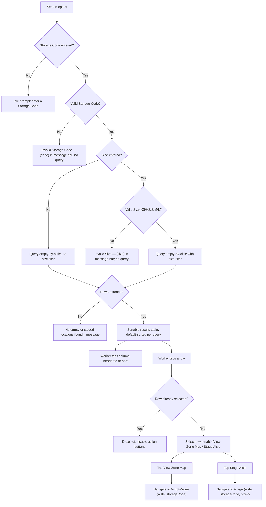

# Screen Design: ELA — Empty Locations by Aisle

**Device:** Tablet — iPad Pro 13" landscape, fixed 1366×1024 canvas (kiosk).
**Bucket:** Existing Warehouse App (current production screen).
**Roles:** All roles (Worker, IM, Lead, Manager, Admin) — no role gating on this screen.

Route: `/empty/aisle` · Jump code: `ELA` · Component: `src/pages/ELAPage.tsx`

## Flow

1. Worker opens ELA (via Home menu jump code, or navigated here with nothing pre-filled).
   The results area shows an idle prompt: *"Enter a Storage Code to see available locations
   (add a Size to narrow further)"*.
2. Worker types or picks a **Storage Code** (2-character field, keyboard-driven via
   `StorageCodeField` — type-to-uppercase-and-auto-commit at 2 characters, or tap the
   chevron for a popup of every `{code} — {description}` pair from `GET
   /api/storage-codes`). The moment a Storage Code is present, the screen queries `GET
   /api/locations/empty-by-aisle` automatically — there is no separate submit step.
   - 2a. If the code isn't a real Storage Code, the message bar shows `"Invalid Storage
     Code — {code}"` and no query runs; the results area shows *"Enter a valid Storage
     Code to see available locations"*.
3. Worker optionally types or picks a **Size** (`SizeField` — XS/HS/S/M/L, same
   type-or-tap-chevron pattern; a two-letter code auto-commits at 2 characters, a single
   letter S/M/L commits immediately after 1 keystroke). Size only narrows which aisles
   qualify — it has never been required. Changing either field re-runs the query
   immediately, clears the current row selection, and resets sort to the query's default
   (see step 5).
   - 3a. If the typed value isn't one of XS/HS/S/M/L, the message bar shows `"Invalid Size
     — {size}"` and no query runs; the results area shows *"Enter a valid Size to see
     available locations"*.
4. Once a valid Storage Code (with or without Size) resolves, a banner reads *"Displaying
   {code}: {description}"* above the results table, and the table fills with one row per
   aisle that has at least one non-zero empty or staged count (aisles that are all-zero
   across every size are omitted entirely).
5. **Default sort:** if a Size was given, the table starts sorted descending by that
   size's own empty count (that column already shows the ▼ indicator). If only a Storage
   Code was given, the table starts sorted ascending by Aisle number.
6. Worker taps any column header (Aisle or any Size column actually present in the
   results) to sort by it; tapping the already-active column flips its direction; tapping
   a different column re-activates with a sensible default direction (Aisle → ascending,
   a Size column → descending). Ascending on a Size column pushes any aisle with a zero
   count for that size to the bottom (a `0` isn't a useful "smallest" result); descending
   already puts zeros last naturally. Ties keep prior relative row order (stable sort).
   Staged counts never affect sort order, only empty counts (or the aisle number itself).
7. Worker taps a row to select it (highlights it) — this activates the **View Zone Map**
   and **Stage Aisle** buttons in the top-right of the screen. Tapping the same row again
   deselects it and disables both buttons; tapping a different row moves the selection.
   Changing either filter field also clears the selection and disables both buttons.
8. **View Zone Map** → navigates to ELZ (`/empty/zone`) with router state `{ aisle:
   selectedRow.aisle, storageCode }`.
9. **Stage Aisle** → navigates to STG (`/stage`) with router state `{ aisle:
   selectedRow.aisle, storageCode, size }` (size omitted if the Size field was never
   filled). This only ever pre-fills STG's Master Control bar — no fork/stack slot is
   written directly; the worker still has to tap "Fill All" or a per-stack "Fill" button
   on STG themselves (see STG.md's Pre-population/Behind the Scenes notes; this was a
   deliberate product decision made in v1.6.4, reversing v1.4.1's "auto-fill all three
   slots" behavior).

### Mis-scan / error handling

- Storage Code not in the `GET /api/storage-codes` reference list → message bar `"Invalid
  Storage Code — {code}"`; no query runs; results area shows a distinct "enter a valid
  code" prompt (different text from the plain idle prompt).
- Size not one of XS/HS/S/M/L → message bar `"Invalid Size — {size}"`; no query runs;
  results area shows "enter a valid Size" prompt.
- Query resolves to zero rows → results area shows `"No empty or staged locations found
  for {storageCode}"` (with `" — {size}"` appended if Size was also entered). This is a
  normal empty-result state, not an error — the message bar is untouched.
- Network/API failure → message bar `"Lookup failed — {message or 'please try again'}"`;
  rows reset to an empty array (rendering as the no-results state).

### Status / messaging behavior

Message bar messages persist until replaced by the next `setMessage` call (no auto-clear
timer) — see `MessageBarContext`. There is no explicit acknowledgment step; the next
successful (or differently-failing) filter change simply overwrites whatever was shown.

## Layout

Full-width single-pane layout inside the app shell's content slot — no persistent Numpad
column, no history log; the on-screen keyboard slides in only while a field is focused.

```
┌──────────────────────────────── Header (104px) ─────────────────────────────────┐
├────────────────────────────── Message Bar (74px) ────────────────────────────────┤
├──────────────────────────── Content slot (792px) ────────────────────────────────┤
│ ┌─────────────┐ ┌─────────┐                    ┌───────────────┐┌──────────────┐│
│ │ Storage Code│ │  Size   │                    │ View Zone Map ││ Stage Aisle  ││
│ │  [CR ▾]     │ │ [M  ▾]  │                    └───────────────┘└──────────────┘│
│ └─────────────┘ └─────────┘                                                     │
│ ──────────── Displaying CR: Conveyable Reserve ──────────────────────────────── │
│ ┌───────────────────────────────────────────────────────────────────────────┐   │
│ │ Aisle▲ │  HS  │  S  │  M  │  L                                            │   │
│ ├────────┼──────┼─────┼─────┼────────────────────────────────────────────── │   │
│ │  304   │      │  4  │6(2) │  2                                           │   │
│ │  312   │  (3) │     │ 5   │                                              │   │
│ │  ...   │      │     │     │        (scrolls; header stays fixed)         │   │
│ └───────────────────────────────────────────────────────────────────────────┘   │
├──────────────────────────────── Footer (54px) ───────────────────────────────────┤
└───────────────────────────────────────────────────────────────────────────────────┘
```

## Input handling

- **Storage Code** and **Size** are both `CodePickerField`-family fields (via
  `StorageCodeField`/`SizeField`): tap the field to open the on-screen Keyboard
  (`NumpadContext`'s `keyboard` panel), type a known code, or tap the chevron button
  beside the field to open a small anchored popup listing every option as `{code} — {full
  name}` and tap one to fill it. No physical-scanner-specific handling on this screen — a
  scanner delivering a barcode isn't a normal input path here (ELA has no location/pallet
  scan target); `deliverScan()` is a shared app capability, not specifically wired into
  this screen's fields beyond what typing already does.
- Every tappable control (field boxes, chevron buttons, action buttons, table headers,
  table rows) meets the app's 72px+ minimum touch-target height where it's a primary
  interactive element (the two action buttons are 64px tall; table rows/headers are sized
  by their own padding but sit within the same touch-friendly system).
- Storage Code auto-commits (and, uniquely to this field via `closeOnAutoSubmit`,
  auto-dismisses the keyboard) once its fixed 2 characters are typed — there's never a
  legitimate "still retyping" case to protect against for an exactly-2-character code.
  Size auto-commits at 2 characters for XS/HS, or immediately after 1 character for
  S/M/L, but does not auto-dismiss the keyboard.

## Data

**Reads:**
- `Location.storageCode`, `Location.size`, `Location.status` (`EMPTY` vs `STAGED`),
  `Location.aisle` — grouped/counted server-side (`prisma.location.groupBy`) to build the
  per-aisle, per-size empty/staged breakdown.
- `StorageCode.id`/`StorageCode.desc` — via `GET /api/storage-codes`, feeds the Storage
  Code field's dropdown-helper popup and the "Displaying {code}: {description}" banner.

**Writes:** None — ELA is a pure read/lookup screen.

**Not written:** Nothing on this screen results in any database mutation; "selecting" a
row is purely client-side UI state (`selected`), not persisted anywhere.

## Screen Flow

Covers: no filter entered, Storage-Code-only browsing, Storage Code + Size narrowing,
invalid Storage Code, invalid Size, zero-result query, row selection → navigation.



## Behind the Scenes

**Query trigger (B/D/F/H/J):** The fetch effect keys off `storageCode`, `size`,
`isInvalidCode`, `isInvalidSize` — `isInvalidCode` deliberately stays `false` (not "not
yet flagged invalid") while `useStorageCodes()` is still `null` (its reference list
hasn't loaded yet), so a valid code isn't wrongly flagged invalid during the brief window
before the list arrives. Every fetch is guarded by a `cancelled` flag so a fast filter
change doesn't let a stale, slower response overwrite a newer one.

**Default sort (M):** Recomputed inside the same effect that triggers the fetch, not a
separate effect — `setSort` runs synchronously right before the `apiFetch` call, so the
sort indicator is correct even during the brief loading state.

**Sort algorithm (N):** `sortAisleRows` (in the shared `AisleSizeTable` component) special-
cases ascending-on-a-size-column: it partitions rows into non-zero (sorted ascending by
that size's count) and zero (appended at the end), rather than a single comparator — a
plain ascending numeric sort would otherwise put every zero-count aisle first, which
reads as useless. Descending needs no such partition since a plain descending sort
already puts zeros last.

**Row selection / navigation (O–V):** Selection (`selected: number | null`) is pure
client component state — nothing server-side tracks "the worker looked at aisle 304."
Both nav buttons pass `storageCode` (and `size`, if present) as React Router state, not
query-string params, so the values only survive a single client-side navigation — a hard
refresh of the destination screen loses the pre-population, which is expected (STG/ELZ
both restore whatever their own session state already had if navigated to directly).

**Shared table component:** `AisleSizeTable` (`src/components/shared/AisleSizeTable.tsx`)
is the literal same component STG's own "no Aisle yet" info panel renders (as of v1.6.6) —
extracted out of this page specifically so the two screens can never drift into two
different sort/column implementations of "the same data." STG's copy commits a tapped row
straight to its Master Control's Aisle field instead of toggling a selection + separate
button, which is the only behavioral difference between the two call sites.

## Open items still remaining

- **GitHub #88** — bad Contraction data (every RS/RF/BS location, plus some HS locations
  on Levels 2-9, incorrectly flagged as contracted) affects the underlying location data
  ELA's counts are built from indirectly (contraction doesn't currently exclude a location
  from ELA's empty/staged counts the way it does from ELZ's zoneSummary — worth
  double-checking whether ELA's `getLocationsEmptyByAisle` should also exclude contracted
  locations, since it currently does not filter on `contraction` at all). Needs a data
  correction on the Contraction flags themselves, not a code fix, per the issue.
- No screen-specific open fix-list items remain — all 4 of ELA's `tasks.md` items shipped
  in v1.6.4, plus a Size-validation follow-up shipped in v1.6.5 (see Change Log). See
  `DevNotes/Fixes/MASTER-CHECKLIST.md`'s ELA section for the authoritative "all done"
  confirmation.
- **App-wide (cross-cutting, not ELA-specific):** "Add screen persistence across the app"
  is an open App-Wide v1.7.0 item — ELA's own filter/selection state does not currently
  persist across navigation away and back (unlike STG's session-level `StagingContext`).

## Change Log

| Date | Change |
|---|---|
| 2026-07-16 (v1.6.5) | ELA validated Storage Code but never Size — fixed to match: an invalid Size now shows `"Invalid Size — {size}"` in the message bar instead of silently running a query that just comes back empty. |
| 2026-07-16 (v1.6.4) | Storage-Code-only browsing (Size made optional); sortable Aisle/Size columns with ▲/▼ indicators and a stable-sort/zero-to-bottom rule; "Displaying {code}: {description}" banner; invalid-Storage-Code detection and message; Storage Code field now auto-dismisses the keyboard on its 2-character auto-commit (`closeOnAutoSubmit`); default sort changed to match what was actually searched for (matched size's own count, or Aisle ascending for a code-only query) instead of always the all-sizes total. Also fixed, same version: STG's pre-population from ELA's "Stage Aisle" now only fills Master Control, never a fork/stack slot directly. |
| 2026-07-12 (v1.5.0) | Added a subtle divider between size columns for readability when several are shown side by side (#63). |
| 2026-07-08 (v1.1.0) | Every DPCI/UPC value elsewhere in the app made clickable to jump to IID (does not touch ELA's own fields, listed for completeness of the same release). |
| 2026-07-08 (v1.0.9) | Fixed: ELA's Storage Code field didn't blur or dismiss the keyboard after entry — every other field-confirm handler in the app already released the shared input panel; ELA's alone hadn't. |
| 2026-07-06 (v1.0.4) | Fixed: ELA's Storage Code field (among four screens named in this fix) previously showed no active-state (focused) indicator at all; every numpad/keyboard-driven field, including this one, now turns its border red while active, in addition to the existing blinking-cursor treatment. |
| 2026-07-05 (v0.9.0) | Initial build — v0.9.0 (2026-07-05). Shipped as part of the original feature-complete core application: Storage Code (required) + Size (then required) filter, per-aisle/per-size empty and staged counts, row selection enabling "View Zone Map"/"Stage Aisle" navigation, shared `AisleGrid`-adjacent empty-locations feature pair with ELZ. |
