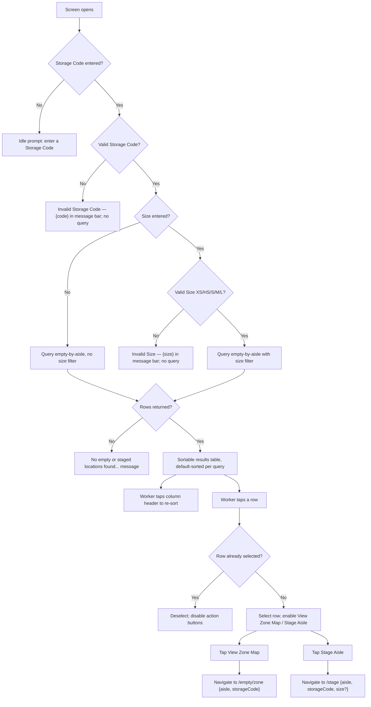

# Screen Design: ELA — Empty Locations by Aisle

**Device:** Tablet — iPad Pro 13" landscape, fixed 1366×1024 canvas (kiosk).
**Bucket:** Existing Warehouse App (current production screen).
**Roles:** All roles (Worker, IM, Lead, Manager, Admin) — no role gating on this screen.

Route: `/empty/aisle` · Jump code: `ELA` · Component: `src/pages/ELAPage.tsx`

## Flow

1. Worker opens ELA (via Home menu jump code, or navigated here with nothing pre-filled).
   The results area shows an idle prompt: *"Enter a Storage Code to see available locations
   (add a Size to narrow further)"*.
2. Worker types or picks a **Storage Code** (2-character field, keyboard-driven via
   `StorageCodeField` — type-to-uppercase-and-auto-commit at 2 characters, or tap the
   chevron for a popup of every `{code} — {description}` pair from `GET
   /api/storage-codes`). The moment a Storage Code is present, the screen queries `GET
   /api/locations/empty-by-aisle` automatically — there is no separate submit step.
   - 2a. If the code isn't a real Storage Code, the message bar shows `"Invalid Storage
     Code — {code}"` and no query runs; the results area shows *"Enter a valid Storage
     Code to see available locations"*. The Storage Code field itself also picks up the
     app-wide red-wash treatment (v1.7.0, individual field wash — see
     `DevNotes/DesignPrompts/Feature-8-AppWide-Invalid-Field-Wash.md`) instead of just its
     plain active border, via `StorageCodeField`'s new `invalid` prop.
3. Worker optionally types or picks a **Size** (`SizeField` — XS/HS/S/M/L, same
   type-or-tap-chevron pattern; a two-letter code auto-commits at 2 characters, a single
   letter S/M/L commits immediately after 1 keystroke). **(GitHub #191, resolved)** Size is
   a display/sort *control*, not a query-narrowing filter — it has never been required, and
   as of #191 it no longer excludes aisles or size columns from the results either; it only
   sets the default sort column (see step 5) and rides along to Stage Aisle's
   pre-population (step 9). Only the **Storage Code**, Aisle Range, and Workstation fields
   narrow which aisles come back. Changing Storage Code re-runs the query immediately and
   clears the current row selection; changing Size re-sorts the already-loaded rows
   client-side and also clears the selection, without re-querying.
   - 3a. If the typed value isn't one of XS/HS/S/M/L, the message bar shows `"Invalid Size
     — {size}"` and no query runs; the results area shows *"Enter a valid Size to see
     available locations"*. Same red-wash treatment as Storage Code above, via
     `SizeField`'s new `invalid` prop — each field washes independently since Storage Code
     and Size each have their own, independently-checkable validity.
4. Once a valid Storage Code resolves, a banner reads *"Displaying {code}: {description}"*
   above the results table, and the table fills with one row per aisle that has at least
   one non-zero empty or staged count *in any size* (aisles that are all-zero across every
   size are omitted entirely) — Size no longer affects this (#191). Every qualifying
   aisle's row always shows every size it stocks: a size with real availability renders the
   normal blank/E/E(S)/(S) count; a size the aisle stocks but has zero currently available
   (e.g. every unit FILLED, or held) renders a blue-washed `0(0)` cell instead of looking
   identical to a size the aisle doesn't carry at all (which stays blank, no wash).
5. **Default sort:** if a Size was given, the table starts sorted descending by that
   size's own empty count (that column already shows the ▼ indicator). If only a Storage
   Code was given, the table starts sorted ascending by Aisle number.
6. Worker taps any column header (Aisle or any Size column actually present in the
   results) to sort by it; tapping the already-active column flips its direction; tapping
   a different column re-activates with a sensible default direction (Aisle → ascending,
   a Size column → descending). Ascending on a Size column pushes any aisle with a zero
   count for that size to the bottom (a `0` isn't a useful "smallest" result); descending
   already puts zeros last naturally. Ties keep prior relative row order (stable sort).
   Staged counts never affect sort order, only empty counts (or the aisle number itself).
   **(v1.7.0)** Sorting by a Size column also fills that size into the **Size** field above
   (direct instruction) — the column key *is* the size code, so this reuses the same value
   the field itself would hold, and clears the current row selection, same as changing Size
   directly via the field does. **(GitHub #191, resolved)** This no longer re-queries or
   narrows anything — Size stopped being a query filter entirely, so writing it here is now
   purely bookkeeping (keeps the field's displayed value in sync, and keeps Stage Aisle's
   pre-population accurate), not something that changes which rows/columns are shown.
   Sorting by Aisle doesn't touch the Size field.
7. Worker taps a row to select it (highlights it) — this activates the **View Zone Map**
   and **Stage Aisle** buttons in the top-right of the screen. Tapping the same row again
   deselects it and disables both buttons; tapping a different row moves the selection.
   Changing either filter field also clears the selection and disables both buttons.
8. **View Zone Map** → navigates to ELZ (`/empty/zone`) with router state `{ aisle:
   selectedRow.aisle, storageCode }`.
9. **Stage Aisle** → navigates to STG (`/stage`) with router state `{ aisle:
   selectedRow.aisle, storageCode, size }` (size omitted if the Size field was never
   filled). This only ever pre-fills STG's Master Control bar — no fork/stack slot is
   written directly; the worker still has to tap "Fill All" or a per-stack "Fill" button
   on STG themselves (see STG.md's Pre-population/Behind the Scenes notes; this was a
   deliberate product decision made in v1.6.4, reversing v1.4.1's "auto-fill all three
   slots" behavior).

### Mis-scan / error handling

- Storage Code not in the `GET /api/storage-codes` reference list → message bar `"Invalid
  Storage Code — {code}"`; no query runs; results area shows a distinct "enter a valid
  code" prompt (different text from the plain idle prompt).
- Size not one of XS/HS/S/M/L → message bar `"Invalid Size — {size}"`; no query runs;
  results area shows "enter a valid Size" prompt.
- Query resolves to zero rows → results area shows `"No empty or staged locations found
  for {storageCode}"` (with `" — {size}"` appended if Size was also entered). This is a
  normal empty-result state, not an error — the message bar is untouched.
- Network/API failure → message bar `"Lookup failed — {message or 'please try again'}"`;
  rows reset to an empty array (rendering as the no-results state).

### Status / messaging behavior

Message bar messages persist until replaced by the next `setMessage` call (no auto-clear
timer) — see `MessageBarContext`. There is no explicit acknowledgment step; the next
successful (or differently-failing) filter change simply overwrites whatever was shown.

**(v1.7.0, issue #95)** A stale error also clears on the next successful lookup: the
`empty-by-aisle` fetch effect now calls `clearMessage()` before running (once past the
Storage Code/Size validation guards, which still set and keep their own errors), so a
prior invalid entry's error doesn't linger through a subsequent valid one.

## Layout

Full-width single-pane layout inside the app shell's content slot — no persistent Numpad
column, no history log; the on-screen keyboard slides in only while a field is focused.

```
┌──────────────────────────────── Header (104px) ─────────────────────────────────┐
├────────────────────────────── Message Bar (74px) ────────────────────────────────┤
├──────────────────────────── Content slot (792px) ────────────────────────────────┤
│ ┌─────────────┐ ┌─────────┐                    ┌───────────────┐┌──────────────┐│
│ │ Storage Code│ │  Size   │                    │ View Zone Map ││ Stage Aisle  ││
│ │  [CR ▾]     │ │ [M  ▾]  │                    └───────────────┘└──────────────┘│
│ └─────────────┘ └─────────┘                                                     │
│ ──────────── Displaying CR: Conveyable Reserve ──────────────────────────────── │
│ ┌───────────────────────────────────────────────────────────────────────────┐   │
│ │ Aisle▲ │  HS  │  S  │  M  │  L                                            │   │
│ ├────────┼──────┼─────┼─────┼────────────────────────────────────────────── │   │
│ │  304   │      │  4  │6(2) │  2                                           │   │
│ │  312   │  (3) │     │ 5   │                                              │   │
│ │  ...   │      │     │     │        (scrolls; header stays fixed)         │   │
│ └───────────────────────────────────────────────────────────────────────────┘   │
├──────────────────────────────── Footer (54px) ───────────────────────────────────┤
└───────────────────────────────────────────────────────────────────────────────────┘
```

## Input handling

- **Storage Code** and **Size** are both `CodePickerField`-family fields (via
  `StorageCodeField`/`SizeField`): tap the field to open the on-screen Keyboard
  (`NumpadContext`'s `keyboard` panel), type a known code, or tap the chevron button
  beside the field to open a small anchored popup listing every option as `{code} — {full
  name}` and tap one to fill it. No physical-scanner-specific handling on this screen — a
  scanner delivering a barcode isn't a normal input path here (ELA has no location/pallet
  scan target); `deliverScan()` is a shared app capability, not specifically wired into
  this screen's fields beyond what typing already does.
- Every tappable control (field boxes, chevron buttons, action buttons, table headers,
  table rows) meets the app's 72px+ minimum touch-target height where it's a primary
  interactive element (the two action buttons are 64px tall; table rows/headers are sized
  by their own padding but sit within the same touch-friendly system).
- Storage Code auto-commits (and, uniquely to this field via `closeOnAutoSubmit`,
  auto-dismisses the keyboard) once its fixed 2 characters are typed — there's never a
  legitimate "still retyping" case to protect against for an exactly-2-character code.
  Size auto-commits at 2 characters for XS/HS, or immediately after 1 character for
  S/M/L, but does not auto-dismiss the keyboard.

## Data

**Reads:**
- `Location.storageCode`, `Location.size`, `Location.status` (`EMPTY` vs `STAGED`),
  `Location.aisle` — grouped/counted server-side (`prisma.location.groupBy`) to build the
  per-aisle, per-size empty/staged breakdown, plus (GitHub #191) a third, unfiltered-by-
  status/hold `total` count per aisle+size, used only to distinguish a size with zero
  *available* capacity from a size the aisle doesn't stock at all.
- `StorageCode.id`/`StorageCode.desc` — via `GET /api/storage-codes`, feeds the Storage
  Code field's dropdown-helper popup and the "Displaying {code}: {description}" banner.

**Writes:** None — ELA is a pure read/lookup screen.

**Not written:** Nothing on this screen results in any database mutation; "selecting" a
row is purely client-side UI state (`selected`), not persisted anywhere.

## Screen Flow

Covers: no filter entered, Storage-Code-only browsing, Storage Code + Size narrowing,
invalid Storage Code, invalid Size, zero-result query, row selection → navigation.


```mermaid
flowchart TD
    A[Screen opens] --> B{Storage Code entered?}
    B -- No --> C[Idle prompt: enter a Storage Code]
    B -- Yes --> D{Valid Storage Code?}
    D -- No --> E["Invalid Storage Code — {code}" in message bar; no query]
    D -- Yes --> F{Size entered?}
    F -- No --> G[Query empty-by-aisle, no size filter]
    F -- Yes --> H{Valid Size XS/HS/S/M/L?}
    H -- No --> I["Invalid Size — {size}" in message bar; no query]
    H -- Yes --> J[Query empty-by-aisle with size filter]
    G --> K{Rows returned?}
    J --> K
    K -- No --> L["No empty or staged locations found..." message]
    K -- Yes --> M[Sortable results table, default-sorted per query]
    M --> N[Worker taps column header to re-sort]
    M --> O[Worker taps a row]
    O --> P{Row already selected?}
    P -- Yes --> Q[Deselect; disable action buttons]
    P -- No --> R[Select row; enable View Zone Map / Stage Aisle]
    R --> S[Tap View Zone Map]
    R --> T[Tap Stage Aisle]
    S --> U["Navigate to /empty/zone {aisle, storageCode}"]
    T --> V["Navigate to /stage {aisle, storageCode, size?}"]
```

## Behind the Scenes

**Query trigger (B/D/F/H/J):** The fetch effect keys off `storageCode`, `size`,
`isInvalidCode`, `isInvalidSize` — `isInvalidCode` deliberately stays `false` (not "not
yet flagged invalid") while `useStorageCodes()` is still `null` (its reference list
hasn't loaded yet), so a valid code isn't wrongly flagged invalid during the brief window
before the list arrives. Every fetch is guarded by a `cancelled` flag so a fast filter
change doesn't let a stale, slower response overwrite a newer one. **(GitHub #191)** `size`
is still a fetch-effect dependency (a `size` change still reruns the effect, to recompute
the default sort — see below) but is deliberately never added to the request's own query
params — `GET /api/locations/empty-by-aisle` is called with only `storageCode` (plus Aisle
Range/Workstation, when set), so the response always covers every size the Storage Code's
qualifying aisles stock, regardless of Size's current value.

**Zero-but-exists cells (GitHub #191):** the API response's per-size `total` (every
location of that size at that aisle, regardless of status/hold — unlike `empty`/`staged`,
which are both eligibility-filtered) lets `CellValue`/`AisleSizeTable` tell "0 available,
but this aisle genuinely stocks this size" (`total > 0`, blue-washed `0(0)`) apart from
"doesn't stock this size at all" (no entry for that size in the row's `sizes` array,
renders blank). Purely a rendering concern — `total` doesn't affect sorting or which rows
qualify.

**Default sort (M):** Recomputed inside the same effect that triggers the fetch, not a
separate effect — `setSort` runs synchronously right before the `apiFetch` call, so the
sort indicator is correct even during the brief loading state.

**Sort algorithm (N):** `sortAisleRows` (in the shared `AisleSizeTable` component) special-
cases ascending-on-a-size-column: it partitions rows into non-zero (sorted ascending by
that size's count) and zero (appended at the end), rather than a single comparator — a
plain ascending numeric sort would otherwise put every zero-count aisle first, which
reads as useless. Descending needs no such partition since a plain descending sort
already puts zeros last.

**Row selection / navigation (O–V):** Selection (`selected: number | null`) is pure
client component state — nothing server-side tracks "the worker looked at aisle 304."
Both nav buttons pass `storageCode` (and `size`, if present) as React Router state, not
query-string params, so the values only survive a single client-side navigation — a hard
refresh of the destination screen loses the pre-population, which is expected (STG/ELZ
both restore whatever their own session state already had if navigated to directly).

**Session persistence via `ELAContext`.** `storageCode`, `size`, and `selected` (the selected row) all live in `ELAProvider` (mounted in `App.tsx`, alongside all 12 sibling per-screen providers — `StagingProvider`/`PIIProvider`/`ISIProvider`/`LIIProvider`/`PIPProvider`/`SDPProvider`/`MNPProvider`/`IIDProvider`/`PARProvider`/`WLHProvider`/`SARProvider`/`ELZProvider`, all 13 now mounted together wrapping `AppShell`), not local component state, so navigating away from ELA and back restores the last-run filter and selection instead of resetting to a blank query. Deliberately the filter *inputs*, not a cached results array — the fetch effect (see "Query trigger" above) already re-runs automatically whenever `storageCode` has a value, so restoring the inputs gets both persistence and freshness for free, instead of risking a stale, out-of-date empty-location count.

**Shared table component:** `AisleSizeTable` (`src/components/shared/AisleSizeTable.tsx`)
is the literal same component STG's own "no Aisle yet" info panel renders (as of v1.6.6) —
extracted out of this page specifically so the two screens can never drift into two
different sort/column implementations of "the same data." STG's copy commits a tapped row
straight to its Master Control's Aisle field instead of toggling a selection + separate
button, which is the only behavioral difference between the two call sites.

## Open items still remaining

- **GitHub #88** — bad Contraction data (every RS/RF/BS location, plus some HS locations
  on Levels 2-9, incorrectly flagged as contracted) affects the underlying location data
  ELA's counts are built from indirectly (contraction doesn't currently exclude a location
  from ELA's empty/staged counts the way it does from ELZ's zoneSummary — worth
  double-checking whether ELA's `getLocationsEmptyByAisle` should also exclude contracted
  locations, since it currently does not filter on `contraction` at all). Needs a data
  correction on the Contraction flags themselves, not a code fix, per the issue.
- No screen-specific open fix-list items remain — all 4 of ELA's original `tasks.md`
  items shipped in v1.6.4, plus a Size-validation follow-up shipped in v1.6.5 (see Change
  Log). `tasks.md`/`MASTER-CHECKLIST.md` were retired 2026-07-24 — remaining open
  ELA-tagged work (e.g. #91) is tracked as a GitHub Issue.
- **App-wide (cross-cutting, not ELA-specific):** the App-Wide screen-persistence item
  has since landed — ELA's own filter/selection state now persists across navigation away
  and back via `ELAContext` (see Behind the Scenes above), matching STG's earlier
  session-level `StagingContext` pattern.

## Change Log

| Date | Change |
|---|---|
| 2026-07-31 (#191) | Size stopped being a query-narrowing filter — sorting by (or typing) a Size no longer excludes aisles lacking that size, or hides other size columns on aisles that do qualify; `GET /api/locations/empty-by-aisle` is now called with only Storage Code + Aisle Range/Workstation. Added a `total` count per size (regardless of status/hold) so a size an aisle stocks but currently has zero available for renders as a blue-washed `0(0)` instead of blank (indistinguishable from not stocking that size at all). |
| 2026-07-31 (#156) | Fixed a shared bug (`src/lib/useCodePickerField.ts`'s `selectOption`, used by every `CodePickerField`/`PalletCodePicker` instance app-wide, including this screen's Storage Code/Size fields) that never closed the shared numpad/keyboard panel after a popup pick — only an Enter/OK/maxLength commit did. Picking a value from a field's dropdown popup (instead of typing it out) could leave the panel open on top of, and intercepting clicks meant for, whatever's rendered underneath it (surfaced here as row-selection clicks silently missing after picking Size from its popup). Root-caused while investigating STG's own e2e failures; see STG.md's Change Log for the sibling fix. |
| 2026-07-28 (Feature 10 / #161) | Start/End Aisle Range fields now each check real aisle existence (`GET /api/locations/aisle-exists`, via the new shared `useAisleField` hook) — previously "any non-negative number" was accepted with no existence check at all. A nonexistent aisle end still applies to the range filter as typed (this is a range, not a single-value field — a range partly or wholly matching zero aisles is a legitimate, non-error outcome) but now washes red as a hint that the value may be a typo. |
| 2026-07-27 (Feature 10) | Internal-only: the Workstation restrict-to filter's inline `CodePickerField` usage replaced with a new shared `WorkstationField` component (mechanical extraction — same options list, `strict`, `optionsLoading`, and `onValidityChange` wiring as before, just named/reusable now). No change to documented wash/message conditions. |
| 2026-07-27 (Feature 10) | Internal-only: Storage Code/Size's invalid-check now lives inside `StorageCodeField`/`SizeField` themselves instead of this screen computing `isInvalidCode`/`isInvalidSize` externally; the Workstation field's strict-mode gate switched from manually disabling `strict` while the reference list loads to passing `optionsLoading` (the mechanism `CodePickerField` already supported, previously unused here). No change to documented wash/message conditions. |
| 2026-07-16 (v1.6.5) | ELA validated Storage Code but never Size — fixed to match: an invalid Size now shows `"Invalid Size — {size}"` in the message bar instead of silently running a query that just comes back empty. |
| 2026-07-16 (v1.6.4) | Storage-Code-only browsing (Size made optional); sortable Aisle/Size columns with ▲/▼ indicators and a stable-sort/zero-to-bottom rule; "Displaying {code}: {description}" banner; invalid-Storage-Code detection and message; Storage Code field now auto-dismisses the keyboard on its 2-character auto-commit (`closeOnAutoSubmit`); default sort changed to match what was actually searched for (matched size's own count, or Aisle ascending for a code-only query) instead of always the all-sizes total. Also fixed, same version: STG's pre-population from ELA's "Stage Aisle" now only fills Master Control, never a fork/stack slot directly. |
| 2026-07-12 (v1.5.0) | Added a subtle divider between size columns for readability when several are shown side by side (#63). |
| 2026-07-08 (v1.1.0) | Every DPCI/UPC value elsewhere in the app made clickable to jump to IID (does not touch ELA's own fields, listed for completeness of the same release). |
| 2026-07-08 (v1.0.9) | Fixed: ELA's Storage Code field didn't blur or dismiss the keyboard after entry — every other field-confirm handler in the app already released the shared input panel; ELA's alone hadn't. |
| 2026-07-06 (v1.0.4) | Fixed: ELA's Storage Code field (among four screens named in this fix) previously showed no active-state (focused) indicator at all; every numpad/keyboard-driven field, including this one, now turns its border red while active, in addition to the existing blinking-cursor treatment. |
| 2026-07-05 (v0.9.0) | Initial build — v0.9.0 (2026-07-05). Shipped as part of the original feature-complete core application: Storage Code (required) + Size (then required) filter, per-aisle/per-size empty and staged counts, row selection enabling "View Zone Map"/"Stage Aisle" navigation, shared `AisleGrid`-adjacent empty-locations feature pair with ELZ. |
