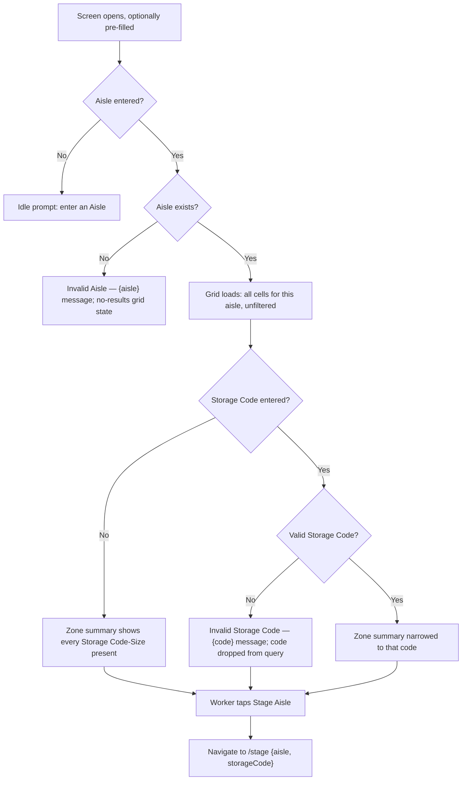

# Screen Design: ELZ — Empty Locations by Zone

**Device:** Tablet — iPad Pro 13" landscape, fixed 1366×1024 canvas (kiosk).
**Bucket:** Existing Warehouse App (current production screen).
**Roles:** All roles (Worker, IM, Lead, Manager, Admin) — no role gating; Contraction
itself is a Lead+ designation but is only ever displayed here, never set or lifted from
this screen.

Route: `/empty/zone` · Jump code: `ELZ` · Component: `src/pages/ELZPage.tsx`

## Concept: Contraction

Contraction is a per-location boolean (`Location.contraction`) independent of occupancy
`status` — a location can be `EMPTY`/`STAGED`/`STORED` *and* contracted at the same time.
It's set at zone-side + level granularity (e.g. "Zone 2 Odd, Level 3" is independently
contractable from "Zone 2 Even, Level 3") by a Lead+ elsewhere in the warehouse system
(Aisle Setup — out of scope for this app). ELZ (and STG's own embedded zone map) display
it read-only: a contracted cell renders highlighted red instead of its normal
Storage-Code-colored label, and contracted locations are excluded from the per-zone
summary panel's empty/staged counts (they aren't usable, so counting them would
overstate available space) — but they still render, visibly, in the grid itself. No role
can set or lift Contraction from ELZ.

## Flow

1. Worker opens ELZ directly (jump code, Home menu), or arrives pre-populated from ELA's
   "View Zone Map" (`{ aisle, storageCode }`) or from STG's "Stage Aisle"-adjacent live
   info panel. With nothing entered, the grid area shows *"Enter an Aisle to view the
   zone map"*.
2. Worker enters an **Aisle** (3-digit numpad field; auto-commits and pads to 3 digits on
   submit, e.g. typing "5" + OK submits as "005"). Aisle alone is sufficient to load the
   grid — Storage Code is optional and only narrows the per-zone summary panel, never the
   grid itself.
3. Worker optionally enters a **Storage Code** (`StorageCodeField`, keyboard-driven,
   type-or-tap-chevron; the popup narrows to only codes actually present in this aisle
   once one is entered, via `useAisleFreightTypes`). Changing Storage Code re-queries to
   re-narrow the summary panel but never affects whether the grid itself loads.
   - 3a. A Storage Code that isn't a real code at all (checked against the full reference
     list, not the aisle-narrowed popup) shows `"Invalid Storage Code — {code}"` in the
     message bar and is dropped from the query — the grid still loads from Aisle alone.
     The Storage Code field also picks up the app-wide red-wash treatment (v1.7.0 — see
     `DevNotes/DesignPrompts/Feature-8-AppWide-Invalid-Field-Wash.md`) via
     `StorageCodeField`'s `invalid` prop, same as ELA.
4. Once Aisle resolves, the screen shows:
   - **Left/center:** the physical aisle grid (`AisleGrid`) — 8 columns (Zone 1-4 ×
     Odd/Even), Level 1 at the bottom, highest level at top. Always unfiltered by
     Storage Code — it's a physical map of everything in the aisle, not a filtered view.
   - **Right:** a per-zone summary panel (Zone 1 through Zone 4), each zone's combined
     Odd+Even empty/staged counts broken down by Storage Code-Size, narrowed to whichever
     Storage Code was entered (or every code present, if none was).
5. Worker taps **Stage Aisle** at the bottom of the summary panel → navigates to STG
   (`/stage`) with router state `{ aisle, storageCode }`. As with ELA, this only ever
   pre-fills STG's Master Control — the worker still fills stacks themselves via "Fill
   All" or a per-stack fill button.
6. Cells and grid rows are entirely read-only — tapping a cell has no action, for every
   role.

### Mis-scan / error handling

- Aisle number doesn't exist (backend 404s) → message bar `"Invalid Aisle — {aisle}"`;
  grid area shows `"No locations found for Aisle {aisle}"` (with `" — {storageCode}"`
  appended if one was entered); summary panel is empty. Every aisle in the seed data has
  locations, so this always means the aisle number itself is wrong. The Aisle box itself
  also red-washes (v1.7.0, individual field wash, keyed off the same `notFound` state) —
  unlike Storage Code/Size, this box isn't built on `CodePickerField`, so the wash is
  applied directly in its own `className` ternary rather than through a prop.
- Storage Code not a real code → message bar `"Invalid Storage Code — {code}"`; code is
  dropped from the query rather than blocking the whole screen (the grid still loads).
- Other network/API failure → message bar `"Lookup failed — please try again"` (generic
  fallback text); result cleared to null (renders as the no-results state).

### Status / messaging behavior

Same as ELA — message bar text persists until the next `setMessage` call replaces it; no
auto-dismiss timer, no explicit acknowledgment step.

**(v1.7.0, issue #95)** Also same as ELA: the zone fetch effect clears a stale error on
its own successful run (in an `else` branch alongside the Storage Code check), so a prior
invalid entry's error doesn't linger through a subsequent valid one — except when Storage
Code itself is invalid, in which case that error deliberately stays even if the Aisle-only
grid still loads.

## Layout

```
┌──────────────────────────────── Header (104px) ─────────────────────────────────┐
├────────────────────────────── Message Bar (74px) ────────────────────────────────┤
├──────────────────────────── Content slot (792px) ────────────────────────────────┤
│ ┌───────┐ ┌──────────────┐                                                      │
│ │ Aisle │ │ Storage Code │                                                      │
│ │ [304] │ │   [CR ▾]     │                                                      │
│ └───────┘ └──────────────┘                                                      │
│ ┌──────────────────────────────────────────┐  ┌─────────────────────────────┐   │
│ │            Zone 1  │ Zone 2 │ Zone 3│Zone4│  │ Zone Summary                │   │
│ │            BINS:128-97 ...              │  │ Zone 1                      │   │
│ │            Odd│Even│Odd│Even│...        │  │  CR-M: 4(1)  CR-S: 2        │   │
│ │  Lvl N  ┌───┬───┬───┬───┬── ...          │  │ Zone 2                     │   │
│ │  ...    │CR-M│CR-M│...│                  │  │  ...                        │   │
│ │  Lvl 1  └───┴───┴───┴───┴── ...          │  │                             │   │
│ │  (grid fills all remaining height,       │  │                             │   │
│ │   rows weighted by physical Size)        │  │                             │   │
│ └──────────────────────────────────────────┘  ├─────────────────────────────┤   │
│                                                 │      Stage Aisle            │   │
│                                                 └─────────────────────────────┘   │
├──────────────────────────────── Footer (54px) ───────────────────────────────────┤
└───────────────────────────────────────────────────────────────────────────────────┘
```

## Input handling

- **Aisle** is a plain numpad-driven field (not a `CodePickerField` — no dropdown-helper,
  since aisle numbers aren't a small enumerable set): tap to open the on-screen Numpad,
  type digits, auto-commits and pads to 3 digits at submit.
- **Storage Code** is a `StorageCodeField` (keyboard panel), type-or-tap-chevron, narrowed
  to codes present in the entered aisle once one exists (`useAisleFreightTypes`), falling
  back to the full `GET /api/storage-codes` list before an aisle is entered.
- Physical barcode scanner input (`deliverScan()`) is a shared app capability but has no
  ELZ-specific wiring beyond what a scanned value typed into the active field would do —
  this screen has no location/pallet barcode target of its own.
- All interactive controls meet the 72px+ minimum touch-target convention; the grid cells
  themselves are deliberately non-interactive (read-only) regardless of size.

## Data

**Reads:**
- `Location.aisle`, `.bin`, `.level`, `.zone`, `.storageCode`, `.size`, `.contraction`,
  `.status` — every location row in the queried aisle is read once and used to build both
  the grid (one representative cell per level/zone/side group) and the zone summary
  (EMPTY/STAGED counts by Storage Code-Size, contraction-excluded).
- `StorageCode.id`/`.desc` — full reference list for the un-narrowed popup case.

**Writes:** None — ELZ is a pure read/lookup screen, matching ELA.

**Not written:** Contraction status is never written from this screen (display-only, per
the Concept section above) — it's managed entirely outside this app.

## Screen Flow

Covers: no Aisle entered, invalid Aisle, valid Aisle with/without Storage Code narrowing,
invalid Storage Code, Stage Aisle navigation.



## Behind the Scenes

**Grid vs. summary independence (F/H/K):** `GET /api/locations/empty-by-zone` computes
the grid (`levels`) from every location in the aisle unconditionally, and the
`zoneSummary` breakdown as a separately-filtered pass over the same location set — the
two are deliberately decoupled server-side so a Storage Code filter can never
accidentally hide part of the physical map. Contraction only affects the summary
(excluded from counts) — contracted cells still render in the grid, highlighted red.

**Aisle-narrowed popup (Storage Code field):** `useAisleFreightTypes(aisle)` derives its
option list from the same `empty-by-zone` response's `levels` (every location regardless
of status/contraction) rather than `zoneSummary` (which excludes contracted and
non-EMPTY/STAGED locations) — fixed in v1.6.6 specifically so a Storage Code/Size that's
entirely under contraction in this aisle still appears as a pickable option (the worker
is choosing what type a cell holds, not confirming it's currently stageable). This same
hook backs STG's and SDP's equivalent narrowing, so the fix applies to all three
screens, not just ELZ.

**Row height weighting:** `AisleGrid` never scrolls — each level's row gets a share of
the fixed grid height proportional to `SIZE_WEIGHTS[size]` (L=1, M=.667, S=.5, HS=.25,
XS=.125), read off the first cell present at that level (a level's Size is constant
across every zone/side within it, per `seed.ts`'s `getSize`). This means an aisle with
many levels still fits without a scrollbar or any level-count threshold.

**Per-zone bin range:** `zoneBinRanges` is computed as one min/max pass over every
location in the aisle per zone (both sides combined, since bin numbering is
level-invariant within a zone) — purely a header decoration, not used by any filtering
logic.

**Session persistence via `ELZContext`.** `aisle` and `storageCode` (the filter inputs) live in `ELZProvider` (mounted in `App.tsx`, alongside all 12 sibling per-screen providers — `StagingProvider`/`PIIProvider`/`ISIProvider`/`LIIProvider`/`PIPProvider`/`SDPProvider`/`MNPProvider`/`IIDProvider`/`PARProvider`/`WLHProvider`/`SARProvider`/`ELAProvider`, all 13 now mounted together wrapping `AppShell`), not local component state, so navigating away from ELZ and back restores the last-viewed aisle instead of resetting to the empty Ready state. Deliberately the filter *inputs*, not a cached `empty-by-zone` result — `ELZPage`'s own query effect already re-fetches fresh data whenever `aisle` is set, the same reasoning `ELAContext` uses. Router-state prefill (ELA's "View Zone Map" button, or STG) still wins over whatever was persisted from a prior visit — the mount-time prefill effect calls both the local numpad-field setter and the context setter whenever prefill is present, so a fresh navigation with explicit state always takes priority over a plain back-navigation with none.

**Shared component with STG:** `AisleGrid` is the same component STG's own embedded
"Live Info Panel" ELZ-format view renders (as of v1.6.6, at `flex-1` sizing matching this
screen's own, after the `dense` prop was retired) — a fix or visual change made here
should be verified against STG's zone-map rendering too, since they now share one
component with no per-caller divergence left.

## Open items still remaining

- **GitHub #88** — bad Contraction data (every RS/RF/BS location, plus some HS locations
  on Levels 2-9, incorrectly flagged as contracted) shows as incorrectly blocked/red on
  this screen's grid. A data correction, not a code fix — needs a DB write, out of scope
  to do inline per this repo's DB-altering-command guidance.
- **App-Wide v1.7.0 backlog item:** whole-level Contraction support (mark an entire level
  contracted at once, not just one zone-side/level cell at a time) is not yet built —
  today Contraction is per zone-side/level cell only, requiring 8 separate marks to
  contract a whole level.
- No screen-specific open fix-list items remain — all 3 of ELZ's `tasks.md` items shipped
  in v1.6.5 (two of them via a combined approach rather than literally as originally
  scoped — see Change Log). See `DevNotes/Fixes/MASTER-CHECKLIST.md`'s ELZ section.
- **App-wide (cross-cutting, not ELZ-specific):** the App-Wide screen-persistence item
  has since landed — ELZ's own Aisle/Storage Code filter now persists across navigation
  away and back via `ELZContext` (see Behind the Scenes above).

## Change Log

| Date | Change |
|---|---|
| 2026-07-16 (v1.6.5) | Grid rows now weighted by physical Size instead of scrolling (superseded the originally-scoped ">10 levels" special case with a more general fix, also applied to STG's embedded map); curated per-Storage-Code text coloring added; per-zone "BINS: {max} - {min}" header line added; heavier/more visible cell dividers, with a distinct heavier zone-to-zone boundary color; invalid-Storage-Code and invalid-Aisle message-bar errors added, matching ELA's existing pattern; Storage Code field now dismisses the keyboard on its 2-character auto-commit. Also app-wide this version: Size field early-commit for single-letter S/M/L codes. |
| 2026-07-12 (v1.5.0) | The zone map now renders from Aisle alone — Storage Code is no longer required to see the physical layout grid (#60), matching ELA's already-optional pattern. |
| 2026-07-11 (v1.4.0) | App-wide code-picker fields (type-or-tap-chevron) rolled out to Storage Code, narrowed to codes present in the aisle once one is entered, via the new shared `GET /api/storage-codes` endpoint and `CodePickerField` primitive (#80). |
| 2026-07-09 (v1.2.0) | Indirect: STG's own "Live Info Panel" (Feature 2) began reusing ELZ's zone-map format/data contract for its own Aisle-present display state — no ELZ-side behavior change, but from this point ELZ's `GET /api/locations/empty-by-zone` contract is shared infrastructure, not ELZ-exclusive. |
| 2026-07-08 (v1.1.0) | Zone map split into 4 zone groups with Odd/Even sub-columns and dividers, instead of one flat header row (#25). |
| 2026-07-07 (v1.0.6) | Fixed: the zone map (and other screens) redrew more often than their inputs actually changed — `MessageBarContext`'s `setMessage`/`clearMessage` weren't memoized, so any screen with an effect depending on `setMessage` (ELZ's zone map included) re-ran on every message-bar update anywhere in the app, not just its own aisle/storage-code changes. |
| 2026-07-06 (v1.0.5) | Fixed (STG-side, but ELZ was the source of the missing data): ELZ's "Stage Aisle" navigation only ever passed `{ aisle }` in router state even though it already had Storage Code in scope — now passes Storage Code along too. |
| 2026-07-06 (v1.0.4) | Fixed: ELZ showed no active-state (focused-field) indicator at all — every numpad/keyboard-driven field, including ELZ's Aisle and Storage Code fields, now turns its border red while active. |
| 2026-07-06 (v1.0.3) | Fixed: zone summary panel's Storage Code-Size rows had no defined sort order — now sorted ascending by size (XS, HS, S, M, L). |
| 2026-07-05 (v0.9.0) | Initial build — v0.9.0 (2026-07-05). Shipped as part of the original feature-complete core application: Aisle (required) + Storage Code (then required) filter, physical zone/level grid via the shared `AisleGrid` component, per-zone empty/staged summary, "Stage Aisle" navigation to STG. |
