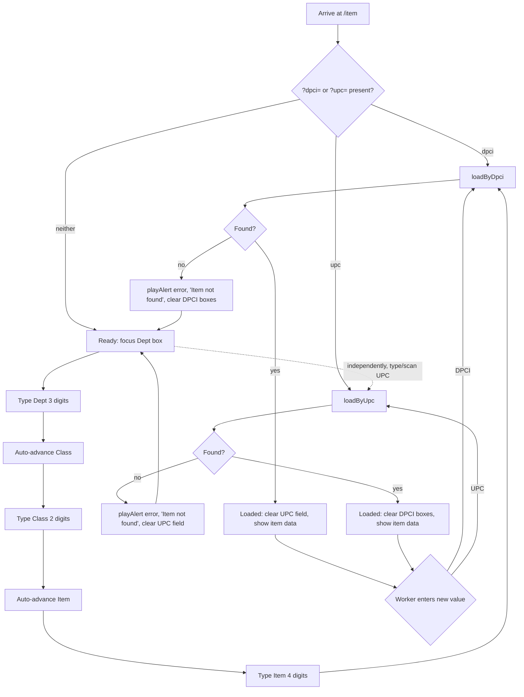

# Screen Design: IID — Item ID Lookup

**Device:** Tablet — iPad Pro 13" landscape, fixed 1366×1024 canvas (kiosk)
**Bucket:** Existing Warehouse App (current production screen)
**Roles:** All roles (Worker, IM, Lead Worker, Manager, Admin) — fully read-only, no role-gated behavior. No edit capability exists on this screen under any role — item data is managed outside this app.

## Flow

1. Worker arrives at `/item` via Home, HotJump ("IID"), or by tapping any DPCI/UPC chip elsewhere in the app (navigates here with `?dpci=` or `?upc=`).
2. The Dept box of the DPCI entry auto-focuses ~50ms after mount.
3. Worker resolves an item one of two independent ways:
   - 3a. **DPCI entry:** types Dept (3 digits, auto-advances), then Class (2 digits, auto-advances), then Item (4 digits, auto-resolves the lookup). The three display boxes are also populated directly (bypassing the typed chain) when the whole DPCI arrives at once — via `?dpci=`, a demo button, or a UPC-lookup fallback — so they never show stale `—` placeholders despite a loaded item.
   - 3b. **UPC entry:** types/scans into the UPC field (keyboard-driven), confirms, resolves the lookup independently of the DPCI boxes.
4. On confirm, the corresponding endpoint is called: `GET /api/items/dpci/:dpci` or `GET /api/items/upc/:upc`.
   - 4a. **Found:** item data renders below the entry fields. Whichever field *wasn't* used to look the item up is cleared (a DPCI lookup clears UPC; a UPC lookup clears the three DPCI boxes).
   - 4b. **Not found:** see Mis-scan handling below.
5. Both entry paths remain live after a successful load — typing a new value into either resolves a new item without navigating away.

### Mis-scan / error handling

- `GET /api/items/dpci/:dpci` or `/upc/:upc` 404: `playAlert('error')`, message bar `"Item not found"`, the field(s) that were used are cleared (all three DPCI boxes on a failed DPCI lookup; the UPC field on a failed UPC lookup), item data cleared.
- A DPCI whose digit count doesn't total 9 across the three boxes never reaches the API at all — each box only auto-advances/resolves once it hits its own fixed length (3/2/4), so an incomplete entry simply sits waiting for more input rather than erroring.

### Status / messaging behavior

- Error messages use the shared MessageBar — non-blocking, persists until the next message or navigation.
- A `"Loading…"` pulsing placeholder shows while the fetch is in flight, hiding any previously-loaded item data during that window.

## Layout

```
┌──────────────────────────────────────────────────────────────────────────────┐
│ ‹ Back   ⌂ Home   >_ Jump   ☰ Activity      ITEM ID LOOKUP      J. Smith  Logout │  104px Header
├──────────────────────────────────────────────────────────────────────────────┤
│                              (Message Bar — success/error text)                │  74px
├──────────────────────────────────────────────────────────────────────────────┤
│  DPCI                                   UPC                                   │
│  ┌─────┐ - ┌────┐ - ┌──────┐            ┌──────────────┐                      │
│  │ 123 │   │ 45 │   │ 6789 │            │ 001234567890 │                      │
│  └─────┘   └────┘   └──────┘            └──────────────┘                      │
│  (Dept)    (Class)  (Item, auto-resolves)  (keyboard-driven, independent)     │
│                                                                                 │
│  DPCI              123-45-6789                                                │
│  UPC               001234567890                                               │
│  Name              Widget, 12-Pack                                            │
│  Short Description WIDGET 12PK                                                │
│  Description       Widget, standard 12-pack case                              │
│  Retail Price      $19.99                                                     │
│  Cost              $8.42                                                      │
│  Storage Code      CR                                                         │
│  Conveyable        Yes                                                        │
│                                                                                 │  content: 792px
├──────────────────────────────────────────────────────────────────────────────┤
│ [123 Keypad] [ABC Keyboard]    ✓ Scan DPCI   ✗ Bad DPCI      BD 26198 7/17 3:41 PM │ 54px Footer
└──────────────────────────────────────────────────────────────────────────────┘
```

## Input handling

- Dept/Class/Item boxes: numpad-driven via `useNumpadField('numpad', maxLength, padOnSubmit=true)` — 3/2/4 digits respectively, each auto-submitting the instant its fixed length is reached (no explicit OK required), and left-zero-padded if an explicit shorter confirm is given (e.g. typing "5" and hitting OK on Dept submits "005").
- UPC field: keyboard-driven (`useNumpadField('keyboard')`) — variable length, requires an explicit confirm (Enter/OK), or an atomic hardware-scanner `deliverScan()`.
- The Dept→Class→Item auto-advance chain uses refs (`deptValueRef`/`classValueRef`), not direct reads of the field hook's `.value`, to avoid a stale-closure hazard: the chain's handlers are registered once at mount and would otherwise always see the values frozen at that render.
- All buttons/fields meet the 72px+ min touch target convention used app-wide (each entry box is 64px tall, matching PII's Pallet ID box sizing).

## Data

**Reads:**
- `Item` (by composite `DPCI` key, or by `upc` unique key) — dept, class, item, upc, name, desc, descShort, retailPrice, cost, packingZoneCode, storageCode, conveyable

**Writes:** None — IID is fully read-only under every role; there is no PATCH/edit endpoint for `Item` reachable from this screen or anywhere else in the app. Item data is managed outside PalletIQ entirely.

**Not written:** No `ActivityLog` entry is produced by looking up an item here — IID performs no state-changing action, so nothing is logged.

## Screen Flow

Covers: DPCI lookup (found/not found), UPC lookup (found/not found), `?dpci=`/`?upc=` pre-population, and the mutual-clear behavior between the two entry paths.



## Behind the Scenes

**Two independent lookup paths converge on the same display.** `loadByDpci` and `loadByUpc` are separate callbacks hitting separate endpoints (`/api/items/dpci/:dpci` vs `/api/items/upc/:upc`), each clearing the *other* entry method's field(s) on invocation (not just on success) — so switching entry methods always leaves exactly one method's fields populated, never both or neither.

**Whole-DPCI callers still populate all three boxes.** `loadByDpci` explicitly splits a dash-joined DPCI string and calls `.set()` on all three field hooks before the fetch resolves — this exists because callers that supply a whole DPCI at once (the demo button, the `?dpci=` URL param) would otherwise leave the three display boxes showing their `—` placeholder even though the item successfully loaded; only the manual typed-entry chain naturally fills them one box at a time as the worker types.

**The Item model has no VCP/SSP fields**, despite the original `DevNotes/Screen-Specs/IID.md` spec's read-only field table listing them — a documented mismatch in the current code (`IIDPage.tsx`'s own top-of-file comment calls this out directly): VCP/SSP are set per-pallet at receiving time in this data model, not fixed at the item level. This screen displays the Item model's real fields instead (retail price, cost, packing zone code, storage code, conveyable) — see the source comment referencing "phase-9 log" for the original investigation.

**No session-local history on this screen.** Like LII, IID keeps no in-screen log of prior lookups — a new resolve simply replaces whatever item was previously displayed, and nothing is written to the app-wide Activity Log overlay since no state changes.

## Open items still remaining

- The Item model/data mismatch versus the original `IID.md` spec (VCP/SSP listed there but not present on the model) has been resolved in code but never formally back-ported into a corrected written spec until this rebuild — flagging here in case any other document still references the stale field list.
- `DevNotes/Fixes/IID/01` (not fixed, feature) — add a "View Storage Locations" button that navigates to ISI, pre-populated with the currently-loaded item's DPCI (mirroring ELA's existing "View Zone Map"/"Stage Aisle" pre-population pattern via router state). Two-sided: ISI doesn't currently accept any pre-population at all, so its side would need to be built too.
- No GitHub issue is currently open specifically against IID (see CHANGELOG's "Unreleased — Reported Issues" section as of this writing).

## Change Log

| Date | Change |
|---|---|
| 2026-07-17 | Rebuilt onto the new standard template from `DevNotes/Screen-Specs/IID.md`, grounded directly in the current `IIDPage.tsx`/`items.ts` code. Corrected the read-only field list to match the actual Item model (no VCP/SSP — see Behind the Scenes) rather than repeating the stale spec table. No behavioral changes made as part of this rebuild. |
| 2026-07-11 (v1.6.1) | Every fixed-width numeric field, including IID's Dept/Class/Item boxes, now accepts a short entry on explicit submit, left-zero-padded (e.g. "5" + OK submits "005"). |
| 2026-07-08 (v1.1.5) | UPC field switched from opening the full on-screen Keyboard to the Numpad, since UPCs are always numeric (issue #56). |
| 2026-07-08 (v1.1.0) | DPCI entry split into three separate Dept/Class/Item boxes with auto-advance, replacing one combined field (issue #16) — same pattern later reused by ISI; fixed a bug where the three display boxes stayed on `—` placeholders after a demo scan or `?dpci=` link despite the item loading successfully. |
| 2026-07-06 (v1.0.4) | Fixed missing focused-field (red border) highlighting on the DPCI/UPC fields. |
| Initial build — v0.9.0 (2026-07-05) | IID shipped as part of the initial feature-complete build: read-only item lookup for all roles by DPCI or UPC, no edit capability. |
