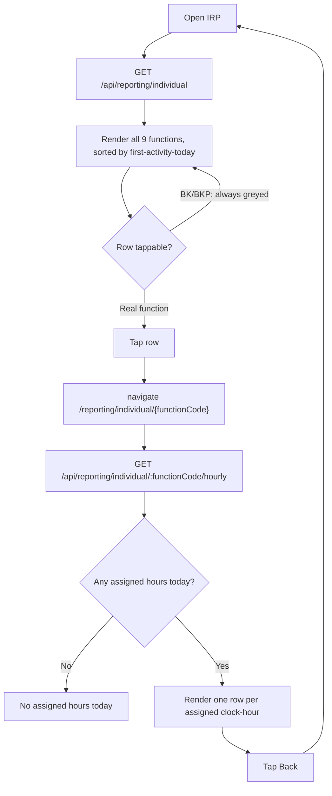

# Screen Design: IRP — Individual Reporting

**Device:** Tablet — iPad Pro 13" landscape, fixed 1366×1024 canvas (kiosk)
**Bucket:** New Screen (v1.7.1)
**Roles:** All roles (read-only report; content is identical for every role — there is no
manager/lead view here, that's the separate, out-of-scope paired lead web app)

## Flow

1. Worker opens IRP (from Reporting Functions in the menu, or HotJump "IRP").
2. On mount, the screen calls `GET /api/reporting/individual` exactly once, scoped
   server-side to the logged-in worker's own `zNumber` — there is no way to view another
   worker's data from this screen. Data is **not** auto-refreshed; re-entering the screen
   triggers a fresh pull. Today only — no date picker, no time-range filter.
3. A single shift-wide indicator (e.g. "6:00AM–8:45AM") shows the span from the earliest
   of today's assignment starts / activity through the moment of the live pull.
4. All 9 prod functions always render, in this order: functions with any activity today
   sort by the time they were first started (earliest at top); functions with none fall
   back to a fixed order (`CA → CF → FP → BKP → BK → RP → HP → GPM → CON`), appended
   after every active function.
5. Each row shows the function's own field set — raw counts, rates, hours, and (where a
   goal exists) an emphasized "star" count + % to goal bubble on a red-to-green
   performance gradient. See each function's exact field list in "Data" below.
6. **Bulk (BK) and Breakpack (BKP) are permanently greyed, zero, and non-tappable this
   version** — neither has a real pull flow anywhere in the app yet (PIP only offers
   CA/CF/FP), so nothing can ever populate them. This is a deliberate scope decision, not
   a bug; see "Open items" below.
7. Tapping any other row navigates to `/reporting/individual/{functionCode}`, an
   hour-by-hour zoom-in for that one function: title changes to the function name, and
   only the clock-hours the worker was actually assigned to that function today are
   listed (no blank/zero rows for unassigned hours), each showing the same field set as
   the summary row. A Back button returns to the summary.

### Mis-scan / error handling

- IRP has no scanner/typed input of its own — there is nothing to mis-scan.
- If either `GET` fails outright, the summary screen falls back to "Unable to load
  today's data"; the hourly screen falls back to "No assigned hours today" — the same
  empty state a genuinely-empty result produces, matching SAR's own failed-fetch-vs-empty
  convention (see that screen's spec).

### Status / messaging behavior

IRP does not use the Message Bar — it is a pure read-only report with no
success/error/warning outcomes to surface there, same as SAR.

## Layout

```
┌──────────────────────────────────────────────────────────────────────────┐
│ Header  (104px) — Home · Back · IRP · Jump · Activity · user/logout      │
├──────────────────────────────────────────────────────────────────────────┤
│ Message Bar  (74px)  (unused on this screen)                             │
├──────────────────────────────────────────────────────────────────────────┤
│ Content (1366×792)                                                       │
│  Individual Reporting                              6:00AM–8:45AM         │
│  ┌──────────────────────────────────────────────────────────────────┐   │
│  │ Carton Air   Locations 40  [Cartons 180]  Density 4.5  ...        │   │
│  │ Rack Puts    Puts 32  Puts/Hr 40.0  [92%]  Hours 0.75  ...        │   │
│  │ Breakpack    No data — not yet available                (greyed) │   │
│  │ Bulk         No data — not yet available                (greyed) │   │
│  │ …(scrolls, all 9 functions always listed)…                       │   │
│  └──────────────────────────────────────────────────────────────────┘   │
├──────────────────────────────────────────────────────────────────────────┤
│ Footer  (54px) — no demo buttons on this screen                         │
└──────────────────────────────────────────────────────────────────────────┘
```

The zoom-in view replaces the function name column with an hour range (e.g. "6AM–7AM")
per row; otherwise identical layout.

## Input handling

IRP has no Numpad, Keyboard, or scanner input — every interaction is a tap on a row (to
zoom in) or the hourly view's Back button.

## Data

**Reads:**
- `FunctionAssignment` (workerZ, functionCode, date, startTime, endTime) — today's rows
  for the logged-in worker only. Same-function blocks combine into one total; hours
  are capped at "now" and rounded to the nearest quarter hour. No in-app assignment UI
  exists yet (owned by the out-of-scope paired lead web app) — rows are stubbed via the
  "Reseed Test Data" dev-tools endpoint for the 4 demo workers it already simulates a
  shift for (CA/z002p21, RP/z002p22, GPM/z002p23, CON/z002p25).
- `ActivityLog`, filtered to today, `userId` = the logged-in worker, and a `functionCode`
  column (added this version) set on the subset of writes that represent one of IRP's 7
  real functions:
  - **CA / CF / FP** — `actionType: 'PULL'` rows; quantities read from `details.pulled`
    (cartons, pallets).
  - **RP** — `actionType: 'PUT'` rows written by SDP's `confirmPut`.
  - **HP** — `actionType: 'PUT'` rows written by MNP's `manualConfirm` normal path.
  - **CON** — `actionType: 'CONSOLID'` rows written by MNP's consolidate branch.
  - **GPM** — `actionType: 'STAGE'` rows written by `stageLocations` (mass `restageAisle`
    stays a separate `RESTAGE` actionType and is never counted, per spec).
- `ProdGoal` (functionCode, rate, unit, optional second blended rate/unit) — seeded
  reference data, not yet editable from any screen.
- `Pallet.currentCartons`, best-effort, for HP's "Cartons" field only — a Manual Put's
  own `ActivityLog` row doesn't carry a carton count, so this reads the pallet's live
  current count via its stored `palletId`. Can read slightly stale if that exact pallet
  is pulled from again later the same day.

**Per-function field set** (★ = emphasized/starred; only functions with a goal show a
% to goal bubble):

| Function | Fields |
|---|---|
| CA / CF | Locations, Cartons★, Density, Cartons/Hour, % to Goal★, Hours, Hours of Work |
| FP | Pallets★, Cartons, Density, Pallets/Hour, % to Goal★, Hours, Hours of Work |
| RP | Puts★, Puts/Hour, % to Goal★, Hours, Hours of Work |
| HP | Locations★, Cartons, Density, Cartons/Hour, % to Goal★, Hours, Hours of Work |
| GPM | Pallets Staged, Pallets/Hour, Hours *(no goal)* |
| CON | Pallets Moved, Pallets/Hour, Hours *(no goal)* |
| BK / BKP | *(always greyed — no fields computed)* |

**Density** = the row's own quantity ÷ Locations (Cartons÷Locations for CA/CF/HP);
FP has no Locations field, so its Density is Cartons÷Pallets instead.

**Writes:** none — IRP performs no writes of any kind, and doesn't influence any other
screen's state or behavior.

**Not written:** BK/BKP's `ProdGoal` rows are seeded for completeness (so future editing
is additive) but nothing in the app can ever write BK/BKP activity today.

## Screen Flow



## Behind the Scenes

**`ActivityLog` was a better IRP data source than the design doc originally assumed.**
The original spec (`DevNotes/DesignPrompts/IRP.md`) proposed splitting `Label.quantity`
into `palletQuantity`/`cartonQuantity`/`sspQuantity` to support CA/CF/FP. That split
turned out to be unnecessary — every pull already writes a fully detailed `ActivityLog`
row (`pulls.ts`'s `writeLog` call) with per-worker, per-timestamp, per-quantity data in
its `details` blob. RP/HP/CON/GPM similarly already had per-action `ActivityLog` rows;
the only real gap was a queryable function code, since RP and HP were both
`actionType: 'PUT'`, disambiguated only by a string inside `details`. This version adds
one nullable `ActivityLog.functionCode` column and populates it at the 5 relevant
`writeLog()` call sites (plus the equivalent direct `activityLog.create` calls in
`demo-reseed.ts`'s worker-shift simulation) instead.

**Bulk and Breakpack are UI-visible but functionally inert.** `PIP` (the only pull
screen) offers only CA/CF/FP as selectable pull functions — `BK` exists as a
`StorageCode`/`Container.pullFunction` value in seed data but nothing scans/verifies a `BK`
label today, and `BKP` doesn't exist as a real pull-function code anywhere outside the
still-unapplied schema proposal. Building a real Bulk/Breakpack pull flow was
deliberately scoped out of this version; IRP shows both rows per spec (so the 9-function
list matches the design doc) permanently in the "no assignment today" greyed state.

**`FunctionAssignment` is a stub, not a real assignment system.** No in-app UI exists to
create these rows — that's owned by a separate, out-of-scope paired lead web app.
`demo-reseed.ts`'s existing worker-shift simulation already has each of 4 demo workers
doing one function all day (CA/z002p21, RP/z002p22, GPM/z002p23, CON/z002p25); one
`FunctionAssignment` row per worker was added matching that same shift window. A worker
manually testing a function outside that simulation (e.g. doing a CF pull via PIP under
a demo user with no CF assignment) correctly falls into spec's "activity without an
assignment" edge case — real counts show, but Hours/rate/% to goal stay blank.

## Open items still remaining

- Bulk (BK) and Breakpack (BKP) have no real pull flow — tracked as a future scope item,
  not a bug. Building one would need its own product/design conversation (a new pull
  screen, or an extension to PIP) before any code changes.
- `FunctionAssignment` has no in-app creation UI — deferred to the paired lead web app,
  which is out of scope for this repo. Until that exists, assignments only exist for the
  4 demo workers `demo-reseed.ts` already simulates.
- HP's "Cartons" figure is a best-effort live read of the pallet's current carton count,
  not a historical snapshot at put time — no tracked issue, but a plausible source of a
  confusing "why did this number change" report if the same pallet is pulled from again
  later the same day.

## Change Log

| Date | Change |
|---|---|
| 2026-07-22 (v1.7.1) | Initial build. All 9 prod functions listed; 7 backed by real data (CA, CF, FP, RP, HP, GPM, CON) via a new `ActivityLog.functionCode` column plus new `FunctionAssignment`/`ProdGoal` tables; Bulk and Breakpack permanently greyed (no real pull flow exists for either). Hour-by-hour zoom-in view added as a new drill-down navigation pattern (none existed in the app before this). |
