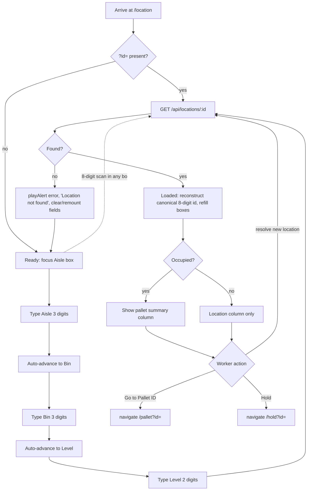

# Screen Design: LII — Location ID Info

**Device:** Tablet — iPad Pro 13" landscape, fixed 1366×1024 canvas (kiosk)
**Bucket:** Existing Warehouse App (current production screen)
**Roles:** All roles (Worker, IM, Lead Worker, Manager, Admin) — fully read-only, no role-gated behavior on this screen.

## Flow

1. Worker arrives at `/location` via Home, HotJump ("LII"), or by tapping any `<LiveId type="location">` chip elsewhere in the app (navigates here with `?id=<8-digit>`).
2. The shared `LocationEntryFields` component (Aisle/Bin/Level, three boxes) auto-focuses its first box ~50ms after mount (if arriving without `?id=`).
   - 2a. If arriving via `?id=`, that location is looked up immediately instead.
3. Worker resolves a location one of two ways:
   - 3a. **Manual entry:** types Aisle (3 digits, auto-advances), then Bin (3 digits, auto-advances), then Level (2 digits, auto-resolves) — each box auto-submits at its fixed length, no explicit Enter/OK needed.
   - 3b. **Barcode scan:** an 8-digit full Aisle+Bin+Level scan lands in whichever box currently has focus and resolves immediately, overriding anything already typed into the other boxes.
4. `GET /api/locations/:id` is called with the resolved id.
   - 4a. **Found:** location data renders below the entry fields. The three boxes are re-derived and refilled with the canonical 8-digit id reconstructed from the response (not trusted from the raw input string) — this matters for a 6-digit lookup (e.g. the demo button), which would otherwise leave Level ambiguous.
   - 4b. **Not found:** see Mis-scan handling below; the three entry boxes are cleared and remounted (fresh `entryKey`).
5. If the location is occupied (has a `pallet`), a second column shows a pallet summary (Pallet ID, DPCI, Cartons, Pallets, SSPs, Pallet Status) alongside the location detail column. If unoccupied, only the location detail column shows.
6. Worker may resolve a new location at any time — the entry fields remain live in the Loaded state.
7. Worker presses **"Go to Pallet ID"** (only enabled when occupied) → navigates to `/pallet?id=<pid>`.
8. Worker presses **"Hold"** (always enabled) → navigates to `/hold?id=<8-digit location id>`.

### Mis-scan / error handling

- `GET /api/locations/:id` 404 (bad manual entry combination, or a scanned barcode for a location that doesn't exist): `playAlert('error')`, message bar `"Location not found"`, all three entry boxes clear (component remounts via an incremented `entryKey`), location data cleared.
- A malformed 6-digit-or-other non-8-digit raw input that doesn't parse as a valid Aisle/Bin pair: rejected server-side as `400 INVALID_INPUT` before ever reaching the not-found check — surfaces identically as "Location not found" to the worker (the frontend does not distinguish 400 from 404 in its catch handler).

### Status / messaging behavior

- Error messages use the shared MessageBar — non-blocking, persists until replaced by the next message or navigation.
- A `"Loading…"` pulsing placeholder shows while the fetch is in flight; the entry fields and any previously-loaded data are hidden during that window (`!loading` gates the results block).

## Layout

```
┌──────────────────────────────────────────────────────────────────────────────┐
│ ‹ Back   ⌂ Home   >_ Jump   ☰ Activity     LOCATION ID INFO      J. Smith  Logout │  104px Header
├──────────────────────────────────────────────────────────────────────────────┤
│                              (Message Bar — success/error text)                │  74px
├──────────────────────────────────────────────────────────────────────────────┤
│  AISLE        BIN        LEVEL                                                │
│  ┌─────┐    ┌─────┐    ┌────┐                                                 │
│  │ 012 │    │ 034 │    │ 05 │   ← auto-advances; full 8-digit scan overrides  │
│  └─────┘    └─────┘    └────┘                                                 │
│                                                                                 │
│  ── Location column ─────────────────  ── Pallet summary (if occupied) ─────  │
│  Location ID    012-034-05             Pallet ID       4471203                │
│  Aisle          12                     DPCI             123-45-6789           │
│  Bin            34                     Cartons          24                    │
│  Level          5                      Pallets          1                    │
│  Zone           2                      SSPs             3                    │
│  Size           M                      Pallet Status    [STORED]              │
│  Storage Code   CR                                                            │
│  Status         [STORED]                                                      │
│  Hold           None                                                          │
│                                                                                 │
│  [ Go to Pallet ID ]  (disabled if empty)   [ Hold ]                          │  content: 792px
│                                                                                 │
├──────────────────────────────────────────────────────────────────────────────┤
│ [123 Keypad] [ABC Keyboard]   ✓ Scan Location   ✗ Bad Location   BD 26198 7/17 3:41 PM │ 54px Footer
└──────────────────────────────────────────────────────────────────────────────┘
```

## Input handling

- All three entry boxes (Aisle/Bin/Level) are numpad-driven via `useNumpadField()`, wrapped by the shared `LocationEntryFields` component (the same component used by WLH). `maxLength` is set per box (3/3/2) so each auto-submits at its fixed length without an explicit OK — a scan mid-injection suppresses this auto-submit via `NumpadContext`'s `isScanningRef`, so a longer scanned override value isn't cut short.
- A short manual entry confirmed explicitly (Enter/OK) is left-zero-padded to the box's fixed width (e.g. typing "80" and pressing OK on Bin submits "080").
- A full 8-digit scan landing in *any* of the three boxes (regardless of which one currently has focus) is treated as a complete override and resolves immediately — this is the physical-barcode path; LII (unlike MNP) always requires the full 3-box or 8-digit resolution — `levelOptional` is not set here.
- All buttons meet the 72px+ min touch target convention for primary actions ("Go to Pallet ID"/"Hold" are 56px tall, matching the app's standard secondary-action-row height).

## Data

**Reads:**
- `Location` (by composite Aisle+Bin+Level, or by Aisle+Bin alone for a 6-digit lookup) — aisle, bin, level, zone, storageCode, size, status, holdCategory
- `Pallet` (via the location's `pallets` relation, first match only) — pid, dept/class/item, currentCartons, currentPallets, currentSSPs, status

**Writes:** None — LII is fully read-only. Hold placement/removal happens on the separate WLH screen this one navigates to; no location or pallet field is ever mutated from LII itself.

**Not written:** No activity-log entry is produced by simply viewing a location on LII — only the destination screens (WLH's Hold placement, PII's Edit) generate `ActivityLog` rows.

## Screen Flow

Covers: cold lookup (found/not found), `?id=` pre-population, manual 3-box entry vs. full-barcode scan override, occupied vs. empty display, and navigation to PII/WLH.



## Behind the Scenes

**Canonical id reconstruction, not raw-input trust.** `loadLocation` always rebuilds the 8-digit `locationId` state from the response's own `aisle`/`bin`/`level` fields, never from whatever string was actually typed or scanned. This matters specifically for a 6-digit (Aisle+Bin only) lookup — the demo button only ever knows Aisle+Bin, and without this reconstruction `locationId` would be ambiguous on Level, which matters because the Hold navigation (`goToHold`) requires an exact 8-digit id.

**GET supports two lookup modes server-side.** `getLocation` in `locations.ts` branches on whether the raw id parses as a full 8-digit barcode: an 8-digit input does an exact `findUnique` on the composite `LocationID` key; anything else falls back to `parseLocationBarcode` and a `findFirst` on Aisle+Bin alone (ignoring Level) — this second path exists for MNP's own 6-digit validation use case as well as LII's demo button, not just LII.

**Only the first pallet at a location is shown.** The Prisma query includes `pallets: { select: PALLET_SUMMARY_SELECT } }` and the handler takes `location.pallets[0] ?? null` — under the current data model a location should only ever hold one pallet, but the code doesn't enforce or surface a second occupant if one somehow exists (see Open Items — issue #87, and the related open bug #86 about `placePallet` not checking for a second occupant when clearing a pallet's old location).

**No session-local history on this screen.** Unlike PIP/SDP/MNP/STG, LII keeps no in-screen log of prior lookups this session — each new resolve simply replaces the currently-displayed location. The app-wide 12-hour Activity Log overlay (header "☰ Activity" button) is a separate, unrelated view and doesn't log LII lookups at all, since LII performs no state-changing action.

## Open items still remaining

- [#87](https://github.com/BobbyJoeCool/PalletIQ/issues/87) (open, Needs Triage) — LII should show and let the worker switch between multiple pallets at a location, if more than one is ever present. Currently only `pallets[0]` is shown and there is no UI to select among others.
- [#86](https://github.com/BobbyJoeCool/PalletIQ/issues/86) (open, Major) — related root cause: `placePallet` clears a pallet's old location to EMPTY without checking for a second occupant pallet (MNP/SDP side, not LII itself, but it's the mechanism that could produce the multi-occupant state #87 would need to handle).
- [#88](https://github.com/BobbyJoeCool/PalletIQ/issues/88) (open, Needs Triage) — bad Contraction seed data (every RS/RF/BS location, plus some HS locations on Levels 2-9, incorrectly flagged as contracted) is not LII-specific but affects what a worker sees if they look up one of those locations here.
- `DevNotes/Fixes/LII/01` (not fixed, cross-cutting with PII/ISI) — the loaded location does not persist across navigating away and back; same proposed fix as PII's identical item (a shared session-level context, mirroring `StagingContext.tsx`).
- `DevNotes/Fixes/LII/02` (not fixed, feature) — no demo helper exists to jump straight to a Held/Reserved/Staged/Contraction location, mirroring WLH's existing "Find Held Location"/"Find Available Location" buttons (`GET /api/locations/random-held`/`random-unheld`) — Reserved/Staged/Contraction have no equivalent random-pick endpoint yet.
- `DevNotes/Fixes/LII/03` (not fixed, feature) — the occupied-location pallet summary doesn't show the item's short description (`descShort`); the current `GET /api/locations/:id` response contract has no such field, so this needs both an API and a frontend change.

## Change Log

| Date | Change |
|---|---|
| 2026-07-17 | Rebuilt onto the new standard template from `DevNotes/Screen-Specs/LII.md`, grounded directly in the current `LIIPage.tsx`/`locations.ts` code. No behavioral changes made as part of this rebuild. |
| 2026-07-15 (v1.6.3) | Underlying `LocationEntryFields` fixed to correctly recognize a 6-digit (Aisle+Bin-only) scanned barcode, which had previously been silently dropped by every screen sharing the component, LII included. |
| 2026-07-08 (v1.1.5) | Focused-field (red border) highlighting confirmed already correct on LII's entry boxes (called out only because PII/IID were found missing it at the same time). |
| 2026-07-06 (v1.0.4) | Aisle/Bin/Level entry fixed to actually auto-advance at each box's fixed digit count, matching what the original spec already called for but the code hadn't implemented; added the `maxLength`/`isScanningRef` mechanism to `useNumpadField`/`LocationEntryFields` that this relies on. |
| 2026-07-08 (v1.1.0) | Added a second column showing the located pallet's summary alongside the location detail, instead of stacking everything in one narrow column (issue #18); DPCI values made tappable, jumping to IID (issue #47). |
| Initial build — v0.9.0 (2026-07-05) | LII shipped as part of the initial feature-complete build: read-only location lookup for all roles via a three-field Aisle/Bin/Level entry or full barcode scan, with a pallet summary shown when occupied. |
