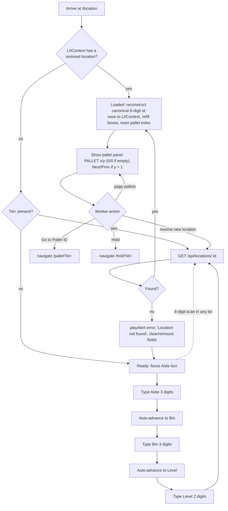

# Screen Design: LII — Location ID Info

**Device:** Tablet — iPad Pro 13" landscape, fixed 1366×1024 canvas (kiosk)
**Bucket:** Existing Warehouse App (current production screen)
**Roles:** All roles (Worker, IM, Lead Worker, Manager, Admin) — fully read-only, no role-gated behavior on this screen.

## Flow

1. Worker arrives at `/location` via Home, HotJump ("LII"), or by tapping any `<LiveId type="location">` chip elsewhere in the app (navigates here with `?id=<8-digit>`).
   - 1a. If a location was already loaded earlier this session (`LIIContext` — see Behind the Scenes), it's restored immediately: the entry boxes and detail panel both show the last-loaded location, and the entry boxes do **not** auto-focus (avoids popping the numpad panel open over the restored detail).
2. On a genuinely fresh visit (nothing restored, no `?id=`), the shared `LocationEntryFields` component (Aisle/Bin/Level, three boxes) auto-focuses its first box ~50ms after mount.
   - 2a. If arriving via `?id=`, that location is looked up immediately instead.
3. Worker resolves a location one of two ways:
   - 3a. **Manual entry:** types Aisle (3 digits, auto-advances), then Bin (3 digits, auto-advances), then Level (2 digits, auto-resolves) — each box auto-submits at its fixed length, no explicit Enter/OK needed.
   - 3b. **Barcode scan:** an 8-digit full Aisle+Bin+Level scan lands in whichever box currently has focus and resolves immediately, overriding anything already typed into the other boxes. The numpad panel closes (`hidePanel()`) and the box stays filled with the resolved value.
4. `GET /api/locations/:id` is called with the resolved id.
   - 4a. **Found:** location data renders below the entry fields, and the three boxes are refilled with the canonical 8-digit id reconstructed from the response (not trusted from the raw input string) — this matters for a 6-digit lookup (e.g. a demo button), which would otherwise leave Level ambiguous. The result is saved into `LIIContext` so it survives navigating away and back.
   - 4b. **Not found:** see Mis-scan handling below; the three entry boxes are cleared and remounted (fresh `entryKey`).
5. The pallet summary column always renders alongside the location detail column, regardless of occupancy — headed by a bold **"PALLET x/y"** indicator (`x` = the currently paged occupant, `y` = total occupant count). An unoccupied location reads **"PALLET 0/0"**, with every field below it (Pallet ID, DPCI, Description, Cartons, Pallets, SSPs, Pallet Status) shown as a null dash (`—`) instead of the column being hidden.
   - 5a. **Multiple occupants** (issue #87 — possible since MNP's v1.6.3 "Proceed Anyway" dual-occupancy path): "PALLET x/y" reads e.g. "PALLET 1/2", with **Next ›** / **‹ Prev** buttons next to the indicator to cycle through occupants (wraps at both ends). Only shown when `y > 1`.
   - 5b. If the location has `contraction: true`, a "CONTRACTED" badge (same `StatusBadge` styling as Status, `danger` variant) renders inline next to the Status badge, in the same row — independent of both Status and Hold, since Contraction is its own column on `Location`, not a value of either.
6. Worker may resolve a new location at any time — the entry fields remain live in the Loaded state. Resolving a new location resets the pallet-paging index back to the first occupant.
7. Worker presses **"Go to Pallet ID"** (enabled only when the currently-paged pallet exists) → navigates to `/pallet?id=<pid>`.
8. Worker presses **"Hold"** (always enabled once a location is loaded) → navigates to `/hold?id=<8-digit location id>`.

### Demo footer buttons

Three buttons, left to right: **"✓ Scan Location"** (a genuinely random location, any status — `status=any`, matching what a real barcode scan could land on), **"Find by Status"** (opens a `DemoPicker` popup listing all 8 possible location states — Empty, Stored, Staged, Reserved, Pull Pending, Held, Contraction, Multiple Pallet IDs — picking one loads a random location in that state), and **"✗ Bad Location"** (a location id that doesn't exist). All three call `hidePanel()` before loading, so an open numpad panel from a prior manual-entry attempt doesn't linger after a demo button resolves a location.

"Multiple Pallet IDs" finds a location with more than one occupant pallet (issue #87 —
MNP's v1.6.3 dual-occupancy "Proceed Anyway" override can produce these live; ~20 are also
seeded explicitly at `db:local:seed`/`db:local:setup` time — see `seed.ts`'s
`addMultiOccupancyPallets`) — the natural way to exercise the pallet panel's "PALLET x/y"
paging described above.

### Mis-scan / error handling

- `GET /api/locations/:id` 404 (bad manual entry combination, or a scanned barcode for a location that doesn't exist): `playAlert('error')`, message bar `"Location not found"`, all three entry boxes clear (component remounts via an incremented `entryKey`), location data cleared.
- A malformed 6-digit-or-other non-8-digit raw input that doesn't parse as a valid Aisle/Bin pair: rejected server-side as `400 INVALID_INPUT` before ever reaching the not-found check — surfaces identically as "Location not found" to the worker (the frontend does not distinguish 400 from 404 in its catch handler).

### Status / messaging behavior

- Error messages use the shared MessageBar — non-blocking, persists until replaced by the next message or navigation.
- A `"Loading…"` pulsing placeholder shows while the fetch is in flight; the entry fields and any previously-loaded data are hidden during that window (`!loading` gates the results block).

## Layout

```
┌──────────────────────────────────────────────────────────────────────────────┐
│ ‹ Back   ⌂ Home   >_ Jump   ☰ Activity     LOCATION ID INFO      J. Smith  Logout │  104px Header
├──────────────────────────────────────────────────────────────────────────────┤
│                              (Message Bar — success/error text)                │  74px
├──────────────────────────────────────────────────────────────────────────────┤
│  AISLE        BIN        LEVEL                                                │
│  ┌─────┐    ┌─────┐    ┌────┐                                                 │
│  │ 012 │    │ 034 │    │ 05 │   ← auto-advances; full 8-digit scan overrides  │
│  └─────┘    └─────┘    └────┘                                                 │
│                                                                                 │
│  ── Location column ─────────────────  ── Pallet summary (always shown) ───  │
│  Location ID    012-034-05             PALLET 1/2      [‹ Prev] [Next ›]      │
│  Aisle          12                     Pallet ID       4471203                │
│  Bin            34                     DPCI             123-45-6789           │
│  Level          5                      Description      Widget, 12pk          │
│  Zone           2                      Cartons          24                    │
│  Size           M                      Pallets          1                    │
│  Storage Code   CR                     SSPs             3                    │
│  Status         [STORED] [CONTRACTED]  Pallet Status    [STORED]              │
│  Hold           None                                                          │
│                                                                                 │
│  [ Go to Pallet ID ]  (disabled if empty)   [ Hold ]                          │  content: 792px
│                                                                                 │
├──────────────────────────────────────────────────────────────────────────────┤
│ [123 Keypad] [ABC Keyboard]  ✓ Scan Location  Find by Status  ✗ Bad Location  BD 26198 7/17 3:41 PM │ 54px Footer
└──────────────────────────────────────────────────────────────────────────────┘
```

An unoccupied location's right column instead reads "PALLET 0/0" with every field below it as `—`; Next/Prev only render when more than one pallet occupies the location.

## Input handling

- All three entry boxes (Aisle/Bin/Level) are numpad-driven via `useNumpadField()`, wrapped by the shared `LocationEntryFields` component (the same component used by WLH). `maxLength` is set per box (3/3/2) so each auto-submits at its fixed length without an explicit OK — a scan mid-injection suppresses this auto-submit via `NumpadContext`'s `isScanningRef`, so a longer scanned override value isn't cut short.
- A short manual entry confirmed explicitly (Enter/OK) is left-zero-padded to the box's fixed width (e.g. typing "80" and pressing OK on Bin submits "080").
- A full 8-digit scan landing in *any* of the three boxes (regardless of which one currently has focus) is treated as a complete override and resolves immediately — this is the physical-barcode path; LII (unlike MNP) always requires the full 3-box or 8-digit resolution — `levelOptional` is not set here.
- All buttons meet the 72px+ min touch target convention for primary actions ("Go to Pallet ID"/"Hold" are 56px tall, matching the app's standard secondary-action-row height).

## Data

**Reads:**

- `Location` (by composite Aisle+Bin+Level, or by Aisle+Bin alone for a 6-digit lookup) — aisle, bin, level, zone, storageCode, size, status, holdCategory, contraction
- `Pallet` (via the location's full `pallets` relation, every occupant, ordered by `pid` ascending — not truncated to the first match, per issue #87) — pid, dept/class/item, currentCartons, currentPallets, currentSSPs, status, and (via `itemRef`) the item's `descShort`

**API contract — `GET /api/locations/:id`:**

```text
{
  aisle, bin, level, zone, storageCode, size, status,
  holdCategory: string | null,
  contraction: boolean,
  pallets: {
    id, dpci, cartons, pallets, ssps, status, descShort
  }[]   // [] when unoccupied — never a single nullable `pallet` field
}
```

**Writes:** None — LII is fully read-only. Hold placement/removal happens on the separate WLH screen this one navigates to; no location or pallet field is ever mutated from LII itself.

**Not written:** No activity-log entry is produced by simply viewing a location on LII — only the destination screens (WLH's Hold placement, PII's Edit) generate `ActivityLog` rows.

## Screen Flow

Covers: cold lookup (found/not found), context restore, `?id=` pre-population, manual 3-box entry vs. full-barcode scan override, always-visible (possibly multi-occupant) pallet panel, and navigation to PII/WLH.



## Behind the Scenes

**Canonical id reconstruction, not raw-input trust.** `loadLocation` always rebuilds the 8-digit `locationId` state from the response's own `aisle`/`bin`/`level` fields, never from whatever string was actually typed or scanned. This matters specifically for a 6-digit (Aisle+Bin only) lookup — a demo button only ever knows Aisle+Bin, and without this reconstruction `locationId` would be ambiguous on Level, which matters because the Hold navigation (`goToHold`) requires an exact 8-digit id.

**GET supports two lookup modes server-side.** `getLocation` in `locations.ts` branches on whether the raw id parses as a full 8-digit barcode: an 8-digit input does an exact `findUnique` on the composite `LocationID` key; anything else falls back to `parseLocationBarcode` and a `findFirst` on Aisle+Bin alone (ignoring Level) — this second path exists for MNP's own 6-digit validation use case as well as LII's demo buttons.

**Every occupant pallet is returned, not just the first (issue #87).** The Prisma query includes `pallets: { select: PALLET_SUMMARY_SELECT, orderBy: { pid: 'asc' } } }`, and the handler maps the full array into the response's `pallets` field — a location can legitimately hold more than one pallet since MNP's v1.6.3 "Proceed Anyway" dual-occupancy path (see the related open bug #86 about `placePallet` not checking for a second occupant when clearing a pallet's old location). `LIIPage.tsx` keeps a local `palletIndex` (reset to 0 on every new location load) to page through the array; the "PALLET x/y" header and Next/Prev buttons are the frontend surface for this.

**Session persistence via `LIIContext`.** The loaded location lives in `LIIProvider` (mounted in `App.tsx`, alongside `PIIProvider`/`ISIProvider`), not local component state, so navigating away from LII and back restores the last-loaded location instead of resetting to the empty Ready state (LII fix-list item 01). `LIIPage`'s entry boxes are prefilled from the restored `locationId` via `LocationEntryFields`' `value` prop (the same external-prefill mechanism PAR already uses), and `autoFocus` is computed once at mount (`!loaded`) so restoring a location doesn't yank focus into the entry boxes and pop the numpad panel open.

**No session-local history on this screen.** Unlike PIP/SDP/MNP/STG, LII keeps no in-screen log of prior lookups this session (beyond the single most-recent one in `LIIContext`) — each new resolve simply replaces the currently-displayed location. The app-wide 12-hour Activity Log overlay (header "☰ Activity" button) is a separate, unrelated view and doesn't log LII lookups at all, since LII performs no state-changing action.

## Open items still remaining

- [#86](https://github.com/BobbyJoeCool/PalletIQ/issues/86) (open, Major) — `placePallet` clears a pallet's old location to EMPTY without checking for a second occupant pallet (MNP/SDP side, not LII itself, but it's the mechanism that produces the multi-occupant state #87 now displays).
- [#88](https://github.com/BobbyJoeCool/PalletIQ/issues/88) (open, Needs Triage) — bad Contraction seed data on the **live** Azure DB (every RS/RF/BS location, plus some HS locations on Levels 2-9, incorrectly flagged as contracted) is not LII-specific but means the new Contraction badge will show up far more often than it should there until that data issue is separately corrected. Root cause traced during LII v1.6.9's live verification: `20260718000000_seed_initial_contraction_rules` (a data-only migration) was applied to the live DB via `prisma migrate deploy` but never to local Docker, since local dev sync uses `db push` (schema-only) — so local Docker currently reads `contraction: false` on every row instead.
- [#90](https://github.com/BobbyJoeCool/PalletIQ/issues/90) (open, Needs Triage, post-v1.7.0) — add a per-record audit trail to LII (and PII, and a future Container ID screen). Explicitly out of scope for v1.6.9.

## Change Log

| Date | Change |
| --- | --- |
| 2026-07-19 (v1.6.9) | "Find by Status" fixed a real bug (Empty/Staged picks showing the wrong status — the demo endpoint's exact `level` was being discarded, causing an ambiguous 6-digit lookup); added an 8th picker option, "Multiple Pallet IDs" (issue #87), backed by a new `Pallet.groupBy`-based branch in `sampleLocation`; and ~20 multi-occupant locations (10 with 2 pallets, 10 with 4, each with a distinct DPCI) are now seeded explicitly by `seed.ts`'s new `addMultiOccupancyPallets`, so this data survives a full database rebuild, not just a one-off backfill. Also (app-wide, not LII-specific): `StatusBadge` now renders underscores in a status string as spaces (`CA_PULL_PEND` → "CA PULL PEND"). |
| 2026-07-19 (v1.6.9) | Contraction display revised after live testing: moved from a separate callout bubble below Status to a "CONTRACTED" `StatusBadge` rendered inline next to the Status badge, same row, same styling (item 04 revision 2 — see that fix file's revision history). |
| 2026-07-18 (v1.6.9) | LII fix-list round: state now persists across navigation via `LIIContext` (item 01); footer's "Find by Status" button opens a `DemoPicker` covering all 7 location states (item 02, expanded from the original Held/Reserved/Staged/Contraction scope); pallet summary gains the item's `descShort` (item 03); Contraction now renders next to Status, and `contraction` was added to `GET /api/locations/:id`'s response (item 04, also closing a prior API gap); demo footer buttons now call `hidePanel()` before loading (item 05); and, per issue #87, the pallet panel is now always visible with a "PALLET x/y" header (or "0/0" when empty) and Next/Prev paging through every occupant pallet — `GET /api/locations/:id` returns the full `pallets` array instead of a single nullable `pallet` field. |
| 2026-07-17 | Rebuilt onto the new standard template from `DevNotes/Screen-Specs/LII.md`, grounded directly in the current `LIIPage.tsx`/`locations.ts` code. No behavioral changes made as part of this rebuild. |
| 2026-07-15 (v1.6.3) | Underlying `LocationEntryFields` fixed to correctly recognize a 6-digit (Aisle+Bin-only) scanned barcode, which had previously been silently dropped by every screen sharing the component, LII included. |
| 2026-07-08 (v1.1.5) | Focused-field (red border) highlighting confirmed already correct on LII's entry boxes (called out only because PII/IID were found missing it at the same time). |
| 2026-07-06 (v1.0.4) | Aisle/Bin/Level entry fixed to actually auto-advance at each box's fixed digit count, matching what the original spec already called for but the code hadn't implemented; added the `maxLength`/`isScanningRef` mechanism to `useNumpadField`/`LocationEntryFields` that this relies on. |
| 2026-07-08 (v1.1.0) | Added a second column showing the located pallet's summary alongside the location detail, instead of stacking everything in one narrow column (issue #18); DPCI values made tappable, jumping to IID (issue #47). |
| Initial build — v0.9.0 (2026-07-05) | LII shipped as part of the initial feature-complete build: read-only location lookup for all roles via a three-field Aisle/Bin/Level entry or full barcode scan, with a pallet summary shown when occupied. |
