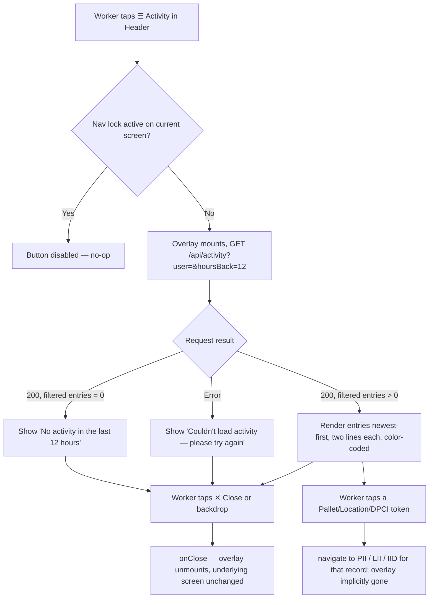

# Screen Design: LOG — App-Wide Activity Log Overlay

**Device:** Tablet — iPad Pro 13" landscape, fixed 1366×1024 canvas (kiosk)
**Bucket:** Existing Warehouse App (current production feature)
**Roles:** All roles (Worker, IM, Lead Worker, Manager, System Admin) — every role sees an identical overlay, scoped to their own activity only (no Lead+ "view others" mode exists in the shipped feature — see Open items)

Not a routed page — there is no `/log` (or similar) URL and no dedicated jump code. It is a full-screen overlay (`src/components/shell/ActivityLogOverlay.tsx`) that any authenticated screen can open via the "☰ Activity" button that AppShell's `<Header>` renders on every screen, and it renders on top of whatever screen was open when it was invoked.

## Flow

1. Worker is on any authenticated screen (Home, PIP, SDP, MNP, PII, LII, ISI, WLH, ELA, ELZ, STG, PAR, etc.). The Header (104px, top of every screen) always shows a "☰ Activity" button alongside Back/Home/Jump/Logout.
2. Worker taps "☰ Activity." `AppShell`'s `ShellInner` sets `activityOpen = true` and renders `<ActivityLogOverlay onClose={...} />` on top of the current screen (the underlying screen is not unmounted — the overlay is a fixed, full-viewport layer at `z-50` over a dimmed/blurred backdrop).
3. On mount, the overlay calls `GET /api/activity?user={zNumber}&hoursBack=12`, always scoped to the logged-in worker's own `zNumber` — every role, with no exception, sees only their own activity.
4. **3a — Loading:** shows a muted, pulsing "Loading…" line.
5. **3b — Error** (request failed): shows "Couldn't load activity — please try again." in a dim red.
6. **3c — Success, zero entries:** shows "No activity in the last 12 hours."
7. **3d — Success, one or more entries:** renders each visible entry (see filtering below) as a two-line block — a bold red function tag + timestamp on the top line, one or more color-coded free-form detail lines below it — newest first.
8. Worker can tap any Pallet ID, Location ID, or DPCI/UPC token embedded in a detail line; this navigates (via the same `<LiveId>` component used everywhere else in the app) to that record's PII/LII/IID detail screen — closing the overlay implicitly, since navigation changes the route AppShell renders in the content slot.
9. Worker taps "✕ Close" (or the dimmed backdrop, outside the panel) to dismiss the overlay and return to whatever screen was already open underneath — no state changes.
10. The window is always recalculated fresh (based on stored `timestamp`s, `now − 12h`) at the moment the overlay opens — it survives a page reload and does not depend on how long the current login session has been open.
11. The Activity button (like Back/Home/Jump/Logout) is disabled whenever the underlying screen has an active navigation lock (e.g. an SDP reservation awaiting put) — `Header`'s `locked` prop, sourced from `NavLockContext`, disables all five controls together so a worker can't leave a locked transaction via any header control, including this one.

### Mis-scan / error handling

Not applicable in the traditional sense (no scanned/typed input on this overlay), but equivalent failure modes:

- **API call fails** (network error, 401, 500, etc.): the overlay shows a generic "Couldn't load activity — please try again," with no retry button — the worker must close and reopen the overlay to retry.
- **A logged-in-but-token-invalid state**: not specifically handled beyond the generic error message above (the underlying `apiFetch` throws, caught by the same `catch` block as any other failure).

### Status / messaging behavior

- This overlay does not use the app's shared `MessageBarContext` at all — its loading/error/empty states are rendered inline inside the overlay's own panel, not in the header's message bar strip.
- Each entry is permanent within the fetched 12-hour window; nothing on this screen auto-clears or requires acknowledgment — the whole overlay is dismissed as a unit via Close.

## Layout (overlay over the existing landscape shell)

```
┌───────────────────────────────────────────────────────────────────────────┐  Full 1366×1024 canvas
│ ░░░░░░░░░░░░░░░░░░  (dimmed/blurred backdrop — bg-black/80, backdrop-blur) ░░░░░░░░░░░░░░ │
│  ░░░  ┌───────────────────────────────────────────────────┐  ░░░           │
│  ░░░  │ ACTIVITY — LAST 12 HOURS                  ✕ Close │  ░░░  ← panel header
│  ░░░  ├───────────────────────────────────────────────────┤  ░░░           │
│  ░░░  │ PULL · 10:42:07 AM                                │  ░░░           │
│  ░░░  │ CA Pull: Pulled 4C from [Pallet 40021] at [305-12-2]│  ░░░  (green) │
│  ░░░  │───────────────────────────────────────────────────│  ░░░           │
│  ░░░  │ PUT · 10:15:41 AM                                  │  ░░░           │
│  ░░░  │ SDP: [Pallet 40077] put in [210-04-1] (Staged)     │  ░░░  (green) │
│  ░░░  │───────────────────────────────────────────────────│  ░░░           │
│  ░░░  │ WLH · 9:30:02 AM                                   │  ░░░           │
│  ░░░  │ Placed Hold Both on [305-06-1]                     │  ░░░ (amber) │
│  ░░░  │ (scrollable, up to max-h-[85%] of viewport)        │  ░░░           │
│  ░░░  └───────────────────────────────────────────────────┘  ░░░           │
│  ░░░░░░░░░░░░░░░░░░░░░░░░░░░░░░░░░░░░░░░░░░░░░░░░░░░░░░░░░░░░░░░░░░░░░░░░░░░ │
└───────────────────────────────────────────────────────────────────────────┘
```

Panel dimensions: `max-w-[720px]`, `max-h-[85%]` of the viewport, centered, rounded corners (`18px`), dark surface (`#0A0A0A`) with a `#2A2A2A` border — sits centered over whichever screen was already rendering underneath, independent of that screen's own layout (ISI's 792px content slot, SDP's locked-transaction layout, etc. are irrelevant to this overlay's own internal layout).

## Input handling

- No Numpad/Keyboard/scanner interaction on this overlay itself — it is read-only and dismiss/tap-navigate only.
- Tapping outside the panel (on the backdrop) closes it, same as "✕ Close" — both call the same `onClose`.
- Tap targets: each `<LiveId>` token inside a detail line is inline text-sized (not a dedicated 72px button) — consistent with how `<LiveId>` renders inline everywhere else in the app (PII/LII detail fields, etc.), not a departure specific to this overlay.
- The "☰ Activity" button that opens this overlay is a standard 68px-tall Header control, same sizing as Back/Home/Jump/Logout.

## Data

**Reads:**
- `ActivityLog` — via `GET /api/activity?user={zNumber}&hoursBack=12`, filtered to `userId = {zNumber}` and `timestamp >= now - 12h`, ordered `timestamp desc`, capped at 200 rows. Every field is read: `id`, `timestamp`, `userId`, `actionType`, `palletId`, `locationAisle`/`locationBin`/`locationLevel` (assembled into a formatted `location` string only when all three are present), `dept`/`class`/`item` (assembled into `dpci`), and `details` (parsed from its stored JSON string).
- Client-side, entries whose `actionType` is in `HIDDEN_ACTION_TYPES` (`RESERVE`, `MNP_SCAN`, `RES_TMOUT`, `STAGE`) are filtered out via `isVisibleActivity()` before rendering — these are intermediate/system bookkeeping rows, not worker-meaningful events (see Behind the Scenes).

**Writes:** None from this overlay itself. Every state-changing endpoint elsewhere in the app (`puts.ts`, `pulls.ts`, `staging.ts`, `pallets.ts`, `locations.ts`, etc.) is what actually writes `ActivityLog` rows via the shared `writeLog()` helper (`api/lib/activityLog.ts`) — this overlay is a pure read/display surface over that data.

**Not written:** Whether/when a worker opened this overlay, and which entries they tapped to navigate away, are not themselves logged anywhere — viewing your own activity log is not itself an activity-log event. Login/logout events are also not written to `ActivityLog` at all (no `actionType` exists for them); this overlay can never show a login/logout entry.

## Screen Flow

Covers: opening from any screen, loading/error/empty/populated states, tap-to-navigate, close, and the nav-lock interaction.



## Behind the Scenes

**Own-activity-only scoping (C):** The `user` query param is always the current session's `user!.zNumber` — there is no UI control anywhere in the overlay to broaden the scope to another worker or "everyone," even for Lead+/Manager/Admin roles. The backend endpoint (`GET /api/activity`) itself is generic enough to support an unfiltered or other-user query (it's the same shared read path IRP/SAR/future reporting screens use), but the overlay's own fetch call hardcodes the filter to the logged-in user — the restriction lives in the frontend, not a backend role check.

**Hidden action types (C, filtering):** `RESERVE` and `MNP_SCAN` are pre-steps immediately followed by the actionType that actually completes the transaction (`PUT`, `UNASSIGN`, or `BLOCK_PUT`); `RES_TMOUT` is a server-initiated auto-expiry with no worker action behind it; `STAGE` is real worker action but is the per-location bookkeeping row that `reporting.ts`'s "Staged Longest" column depends on — the overlay instead shows the combined `STAGE_SUM`/`RESTAGE` one-row-per-action entries (added in v1.5.1) built specifically for this display. This means the number of raw `ActivityLog` rows behind a single visible STG entry can be much larger than what's shown — one `STAGE_SUM` row summarizes potentially dozens of individual per-location `STAGE` rows written in the same staging action.

**Severity color-coding (G):** `severityFor()` in `src/lib/activityFormat.ts` is not a flat 1:1 mapping from `actionType` to color — `PUT` and `RESTAGE` inspect `entry.details` to distinguish a routine outcome from one worth flagging (e.g. a non-consolidating move, an MNP put onto an already-occupied location, a restage that only cleared locations without staging anything new). `error` (red) is reserved for `RES_TMOUT` — a failed action generally never reaches a written log entry at all, since the write only happens on a completed transaction.

**Tap navigation (H):** Detail lines are built as arrays of tokens (`DetailToken = string | { id, type }`) rather than plain strings — `detailFor()` returns structured `DetailLine[]`, and the overlay renders each token, turning `{id, type}` tokens into `<LiveId>` components. This was a deliberate contract change (v1.5.1) from an earlier flat-string design specifically to support tapping.

**Per-function detail copy (G):** Every `actionType` the app currently writes has a bespoke `detailFor()` case — PIP states pull function + quantity pulled, SDP/MNP distinguish put-vs-move and append override/occupied/contraction notes plus a "SDP:"/"MNP:" prefix (added v1.6.3 so a PUT-type entry's origin screen is visible at a glance), PII shows a changed-fields old→new diff plus reason code, STG breaks Restage into one line per freight type. An unrecognized future `actionType` falls back to a generic `"{actionType} at {location}"` readout rather than a blank line, so the overlay never silently drops an entry it doesn't have bespoke copy for yet.

**Independence from per-screen session logs:** This overlay is explicitly separate from, and does not replace, each individual screen's own session-local log/history panel (STG's collapsed bar, PIP/SDP/MNP's in-session history lists) — those still show only that one screen's own current-session activity and were deliberately left unchanged when this overlay shipped.

## Open items still remaining

- **Activity button's disabled-during-nav-lock state was flagged as possibly broken during the v1.5.0 smoke test**, though a static read of the current code (`Header.tsx`'s `disabled={locked}` on the Activity button, wired the same as Jump/Logout via `NavLockContext` → `AppShell` → `Header`) shows the disable wiring already present end-to-end — if still reproducible live, it's likely a timing/race issue (e.g. `NavLockContext` updating a render behind `screenState`) rather than a missing prop; worth re-verifying against a live build before assuming it's still broken. (`DevNotes/Fixes/AppWide/01-activity-log-button-not-disabled-during-sdp-lock.md`)
- **Mixed-outcome Restage/Unstage entries are colored by the action's overall outcome, not per line** — if any freight type in a single Restage/Unstage action was actually restaged, the whole entry renders green even though one of its per-freight-type lines describes a pure unstage. Splitting severity per line would need a larger rendering change than the current one-severity-per-entry model supports. (v1.5.1 Known Limitation, still open)
- **No "view another worker's activity" mode exists for any role**, including Lead+/Manager/Admin — every role sees only their own last-12-hours activity, with no backend role check preventing a broader query (the `GET /api/activity` endpoint itself already supports an unfiltered `user` param) and no frontend control to invoke one. Whether this is intended final behavior or a scoped-down v1 of a broader plan hasn't been explicitly settled — flagged here rather than assumed either way.
- **An earlier, more elaborate design existed for this feature** (`DevNotes/DesignPrompts/LOG.md`) describing a dedicated jump-code-accessible "LOG" screen with editable date/action-type filters, a Lead+ "My Log"/"Everyone" toggle (with names shown instead of zNumbers), and integration with a not-yet-built CII (label cancellation) screen and a separate `ScanLog` Prisma model — none of that shipped. What was actually built (v1.5.0/#46, this document) is materially simpler: a fixed 12-hour window, no filters, no jump code, own-activity-only, built on the existing `ActivityLog` model rather than a new `ScanLog` model. Any future work resuming that older design should treat it as superseded by this document, not as a spec to reconcile against.
- **`Bucket3-Redesign-Guidelines.md` separately floats giving LOG its own dedicated screen on a future handheld-scanner redesign** — that is an unrelated, not-yet-started future project and has no bearing on the current tablet-kiosk overlay documented here.

## Change Log

| Date | Change |
|---|---|
| 2026-07-17 | Initial design — new standard-template spec, built from `src/components/shell/ActivityLogOverlay.tsx`, `src/lib/activityFormat.ts`, `api/functions/activity.ts`, `api/lib/activityLog.ts`, `DevNotes/DesignPrompts/Feature-5-App-Wide-Activity-Log.md`, the five `DevNotes/Fixes/AppWide/0{1,4,5,6,7}-activity-log-*.md` fix files, and the CHANGELOG lineage across v1.5.0 (initial ship), v1.5.1 (color-coding/tap-nav/seconds/detail-copy rework), and v1.6.3 (SDP:/MNP: prefix, MNP_CANCEL entries). No previous doc existed at `Documentation/ScreenSpecs/LOG.md`; superseded the aspirational `DevNotes/DesignPrompts/LOG.md` design (see Open items) which was never built as described. |
