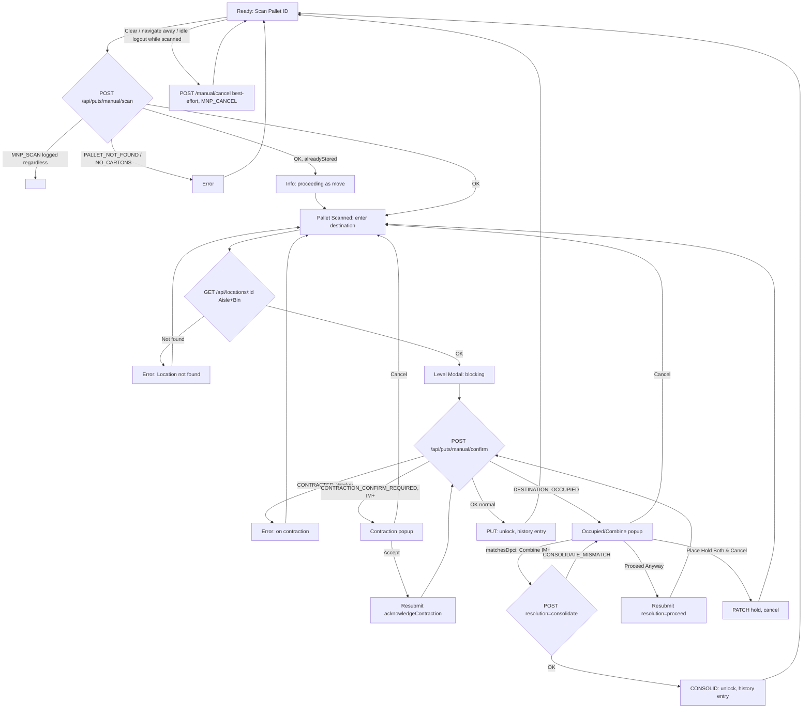

# Screen Design: MNP — Manual Put

**Device:** Tablet — iPad Pro 13" landscape, fixed 1366×1024 canvas (kiosk).
**Bucket:** Existing Warehouse App (current production screen).
**Roles:** Worker, IM, Lead Worker, Manager, Admin — every role can scan a pallet, choose its own destination, and complete a put. There is no IM+-only override in the entry flow itself (no zone/storage logic to override, unlike SDP); IM+ is only consulted mid-flow for two specific gates — see Flow steps 4a and 4c.

## Flow

1. Worker lands on `/put/manual` in the **ready** state — a single **Scan Pallet ID** field, auto-focused.
2. Worker scans/keys a Pallet ID. `POST /api/puts/manual/scan` writes an `MNP_SCAN` activity-log entry **unconditionally, before** any eligibility check — this is the one place outside the standard transactional events where a bare scan itself is durably recorded, since Manual Put is the override path and more error-prone than Directed Put.
   - 2a. Pallet not found (`404`) or has no stored cartons (`409`) → error; the `MNP_SCAN` entry was already written regardless.
   - 2b. On success: eligibility passed (non-blocking otherwise — see note below); pallet data displays; screen advances to **pallet_scanned**. If the pallet is already stored somewhere, an info message notes it's proceeding as a move.
3. Worker enters a destination via the shared 3-box Aisle/Bin/Level entry (`levelOptional` — Aisle+Bin alone is enough to advance; a full 8-digit scan still resolves the whole location, including level, at once). `GET /api/locations/:id` validates the Aisle+Bin exists.
   - 3a. Not found → error; destination boxes clear and refocus.
   - 3b. Found → advances to **level_modal**, pre-filled with a known level if a full barcode (or a demo button, which always knows the exact level) already supplied one.
4. The **Level Modal** (blocking, no dismiss) collects the rack level the pallet was physically placed at. On Enter, `POST /api/puts/manual/confirm` runs three ordered gates before the put actually commits:
   - 4a. **Contraction** — if the destination is flagged Contraction: a Worker is hard-blocked outright (`403 CONTRACTED`, no override). An IM+ instead sees a confirmation popup ("This location is on contraction, do you want to complete the put?") and may proceed after accepting (`acknowledgeContraction: true` on resubmit).
   - 4b. **Occupied/Staged** — if the destination is currently `STORED` or `STAGED` (by a different pallet than the one being put): a blocking popup opens instead of completing with a post-hoc warning.
     - If the occupant's DPCI matches the incoming pallet's DPCI: the popup offers only **Combine** (IM+ only — see 4c) or Cancel; a Worker sees Cancel plus a note that combining needs IM+.
     - Otherwise (different DPCI, or a Staged destination with nothing to compare): the popup offers **Proceed Anyway** (any role), **Place Hold Both (Empty Location) & Cancel** (any role — places a `W04` hold and cancels the put), or **Cancel**.
   - 4c. **Consolidate** (`resolution: 'consolidate'`, IM+ only, reachable only from 4b's Combine choice) — merges the incoming pallet's current quantities onto the STORED occupant of the same DPCI, then zeroes the incoming pallet's own quantity, clears its location fields, and marks its status `CONSOLIDATED` instead of moving it. If the incoming pallet had its own prior location, that location is freed to `EMPTY`, same as a normal move.
   - Declining any of the three gate popups returns to **pallet_scanned** with the pallet still scanned and the destination boxes cleared (product decision) — it does not restart the whole put.
5. On a normal (non-consolidate) completion: the pallet is stored at the destination (old location cleared atomically if this was a move), an entry is recorded in the session's Put History, and the screen resets to **ready**.
6. **Clear** (available in `pallet_scanned`): cancels the current pallet and returns to `ready` without confirming — no API call for the state reset itself, but `POST /api/puts/manual/cancel` fires (best-effort, not awaited) to record the abandonment as a visible `MNP_CANCEL` activity-log entry, and the local Put History entry updates to read Canceled.
7. **Abandonment via navigation-away or idle-timeout logout:** if the component unmounts while a pallet is scanned but not yet confirmed, the same `POST /api/puts/manual/cancel` best-effort call fires from an unmount-cleanup effect (using a ref-held token, since `AuthContext`'s idle-timeout logout can null the real token before this effect runs) — MNP has no server-side reservation row the way SDP does, so this client-triggered call is the only way an abandoned scan gets a visible, non-perpetually-"in-progress" outcome in the activity log.
8. A **Hold** quick-action button (visible whenever the scanned pallet has a current location) opens the shared `HoldPanel` inline for the pallet's existing location, without leaving MNP.

### Mis-scan / error handling

- Pallet not found (`404 PALLET_NOT_FOUND`) → error, `"Pallet not found"`, field clears.
- Pallet has no stored cartons (`409 NO_CARTONS`) → error, `"Pallet {ID} has no stored cartons — cannot put"`, field clears.
- Destination Aisle+Bin not found (`404`) → error, `"Location not found"`, destination boxes clear and refocus.
- **App-wide red-wash audit (v1.7.0):** unlike PIP/SDP/PII/IID/ISI, no field on this screen picked up the red-wash treatment (`DevNotes/DesignPrompts/Feature-8-AppWide-Invalid-Field-Wash.md`) — every failure above clears its field atomically before the next render (`palletField.clear()` / `resetLocationField()`), so there's never a moment where a bad value sits visibly in a box to wash. Audited and intentionally skipped, not overlooked.
- Contraction, non-IM (`403 CONTRACTED`) → error, `"This location is on contraction — put not allowed"`; returns to `pallet_scanned` with destination cleared.
- Contraction, IM+, not yet acknowledged (`409 CONTRACTION_CONFIRM_REQUIRED`) → opens the contraction confirm dialog rather than an error message.
- Destination occupied/staged (`409 DESTINATION_OCCUPIED`) → opens the Occupied/Combine popup rather than an error message.
- Stale resubmission where the occupant no longer matches DPCI (`409 CONSOLIDATE_MISMATCH`) → not currently surfaced with a distinct message in the frontend; falls through to the generic confirm-failure path.
- Non-IM attempting `resolution: 'consolidate'` (`403 FORBIDDEN`) → not reachable through the UI (Combine is hidden from non-IM in `CombineDialog`).
- Any other confirm failure → generic error, `"Confirm failed — please try again"`; returns to `pallet_scanned` with destination cleared.

### Status / messaging behavior

- Errors persist until the next message-bar update.
- A successful put/move shows `warning` tone with a "(was occupied)"/"(was staged)" suffix if the destination wasn't clean; plain `info`/`success` otherwise.
- Consolidate success shows `success` — `"Pallet {source} combined into Pallet {target}"`.
- Move detection at scan time (step 2b) shows `info`, distinct from the occupied/staged outcome at confirm time (which is `warning`) — these are two different conditions (pallet's own prior location vs. destination's current occupant).
- **(v1.7.0, issue #95)** A stale error also clears on success: `handlePalletScan`'s success path calls `clearMessage()` in an `else` branch alongside the `currentLocation` check (that branch still sets its own info message and isn't touched), and `handleDestinationResolved`'s success path clears it right after entering `level_modal`.

## Layout

```
┌──────────────────────────────────────────────────────────────────────────────────────┐
│ Header (104px): [Back] [Home] [Jump]        Manual Put        [Name]        [Logout]  │
├──────────────────────────────────────────────────────────────────────────────────────┤
│ Message Bar (74px): idle / error / warning / info / success text                      │
├───────────────────────────────────────────────────────────┬──────────────────────────┤
│ Content (792px)                                             │ Put History (456px)     │
│                                                              │                          │
│  Scan Pallet ID [______________]                             │  ┌────────────────────┐  │
│                                                              │  │ PID 88213   PUT      │  │
│  (once scanned:)                                              │  │ 030105-08 Lvl 3 10:44a│ │
│  Pallet ID  [ 88213 ]                                         │  └────────────────────┘  │
│  Item       Widget, Blue, 12ct                                │  ┌────────────────────┐  │
│  DPCI       012-34-5678                                       │  │ ...                 │  │
│  Qty on pallet   2P / 5C / 0S                                 │  └────────────────────┘  │
│  Move from [ 030102-04 ]  [Hold]   (only if already stored)     │                          │
│                                                              │                          │
│  Destination Location [Aisle][Bin][Lvl]        [Clear]         │                          │
├───────────────────────────────────────────────────────────┴──────────────────────────┤
│ Footer (54px): [Numpad/Keyboard toggle]  [state-aware demo buttons]  [date/time]       │
└──────────────────────────────────────────────────────────────────────────────────────┘

   Level Modal (blocking overlay, no dismiss):
   ┌───────────────────────────────────────┐
   │  What level was the pallet placed at?  │
   │        [    3    ]                     │
   │   1 2 3 / 4 5 6 / 7 8 9 / ⌫ 0 Enter    │
   └───────────────────────────────────────┘
```

## Input handling

- Same `NumpadContext`/`useNumpadField` model as PIP/SDP — on-screen Numpad/Keyboard bound per field, hardware scans delivered via `deliverScan()`.
- Destination is the shared 3-box `LocationEntryFields` with `levelOptional` set — a manually-typed Aisle+Bin (no Level) is enough to resolve; a 6-digit scan (the physical-barcode-typical case) or an 8-digit full-barcode scan both resolve atomically regardless of what's already typed.
- **Screen-specific override — Level Modal.** The rack level is collected by a dedicated full-screen blocking modal (`LevelModal`), not a `useNumpadField`-bound `FieldDisplay` — it renders its own oversized digit keypad directly (not routed through `NumpadContext`) and has no Cancel/dismiss path; a level must be selected to proceed. Pre-filled (but still requiring an explicit Enter tap) when the destination resolution already supplied a known level.
- Demo footer buttons are state-aware: `ready` shows Put/Move/Invalid-PID; `pallet_scanned` shows Empty/Occupied/Contraction/Consolidate (Consolidate hidden until a pallet is actually scanned, since it needs that pallet's DPCI to find a matching destination).

## Data

**Reads:**
- `Pallet` (by `pid`) — eligibility fields, current location, `dept`/`class`/`item`, quantities — via the shared `checkPalletEligibility` helper.
- `Label` — open (non-terminal) label count against the pallet, to detect `BLOCKED_BY_PENDING_PULL`.
- `Location` (destination, by Aisle+Bin) — existence check before the Level Modal.
- `Location` (destination, by Aisle+Bin+Level) — full record at confirm time: `contraction` flag, current `status` (`STORED`/`STAGED`/other).
- `Pallet` (occupant lookup, at confirm time) — a fresh, never-client-trusted lookup of whichever pallet is `STORED` at the exact destination (excluding the incoming pallet's own pid), to determine `matchesDpci` for the Combine gate.

**Writes:**
- `ActivityLog` — `MNP_SCAN` unconditionally on every scan (success or failure); `PUT` on a normal completion (`wasMove`, `clearedLocation`, `destinationWasOccupied`, `destinationWasStaged`, `method: 'MNP'`, `wasContracted`); `CONSOLID` on a consolidate completion; `MNP_CANCEL` on an abandoned scan (Clear, navigation-away, or idle-timeout).
- `Pallet.locationAisle`/`locationBin`/`locationLevel`, `storageCode`/`size`/`zone` (inherited from the destination), `status`, `putByZ`/`putAt` — set via `placePallet` on a normal completion.
- On **consolidate**: the occupant `Pallet`'s quantities increase by the incoming pallet's; the incoming `Pallet`'s quantities zero out, its location fields null out, and its `status` becomes `CONSOLIDATED`; its own prior location (if any) is freed to `EMPTY`.
- `Location.status` → `STORED` at the destination (old location, if a move, → `EMPTY` in the same transaction); `holdCategory` → `HOLD_BOTH` if the worker chose "Place Hold Both (Empty Location)".

**Not written:** MNP has no server-side reservation row of any kind (unlike SDP) — the scanned-but-unconfirmed in-between state exists purely client-side, which is why an abandoned scan needs its own explicit `MNP_CANCEL` log call rather than relying on a background expiry job. The session-local Put History panel is client-side only and resets on navigation away.

## Screen Flow

Covers: pallet scan success/failure and move detection, destination entry/validation, the Level Modal, and the three confirm-time gates (Contraction, Occupied/Staged, Consolidate) including their decline paths.



## Behind the Scenes

**MNP_SCAN's unconditional write.** `manualScan` writes the `ActivityLog` entry *before* calling `checkPalletEligibility` — a scan of an ineligible pallet (no cartons, canceled, pull-pending) still leaves a durable trace, unlike SDP's `directedPut`, which only logs on success. This is a deliberate scope decision (`outline.md`'s Manual Put section) — MNP is the more error-prone override path, so every attempt is recorded regardless of outcome.

**Three gates, one resubmission shape.** Contraction, Occupied/Staged, and Consolidate all follow the same "throw a specific error code, resubmit with an extra flag" pattern PIP's `LEVEL_MISMATCH` uses. `pendingLevelRef`/`acknowledgeContractionRef` on the frontend exist specifically to survive this multi-step round-trip — `handleLevelSelect`'s own `level` parameter doesn't otherwise persist across a contraction-then-occupied double-gate, and a worker who's already accepted the contraction popup shouldn't be asked again when a subsequent occupied/combine gate also fires for the same attempt.

**Occupant lookup is server-truth, not client-supplied.** `manualConfirm` re-queries `Pallet` for whoever is currently `STORED` at the exact destination on every call (excluding the incoming pallet's own pid) — the client never gets to assert who the occupant is. This matters for `CONSOLIDATE_MISMATCH`: if the occupant changed between the initial `DESTINATION_OCCUPIED` throw and the worker's `resolution: 'consolidate'` resubmission (e.g. another worker's put landed there in between), the mismatch is caught server-side rather than trusting a stale client snapshot.

**Consolidate's asymmetric write.** Unlike a normal move, consolidate never calls `placePallet` — it directly updates both pallets' rows and, separately, frees the incoming pallet's own prior location (if any) in the same transaction. The destination location's own `status` is untouched by consolidate (the occupant is still `STORED` there, unchanged); only the two `Pallet` rows and the *source* pallet's old location move.

**No server-side reservation means client-side cancellation is best-effort.** `cancelScan`'s `POST /api/puts/manual/cancel` call is fired-and-forgotten (`.catch()` swallows failures) from both the Clear button and the component's unmount-cleanup effect. The unmount path specifically reads a `tokenRef` (not `useAuth().token` directly) because an idle-timeout logout nulls the real token via a route swap before MNPPage gets another render — by the time cleanup runs, the ref still holds the last-known-valid token even though the live auth state no longer does.

**Session persistence via `MNPContext`.** The scanned pallet (`scannedPallet`, typed `MNPScannedPallet`) lives in `MNPProvider` (mounted in `App.tsx`, alongside all 12 sibling per-screen providers — `StagingProvider`/`PIIProvider`/`ISIProvider`/`LIIProvider`/`PIPProvider`/`SDPProvider`/`IIDProvider`/`PARProvider`/`WLHProvider`/`SARProvider`/`ELAProvider`/`ELZProvider`, all 13 now mounted together wrapping `AppShell`), not local component state, so navigating away from MNP and back restores the last-scanned pallet instead of resetting to the empty ready state. Unlike SDP, MNP has no server-side reservation/timeout tied to a scanned pallet, so there's no expiry to reconcile on resume. Only the scanned pallet persists — the destination Aisle/Bin/Level entry boxes' in-progress typing, the Level Modal's own state, and the session-local Put History panel (client-side only, resets on navigation away per the Data section above) are never part of this state.

**Placement atomicity.** The shared `placePallet` helper (used by both MNP's normal-completion path and SDP's `confirmPut`) runs the old-location-clear and new-location-store as one `prisma.$transaction`, so a pallet can never appear to exist in two locations at once, even under a mid-write crash.

## Open items still remaining

- [#86](https://github.com/BobbyJoeCool/PalletIQ/issues/86) — `placePallet` clears a pallet's old location to `EMPTY` without checking whether a second occupant pallet has since moved in there (shared with SDP).
- [#83](https://github.com/BobbyJoeCool/PalletIQ/issues/83) — scanning an unknown Pallet ID on MNP crashes with a 500 instead of a clean 404.
- `CONSOLIDATE_MISMATCH` (a stale Combine resubmission where the occupant no longer matches) has no dedicated frontend message — it currently falls through to the generic "Confirm failed — please try again" text rather than a more specific explanation of what happened.
- [#88](https://github.com/BobbyJoeCool/PalletIQ/issues/88) — bad Contraction data on RS/RF/BS/some HS locations could incorrectly trigger the Contraction gate (or fail to) for locations that aren't actually contracted.

## Change Log

| Date | Change |
|---|---|
| 2026-07-17 | Rebuilt to the new Screen-Design-Template format, documenting the screen as currently shipped (v1.6.3 and later fixes). The old `DevNotes/Screen-Specs/MNP.md` described a simpler 4-state flow with a single free-text destination field, a non-blocking post-hoc "occupied" warning, and no Contraction gate or Consolidate operation at all — all superseded by the v1.6.3 rebuild described below. |
| 2026-07-15 (v1.6.3) | Added the Contraction gate (Worker hard-blocked, IM+ can acknowledge and proceed), converted the occupied/staged check from a post-hoc warning into a blocking popup, added pallet Consolidation for same-DPCI destinations (IM+ only), rebuilt destination entry as the shared 3-box Aisle/Bin/Level field (replacing a single free-text field), and added abandoned-scan logging (`MNP_CANCEL`) for Clear/navigate-away/idle-timeout. Fixed a same-session bug where a 6-digit destination barcode scan (including the demo Empty/Occupied buttons) was silently dropped by the new 3-box entry. |
| 2026-07-08 (v1.1.0) | DPCI/UPC values on the pallet-data panel became tap-to-jump links to Item ID Lookup. |
| 2026-07-08 (v1.0.9) | The "✓ Empty"/"~ Occupied" demo destination buttons started pre-filling the Level Confirmation modal with the fetched location's actual level (previously left blank even though the system already knew it). |
| 2026-07-06 (v1.0.3) | Fixed the "✗ PID" demo button showing a generic "Scan failed" instead of "Pallet not found" (non-numeric placeholder ID failed the API's numeric validation before ever reaching the not-found check; changed to a numeric placeholder that simply doesn't exist). |
| Initial build — v0.9.0 (2026-07-05) | Manual Put: worker-directed put-away/move with pallet-eligibility safety checks, no system direction, no reservation, no screen lock.
