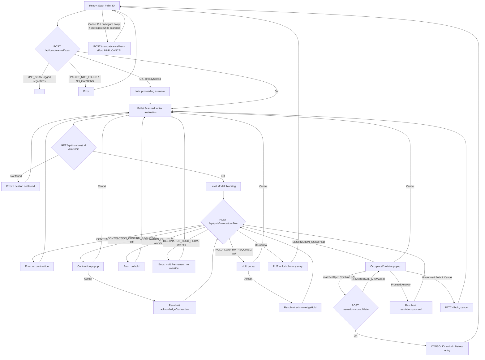

# Screen Design: MNP — Manual Put

**Device:** Tablet — iPad Pro 13" landscape, fixed 1366×1024 canvas (kiosk).
**Bucket:** Existing Warehouse App (current production screen).
**Roles:** Worker, IM, Lead Worker, Manager, Admin — every role can scan a pallet, choose its own destination, and complete a put. There is no IM+-only override in the entry flow itself (no zone/storage logic to override, unlike SDP); IM+ is only consulted mid-flow for two specific gates — see Flow steps 4a and 4c.

## Flow

1. Worker lands on `/put/manual` in the **ready** state — a single **Scan Pallet ID** field, auto-focused.
2. Worker scans/keys a Pallet ID. `POST /api/puts/manual/scan` writes an `MNP_SCAN` activity-log entry **unconditionally, before** any eligibility check — this is the one place outside the standard transactional events where a bare scan itself is durably recorded, since Manual Put is the override path and more error-prone than Directed Put.
   - 2a. Pallet not found (`404`) or has no stored cartons (`409`) → error; the `MNP_SCAN` entry was already written regardless.
   - 2b. On success: eligibility passed (non-blocking otherwise — see note below); pallet data displays; screen advances to **pallet_scanned**. If the pallet is already stored somewhere, an info message notes it's proceeding as a move.
3. Worker enters a destination via the shared 3-box Aisle/Bin/Level entry (`levelOptional` — Aisle+Bin alone is enough to advance; a full 8-digit scan still resolves the whole location, including level, at once). `GET /api/locations/:id` validates the Aisle+Bin exists.
   - 3a. Not found → error; destination boxes wash red and keep their entered value (issue #190) instead of clearing.
   - 3b. Found → advances to **level_modal**, pre-filled with a known level if a full barcode (or a demo button, which always knows the exact level) already supplied one.
4. The **Level Modal** (blocking, no dismiss) collects the rack level the pallet was physically placed at. On Enter, `POST /api/puts/manual/confirm` runs four ordered gates before the put actually commits:
   - 4a. **Contraction** — if the destination is flagged Contraction: a Worker is hard-blocked outright (`403 CONTRACTED`, no override). An IM+ instead sees a confirmation popup ("This location is on contraction, do you want to complete the put?") and may proceed after accepting (`acknowledgeContraction: true` on resubmit).
   - 4b. **Hold** (issue #92) — if the destination has a `holdCategory`: `HOLD_OUT` never blocks (outbound-only, same rule Directed Put's location search already applies). `HOLD_IN`/`HOLD_BOTH` follow the exact same pattern as Contraction: a Worker is hard-blocked (`403 DESTINATION_ON_HOLD`); an IM+ sees a confirmation popup ("Location On Hold Both"/"Location On Hold Inbound" — "This location is on hold, do you want to complete the put?") and may proceed after accepting (`acknowledgeHold: true` on resubmit). `HOLD_PERM` is a harder, no-override block (`403 DESTINATION_HOLD_PERM`) for **every** role, including Admin — there is no acknowledgement path past it, matching how Permanent is already the most protected hold tier elsewhere in the app (WLH's `HOLD_REMOVE_MIN_ROLE`).
   - 4c. **Occupied/Staged** — if the destination is currently `STORED` or `STAGED` (by a different pallet than the one being put): a blocking popup opens instead of completing with a post-hoc warning.
     - If the occupant's DPCI matches the incoming pallet's DPCI: the popup offers only **Combine** (IM+ only — see 4d) or Cancel; a Worker sees Cancel plus a note that combining needs IM+.
     - Otherwise (different DPCI, or a Staged destination with nothing to compare): the popup offers **Proceed Anyway** (any role), **Place Hold Both (Empty Location) & Cancel** (any role — opens a reason-code confirmation step, pre-filled `W01`/Empty Location but editable, issue #84; confirming places the hold and cancels the put), or **Cancel**.
   - 4d. **Consolidate** (`resolution: 'consolidate'`, IM+ only, reachable only from 4c's Combine choice) — merges the incoming pallet's current quantities onto the STORED occupant of the same DPCI, then zeroes the incoming pallet's own quantity, clears its location fields, and marks its status `CONSOLIDATED` instead of moving it. If the incoming pallet had its own prior location, that location is freed to `EMPTY`, same as a normal move.
   - Declining any of the four gate popups returns to **pallet_scanned** with the pallet still scanned and the destination boxes cleared (product decision) — it does not restart the whole put.
5. On a normal (non-consolidate) completion: the pallet is stored at the destination (old location cleared atomically if this was a move), an entry is recorded in the session's Put History, and the screen resets to **ready**.
6. **Cancel Put** (available in `pallet_scanned`; renamed from "Clear" and recolored to the same amber SDP's Unassign button uses — 2026-08-03, avoids a name collision with the on-screen Numpad's own new Clear key, issue #100): cancels the current pallet and returns to `ready` without confirming — no API call for the state reset itself, but `POST /api/puts/manual/cancel` fires (best-effort, not awaited) to record the abandonment as a visible `MNP_CANCEL` activity-log entry, and the local Put History entry updates to read Canceled.
7. **Abandonment via navigation-away or idle-timeout logout:** if the component unmounts while a pallet is scanned but not yet confirmed, the same `POST /api/puts/manual/cancel` best-effort call fires from an unmount-cleanup effect (using a ref-held token, since `AuthContext`'s idle-timeout logout can null the real token before this effect runs) — MNP has no server-side reservation row the way SDP does, so this client-triggered call is the only way an abandoned scan gets a visible, non-perpetually-"in-progress" outcome in the activity log.
8. A **Hold** quick-action button (visible whenever the scanned pallet has a current location) opens the shared `HoldPanel` inline for the pallet's existing location, without leaving MNP. **(Issue #84, 2026-08-03, direct decision)** Deliberately **no** default Hold Type/reason here, unlike the occupied-gate's "Place Hold Both (Empty Location)" above — this is a general "something's wrong with where this pallet currently is" action with no single obvious reason, so the worker picks fresh each time, same as WLH's own plain Hold button.

### Mis-scan / error handling

- Pallet not found (`404 PALLET_NOT_FOUND`) → error, `"Pallet not found"`, field washes red and keeps its entered value (issue #190).
- Pallet has no stored cartons (`409 NO_CARTONS`) → error, `"Pallet {ID} has no stored cartons — cannot put"`, field washes red and keeps its entered value (issue #190).
- Destination Aisle+Bin not found (`404`) → error, `"Location not found"`, destination boxes wash red as a group and keep their entered values (issue #190).
- **App-wide red-wash audit (v1.7.0), superseded by issue #190:** the original audit found no field on this screen picking up the red-wash treatment (`DevNotes/DesignPrompts/Feature-8-AppWide-Invalid-Field-Wash.md`), since every failure cleared its field atomically before the next render — never a moment for a bad value to sit visibly in a box to wash. Issue #190 reversed that: Pallet ID and destination boxes now persist their entered value through an error instead of clearing, and both now use the standard wash (`invalid` on Pallet ID, `groupInvalid` on the destination's 3-box entry — a single combined existence check with no way to attribute it to one box, same category as WLH's whole-location lookup). Fields still reset to blank only on a confirmed put, a declined gate popup, or the Cancel Put button — never on the error path itself.
- Contraction, non-IM (`403 CONTRACTED`) → error, `"This location is on contraction — put not allowed"`; returns to `pallet_scanned` with destination cleared.
- Contraction, IM+, not yet acknowledged (`409 CONTRACTION_CONFIRM_REQUIRED`) → opens the contraction confirm dialog rather than an error message.
- Hold In/Both, non-IM (`403 DESTINATION_ON_HOLD`) → error, `"This location is on hold — put not allowed"`; returns to `pallet_scanned` with destination cleared.
- Hold In/Both, IM+, not yet acknowledged (`409 HOLD_CONFIRM_REQUIRED`) → opens the hold confirm dialog rather than an error message.
- Hold Permanent, any role (`403 DESTINATION_HOLD_PERM`) → error, `"This location is on Hold Permanent — put not allowed"`; no acknowledgement path exists for this one — returns to `pallet_scanned` with destination cleared regardless of role.
- Destination occupied/staged (`409 DESTINATION_OCCUPIED`) → opens the Occupied/Combine popup rather than an error message.
- Stale resubmission where the occupant no longer matches DPCI (`409 CONSOLIDATE_MISMATCH`) → not currently surfaced with a distinct message in the frontend; falls through to the generic confirm-failure path.
- Non-IM attempting `resolution: 'consolidate'` (`403 FORBIDDEN`) → not reachable through the UI (Combine is hidden from non-IM in `CombineDialog`).
- Any other confirm failure → generic error, `"Confirm failed — please try again"`; returns to `pallet_scanned` with destination cleared.

### Status / messaging behavior

- Errors persist until the next message-bar update.
- A successful put/move shows `warning` tone with a "(was occupied)"/"(was staged)" suffix if the destination wasn't clean; plain `info`/`success` otherwise.
- Consolidate success shows `success` — `"Pallet {source} combined into Pallet {target}"`.
- Move detection at scan time (step 2b) shows `info`, distinct from the occupied/staged outcome at confirm time (which is `warning`) — these are two different conditions (pallet's own prior location vs. destination's current occupant).
- **(v1.7.0, issue #95)** A stale error also clears on success: `handlePalletScan`'s success path calls `clearMessage()` in an `else` branch alongside the `currentLocation` check (that branch still sets its own info message and isn't touched), and `handleDestinationResolved`'s success path clears it right after entering `level_modal`.

## Layout

```
┌──────────────────────────────────────────────────────────────────────────────────────┐
│ Header (104px): [Back] [Home] [Jump]        Manual Put        [Name]        [Logout]  │
├──────────────────────────────────────────────────────────────────────────────────────┤
│ Message Bar (74px): idle / error / warning / info / success text                      │
├───────────────────────────────────────────────────────────┬──────────────────────────┤
│ Content (792px)                                             │ Put History (456px)     │
│                                                              │                          │
│  Scan Pallet ID [______________]                             │  ┌────────────────────┐  │
│                                                              │  │ PID 88213   PUT      │  │
│  (once scanned:)                                              │  │ 030105-08 Lvl 3 10:44a│ │
│  Pallet ID  [ 88213 ]                                         │  └────────────────────┘  │
│  Item       Widget, Blue, 12ct                                │  ┌────────────────────┐  │
│  DPCI       012-34-5678 (CR)  ← Storage Code badge (#189)      │  │ ...                 │  │
│  Qty on pallet   2P / 5C / 0S                                 │  └────────────────────┘  │
│  Move from [ 030102-04 ] (CR-L) [Hold]  ← +Size badge, #189    │                          │
│              (only if already stored)                          │                          │
│  Destination Location [Aisle][Bin][Lvl]     [Cancel Put]        │                          │
├───────────────────────────────────────────────────────────┴──────────────────────────┤
│ Footer (54px): [Numpad/Keyboard toggle]  [state-aware demo buttons]  [date/time]       │
└──────────────────────────────────────────────────────────────────────────────────────┘

   Level Modal (blocking overlay, no dismiss):
   ┌───────────────────────────────────────┐
   │  What level was the pallet placed at?  │
   │        [    3    ]                     │
   │   1 2 3 / 4 5 6 / 7 8 9 / ⌫ 0 Enter    │
   └───────────────────────────────────────┘
```

## Input handling

- Same `NumpadContext`/`useNumpadField` model as PIP/SDP — on-screen Numpad/Keyboard bound per field, hardware scans delivered via `deliverScan()`.
- Destination is the shared 3-box `LocationEntryFields` with `levelOptional` set — a manually-typed Aisle+Bin (no Level) is enough to resolve; a 6-digit scan (the physical-barcode-typical case) or an 8-digit full-barcode scan both resolve atomically regardless of what's already typed.
- **Screen-specific override — Level Modal.** The rack level is collected by a dedicated full-screen blocking modal (`LevelModal`), not a `useNumpadField`-bound `FieldDisplay` — it renders its own oversized digit keypad directly (not routed through `NumpadContext`) and has no Cancel/dismiss path; a level must be selected to proceed. Pre-filled (but still requiring an explicit Enter tap) when the destination resolution already supplied a known level.
- Demo footer buttons are state-aware: `ready` shows the generalized Pallet ID Demo Scanner (Feature 9, Phase 1 — ✓ Valid Pallet ID / Pallet ID by Status with a Status dropdown, defaulting to **Put Pending**, plus Storage Code/Size filter dropdowns / ✗ Invalid Pallet ID, owned internally by `PalletIdField`'s `demoScanner` prop, replacing the old dedicated `demoPut`/`demoMove`/`demoBadPid` buttons); `pallet_scanned` shows the generalized Location ID Demo Scanner instead (Feature 9, Phase 2 — ✓ Valid Location / Location by Filter with independent Status/Hold/Contraction/Multi-Occupant axes / ✗ Invalid Location / ⇄ Consolidate, owned internally by `LocationEntryFields`' `demoScanner`/`demoScannedPalletId` props, replacing the old dedicated `demoEmptyLoc`/`demoOccupiedLoc`/`demoContractedLoc`/`demoConsolidateLoc` buttons — Consolidate still only appears once a pallet is actually scanned, via `demoScannedPalletId`, since it needs that pallet's DPCI to find a matching destination). See `Documentation/Components/DemoScannerBar.md` / `Documentation/Components/LocationDemoScannerBar.md`.

## Data

**Reads:**
- `Pallet` (by `pid`) — eligibility fields, current location, `dept`/`class`/`item`, quantities — via the shared `checkPalletEligibility` helper.
- `Container` — open (non-terminal) container count against the pallet, to detect `BLOCKED_BY_PENDING_PULL`.
- `Location` (destination, by Aisle+Bin) — existence check before the Level Modal.
- `Location` (destination, by Aisle+Bin+Level) — full record at confirm time: `contraction` flag, current `status` (`STORED`/`STAGED`/other).
- `Pallet` (occupant lookup, at confirm time) — a fresh, never-client-trusted lookup of whichever pallet is `STORED` at the exact destination (excluding the incoming pallet's own pid), to determine `matchesDpci` for the Combine gate.

**Writes:**
- `ActivityLog` — `MNP_SCAN` unconditionally on every scan (success or failure); `PUT` on a normal completion (`wasMove`, `clearedLocation`, `destinationWasOccupied`, `destinationWasStaged`, `method: 'MNP'`, `wasContracted`); `CONSOLID` on a consolidate completion; `MNP_CANCEL` on an abandoned scan (Cancel Put, navigation-away, or idle-timeout).
- `Pallet.locationAisle`/`locationBin`/`locationLevel`, `storageCode`/`size`/`zone` (inherited from the destination), `status`, `putByZ`/`putAt` — set via `placePallet` on a normal completion.
- On **consolidate**: the occupant `Pallet`'s quantities increase by the incoming pallet's; the incoming `Pallet`'s quantities zero out, its location fields null out, and its `status` becomes `CONSOLIDATED`; its own prior location (if any) is freed to `EMPTY`.
- `Location.status` → `STORED` at the destination (old location, if a move, → `EMPTY` in the same transaction); `holdCategory` → `HOLD_BOTH` if the worker chose "Place Hold Both (Empty Location)".

**Not written:** MNP has no server-side reservation row of any kind (unlike SDP) — the scanned-but-unconfirmed in-between state exists purely client-side, which is why an abandoned scan needs its own explicit `MNP_CANCEL` log call rather than relying on a background expiry job. The session-local Put History panel is client-side only and resets on navigation away.

## Screen Flow

Covers: pallet scan success/failure and move detection, destination entry/validation, the Level Modal, and the four confirm-time gates (Contraction, Hold, Occupied/Staged, Consolidate) including their decline paths.


```mermaid
flowchart TD
    A[Ready: Scan Pallet ID] --> B{POST /api/puts/manual/scan}
    B -->|MNP_SCAN logged regardless| B0[ ]
    B -->|PALLET_NOT_FOUND / NO_CARTONS| A1[Error] --> A
    B -->|OK, alreadyStored| C1[Info: proceeding as move] --> C
    B -->|OK| C[Pallet Scanned: enter destination]

    C --> D{GET /api/locations/:id Aisle+Bin}
    D -->|Not found| D1[Error: Location not found] --> C
    D -->|OK| E[Level Modal: blocking]

    E --> F{POST /api/puts/manual/confirm}
    F -->|CONTRACTED, Worker| F1[Error: on contraction] --> C
    F -->|CONTRACTION_CONFIRM_REQUIRED, IM+| G[Contraction popup]
    F -->|DESTINATION_ON_HOLD, Worker| F1b[Error: on hold] --> C
    F -->|DESTINATION_HOLD_PERM, any role| F1c[Error: Hold Permanent, no override] --> C
    F -->|HOLD_CONFIRM_REQUIRED, IM+| G2[Hold popup]
    F -->|DESTINATION_OCCUPIED| H[Occupied/Combine popup]
    F -->|OK normal| I[PUT: unlock, history entry] --> A

    G -->|Accept| F2[Resubmit acknowledgeContraction] --> F
    G -->|Cancel| C

    G2 -->|Accept| F2b[Resubmit acknowledgeHold] --> F
    G2 -->|Cancel| C

    H -->|matchesDpci: Combine IM+| J{POST resolution=consolidate}
    H -->|Proceed Anyway| F3[Resubmit resolution=proceed] --> F
    H -->|Place Hold Both & Cancel| K[PATCH hold, cancel] --> C
    H -->|Cancel| C

    J -->|OK| L[CONSOLID: unlock, history entry] --> A
    J -->|CONSOLIDATE_MISMATCH| H

    A -->|Cancel Put / navigate away / idle logout while scanned| M[POST /manual/cancel best-effort, MNP_CANCEL] --> A
```

## Behind the Scenes

**MNP_SCAN's unconditional write.** `manualScan` writes the `ActivityLog` entry *before* calling `checkPalletEligibility` — a scan of an ineligible pallet (no cartons, canceled, pull-pending) still leaves a durable trace, unlike SDP's `directedPut`, which only logs on success. This is a deliberate scope decision (`outline.md`'s Manual Put section) — MNP is the more error-prone override path, so every attempt is recorded regardless of outcome.

**Four gates, one resubmission shape (Hold added in issue #92).** Contraction, Hold, Occupied/Staged, and Consolidate all follow the same "throw a specific error code, resubmit with an extra flag" pattern PIP's `LEVEL_MISMATCH` uses. `pendingLevelRef`/`acknowledgeContractionRef`/`acknowledgeHoldRef` on the frontend exist specifically to survive this multi-step round-trip — `handleLevelSelect`'s own `level` parameter doesn't otherwise persist across a contraction-then-hold-then-occupied multi-gate sequence, and a worker who's already accepted the contraction and/or hold popups shouldn't be asked again when a subsequent gate also fires for the same attempt. Hold's own override tier is narrower than Contraction's: `HOLD_IN`/`HOLD_BOTH` are IM+-overridable the same way Contraction is, but `HOLD_PERM` has no override path at all, for any role — matching how Permanent is already the most protected hold tier elsewhere in the app (WLH's `HOLD_REMOVE_MIN_ROLE`).

**Occupant lookup is server-truth, not client-supplied.** `manualConfirm` re-queries `Pallet` for whoever is currently `STORED` at the exact destination on every call (excluding the incoming pallet's own pid) — the client never gets to assert who the occupant is. This matters for `CONSOLIDATE_MISMATCH`: if the occupant changed between the initial `DESTINATION_OCCUPIED` throw and the worker's `resolution: 'consolidate'` resubmission (e.g. another worker's put landed there in between), the mismatch is caught server-side rather than trusting a stale client snapshot.

**Consolidate's asymmetric write.** Unlike a normal move, consolidate never calls `placePallet` — it directly updates both pallets' rows and, separately, frees the incoming pallet's own prior location (if any) in the same transaction. The destination location's own `status` is untouched by consolidate (the occupant is still `STORED` there, unchanged); only the two `Pallet` rows and the *source* pallet's old location move.

**No server-side reservation means client-side cancellation is best-effort.** `cancelScan`'s `POST /api/puts/manual/cancel` call is fired-and-forgotten (`.catch()` swallows failures) from both the Cancel Put button and the component's unmount-cleanup effect. The unmount path specifically reads a `tokenRef` (not `useAuth().token` directly) because an idle-timeout logout nulls the real token via a route swap before MNPPage gets another render — by the time cleanup runs, the ref still holds the last-known-valid token even though the live auth state no longer does.

**Session persistence via `MNPContext`.** The scanned pallet (`scannedPallet`, typed `MNPScannedPallet`) lives in `MNPProvider` (mounted in `App.tsx`, alongside all 12 sibling per-screen providers — `StagingProvider`/`PIIProvider`/`ISIProvider`/`LIIProvider`/`PIPProvider`/`SDPProvider`/`IIDProvider`/`PARProvider`/`WLHProvider`/`SARProvider`/`ELAProvider`/`ELZProvider`, all 13 now mounted together wrapping `AppShell`), not local component state, so navigating away from MNP and back restores the last-scanned pallet instead of resetting to the empty ready state. Unlike SDP, MNP has no server-side reservation/timeout tied to a scanned pallet, so there's no expiry to reconcile on resume. Only the scanned pallet persists — the destination Aisle/Bin/Level entry boxes' in-progress typing, the Level Modal's own state, and the session-local Put History panel (client-side only, resets on navigation away per the Data section above) are never part of this state.

**Placement atomicity.** The shared `placePallet` helper (used by both MNP's normal-completion path and SDP's `confirmPut`) runs the old-location-clear and new-location-store as one `prisma.$transaction`, so a pallet can never appear to exist in two locations at once, even under a mid-write crash.

## Open items still remaining

- `CONSOLIDATE_MISMATCH` (a stale Combine resubmission where the occupant no longer matches) has no dedicated frontend message — it currently falls through to the generic "Confirm failed — please try again" text rather than a more specific explanation of what happened.
- [#88](https://github.com/BobbyJoeCool/PalletIQ/issues/88) — bad Contraction data on RS/RF/BS/some HS locations could incorrectly trigger the Contraction gate (or fail to) for locations that aren't actually contracted.

## Change Log

| Date | Change |
|---|---|
| 2026-08-03 (direct bug report) | The Location Demo Scanner's "Find a Location" popup (and its Item/Container/Pallet ID siblings — same shared pattern across `*DemoScannerBar`) could disappear if the worker clicked anywhere else on screen while it was open. Root cause: this session's earlier `z-[60]` fix on the on-screen Keyboard/Numpad (so those panels could no longer be blocked by a modal, see the Popup positioning entries above) put them *above* these popups' own `z-50`, so a click meant for the popup's backdrop could land on the still-visible Keyboard/Numpad instead and drive whichever field was active — indirectly closing the popup along with the rest of the demo bar it lives in (footer demo-slot content only renders while that field stays active). Fixed by raising all four popups to `z-[65]`, above Keyboard/Numpad again. |
| 2026-08-03 ([#84](https://github.com/BobbyJoeCool/PalletIQ/issues/84) follow-up, direct instruction) | The occupied-location gate's reason-code confirmation step (added in the entry below) is now built on the new shared `LockedHoldConfirmDialog` rather than inline JSX — extracted once SDP's own Hold Location needed the identical shape (locked hold type, editable Reason Code, Back/Confirm) a second time. No behavior change here, purely the underlying component. |
| 2026-08-03 ([#84](https://github.com/BobbyJoeCool/PalletIQ/issues/84)) | "Place Hold Both (Empty Location)" no longer sends a hardcoded, non-editable `W04` reason code — it now opens a reason-code confirmation step (pre-filled `W01`/Empty Location, editable) before placing the hold, same pattern every other hold entry point in the app uses. Part of the app-wide database-backed reason-code redesign — see `Documentation/Components/ReasonCodeField.md`. |
| 2026-08-03 ([#189](https://github.com/BobbyJoeCool/PalletIQ/issues/189)) | DPCI now shows a Storage Code badge (the Item's own intrinsic Storage Code); "Move from" now shows a Storage Code+Size badge (the location's own values) whenever the pallet is already stored — both via the existing shared `StorageCodeBadge` component. `manualScan`'s response gained `itemStorageCode`/`currentLocationStorageCode`/`currentLocationSize`; `checkPalletEligibility` (shared with SDP) now includes the current location's own Storage Code/Size on `currentLocation`. |
| 2026-08-03 (direct instruction, #100 follow-up) | The manual "Clear" button renamed to **Cancel Put** and recolored to the same amber SDP's Unassign button uses — a Playwright regression surfaced that it collided by accessible name with the on-screen Numpad's own new Clear key (issue #100), so it needed a distinct name regardless of the color change. |
| 2026-08-03 ([#190](https://github.com/BobbyJoeCool/PalletIQ/issues/190)) | Pallet ID and destination fields now persist their entered value through an error (washed red via `invalid`/`groupInvalid`) instead of clearing — see Mis-scan / error handling above. Fields still reset to blank only on a confirmed put, a declined gate popup, or the Cancel Put button. |
| 2026-07-29 (Feature 9, Phase 2) | `pallet_scanned`-state footer buttons (`demoEmptyLoc`/`demoOccupiedLoc`/`demoContractedLoc`/`demoConsolidateLoc`) and the `demoLevelHintRef` side channel removed, replaced by `LocationEntryFields`' new `demoScanner`/`demoScannedPalletId` opt-in and the shared Location ID Demo Scanner — see Input handling above. `handleDestinationResolved` now reads the picked level via a third `demoLevel` argument on `onResolved` instead of a ref. |
| 2026-07-29 (Feature 9, Phase 1) | `ready`-state footer buttons (`demoPut`/`demoMove`/`demoBadPid`) removed, replaced by `PalletIdField`'s new `demoScanner` opt-in and the shared Pallet ID Demo Scanner — see Input handling above. Genuinely generic handlers (no screen-state tie-in), unlike PIP's own PID demo buttons, which stayed screen-owned for exactly that reason (see `DevNotes/DesignPrompts/Feature-9-AppWide-Demo-Scanner.md`'s Implementation-detail resolutions). `pallet_scanned`-state demo buttons (Empty/Occupied/Contraction/Consolidate) are unaffected. |
| 2026-07-27 (Feature 10 / #158) | Internal-only: the Pallet ID box (local `FieldDisplay`/`NumpadFieldBox`) replaced with the shared `PalletIdField` component, matching its existing 72px box size via override props. `handlePalletScan`'s own submit logic was otherwise unchanged at the time (its clear-on-error behavior was later reversed by [#190](https://github.com/BobbyJoeCool/PalletIQ/issues/190) above). |
| 2026-07-27 | Fixed [#86](https://github.com/BobbyJoeCool/PalletIQ/issues/86) — `placePallet` (and `manualConfirm`'s consolidate branch) now check whether a second pallet still occupies a vacated location before clearing it, falling back to `STORED` instead of `EMPTY` if so. |
| 2026-07-27 | Fixed [#83](https://github.com/BobbyJoeCool/PalletIQ/issues/83) — `manualScan` no longer includes a nonexistent scanned pallet id in its unconditional `MNP_SCAN` log write (was violating `ActivityLog.palletId`'s FK and 500ing instead of surfacing `404 PALLET_NOT_FOUND`); logs `palletId: null` with the invalid id kept in `details.scannedId` instead. |
| 2026-07-27 | Added the Hold gate ([#92](https://github.com/BobbyJoeCool/PalletIQ/issues/92)) as step 4b of `manualConfirm`'s gate sequence — `HOLD_IN`/`HOLD_BOTH` use the same IM+-overridable pattern as Contraction; `HOLD_PERM` is a harder no-override block for every role; `HOLD_OUT` never blocks. |
| 2026-07-17 | Rebuilt to the new Screen-Design-Template format, documenting the screen as currently shipped (v1.6.3 and later fixes). The old `DevNotes/Screen-Specs/MNP.md` described a simpler 4-state flow with a single free-text destination field, a non-blocking post-hoc "occupied" warning, and no Contraction gate or Consolidate operation at all — all superseded by the v1.6.3 rebuild described below. |
| 2026-07-15 (v1.6.3) | Added the Contraction gate (Worker hard-blocked, IM+ can acknowledge and proceed), converted the occupied/staged check from a post-hoc warning into a blocking popup, added pallet Consolidation for same-DPCI destinations (IM+ only), rebuilt destination entry as the shared 3-box Aisle/Bin/Level field (replacing a single free-text field), and added abandoned-scan logging (`MNP_CANCEL`) for Clear/navigate-away/idle-timeout. Fixed a same-session bug where a 6-digit destination barcode scan (including the demo Empty/Occupied buttons) was silently dropped by the new 3-box entry. |
| 2026-07-08 (v1.1.0) | DPCI/UPC values on the pallet-data panel became tap-to-jump links to Item ID Lookup. |
| 2026-07-08 (v1.0.9) | The "✓ Empty"/"~ Occupied" demo destination buttons started pre-filling the Level Confirmation modal with the fetched location's actual level (previously left blank even though the system already knew it). |
| 2026-07-06 (v1.0.3) | Fixed the "✗ PID" demo button showing a generic "Scan failed" instead of "Pallet not found" (non-numeric placeholder ID failed the API's numeric validation before ever reaching the not-found check; changed to a numeric placeholder that simply doesn't exist). |
| Initial build — v0.9.0 (2026-07-05) | Manual Put: worker-directed put-away/move with pallet-eligibility safety checks, no system direction, no reservation, no screen lock.
