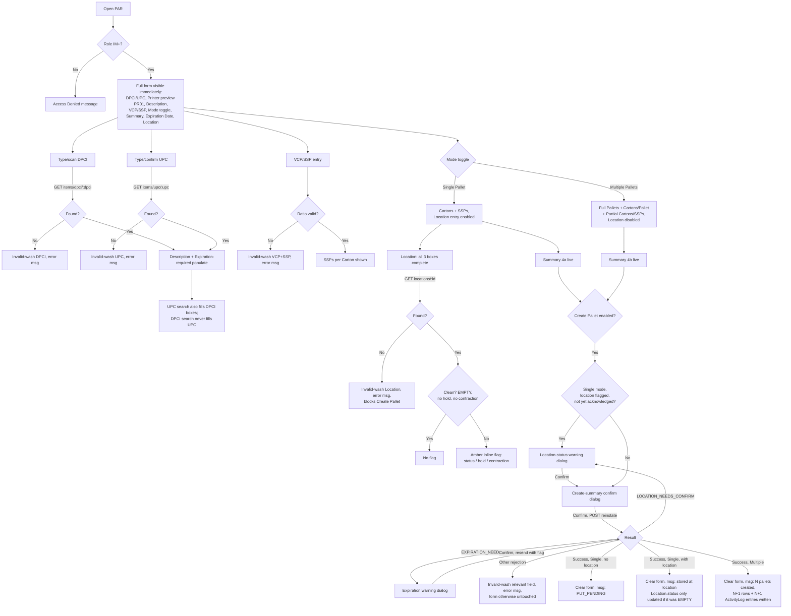

# Screen Design: PAR — Pallet Reinstate

**Device:** Tablet — iPad Pro 13" landscape, fixed 1366×1024 canvas (kiosk)
**Bucket:** Existing Warehouse App (current production screen)
**Roles:** IM, Lead Worker, Manager, Admin (Worker sees an Access Denied message; no form is rendered)

## Flow

1. Worker (IM+) opens PAR (from the Inventory Management menu, HotJump "PAR", or IID's "Reinstate Pallet" hot button — IM+ only, pre-fills the DPCI via `?dpci=`). A sub-IM role sees a centered "Access Denied — Pallet Reinstate requires Inventory Manager or higher" message and nothing else — the form never mounts, and no footer demo buttons render either.
2. **(v1.6.11)** For IM+, the **full form renders immediately and stays fully visible at all times** — no field appears or disappears as the worker types, and every display field's label is visible even while its value is blank (e.g. "Description" renders under the DPCI/UPC row from the moment the screen loads, showing nothing until a valid item resolves). This is a deliberate reversal of the "gate everything behind a resolved state" pattern other screens use — PAR's whole redesign is built around always showing every field's structure.

**Screen-wide auto-advance (v1.6.11, new, direct instruction):** completing one field automatically focuses the next, all the way down the form, so a worker can walk the entire screen without tapping ahead of each field: **DPCI or UPC resolves → VCP → SSP → Cartons → SSPs →** then a fork — **Month → Day → Year** if the resolved item's `requiresExpirationDate` flag is set, **straight to Location's Aisle box** otherwise (and Aisle → Bin → Level regardless of which fork led there, since that chain already auto-advances on its own). Advancing happens whether or not the just-completed field's own value was actually *valid* (same "length drives advance, correctness is a separate highlight" convention every chain on this screen already uses) — a worker who enters an out-of-range Month, for instance, still lands on Day next, with Month's own box washed red to flag the problem. This flow is scoped to Single Pallet mode's own fields; Multiple Pallets' Full Pallets/Cartons per Pallet/Partial fields aren't part of it and still require a manual tap each.

### Row 1 — DPCI / UPC entry, Printer preview

3. **DPCI** (3-box numpad-driven Dept/Class/Item chain, **v1.6.11 revised** — see Input handling below) and **UPC** (single numpad field) render side by side, **sized to match each other** (both a fixed 261px, 10%-shrunk from the redesign's first pass), same shape as IID's own dual entry — either one resolves the item independently (the DPCI chain resolves the moment its Item box's 4th digit lands, mirroring IID's own Dept→Class→Item auto-advance; `GET /api/items/upc/:upc` fires on the UPC field's numpad confirm). **Asymmetric, by design:** resolving via UPC populates the DPCI boxes with the resolved item's DPCI; resolving via DPCI **clears the UPC field** (**v1.6.11 revised**, direct instruction, matching IID's own `loadByDpci` — DPCI is the anchor field everywhere else in the app, so entering one directly supersedes whatever UPC held rather than leaving a now-unrelated value visible).
4. **Printer** — a preview at the far right of this row (pushed there via `ml-auto`, separated from DPCI/UPC by open space). **Typeable (v1.6.11 revised)**: defaults to "PR01" but the box is a real free-text field (opens the on-screen **Keyboard**, not the Numpad, since a printer id isn't a quantity/code), with no format/existence validation on whatever's typed. The dropdown chevron beside it stays inert (no click handler, no popup) — this app has no real printer integration yet, so there's no code-list for it to open. Visually matches the entry-box + dropdown-helper shape used elsewhere (`CodePickerField`) without the dropdown half's actual behavior.
5. A DPCI or UPC that doesn't resolve gets the new red-background-wash invalid treatment (see Styling below) on whichever field was searched, plus a Message Bar error ("DPCI not found" / "UPC not found"). The field is never cleared — the bad value stays visible.

### Description

6. Its own row directly below Row 1 — plain text (not a boxed field — this and every other read-only display on this screen deliberately doesn't look like something tappable), always visible, populated from the resolved item's `descShort` once a lookup succeeds.

### Row 2 — VCP / SSP entry

7. VCP and SSP numeric entry, plus a plain-text **SSPs per Carton** display (`vcp / ssp`, not boxed — same "information, not a field" treatment as Description) that's blank until both fields hold a valid, evenly-dividing pair. Validated live, on either field's commit: SSP must evenly divide VCP (same rule PII's `editPallet` enforces) — a violation shows a Message Bar error ("SSP must divide evenly into VCP") and washes VCP and SSP together as **one shared group** (v1.6.11 revised — same group-wash treatment as DPCI/Expiration Date/Location, rather than each box washing on its own), since the rule that invalidates them always invalidates both at once. Re-validated server-side regardless of the client-side check.

### Row 3 — Unit Entry

8. A small vertical two-option toggle — **Single Pallet** (default) / **Multiple Pallets** — sits to the left of this row, with the relevant fields to its right:
   - **Single Pallet:** Cartons, SSPs (loose). SSPs is validated live against the SSPs-per-Carton cap (must stay below one full carton's worth) — same rule PII enforces on `currentSSPs`.
   - **Multiple Pallets:** Full Pallets, Cartons per Pallet — a vertical divider — Partial Pallet: Carton Count, SSPs (loose, same cap validation as Single Pallet's own SSPs field).

### Row 4 — Summary (always visible, plain text, recalculates live)

9. **Single Pallet:** Carton Count and Loose SSPs (echoing Row 3 as typed), plus a calculated **Total SSPs on Pallet** = `Cartons × SSPs-per-Carton + Loose SSPs`. Every figure in this row is plain text, not a boxed field — this is purely a live-updating summary, nothing here is enterable.
10. **Multiple Pallets**, e.g. for 4 Full Pallets @ 90 cartons/pallet + 1 Partial @ 45 cartons/0 SSPs at a 2-SSPs-per-carton ratio:

    > 4 Pallets: 90 cartons
    > 1 Pallet: 45 Cartons, 0 SSPs
    > Total Cartons: 405
    > Total SSP: 810 (for 2 per carton)

    The Partial line always reads "1 Pallet," even at 0 SSPs. Total Cartons = `FullPallets × CartonsPerPallet + PartialCartons`; Total SSP = `TotalCartons × SSPs-per-Carton + PartialLooseSSPs`.

### Expiration Date

11. A 3-box numpad-driven **Month / Day / Year** entry (**v1.6.11 revised** — restored to 3 separate boxes, matching the native `<input type="date">` this screen used before the numpad-persistence round; see Input handling below), always visible and always enterable, positioned as its own row **directly above Location** — deliberately separated from Row 1's item-identity fields, sitting instead next to the other "where does this pallet end up" decision. Each box auto-advances to the next once full (2/2/4 digits), has its own "Month"/"Day"/"Year" label rendered **inline to its left** (direct instruction — not stacked above the box, unlike every other labeled box on this screen), and keeps its own value visible once committed. **Two levels of validation (v1.6.11 revised):**

- **Per-box (new)**: Month is checked against a 1-12 range the instant it's entered (direct instruction — "I can put 24 in the month, we should validate the month to be only 1-12"); Day is checked against the actual number of days in the entered month (direct instruction — "validate the day exists in the month (if entered)"), re-checked once Year lands for leap-year precision on a Feb 29 entered before the year was known. Either failure washes **just that one box**, not the whole group — direct instruction: "If a single box is invalid, it should be highlighted."
- **Whole-value**: the identical thresholds PII's Edit Mode already uses — a composed date under 1 month out is rejected outright, 1–3 months out raises an in-app confirmation before it's accepted, 3+ months out (or leaving it blank) needs neither. This check only runs once Month/Day are themselves in range (an out-of-range month/day composed into an ISO string and parsed would silently roll over to a different, misleading date). A too-soon date washes the **whole Month/Day/Year group as one unit** (direct instruction — "the 'Group' highlight like DPCI has"), the same treatment DPCI's own 3-box group uses — since "too soon" isn't attributable to any one box.

**New for PAR (a deliberate departure from PII, where this is only ever a prompt):** if the resolved item's `Item.requiresExpirationDate` is true, the date is **required** — Create Pallet is blocked until one is entered. A "Required for this item" note renders next to the label whenever that's the case and the field is still blank.

### Row 5 — Location (optional, Single Pallet mode only)

12. 3-box Aisle/Bin/Level entry (`LocationEntryFields`) — scan into Aisle, or manual entry; leaving all three boxes blank is valid. **Disabled (not hidden — stays visible, grayed out, with an explanatory note) whenever Multiple Pallets mode is selected**: a Multiple Pallets reinstate always lands every row `PUT_PENDING`, since it can't target a location — Bulk locations, where that restriction would lift, don't exist yet.
13. **Validated live, per box, as each one is entered (v1.6.11 revised, direct instruction)** — no longer a single check gated on all three boxes:
    - **Aisle**: checked against `GET /api/locations/aisle-exists?aisle=` the instant it's entered — does *any* location exist on this Aisle at all.
    - **Bin**: checked against `GET /api/locations/{aisle}{bin}` (the existing 6-digit, level-agnostic lookup) once entered — does this Aisle+Bin combination exist.
    - **Level**: checked against the full `GET /api/locations/:id` (8-digit) resolution once selected — the same existence check this screen always ran, now attributed specifically to the Level box rather than the whole three-box group.
    Each box washes **individually** on its own failure — direct instruction: "if a single box is invalid, it should be highlighted" — rather than the whole 3-box group washing as one unit (the prior treatment). A location that resolves (Level box passes) but isn't clean — occupied (status other than `EMPTY`), on hold, or contracted — does **not** block anything: it's flagged inline next to the "Location" label (amber text naming exactly what's flagged, e.g. "STORED · Hold Both") and handled at Create Pallet time instead (see below).

### Create Pallet

14. **Create Pallet** enables once: the item has resolved; VCP/SSP are present and valid; Expiration Date is present if the item requires one; the Location, if entered, actually exists; and, mode-specific, either both Single Pallet fields are present and valid, or Multiple Pallets has at least one full pallet or a non-empty partial.
15. **If a Single Pallet location was entered and it's occupied, on hold, or contracted** (and hasn't already been acknowledged for this specific location), pressing Create Pallet first opens a **warning `ConfirmDialog`** — *"Location {location} is currently STORED and on Hold Both. The pallet may already be physically here — continue anyway?"* — built from the same live status the Location field already fetched. Direct product reasoning: the pallet being reinstated is very likely physically sitting in that exact spot already and needs to be assigned there regardless of what the system currently thinks occupies it — so this warns, but never hard-blocks, unlike a normal put. Confirming remembers the acknowledgment for that location (re-typing/re-scanning a *different* location resets it) and proceeds to the next step; Cancel returns to the form untouched, nothing sent.
16. Either way, pressing (or continuing past the warning above) opens the normal **create-summary `ConfirmDialog`**, now a fixed 5-line layout (**v1.6.11 revised**, direct instruction — replaces one long sentence) instead of prose:
    1. `DPCI — Description`
    2. Pallet-count summary (`1 Pallet` in Single mode — nothing to aggregate; `{N} Pallets — {total cartons}, {total SSPs} Total` in Multiple mode)
    3. Mode-specific breakdown (`Cartons: X  SSPs: Y` in Single mode; `{n} Full Pallets @ {c} Cartons/Pallet, 1 Partial Pallet @ {c} Cartons / {s} SSPs` in Multiple mode)
    4. `Expiration: MM/DD/YYYY` — only if one was entered
    5. `Location: {aisle-bin-level}` or `PUT_PENDING (no location)` — Single mode only; omitted entirely in Multiple mode, which can never target a location (a structural constraint of that mode, not a per-transaction choice, so showing `PUT_PENDING` on every Multiple-mode confirmation would be redundant rather than informative)

    `ConfirmDialog`'s own message paragraph gained `whitespace-pre-line` (v1.6.11) so a `\n`-joined string like this renders as actual line breaks instead of collapsing to one line — every other `ConfirmDialog` caller (MNP, SDP, WLH) is unaffected, since their own messages never contained `\n` to begin with. Confirming calls `POST /api/pallets/reinstate` (with `confirmLocationStatus: true` folded in when step 15 applied); Cancel returns to the form untouched.
17. If the server responds `EXPIRATION_NEEDS_CONFIRM` (the entered date is 1–3 months out), a further, smaller confirm dialog raises that warning; accepting resubmits the identical request with `confirmNearExpiration: true`.
18. On success: the entire form clears (including Location, via `LocationEntryFields`' external clear), and the Message Bar shows a success line — `"Pallet {id} created — stored at {location}"` / `"Pallet {id} created — PUT_PENDING"` for a single row, or `"{n} pallets created — PUT_PENDING"` for a Multiple Pallets batch. `playAlert('info')` plays either way.

### Multiple Pallets creates N+1 separate rows, not one row with a count

19. A Multiple Pallets submission creates **one `Pallet` row per full pallet, plus one more for the partial** (only if the partial has any cartons/SSPs at all) — e.g. 4 Full Pallets + 1 Partial creates 5 distinct rows, each `currentPallets: 1`, each with its own `pid`. Every row shares the same DPCI/VCP/SSP/Expiration Date and is always `PUT_PENDING` (Multiple Pallets can never target a location). This is deliberate groundwork for Bulk locations (a future feature, not built here) — a pid should always mean one physical pallet, even once a location can hold several of them plus a partial at once.
20. **One `ActivityLog` entry per created row, never one entry summarizing the whole batch** — a single worker action creating 5 pallets produces 5 separate `REINSTATE` log entries, one per pid. Confirmed, forward-looking reasoning: once Bulk locations exist, the audit trail should already be structured around "one pid, one row."

### Mis-scan / error handling

- **DPCI/UPC not found:** the searched field gets the invalid-wash treatment; Message Bar `error` — "DPCI not found" / "UPC not found"; the field's value is never cleared.
- **VCP/SSP ratio invalid** (`INVALID_VCP_SSP_RATIO`): VCP and SSP wash together as one group (v1.6.11 revised); Message Bar `error` — "SSP must divide evenly into VCP".
- **Loose SSPs at or above a full carton's worth** (`SSPS_EXCEED_CARTON`): the relevant field (Single Pallet's SSPs, or the Partial's SSPs) gets the invalid-wash treatment; Message Bar `error` — "SSPs must be less than a full carton ({n} per carton)".
- **Expiration Date under 1 month out** (`EXPIRATION_TOO_SOON`): the whole Month/Day/Year group washes as one unit; Message Bar `error` — "Expiration Date must be at least 1 month out".
- **Expiration Date required but missing** (`EXPIRATION_REQUIRED`): same group-wash treatment; Message Bar `error` — "Expiration Date is required for this item".
- **Expiration Date's Month out of 1-12 range, or Day not existing in that month** (client-side only, v1.6.11 new — no corresponding server error code, since a syntactically invalid date can't compose into a real ISO string to submit in the first place): the specific box washes individually, live, the moment it's entered; no Message Bar text (the visual highlight is the only feedback — same as DPCI/UPC individual chain digits, which also don't raise a Message Bar per keystroke).
- **Aisle doesn't exist / Bin doesn't exist within that Aisle** (client-side only, v1.6.11 new, live per-box checks): the specific box washes individually as it's entered; no Message Bar text, same reasoning as Month/Day above.
- **Level doesn't exist within the entered Aisle+Bin**, live or at submit (`404 LOCATION_NOT_FOUND`): the Level box specifically gets the invalid-wash treatment (v1.6.11 revised — previously the whole 3-box group); Message Bar `error` — "Location not found"; blocks Create Pallet.
- **Location occupied, on hold, or contracted** (`409 LOCATION_NEEDS_CONFIRM`) — **not an error state**: flagged inline (amber text next to the Location label) as the field resolves, and gated by the warn-then-allow `ConfirmDialog` at Create Pallet time (see Create Pallet steps above) rather than blocking or showing a Message Bar error. Confirming sends `confirmLocationStatus: true` and proceeds normally.
- **Any other submit failure:** generic Message Bar `error` — "Create failed — please try again".
- No barcode/scan-specific mis-scan handling beyond the above — a scanned location barcode that doesn't parse to a valid 8-digit value is handled the same as any malformed manual entry by `LocationEntryFields` itself.

### Status / messaging behavior

Message Bar entries are transient, following the app-wide convention (`MessageBarContext`) — no acknowledgment required, and a new message simply replaces whatever was showing. The Location field's invalid-wash (not-found) state and the amber occupied/hold/contraction note are both *persistent* (non-message-bar) states — unlike a Message Bar entry, they stay until the location itself changes.

## Styling — red background wash for invalid fields (v1.6.11)

New visual treatment, trialed on PAR only before any wider rollout: an invalid field's background fills with a translucent red wash (`bg-[#CC0000]/30`) instead of relying on a border alone. Applied to **every** invalid state on this screen — DPCI, UPC, the VCP/SSP pair, the mode-relevant loose-SSPs field, Expiration Date (both its group- and box-level failures), and Location's Aisle/Bin/Level (each individually) — Location's old separate `highlight`-prop mechanism from before this redesign is gone; occupied/hold/contraction were folded into the new warn-then-allow flow instead of a hard-block highlight, so there's no longer a second, different Location error state to keep distinct. `src/lib/invalidWash.ts` now exports the shared `INVALID_WASH` constant (v1.6.11, extracted once a second consumer — `LocationEntryFields.tsx`'s own per-box washing — needed it too, rather than duplicating the class string).

**Two treatment modes (v1.6.11, settled after several rounds — see the Change Log below), formalized as a reusable app-wide spec at `DevNotes/DesignPrompts/Feature-8-AppWide-Invalid-Field-Wash.md`:**

- **Individual field wash** — a single box washes on its own, independent of any neighbor. UPC, the loose-SSPs field(s), Expiration Date's Month/Day boxes when the failure is attributable to that one box specifically (out-of-range month, day not existing in that month), and Location's Aisle/Bin/Level boxes (each has its own independent existence check against the prior box(es), per direct instruction — "if a single box is invalid, it should be highlighted").
- **Group wash** — several boxes wash together as one shared rectangle whenever their valid/invalid state is always determined together and isn't attributable to one specific box: DPCI (Dept/Class/Item — one composite value, not found), Expiration Date's Month/Day/Year group (a syntactically valid but too-soon composed date), and VCP/SSP (two genuinely separate values, but cross-validated by one rule that always invalidates both at once). **Location no longer uses a group wash** (v1.6.11 revised) — every one of its 3 possible failures is now attributable to a specific box, so it moved entirely to the individual-wash column.

Explicitly not rolled out to any other screen as part of this effort — see the spec doc's own Rollout section for what that migration needs (a per-screen audit, applying the individual-vs-group decision rule to each screen's own fields). PAR's own treatment has already been reviewed live throughout this session — the user smoke-tests against the running dev server as each change lands, which is how several of this doc's Change Log corrections (e.g. the group-wash-too-wide fix) were actually caught.

## Layout

```
┌──────────────────────────────────────────────────────────────────────────┐
│ Header  (104px) — Home · Back · PAR · Jump · Activity · user/logout      │
├──────────────────────────────────────────────────────────────────────────┤
│ Message Bar  (74px)                                                      │
├──────────────────────────────────────────────────────────────────────────┤
│ Content (1366×792, scrollable)                                          │
│  DPCI          UPC                              Printer            │
│  [___-__-____] [___________]                       [PR01 ▾]        │
│  (same width)  (same width)                      (inert preview)   │
│                                                                          │
│  Description: Widget, blank until resolved (plain text, own row)        │
│                                                                          │
│  VCP     SSP     SSPs per Carton                                        │
│  [____]  [____]  2  (plain text, not boxed)                            │
│                                                                          │
│  ┌──────────────┐  Single Pallet mode:                                  │
│  │Single Pallet │  Cartons     SSPs                                     │
│  │Multiple      │  [____]      [____]                                  │
│  │ Pallets      │  Multiple Pallets mode:                               │
│  └──────────────┘  Full Pallets  Cartons/Pallet │ Partial: Cartons SSPs │
│                     [____]        [____]        │ [____]        [____] │
│                                                                          │
│  ┌ Summary (compact, always visible, plain text) ────────────────────┐  │
│  │ Single: Carton Count · Loose SSPs · Total SSPs on Pallet          │  │
│  │ Multiple: N Pallets: X cartons / 1 Pallet: Y Cartons, Z SSPs /    │  │
│  │           Total Cartons / Total SSP (for R per carton)            │  │
│  └────────────────────────────────────────────────────────────────────┘ │
│                                                                          │
│  Expiration Date  (numpad-driven, labels inline to each box's left)     │
│  Month [MM]   Day [DD]   Year [YYYY]                                    │
│                                                                          │
│  Location (optional — disabled/grayed in Multiple Pallets mode)         │
│           — live-validated; occupied/hold/contraction flag amber        │
│  AISLE  BIN  LEVEL                                                       │
│  [___] [___] [__]                                                       │
│                                                                          │
│  [ Create Pallet ] → (maybe) location-status warning popup → confirm    │
│                       summary popup → (maybe) expiration popup → submit │
├──────────────────────────────────────────────────────────────────────────┤
│ Footer  (54px) — DPCI · UPC · Location  (each opens a popup: DPCI/UPC   │
│                  ask Valid / Valid w/ Expiration / Valid w/o            │
│                  Expiration / Invalid; Location asks Empty/Occupied/    │
│                  Invalid/Hold/Contraction) — IM+ only, hidden for       │
│                  sub-IM roles                                           │
└──────────────────────────────────────────────────────────────────────────┘
```

Sub-IM (Worker) role: content area shows only the centered Access Denied message; footer demo buttons do not render at all.

## Input handling

- **Every entry field on this screen is numpad-driven except Printer, which is keyboard-driven (v1.6.11, direct instruction).** This is a full departure from every other screen in the app, where DPCI edits and date entry are named, deliberate exceptions to the on-screen-numpad convention (see `DpciField`'s own doc comment) — PAR's redesign concluded those exceptions don't apply to this specific kiosk flow and rebuilt both fields as numpad chains local to this page instead of reusing the shared `DpciField`/a native `<input type="date">`.
- **DPCI (v1.6.11 revised)** is a 3-box numpad-driven Dept→Class→Item chain, mirroring IID's own identical pattern exactly: each box auto-advances to the next once it reaches its fixed length (3/2/4 digits), and the Item box's completion resolves the full DPCI lookup directly.
- **UPC (v1.6.11)** is numpad-driven (`useNumpadField('numpad')`, no fixed max length — resolves on an explicit Enter/OK), same treatment IID's own UPC field uses.
- **Expiration Date (v1.6.11, restored as 3 boxes)** is a numpad-driven **Month → Day → Year** chain — `useNumpadField('numpad', 2, true)` for Month/Day (padOnSubmit makes sense here: typing "5" and confirming becomes a real, valid "05"), `useNumpadField('numpad', 4)` for Year (no padOnSubmit — a partial year has no sensible padded meaning). Same auto-advance shape as the DPCI chain; each box carries its own "Month"/"Day"/"Year" label rendered inline to its left (rather than stacked above, the way FieldBox's own built-in label normally sits), unlike DPCI's single shared group label. Month/Day range-validate live as each box completes (see Styling above for the resulting per-box-vs-group wash split). Replaces both the original native `<input type="date">` and an intermediate single-8-digit-box numpad version this screen briefly used.
- **Printer (v1.6.11 revised)** is keyboard-driven (`useNumpadField('keyboard')`, no fixed max length, no validation) — the one field on this screen that opens the **Keyboard** panel instead of the Numpad, since a printer id is free text, not a quantity/code. Defaults to "PR01" on mount; typing and confirming a new value (or leaving it, via Blur to another field) reopens the persistent Numpad panel afterward via the same `resetToNumpad()` every numeric field on this screen uses. The dropdown chevron beside it stays inert regardless of the box's own editability.
- **The on-screen Numpad panel stays visible on this screen at all times (v1.6.11, direct instruction)** — shown on mount even before any field is focused, and reopened immediately (via a shared `resetToNumpad()` helper) the instant any Numpad-driven field commits, rather than closing the way it does on every other screen once a field resolves. Location's own `LocationEntryFields` component still closes the panel internally once its third box resolves (unchanged shared-component behavior); PAR compensates by calling `showNumpad()` again right after `onResolved` fires, without needing to modify that shared component. Printer is the sole exception where the panel deliberately switches to Keyboard instead, for the duration that field is focused.
- **Location's Aisle/Bin boxes now report their own completion back to PAR as they're typed (v1.6.11, new)** — `LocationEntryFields` gained optional `onAisleEntered`/`onBinEntered` callback props (additive; every other caller — LII/WLH/MNP/PIP/SDP/ELZ/STG/IID/ISI — doesn't pass them and is unaffected) fired the instant each box completes its manually-typed 3 digits, letting PAR kick off that box's own existence check without waiting for the whole chain to resolve. A full 8-digit (or, where `levelOptional` applies, 6-digit) barcode scan into any box still resolves atomically via `onResolved` as before, bypassing these per-box callbacks entirely (a scan already updates every box at once, so there's nothing progressive to report). `LocationEntryFields` also gained `aisleInvalid`/`binInvalid`/`levelInvalid` props for the resulting per-box wash — see Styling above.
- Hardware scanner input via `deliverScan()` is only wired into the Location field (any of its three boxes accepts a full 8-digit barcode as an override); DPCI/UPC/Printer have no scan path.
- Every quantity/location field meets the app's 72px+ effective touch-target convention.

## Data

**Reads:**
- `Item` — via `GET /api/items/dpci/:dpci` or `GET /api/items/upc/:upc` (whichever identifier was used), now consumed for real (`descShort`, `requiresExpirationDate`) rather than just an existence check.
- `Location` — three separate live client-side checks now (v1.6.11 revised — previously one, gated on all three boxes): `GET /api/locations/aisle-exists?aisle=` the moment Aisle is entered (**new endpoint**, `{ exists: boolean }`, backed by a plain `prisma.location.count({ where: { aisle } })`); `GET /api/locations/{aisle}{bin}` (the existing 6-digit, level-agnostic `getLocation` lookup) once Bin is entered; `GET /api/locations/:id` (8-digit) once Level is entered, reading `status`/`holdCategory`/`contraction` to drive the amber-flag/warning-dialog behavior described above. Also re-checked server-side inside `POST /api/pallets/reinstate` at actual submit time (Single Pallet mode only, Level-equivalent check only — Aisle/Bin's own progressive checks are client-side conveniences, not separately enforced server-side).
- `Item` (random row) — via `GET /api/pallets/sample-reinstate`, for the DPCI/UPC "Valid"/"Valid w/ Expiration"/"Valid w/o Expiration" demo picker options (returns `{ dpci, upc, vcp, ssp, cartons, ssps }` — `upc` is new in v1.6.11, needed so the UPC picker has a real value to fill). Accepts an optional `?requiresExpirationDate=true|false` filter (v1.6.11, new) so the "w/ Expiration"/"w/o Expiration" options land deterministically on an item with that specific requirement, rather than only ever getting a random one like plain "Valid" does.
- `Location` (random, by status) — via `GET /api/demo/location?status={empty|occupied|held|contracted}`, for the Location demo picker's options (Empty/Occupied/Hold/Contraction reuse the same status branches LII's own "Find by Status" picker already established; "Invalid" fills a nonexistent id directly, no API call).

**Writes:**
- `Pallet` — one row per created pallet (one in Single Pallet mode; `fullPallets` + up to 1 more in Multiple Pallets mode): `pid` (generated per row), `dept`/`class`/`item` (shared across every row in a batch), `receivedPallets`/`currentPallets` (always `1` per row now — a row is always exactly one physical pallet), `receivedCartons`/`currentCartons`, `receivedSSPs`/`currentSSPs`, **`cartonsPerPallet`** (v1.6.11, new — see below), `vcp`, `ssp` (shared across the batch), `status` (`'STORED'` whenever Single Pallet mode supplied *any* location, clean or overridden; `'PUT_PENDING'` otherwise, always for every row in Multiple Pallets mode), `locationAisle`/`locationBin`/`locationLevel` (Single Pallet + location only), `storageCode`/`size`/`zone` (inherited from the target location if given, regardless of whether it was clean or overridden), `receivedByZ`/`receivedAt`, `putByZ`/`putAt` (Single Pallet + location only), `poNumber`/`apptNumber` (always `null` — a reinstated pallet was never actually received through inbound), **`expirationDate`** (v1.6.11 — now worker-entered on this screen, shared across every row in a batch, instead of permanently `null`).
- `Location.status` — **(v1.6.11, changed)** set to `'STORED'` in the same transaction **only when the location was actually `EMPTY` beforehand**. An override onto an already-occupied/staged/reserved location leaves `Location`'s own row completely untouched — the new `Pallet` row is still created and points at that location, but nothing about the location's own status/hold/contraction is modified. Deliberately conservative: forcibly resetting an active `STAGED`/`RESERVED`/`PULL_PENDING` status could corrupt whatever other in-flight process put it in that state.
- `ActivityLog` — **one entry per created row** (v1.6.11 — previously always exactly one entry, since only one row was ever created): `actionType: 'REINSTATE'`, carrying that row's own pallet id, target location (Single Pallet + location only), dept/class/item, and `details: { vcp, ssp, mode, cartons, ssps, cartonsPerPallet, expirationDate, status }`, plus **`locationOverride: true`** (v1.6.11, new — present only when the location wasn't clean and the warn-then-allow popup was accepted; absent entirely otherwise) for audit clarity.

**New field — `Pallet.cartonsPerPallet` (v1.6.11):** how many cartons make up one full pallet of this quantity, a fixed snapshot taken at creation — never updated afterward as `currentCartons` depletes, unlike that field. **Every pallet gets this now, not just PAR-created ones** — backfilled onto `seed.ts`, `seed-pending-pallets.ts`, and `demo-reseed.ts`'s pallet-creation paths, plus a one-time data migration for pre-existing rows. Rounding rule when derived from a cartons+loose-SSPs pair: `wholeCartons + (looseSSPs > 0 ? 1 : 0)` — a flat +1 if there's any loose-SSP remainder, not a fractional/ratio-based calculation. In Multiple Pallets mode, each full-pallet row's `cartonsPerPallet` is simply the worker-entered "Cartons per Pallet" value directly (already a whole number, no rounding needed); the partial row's own value uses the rounding rule against its own cartons/SSPs. `editPallet`'s `INSUFFICIENT_QUANTITY` check now reads this field directly, replacing an old `receivedCartons`-as-proxy approximation its own code comment had flagged as a stand-in for exactly this concept.

**Not written:** `poNumber`/`apptNumber` are still never populated for a reinstated pallet, unaffected by this redesign — still `null` permanently, still the data-level marker of "this pallet didn't come through a real receiving event."

## Screen Flow

Covers: role gate, item resolve by DPCI or UPC, live VCP/SSP/Location/Expiration Date validation, Single Pallet create with/without a clean or flagged location, Multiple Pallets create (N+1 rows), and every server-side rejection path.



## Behind the Scenes

**Screen-wide auto-advance needed 2 small "latest function" refs to satisfy this project's React Compiler lint integration, not because of any actual runtime problem.** At runtime, a plain JS closure can freely reference a function or `const` declared later in the same component body, as long as it isn't actually *called* until after the whole render has finished executing once (true for every handler here — none of them run synchronously during render). The project's React Compiler integration (`eslint-plugin-react-hooks`'s newer rules) is stricter than that: it requires a referenced value to be textually declared before the code that references it, even inside a deferred callback body, so it can statically verify reactivity/memoization. Two forward references genuinely needed this: `loadByDpci`/`loadByUpc` (Row 1) calling into VCP's own focus function, and VCP/SSP's own SSP handler calling into Cartons' own focus function (Row 3) — both call a *later-declared section's* function from an *earlier-declared section*, the reverse of every other chain on this screen (which always call forward into something declared later in the same or a later section, never backward). `focusVcpRef`/`focusCartonsRef` — plain `useRef`s kept current via a no-dependency-array `useEffect` after each render (mirroring `NumpadContext`'s own `onActiveChangeRef` pattern, via `useEffect` rather than a direct render-body assignment, which trips a different, already-flagged, pre-existing lint error on `LocationEntryFields.tsx`) — give the compiler an indirection it can verify, without changing any actual behavior. `locationAutoFocus`'s own state declaration didn't need this treatment — a bare `useState` setter has no internal dependencies, so simply relocating that one line earlier in the component was enough.

**DPCI's chain reads live field values, not parallel refs (v1.6.11 bugfix, 2026-07-20 — "when you hand enter a DPCI, it comes back invalid").** The Dept→Class→Item chain originally tracked its own `deptValueRef`/`classValueRef` (mirroring IID's own pattern), populated only inside the chain's own `handleDeptConfirm`/`handleClassConfirm` handlers. Every *other* path that sets these fields — a demo picker's `.set()` calls, the `?dpci=` URL pre-population, a UPC lookup's DPCI auto-fill — updates the fields' own displayed values but never touched those refs, so a worker retyping just one box after any of those (or tapping directly into Class/Item, since each box is independently focusable and nothing enforces in-order entry) could have `handleItemConfirm` read a stale/empty ref instead of what was actually on screen, producing a malformed digits string the server correctly (but confusingly, from the worker's perspective) rejects. Fixed by reading `deptField.value`/`classField.value` directly instead — always correct by construction, since whatever's displayed is exactly what gets looked up. The refs were removed entirely; Expiration Date's now-equivalent chain never had them to begin with (built after this fix, reading `.value` from the start).

**Role gate is purely client-side rendering + server-side enforcement, no separate route guard.** Unchanged from before this redesign: `PARPage` checks `isIM` and swaps its entire render tree to the Access Denied message; the real enforcement is `requireRole(auth, 'IM')` inside `reinstatePallet` server-side.

**DPCI and UPC each resolve independently, and only one identifier is sent at submit time.** The frontend tracks whichever identifier most recently resolved successfully and sends only that one (`dpci` or `upc`) in the request body — the server resolves the item fresh either way, independent of the client-side lookups that populated Description/Expiration-required along the way.

**Nothing is written until Create Pallet's confirm dialog is accepted.** Selecting a mode, typing quantities, or the live client-side VCP/SSP and Expiration Date checks are all pure client-side/read-only steps — the only server write is the final `POST /api/pallets/reinstate`, after Confirm (and, in the 1-3-month expiration case, a second Confirm).

**Multiple Pallets' pid reservation is sequential, not parallel.** `reinstatePallet` calls `generateUniquePid()` once per row to create, awaited in sequence rather than via `Promise.all` — `generateUniquePid` checks the database for a collision on each call, and two concurrent calls within the same request could otherwise race to the same id before either had committed.

**Printer is a real, typeable field with no backing state beyond its own value — no API, nothing else to wire up (v1.6.11 revised).** `PrinterField` now accepts `value`/`onFocus`/`active` like any other numpad-style field on this screen, but its own `useNumpadField('keyboard')` call has no server round-trip and no validation on submit; there's no printer concept anywhere else in this app (no field on `Pallet`/`Label`, no endpoint) for a typed value to connect to yet. The dropdown chevron beside it remains pure decoration — a `▾` glyph with no `onClick` — since there's no code-list for it to open.

**`cartonsPerPallet` is response-and-storage data, not read anywhere on PAR itself after creation.** PAR only ever *writes* this field (Single Pallet: derived from Cartons+SSPs via the rounding rule; Multiple Pallets: the full-pallet rows get the worker's own typed value directly, the partial row gets the rounding rule applied to its own cartons/SSPs) — reading it back to inform some other screen's UI (PII, Bulk locations) is out of scope for this effort.

**Expiration Date's requirement gate is new and PAR-specific — not shared with `editPallet`.** PII's own edit endpoint still never blocks a save on a missing Expiration Date, even for an item that requires one (it only ever prompts, per its own doc comment) — `reinstatePallet`'s `EXPIRATION_REQUIRED` gate is a deliberate, stricter departure for pallet *creation* specifically, not a change to editing an already-existing pallet.

**Location's occupied/hold/contraction override reads live-fetched data, not a fresh server round-trip.** `locationWarningMessage()` builds its copy entirely from the same `LocationStatusInfo` the live `checkLocation()` call already fetched when the Location field resolved — the server's own `LOCATION_NEEDS_CONFIRM` rejection (used as a fallback safety net, see below) never needs to communicate which condition applies, since the frontend already showed the specific reason before ever attempting to submit.

**`LOCATION_NEEDS_CONFIRM` is a fallback path, not the primary one.** The normal flow never actually hits this server rejection — `handleCreateClick()` already checks `locationNeedsWarning` client-side and shows the warning dialog before attempting `POST /api/pallets/reinstate` at all. The server-side check exists for the same reason `EXPIRATION_NEEDS_CONFIRM` does: a location's status could theoretically change in the gap between the live client-side check and the actual submit (e.g. another worker's action lands in between) — if that ever happens, the response still reopens the same warning dialog rather than showing a raw error.

**`Location.status` is deliberately left untouched on an override, not reset to `STORED`.** `reinstatePallet` only pushes a `Location.update` when the location's status was `EMPTY` at lookup time (`locationWasEmpty`); an override onto `STORED`/`STAGED`/`RESERVED`/`PULL_PENDING` creates the new `Pallet` row and points it at that location, but never touches the `Location` row itself. Forcibly resetting an active staged/reserved status just to reflect "a pallet now also points here" risked corrupting whatever other process put it in that state — the physical-reality justification for the override ("the pallet is likely already here") applies to creating the pallet record, not to overwriting the location's own bookkeeping.

**Demo buttons redesigned from a fixed good/bad pair into per-identifier pickers (v1.6.11), direct instruction.** Three footer buttons (DPCI/UPC/Location) each open a `DemoPicker` popup instead of the old four fixed buttons (✓ Create/✓ To Location/✗ Bad DPCI/✗ Bad Location). DPCI/UPC offer 4 options — **Valid** (random item, either Expiration-Date requirement), **Valid w/ Expiration** and **Valid w/o Expiration** (v1.6.11, new — deterministically land on an item that does/doesn't require one, via `sampleReinstate`'s new `requiresExpirationDate` filter, so the required-Expiration-Date gate can be exercised on demand instead of re-rolling "Valid" until one happens to land), and **Invalid**; Location offers Empty/Occupied/Invalid/Hold/Contraction — the last two reuse `sampleLocation`'s existing `held`/`contracted` branches (built for LII's own "Find by Status" picker, `v1.6.9`), not new backend work. Each picker **only fills the one field it's for** — the Location picker, for instance, never also fills a DPCI or VCP/SSP — matching the direct instruction that these are single-field simulators, not full-form fillers like the old ✓/✗ pair were.

**`?dpci=` pre-population only fills the Dept/Class/Item numpad fields' values** (v1.6.11 revised — previously filled the shared `DpciField`'s state) — it doesn't trigger the numpad panel or bypass the existence check; the DPCI resolve still only fires from the same code path the Item box's own completion uses, called directly rather than through a background effect.

## Open items still remaining

- [#84](https://github.com/BobbyJoeCool/PalletIQ/issues/84) — Reason codes as a hard-coded list; not directly used on PAR's own form (this screen has never had a Reason Code field, and this redesign doesn't add one), but the broader reason-code-as-DB-table redesign, if it happens, could eventually touch how a reinstate's `ActivityLog.details` are structured/validated app-wide.
- **Bulk locations** (multiple full pallets + a partial sharing one physical location) are not built — `cartonsPerPallet` and the N+1-separate-rows creation model are groundwork for it, but the location side itself needs its own future design/build.
- The new red-background-wash invalid-field style is scoped to PAR only — a deliberate trial before any wider app-wide rollout, per direct instruction. Reviewed live throughout this screen's own iterative rounds (the user smoke-tests against the running dev server as changes land — several corrections in this doc's own Change Log, e.g. the group-wash-too-wide fix, came directly from that live review), but not yet applied to any other screen; see `DevNotes/DesignPrompts/Feature-8-AppWide-Invalid-Field-Wash.md` for the rollout plan.
- Two pre-existing, unrelated data-generation quirks were found (not fixed) while adding `cartonsPerPallet`: `api/prisma/seed-pending-pallets.ts` and `api/functions/demo-reseed.ts`'s own PUT_PENDING-pallet generators both set `currentSSPs = cartons × ssp`, which doesn't match the loose-SSPs-below-one-carton's-worth rule PII/editPallet enforce elsewhere — flagged in both files' own comments, out of scope for this effort.
- The occupied/hold/contraction override doesn't distinguish *why* a location is occupied (e.g. a genuinely different DPCI already stored there vs. the exact same DPCI) — every non-`EMPTY` status gets the identical warning copy and identical treatment (create the row, leave `Location` alone). No finer-grained handling was asked for; flagging in case a future round wants to differentiate.

## Change Log

| Date | Change |
|---|---|
| 2026-07-20 (v1.6.11) | Create-summary confirm dialog reformatted from one long sentence into a fixed 5-line layout (DPCI — Description; pallet-count summary; mode-specific Cartons/SSPs or Full-Pallets/Partial breakdown; Expiration Date if entered; Location if applicable); `ConfirmDialog` gained `whitespace-pre-line` so multi-line messages actually render as separate lines. |
| 2026-07-20 (v1.6.11) | Screen-wide auto-advance: completing DPCI/UPC, VCP, SSP, or Cartons/SSPs now automatically focuses the next field down the form, ending at Location's Aisle box (via Month/Day/Year first if the item requires an Expiration Date). |
| 2026-07-20 (v1.6.11) | Edge-case validation round: Expiration Date's Month now range-checked (1-12) and Day checked against the actual days in that month, each washing individually when wrong (the whole-group wash still applies for a syntactically valid but too-soon date); Location's Aisle/Bin/Level each gained their own live existence check (new `GET /api/locations/aisle-exists` endpoint for Aisle; the existing 6-digit lookup reused for Bin; the existing 8-digit lookup reused, now attributed to Level specifically) and moved from one group wash to 3 independent per-box washes; `INVALID_WASH` extracted to a shared `src/lib/invalidWash.ts` now that `LocationEntryFields.tsx` needs it too; fixed a bug where hand-entering a DPCI outside a specific in-order sequence could read a stale ref and come back falsely "not found" (the chain now reads live field values instead); entering a DPCI now clears the UPC field (matching IID), completing the asymmetric-entry behavior in the other direction. |
| 2026-07-20 (v1.6.11) | VCP/SSP's invalid-wash changed from washing each box independently to washing them together as one shared group, matching DPCI/Expiration Date/Location's own group treatment; the group-wash pattern itself formalized as a reusable app-wide spec (`DevNotes/DesignPrompts/Feature-8-AppWide-Invalid-Field-Wash.md`) and added to `MASTER-CHECKLIST.md`'s App-Wide backlog for eventual rollout to every other screen. |
| 2026-07-20 (v1.6.11) | Expiration Date's invalid-wash changed back to a single shared wash around the whole Month/Day/Year group (matching DPCI's own group treatment), replacing the per-box wash from the prior round; DPCI/UPC demo pickers expanded from Valid/Invalid to 4 options (Valid, Valid w/ Expiration, Valid w/o Expiration, Invalid), backed by a new `?requiresExpirationDate` filter on `GET /api/pallets/sample-reinstate`. |
| 2026-07-20 (v1.6.11) | Expiration Date's Month/Day/Year labels moved from stacked above each box to inline to its left, per direct instruction. |
| 2026-07-20 (v1.6.11) | Expiration Date's invalid-wash narrowed from a single wash around the whole Month/Day/Year group (which extended well past the actual boxes) to per-box washing, matching VCP/SSP's own treatment; each box also gained its own "Month"/"Day"/"Year" label (previously unlabeled, DPCI-chain-style), which incidentally gives the row enough width on its own without needing a group wrapper for spacing. |
| 2026-07-20 (v1.6.11) | Expiration Date restored to 3 separate numpad-driven Month/Day/Year boxes (matching the original native date input's segment shape, replacing the intermediate single-8-digit-box version from the numpad-persistence round immediately prior); Printer preview made a real typeable field (opens the Keyboard panel, not the Numpad; defaults to "PR01"; no validation on the typed value), with its dropdown chevron remaining inert. |
| 2026-07-20 (v1.6.11) | Numpad-persistence round, direct instruction: DPCI rebuilt from the shared `DpciField` (native inputs) into a local numpad-driven Dept/Class/Item chain mirroring IID's own pattern; Expiration Date rebuilt from a native `<input type="date">` into a numpad-driven 8-digit MMDDYYYY entry; the on-screen Numpad panel now stays visible on this screen at all times (shown on mount, reopened immediately after every field commits via a shared `resetToNumpad()` helper, including after Location's own internal panel-close). Printer remains the sole non-numpad-relevant field (still non-functional). |
| 2026-07-2X (v1.6.11) | Full redesign: every entry/display field now visible at all times (no more gating behind typing); DPCI/UPC dual entry (IID-style, asymmetric — UPC search populates DPCI, not the reverse — both fields the same exact pixel size, height included), Description on its own plain-text row, and a static non-functional Printer preview (hardcoded "PR01," inert dropdown chevron) pushed to the far right of Row 1; Expiration Date moved to its own row directly above Location (required at creation when the item flags it, a new stricter departure from PII's prompt-only rule); VCP/SSP validation added (previously unvalidated on this screen), with SSPs per Carton and every Row 4 summary figure rendered as compact plain text rather than boxed fields; new Single Pallet / Multiple Pallets mode toggle — Multiple Pallets creates one row per full pallet plus one for the partial (N+1 rows, one `ActivityLog` entry each), always `PUT_PENDING`, Location disabled in that mode; Location validated live as all three boxes fill in, with occupied/held/contracted locations warned-then-allowed (not hard-blocked) via a dedicated confirm dialog before the create-summary one, since the pallet being reinstated is very likely already physically there; footer demo buttons redesigned from a fixed good/bad pair into three per-identifier `DemoPicker` popups (DPCI/UPC: Valid/Invalid; Location: Empty/Occupied/Invalid/Hold/Contraction); every entry box shrunk 10% from the redesign's first pass, once actually seen on screen; Create Pallet now opens a confirmation summary dialog before submitting; new `Pallet.cartonsPerPallet` field, backfilled onto every pallet-creation code path and pre-existing rows; new red-background-wash invalid-field styling, trialed on this screen only. |
| 2026-07-18 (v1.6.8) | Added `?dpci=` pre-population — IID's new "Reinstate Pallet" hot button (IM+ only) navigates here with the currently-loaded item's DPCI already filled in. Only DPCI transfers; the form's other fields are untouched. |
| 2026-07-17 | Rebuilt onto the new screen-spec template from the legacy `DevNotes/Screen-Specs/PAR.md`, reconciled against current code: corrected the old doc's DPCI auto-fill description (it stated VCP/SSP are pre-filled from the DPCI lookup — current code's `DpciField`/existence-check design does **not** pre-fill anything, since `Item` has no VCP/SSP fields to pull from; the check is existence-only). Added the v1.4.3/v1.4.4 demo-button and label fixes the old doc only partially documented as an inline note. |
| 2026-07-11 (v1.4.4) | Fixed "✓ To Location"/"✗ Bad Location" demo buttons writing only a 6-digit aisle+bin into the Location field (issue #70) — now appends the separately-returned `level`. |
| 2026-07-11 (v1.4.3) | Relabeled "Cartons" to "Cartons per Pallet" for clarity (issue #71). |
| 2026-07-12 (v1.5.0) | DPCI and Location entry rebuilt as 3-box components (`DpciField`, `LocationEntryFields`), replacing single free-text fields (issues #68, #69). |
| 2026-07-05 (v0.9.0) | Initial build — single-form Pallet Reinstate, IM+ only, PUT_PENDING/STORED outcome based on whether a location was supplied, per `DevNotes/Screen-Specs/PAR.md`'s original design. |
