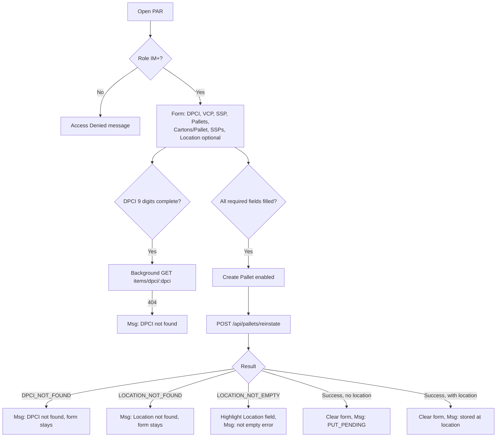

# Screen Design: PAR — Pallet Reinstate

**Device:** Tablet — iPad Pro 13" landscape, fixed 1366×1024 canvas (kiosk)
**Bucket:** Existing Warehouse App (current production screen)
**Roles:** IM, Lead Worker, Manager, Admin (Worker sees an Access Denied message; no form is rendered)

## Flow

1. Worker (IM+) opens PAR (from the Inventory Management menu, or HotJump "PAR"). A sub-IM role sees a centered "Access Denied — Pallet Reinstate requires Inventory Manager or higher" message and nothing else — the form never mounts, and no footer demo buttons render either.
2. For IM+, the full form renders as a single scrollable view — all fields visible at once, no multi-step wizard:
   - **DPCI** — 3-box numeric entry (`DpciField`: Dept/3, Class/2, Item/4), required.
   - **VCP** — numeric field (Numpad), required.
   - **SSP** — numeric field (Numpad), required.
   - **Pallets** — quantity (Numpad), required.
   - **Cartons per Pallet** — quantity (Numpad), required.
   - **SSPs** (qty) — quantity (Numpad), required.
   - **Location (optional)** — 3-box Aisle/Bin/Level entry (`LocationEntryFields`), not required; leaving all three boxes blank is valid.
3. As soon as all three DPCI boxes look complete (3/2/4 digits), the screen fires its own existence check (`GET /api/items/dpci/:dpci`) in the background — this is a validation-only check, not an auto-fill; nothing pre-populates from it (unlike the legacy design's originally-planned VCP/SSP auto-fill — Item has no VCP/SSP fields to pull from). A `404` shows Message Bar `error` — "DPCI not found" — but does not block further typing.
4. If a Location is entered (typed digit-by-digit with auto-advance, or scanned as a full 8-digit barcode into any of the three boxes), it is recorded but **not validated until submit**.
5. **Create Pallet** enables once DPCI (9 digits) and all five quantity fields have a value (Location is never part of this gate, since it's optional). Pressing it calls `POST /api/pallets/reinstate` with the DPCI, all five quantities, and the location id (or `null` if left blank).
6. On success: the entire form clears (including the Location boxes, via `LocationEntryFields`' external clear), and the Message Bar shows:
   - No location given: `"Pallet {id} created — PUT_PENDING"`.
   - Location given: `"Pallet {id} created — stored at {location}"`.
   `playAlert('info')` plays either way.

### Mis-scan / error handling

- **DPCI not found** (either the live existence check, or a `404 DPCI_NOT_FOUND` at submit time): Message Bar `error` — "DPCI not found"; `playAlert('error')` fires on the submit-time version. The form is not cleared or reset.
- **Location not found** (`404 LOCATION_NOT_FOUND` at submit — a location id was entered but doesn't resolve to a real row): Message Bar `error` — "Location not found"; `playAlert('error')`.
- **Location not empty** (`409 LOCATION_NOT_EMPTY` — the entered location resolves but its status isn't `EMPTY`): the Location field is highlighted red via `LocationEntryFields`' `highlight` prop (cleared automatically the next time a location is successfully re-resolved), and Message Bar shows `error` — `"Location {location} is not empty — must be EMPTY to reinstate here"`. The server's error envelope doesn't carry which status blocked it (staged/reserved/stored all collapse to the same generic message client-side) even though the API's own doc comment for this endpoint notes the richer `{ status }` detail isn't currently plumbed through `withHandler`'s shared error shape.
- **Any other submit failure:** generic Message Bar `error` — "Create failed — please try again"; `playAlert('error')`.
- No barcode/scan-specific mis-scan handling beyond the above — a scanned location barcode that doesn't parse to a valid 8-digit value is handled the same as any malformed manual entry by `LocationEntryFields` itself (it simply never resolves/fires `onResolved`).

### Status / messaging behavior

Message Bar entries are transient, following the app-wide convention (`MessageBarContext`) — no acknowledgment required, and a new message simply replaces whatever was showing. The Location field's red highlight is the one piece of *persistent* (non-message-bar) error state on this screen — it stays until the field is either cleared or successfully re-resolved, independent of whatever the Message Bar is currently showing.

## Layout

```
┌──────────────────────────────────────────────────────────────────────────┐
│ Header  (104px) — Home · Back · PAR · Jump · Activity · user/logout      │
├──────────────────────────────────────────────────────────────────────────┤
│ Message Bar  (74px)                                                      │
├──────────────────────────────────────────────────────────────────────────┤
│ Content (1366×792, scrollable)                                          │
│  DPCI               VCP        SSP                                     │
│  [___-__-____]      [____]     [____]                                  │
│                                                                          │
│  Pallets     Cartons per Pallet     SSPs                                │
│  [____]      [____]                 [____]                              │
│                                                                          │
│  Location (optional)                                                    │
│  AISLE  BIN  LEVEL                                                       │
│  [___] [___] [__]                                                       │
│                                                                          │
│  [ Create Pallet ]                                                       │
├──────────────────────────────────────────────────────────────────────────┤
│ Footer  (54px) — ✓ Create · ✓ To Location · ✗ Bad DPCI · ✗ Bad Location │
│                  (IM+ only; hidden entirely for sub-IM roles)            │
└──────────────────────────────────────────────────────────────────────────┘
```

Sub-IM (Worker) role: content area shows only the centered Access Denied message; footer demo buttons do not render at all.

## Input handling

- On-screen **Numpad** appears contextually (`NumpadContext`) on VCP/SSP/Pallets/Cartons/SSPs focus, and on Aisle/Bin/Level focus within the Location field. DPCI's three boxes are plain native `<input>` elements (not numpad-driven) — a deliberate exception noted in `DpciField`'s own comment, since DPCI correction/entry is treated as an infrequent, deliberate IM+ admin action typed in one sitting rather than a scanned/queued touchscreen-only field.
- Hardware scanner input via `deliverScan()` is only wired into the Location field (any of its three boxes accepts a full 8-digit barcode as an override); DPCI has no scan path.
- Every quantity/location field meets the app's 72px+ effective touch-target convention (56–64px visual box heights with generous tap padding).
- No code-picker/dropdown field is used on this screen.

## Data

**Reads:**
- `Item` — via `GET /api/items/dpci/:dpci`, purely an existence check (no VCP/SSP or any other field is consumed from the response); via `POST /api/pallets/reinstate` server-side, to resolve `dept`/`class`/`item` and confirm the DPCI exists before creating the pallet.
- `Location` — via `POST /api/pallets/reinstate` server-side, when a location id is supplied: looked up to confirm it exists and that `status === 'EMPTY'`.
- `Item` (random row) — via `GET /api/pallets/sample-reinstate`, for the "✓ Create"/"✓ To Location" demo fills.
- `Location` (random empty/occupied) — via `GET /api/demo/location?status=empty|occupied`, for the "✓ To Location"/"✗ Bad Location" demo fills.

**Writes:**
- `Pallet` — a new row created on successful submit: `pid` (generated), `dept`/`class`/`item` (from DPCI), `receivedPallets`/`currentPallets`, `receivedCartons`/`currentCartons`, `receivedSSPs`/`currentSSPs` (all set equal to the submitted quantities), `vcp`, `ssp`, `status` (`'STORED'` if a location was given, else `'PUT_PENDING'`), `locationAisle`/`locationBin`/`locationLevel` (or all `null`), `storageCode`/`size`/`zone` (inherited from the target location if given, else `null`), `receivedByZ`/`receivedAt` (the submitting IM's zNumber and now), `putByZ`/`putAt` (set only if a location was given), `poNumber`/`apptNumber`/`expirationDate` all explicitly `null` — a reinstated pallet was never actually received through inbound, so there's no real PO/appointment or known expiration.
- `Location.status` — set to `'STORED'` in the same transaction, only when a location was supplied.
- `ActivityLog` — one entry, `actionType: 'REINSTATE'`, carrying the pallet id, the target location (if any), dept/class/item, and `details: { vcp, ssp, pallets, cartons, ssps, status }`.

**Not written:** no `poNumber`, `apptNumber`, or `expirationDate` is ever populated for a reinstated pallet — these stay permanently `null` for any pallet created this way, which distinguishes a PAR-created pallet from a normally-received one at the data level (a query for pallets with no PO number is, in effect, a query for "reinstated" pallets).

## Screen Flow

Covers: role gate, valid create with/without location, DPCI not found, location not found, location not empty.



## Behind the Scenes

**Role gate is purely client-side rendering + server-side enforcement, no separate route guard.** `PARPage` itself checks `isIM` and swaps its entire render tree to the Access Denied message — there's no router-level redirect. The real enforcement is `requireRole(auth, 'IM')` inside `reinstatePallet` server-side; a sub-IM role that somehow reached the form (e.g. a stale client) would still get a `403` from the API.

**DPCI's existence check and the submit-time check are two separate calls, not shared state.** The `useEffect` firing on DPCI completion (`GET /api/items/dpci/:dpci`) exists purely to give the worker an early heads-up — it doesn't cache or pass anything to the actual `POST /api/pallets/reinstate` call, which independently re-resolves the DPCI server-side and would 404 again on its own if the item genuinely doesn't exist.

**Location validation happens entirely server-side, at submit.** Unlike DPCI, there is no client-side existence/empty pre-check for Location — `LocationEntryFields` only resolves the typed/scanned value into a string; whether it's real and whether it's `EMPTY` is only known once `POST /api/pallets/reinstate` responds. This is why the `highlight` prop exists at all: it's the only way to reflect a server-discovered problem back onto a field that had no client-side validation of its own.

**The pallet create and location status update are one transaction.** `reinstatePallet` wraps the `Pallet.create` and (when a location is given) the `Location.update` to `STORED` inside a single `prisma.$transaction` — a reinstated pallet with a location can never exist without its target location's status also flipping to `STORED` in the same atomic step, and vice versa.

**`storageCode`/`size`/`zone` are inherited, not entered.** These three fields are never worker-supplied on this screen — when a location is given, they're copied straight from that location's own row (the same inheritance pattern `placePallet` uses for a normal put); when no location is given (`PUT_PENDING`), all three stay `null` until some later put operation assigns a real location.

**Demo button fixups (v1.4.3/v1.4.4) are both still live.** "Cartons" is labeled "Cartons per Pallet" (v1.4.3, issue #71) to avoid ambiguity with a lone cartons total; "✓ To Location" and "✗ Bad Location" append the demo location endpoint's separately-returned `level` (zero-padded to 2 digits) onto the 6-digit aisle+bin it also returns (v1.4.4, issue #70) — omitting this previously left the Location field holding an unparseable 6-digit value that `parseFullLocationBarcode` rejected outright.

## Open items still remaining

- [#84](https://github.com/BobbyJoeCool/PalletIQ/issues/84) — Reason codes as a hard-coded list (not directly used on PAR's own form, but the broader reason-code-as-DB-table redesign, if it happens, could eventually touch how a reinstate's activity-log `details` are structured/validated app-wide).
- The `LOCATION_NOT_EMPTY` server error deliberately doesn't expose which status (`STAGED`/`RESERVED`/`STORED`) is blocking the reinstate, per a documented constraint of the shared `withHandler` error envelope (`api/lib/response.ts`) — the frontend shows a generic "not empty" message rather than the specific blocking status the endpoint's own doc comment says the "ideal" contract would include. No open issue tracks changing this; it would require a shared infra change other endpoints also depend on.

## Change Log

| Date | Change |
|---|---|
| 2026-07-17 | Rebuilt onto the new screen-spec template from the legacy `DevNotes/Screen-Specs/PAR.md`, reconciled against current code: corrected the old doc's DPCI auto-fill description (it stated VCP/SSP are pre-filled from the DPCI lookup — current code's `DpciField`/existence-check design does **not** pre-fill anything, since `Item` has no VCP/SSP fields to pull from; the check is existence-only). Added the v1.4.3/v1.4.4 demo-button and label fixes the old doc only partially documented as an inline note. |
| 2026-07-11 (v1.4.4) | Fixed "✓ To Location"/"✗ Bad Location" demo buttons writing only a 6-digit aisle+bin into the Location field (issue #70) — now appends the separately-returned `level`. |
| 2026-07-11 (v1.4.3) | Relabeled "Cartons" to "Cartons per Pallet" for clarity (issue #71). |
| 2026-07-12 (v1.5.0) | DPCI and Location entry rebuilt as 3-box components (`DpciField`, `LocationEntryFields`), replacing single free-text fields (issues #68, #69). |
| 2026-07-05 (v0.9.0) | Initial build — single-form Pallet Reinstate, IM+ only, PUT_PENDING/STORED outcome based on whether a location was supplied, per `DevNotes/Screen-Specs/PAR.md`'s original design. |
