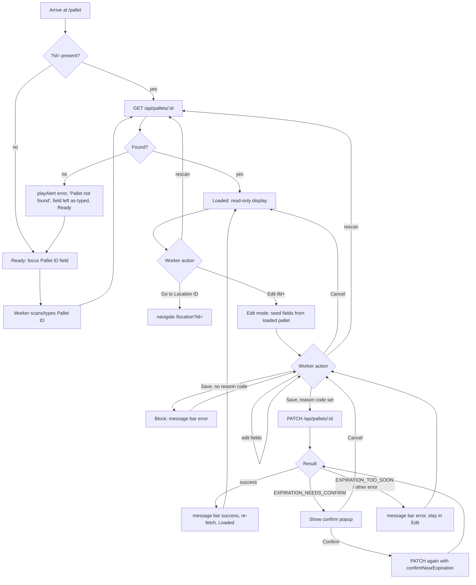

# Screen Design: PII — Pallet ID Info

**Device:** Tablet — iPad Pro 13" landscape, fixed 1366×1024 canvas (kiosk)
**Bucket:** Existing Warehouse App (current production screen)
**Roles:** All roles can look up (Worker, IM, Lead Worker, Manager, Admin). Edit mode: IM, Lead Worker, Manager, Admin only (Worker never sees the Edit button).

## Flow

1. Worker arrives at `/pallet` via Home, HotJump ("PII"), or by tapping any `<LiveId type="pallet">` chip elsewhere in the app (which navigates here with `?id=<pid>`).
   - 1a. **(v1.6.7)** If a pallet was already loaded earlier in this session (`PIIContext`/`PIIProvider`, mounted in `App.tsx` — mirrors `StagingContext`'s pattern for STG), the screen starts directly in the Loaded state showing that pallet instead of Ready, even without a `?id=` this time. Any unsaved Edit-mode changes from before are never persisted — a return visit always lands read-only, never back in Edit mode.
2. The Pallet ID field auto-focuses ~50ms after mount (if arriving without a `?id=` *and* no pallet is already persisted from a prior visit) and opens the on-screen Numpad.
   - 2a. If arriving via `?id=`, that pallet is looked up immediately instead, and the field is not auto-focused.
3. Worker scans a pallet ID barcode, or types a numeric pallet ID and confirms.
4. `GET /api/pallets/:id` is called.
   - 4a. **Found:** the pallet loads into the read-only Loaded state; the Pallet ID field defocuses/blurs (dismissing the Numpad) so it doesn't cover the data that just loaded.
   - 4b. **Not found / non-numeric:** see Mis-scan handling below; screen returns to/stays in Ready state.
5. In the Loaded state, all fields render read-only in a two-column layout. "Go to Location ID" is always present (disabled if the pallet has no current location); "Edit" is present only for IM+.
6. Worker may re-scan/re-type at any time in the Loaded state — the Pallet ID field stays live — loading a different pallet without navigating away.
7. **IM+ presses Edit** → screen enters Edit mode (State: `edit`).
   - 7a. Edit-mode fields (DPCI, VCP, SSP, Total Cartons, SSPs on Pallet, Full Pallets, Expiration Date, Reason Code) are seeded from the currently-loaded pallet's values.
   - 7b. Worker changes one or more fields. The Save button stays disabled until at least one field's *parsed* value actually differs from what was loaded (a re-typed but numerically identical value does not enable Save).
   - 7c. Worker picks or types a Reason Code — required the moment any field differs; Save blocked client-side with a message-bar error if omitted at Save time.
   - 7d. Worker presses **Save** → `PATCH /api/pallets/:id` with only the changed fields plus `reasonCode`.
     - 7d-i. **Success:** returns to Loaded state (re-fetches the pallet); message bar `success` — `"Pallet {pid} updated"`.
     - 7d-ii. **`EXPIRATION_NEEDS_CONFIRM` (409):** not treated as an error — opens the in-app "Expiration date is coming up soon" confirm popup. Confirming resubmits the identical body with `confirmNearExpiration: true`; Cancel dismisses the popup and leaves Edit mode's fields untouched.
     - 7d-iii. **`EXPIRATION_TOO_SOON` (400):** message-bar error, `"Expiration Date must be at least 1 month out"`; stays in Edit mode.
     - 7d-iv. **Any other error:** message-bar error, `"Update failed — {code}"`; stays in Edit mode.
   - 7e. Worker presses **Cancel** → discards all Edit-mode field values, returns to Loaded state with no request made.
   - 7f. Worker scans/types a new Pallet ID while in Edit mode → unsaved changes are discarded silently (no confirmation prompt — a documented demo-scope simplification versus the original spec's "confirm before discard"), and the new pallet loads.
8. Worker presses **"Go to Location ID"** (Loaded or Edit state, if a location exists) → navigates to `/location?id=<8-digit location id>`.

### Mis-scan / error handling

- Non-numeric or unparseable Pallet ID entry: `playAlert('error')`, message bar `"Pallet not found"`, screen returns to Ready (pallet cleared from context if one was loaded). **(v1.6.7)** The typed value is left in the field rather than cleared, so the worker can see and correct what they actually entered instead of retyping from scratch — issue PII#01. **(v1.7.0)** The field also picks up the app-wide red-wash treatment (see `DevNotes/DesignPrompts/Feature-8-AppWide-Invalid-Field-Wash.md`) via a `palletInvalid` flag — an individual wash, since Pallet ID is the screen's only entry field.
- `GET /api/pallets/:id` 404: identical handling — `playAlert('error')`, `"Pallet not found"`, field left as-typed, back to Ready, same red-wash treatment.
- Save with no reason code but at least one changed field: client-side block, message bar `"A reason code is required to save changes"` — no request sent.
- Save rejected server-side for a missing reason code despite a changed field (`400 INVALID_INPUT`): generic `"Update failed — INVALID_INPUT"` (this path is normally pre-empted client-side by the reason-code check above).
- **(v1.6.7)** SSP doesn't evenly divide VCP (`400 INVALID_VCP_SSP_RATIO`): message bar `"SSP must divide evenly into VCP"`; Edit mode is not exited. Re-checked on every save regardless of which field actually changed (see Data/Behind the Scenes below).
- **(v1.6.7)** `currentSSPs` (SSPs on Pallet) is at or above one full carton's worth, `vcp/ssp` (`400 SSPS_EXCEED_CARTON`): message bar `"SSPs on Pallet must be less than a full carton (VCP ÷ SSP)"`; Edit mode is not exited.
- **(v1.6.7, non-blocking)** Committing VCP, SSP, or SSPs on Pallet to an invalid combination (same two rules as the Save-time checks above) shows the identical message text immediately, as a `warning`-tone message rather than `error` — this is a heads-up, not a rejection; the worker can keep editing normally, and only an actual Save attempt enforces it server-side.
- DPCI change blocked by open pending-pull labels (`409 BLOCKED_BY_PENDING_PULL`), new DPCI not found in the Item catalogue (`404 DPCI_NOT_FOUND`), or a quantity edit that would drop below what's already committed to open labels (`409 INSUFFICIENT_QUANTITY`): all surface as `"Update failed — {code}"`; Edit mode is not exited.
- Worker below IM attempting a direct PATCH (not reachable via the UI, since Edit isn't rendered for Worker): `403 FORBIDDEN`.

### Status / messaging behavior

- Error/success messages use the shared MessageBar — non-blocking, does not require dismissal, persists until the next message or navigation replaces it.
- The Expiration-Date "coming up soon" popup is a blocking modal-style overlay (not a MessageBar message) — requires an explicit Confirm or Cancel tap. It renders in the screen's upper half, `pointer-events-none` on its wrapper except the panel itself, so it never covers the bottom-right Numpad/Keyboard corner (an app-wide convention for this style of confirm).
- Loading state shows a plain `"Loading…"` pulsing text placeholder while the fetch is in flight; no skeleton layout.
- **(v1.7.0, issue #95)** A stale error also clears on the next successful pallet load — `loadPallet` now calls `clearMessage()` unconditionally right after `hidePanel()`, so it fires even though a successful load doesn't set a message of its own.

## Layout

```
┌──────────────────────────────────────────────────────────────────────────────┐
│ ‹ Back   ⌂ Home   >_ Jump   ☰ Activity      PALLET ID INFO      J. Smith  Logout │  104px Header
├──────────────────────────────────────────────────────────────────────────────┤
│                              (Message Bar — success/error text)                │  74px
├──────────────────────────────────────────────────────────────────────────────┤
│  PALLET ID                                                                     │
│  ┌────────────┐                                                                │
│  │ 4471203    │  ← tap to refocus/rescan                                       │
│  └────────────┘                                                                │
│                                                                                 │
│  ── Loaded (read-only) ──────────────────────────────────────────────────────  │
│  Pallet ID      4471203                    Status          [STORED]           │
│  DPCI           123-45-6789                Current Location  012-034-05       │
│  Description    Widget, Blue, 12pk                                            │
│  UPC            001234567890                Received By     z001234 — 7/1 8:02 │
│  VCP / SSP      12 / 6   2 SSPs per Carton  Put By           z005566 — 7/1 9:15│
│  Total Cartons  24                          Last Pulled By   —                 │
│  SSPs on Pallet 3                                                              │
│  Full Pallets   1                                                              │
│  PO Number      DEMO1234                                                       │
│  Appt Number    DEMO1234                                                       │
│  Expiration Date 2026-11-02                                                    │
│                                                                                 │
│  [ Go to Location ID ]   [ Edit ]  (IM+ only)                                   │  content: 792px
│                                                                                 │
│  ── Edit mode (IM+, replaces read-only block above) ─────────────────────────  │
│  DPCI  [123]-[45]-[6789]         Current: 123-45-6789                         │
│  Description    Widget, Blue, 12pk                                            │
│  VCP / SSP  [12] / [6]           Current: 12/6                                │
│  Total Cartons [24]              Current: 24                                  │
│  SSPs on Pallet [3]              Current: 3                                   │
│  Full Pallets [1]                Current: 1                                   │
│  Expiration Date [2026-11-02]  Current: 2026-10-15 (Required, if flagged/empty)│
│  Reason Code  [E01______] [▾]    ← type 3 chars or tap ▾ (same as Storage Code)│
│  [ Cancel ]   [ Save ]                                                        │
├──────────────────────────────────────────────────────────────────────────────┤
│ [123 Keypad] [ABC Keyboard]  ✓ Scan PID  Find by Status  ✗ Bad PID  BD 26198 7/17 3:41 PM │  54px Footer
└──────────────────────────────────────────────────────────────────────────────┘
```

## Input handling

- Pallet ID field: on-screen Numpad via `useNumpadField()` / `NumpadContext`; variable length (no `maxLength`/auto-submit) — confirmed by an explicit Enter/OK, or an atomic hardware-scanner `deliverScan()`.
- **(v1.7.0, direct instruction — "a helper button that finds pallet ID on PII by status, with each of those statuses")** A **Find by Status** footer button opens the shared `DemoPicker` with one option per literal `PalletStatus` value (Put Pending, Stored, CA Pull Pending, FP Pull Pending, Pulled, Canceled, Consolidated — see `shared/index.ts`), same shape as LII's own status picker. Backed by a new dedicated endpoint, `GET /api/demo/pallet-status?status={value}` (`samplePalletByStatus` in `api/functions/samples.ts`) — a separate function from `samplePallet`/`GET /api/demo/pallet`, since that endpoint's own `status` query param already means a set of scenario-driven filters (e.g. `"stored"` = has a location, `"pull-pending"` = derived from open Labels) rather than a literal 1:1 match against every `PalletStatus` value; reusing that param for a different meaning would collide. Picking an option loads that pallet the same way a real "Scan PID" does.
- **(v1.7.0, direct instruction — "PII should have a line for Description of the DPCI")** A read-only **Description** row (the resolved item's `descShort`) sits directly below DPCI, in both the read-only view and Edit mode — matching PAR's own always-visible Description row. `GET /api/pallets/:id` now selects `descShort` off `itemRef` alongside `upc`/`requiresExpirationDate`. Not itself editable and not a live DPCI-lookup — it reflects the currently-loaded pallet's item, same as Edit mode's "Current: {value}" indicators show the pre-edit DPCI rather than re-resolving as the boxes are retyped.
- **(v1.6.7)** Edit-mode DPCI/VCP/SSP/Total Cartons/SSPs on Pallet/Full Pallets: every one of these is now a numpad-driven `EditBox` (a local `PIIPage.tsx` component, tap to open the on-screen Numpad via a shared `useEditField` hook), replacing the previous plain native `<input>`/`<input type="number">` fields — direct instruction that no Edit-mode box should pop the OS's own keyboard/number pad. DPCI's three boxes keep their old fixed-width zero-pad-on-confirm behavior (3/2/4 digits), now via `useNumpadField`'s own `padOnSubmit` instead of a manual `onBlur` handler. The shared `DpciField` component (still used by PAR, which keeps its own plain-native-input DPCI entry deliberately, per that component's own docstring) is no longer used on this screen.
- **(v1.6.7)** Every Edit-mode box now shows a "Current: {value}" indicator to its right — the pallet's pre-edit value, so the worker can see what they're changing without having to remember or scroll back to the read-only view. VCP/SSP show one combined "Current: {vcp}/{ssp}" per their own merged box row.
- **(v1.6.7)** VCP, SSP, and SSPs on Pallet each re-run a client-side mirror of `PATCH`'s own VCP/SSP checks (`vcpSspWarning` in `PIIPage.tsx`) immediately when that box commits (numpad Enter/OK, or the synthetic Blur `useNumpadField` fires when focus moves to another field) — a warning-tone `MessageBar` message if invalid, but editing is never blocked; only pressing Save actually enforces it (the server's own check, unchanged from before this round). **(v1.7.0)** VCP/SSP also picks up the app-wide red-wash treatment (see `DevNotes/DesignPrompts/Feature-8-AppWide-Invalid-Field-Wash.md`) as a group — a `vcpSspInvalid` flag set alongside the warning, washing both boxes together the same way PAR's own VCP/SSP pair does (a cross-validated rule needing both values at once, not attributable to either field alone).
- **(v1.7.0)** Expiration Date: rebuilt as the same numpad-driven Month/Day/Year chain PAR uses (direct instruction — "exact same format that is on PAR"), replacing the previous native `<input type="date">`. Each box auto-advances on a 2-digit (Month/Day, zero-padded) or 4-digit (Year) commit; Month validates its 1-12 range and Day validates it exists in the entered month, each washing its own box individually on failure (`monthInvalid`/`dayInvalid`) — mirroring PAR's identical per-box checks. PAR's additional whole-date "expiration too soon" group wash was *not* carried over — that's a business-rule check, not a format one, and this screen already surfaces the equivalent case differently, via the server's `EXPIRATION_NEEDS_CONFIRM`/`EXPIRATION_TOO_SOON` responses (see 7d-ii/7d-iii above), not a wash. Still gets the same "Current: {value}" treatment as everything else.
- **(v1.6.7)** Reason Code: the shared `ReasonCodeField`, redesigned this round onto the same entry-with-dropdown-helper pattern as Storage Code/Size (`CodePickerField`) — type a known 3-character code (auto-commits and dismisses the keyboard, `closeOnAutoSubmit`) or tap the chevron for a popup of `{code} — {desc}` options. Replaces the previous native `<select>` + conditional "Type a code…" custom-field design; this is a shared-component change, so WLH's hold panel and STG's reject/hold popup get the identical new UX too, not just PII.
- All buttons meet the 72px+ min touch target convention (Edit/Save/Cancel/Go to Location ID are 56px tall but wide, at the lower bound the app uses for secondary action rows).
- Scanning a barcode while the Pallet ID field is not focused still lands correctly — the header-level hardware scanner buffer (`AppShell`) delivers to whichever field is currently registered.

## Data

**Reads:**
- `Pallet` (by `pid`) — dept/class/item, vcp, ssp, currentPallets/currentCartons/currentSSPs, status, locationAisle/Bin/Level, receivedByZ/At, putByZ/At, lastPulledByZ/At, poNumber, apptNumber, expirationDate
- `Item` (via `pallet.itemRef`) — `upc`, `requiresExpirationDate` (surfaced on the pallet response, not a Pallet column)
- `User` (via receivedBy/putBy/lastPulledBy relations) — zNumber (displayed; firstName/lastName fetched but not shown, per issue #7)

**Writes (Edit mode only, IM+):**
- `Pallet.dept/class/item` — on a DPCI change; cascades to every `Label` row for that pallet (`dept/class/item`) in the same transaction; blocked if any non-terminal Label exists for the pallet
- `Pallet.vcp`, `Pallet.ssp` — **(v1.6.7)** re-validated together on every save (not just when either changes): SSP must evenly divide VCP (`vcp % ssp === 0`), rejected otherwise
- `Pallet.currentPallets`, `Pallet.currentCartons`, `Pallet.currentSSPs` — floor-checked against cartons/SSPs already committed to open pull Labels; **(v1.6.7)** `currentSSPs` is also capped below one full carton's worth (`vcp/ssp`), rejected if at or above it
- `Pallet.expirationDate` — nullable; 1-month floor / 3-month confirm gate (see Behind the Scenes)
- `ActivityLog` — one `EDIT_PAL` entry per successful save carrying `{ old, new, reasonCode }` for every field that actually changed, plus the pallet's location (if any) — written only if at least one field changed

**Not written:**
- The reason code itself is never stored as a column anywhere — only inside `ActivityLog.details` (same convention as Location Hold reason codes)
- Current location is never editable from this screen (use MNP to move a pallet) — no location write path exists here
- `poNumber`/`apptNumber` are read-only from every screen including this one's own Edit mode — set once, only by simulated receiving/PAR

## Screen Flow

Covers: cold lookup (found/not found), `?id=` pre-population, entering/saving/canceling Edit mode, the Expiration Date confirm branch, and re-scanning mid-Edit.



## Behind the Scenes

**Cold lookup / `?id=` pre-population.** The `?id=` effect and the manual-scan path both funnel into the same `loadPallet()` callback, so behavior (loading state, error handling, field state) is identical regardless of entry method. A guard on the Ready-state auto-focus effect (`[screenState === 'ready']` as the only dependency) exists specifically so the very first successful scan of a session — which flips this boolean true→false — doesn't get a second stale focus call scheduled by the same render pass; without it, the Numpad briefly reopened right after `loadPallet`'s own `hidePanel()` had just closed it (issue #55, only ever visible on the first scan of a session).

**Save button gating.** `changedFields` is recomputed via `useMemo` on every keystroke in Edit mode; it does a *parsed* comparison (e.g. VCP typed as `"012"` counts as unchanged if the loaded value was already `12`), not a raw string diff. `hasChanges` (`Object.keys(changedFields).length > 0`) drives Save's disabled state directly — this was a real bug fix (issue #66): Save used to submit successfully with an empty body as long as a reason code happened to be selected, silently "succeeding" without changing anything.

**PATCH is not atomic across every field independently — but DPCI changes are.** Only when `dpciChanging` is true does the backend wrap the pallet update and the `Label.updateMany` cascade in a single `prisma.$transaction`; a non-DPCI-only edit (e.g. just VCP) is a single `prisma.pallet.update` call with no transaction wrapper, since there's nothing else to keep in sync. A DPCI change is blocked entirely (409) if any Label for the pallet is still in a non-terminal status (`PULLED`/`DIVERTED`/`CANCELED`/`PURGED` are the only ones that don't block) — this prevents an open pull ticket from pointing at a since-changed DPCI.

**Expiration Date's three-tier gate is server-enforced, not client-derived.** The frontend never computes "is this within 3 months" itself — it just relays whatever the server decides via the `EXPIRATION_NEEDS_CONFIRM`/`EXPIRATION_TOO_SOON` error codes. The 1-month and 3-month cutoffs are computed fresh on every request (`new Date()` plus 1/3 months) at the API layer, so the boundary is always evaluated against "now," not against whenever the pallet was loaded into the browser. Clearing the date (`null`) or a date 3+ months out both skip the gate entirely.

**Quantity floor check reuses `receivedCartons` as a cartons-per-pallet proxy.** `totalCartons = newPallets * pallet.receivedCartons + newCartons` is compared against cartons already committed to open Labels — a known simplification (the code comment flags it as "production would use a dedicated field") rather than a true independent cartons-per-pallet column.

**Reason code is logged, never a column.** `writeLog()` is the single choke point for all ActivityLog writes app-wide; PII's call only fires when `Object.keys(oldVals).length > 0` — i.e., a log entry is written if and only if the save actually changed something, even though the request may have carried a reason code regardless.

**VCP/SSP semantics (v1.6.7).** Both are item-quantities, not counts of units-of-units: VCP = items per carton, SSP = items per store-ship unit (equal to VCP for a full case, smaller for a partial carton — see `Documentation/outline.md`'s field descriptions). `vcp / ssp` is therefore the number of SSP-units inside one carton ("SSPs per Carton"), which is why SSP is required to evenly divide VCP — a non-integer result wouldn't correspond to a real physical carton count. This was confirmed by reading `seed.ts`'s own `ssp` generation (always either equal to `vcp` or exactly `vcp/2`) rather than trusting the fix notes' wording alone, since two of them read as contradictory in isolation.

**VCP/SSP validation re-runs on every save, not just when those fields change (v1.6.7).** `editPallet` computes `newVcp`/`newSsp`/`newSSPs` as `body.<field> ?? pallet.<field>` and validates the resulting state unconditionally — so an edit that only touches, say, DPCI still gets checked against the pallet's existing VCP/SSP/currentSSPs. This is safe against false-positives on old data because seed data already guarantees `vcp % ssp === 0` for every generated pallet.

**PIIContext mirrors StagingContext's mounting pattern exactly (v1.6.7).** `PIIProvider` wraps `AppShell` in `App.tsx`, sibling to `StagingProvider`, so it lives above the route `Outlet` and survives PII unmounting on navigation. It holds only the last-loaded `pallet` object — no Edit-mode field state — so a worker returning to PII after navigating away always lands back in the read-only Loaded state (`screenState` initializes to `'loaded'` when `usePII()` already has a pallet, `'ready'` otherwise), never mid-edit. Deliberately scoped to PII only, per direct product decision, even though LII and ISI need the identical "last-viewed-record" pattern later — not generalized into a shared context until their own versions actually pick it up.

**Every Edit-mode box shares one `useEditField` hook (v1.6.7).** A small local hook in `PIIPage.tsx` wires a `useNumpadField` instance to a piece of Edit-mode state: it syncs the field's displayed value from that state (so entering Edit mode, or a value changing indirectly, is reflected immediately), and on confirm writes the trimmed value back into state, dismisses the numpad panel, and — if the caller supplied one — fires an `onCommit` callback with the fresh value. VCP/SSP/SSPs on Pallet pass `onCommit: (v) => checkVcpSspWarning(...)`, closing over the *other* two fields' current state so whichever one the worker just left is validated against the trio's latest values, not stale ones from when Edit mode was entered. The hook's own `focus` function is deliberately not `useCallback`-memoized — it needs to close over fresh values every render, and a new function identity per render is harmless for a plain `onClick`.

**The "different error sound" report was investigated and traced to the removed native number inputs, not application code (v1.6.7).** `lib/audio.ts` has exactly one `Error.mp3` asset and one `playAlert('error')` call path per failure branch in `PIIPage.tsx` — confirmed no double-firing and no second sound file anywhere in the codebase. The two VCP/SSP `PATCH` error branches (`INVALID_VCP_SSP_RATIO`/`SSPS_EXCEED_CARTON`) call `playAlert('error')` exactly like every other error path on this screen. The most plausible explanation is the browser/OS's own feedback sound from the (now-removed) native `<input type="number">` fields those errors were originally reported against — converting every Edit-mode box to the numpad-driven `EditBox` this same round removes that class of native-input interaction entirely, which should resolve it as a side effect; flagged as not fully confirmable without the original hardware/browser to reproduce against.

## Open items still remaining

- The original spec (`DevNotes/Screen-Specs/PII.md`) calls for a confirmation prompt before discarding unsaved Edit-mode changes when a new pallet is scanned mid-edit; the shipped code discards silently instead — documented in-code as "a demo-scope simplification," not yet reconciled with the written spec.
- All five items previously listed here (`DevNotes/Fixes/PII/01`–`05`: Pallet ID field clearing on a failed scan, VCP/SSP divisibility, SSPs-per-carton cap, the VCP/SSP display merge, and cross-navigation persistence) are fixed as of v1.6.7 — see the Change Log below.
- PII#05's "last-viewed-record persists across navigation" pattern has since been generalized to every other screen in the app (LII, ISI, and 9 more — see each screen's own spec) — `PIIContext` was the first of what's now 13 sibling per-screen providers mounted together in `App.tsx`, not a PII-only special case anymore.
- No GitHub issue currently open specifically against PII (see CHANGELOG's "Unreleased — Reported Issues" section as of this writing) — the items above lived in `DevNotes/Fixes/PII/`, not as filed GitHub issues.
- Issue #29 (Warehousing/Inbound menu restructure, distant-future/unscheduled) would let Edit Reason Codes be gated by module/role instead of the current flat, ungated `EDIT_REASON_CODES` list — explicitly deferred until that lands.
- Issue #84 (open, Major) — reason codes generally (including PII's Edit Reason Codes) should eventually become a database table with per-department/role restrictions, rather than the current hardcoded `editReasonCodes.ts` list; needs a product conversation first.

## Change Log

| Date | Change |
|---|---|
| 2026-07-21 (v1.7.0) | Added a **Find by Status** demo footer button — a `DemoPicker` listing every `PalletStatus` value, backed by a new `GET /api/demo/pallet-status?status=` endpoint — direct instruction: "a helper button that finds pallet ID on PII by status, with each of those statuses." |
| 2026-07-21 (v1.7.0) | Added a read-only Description row (item's `descShort`) directly below DPCI, in both the read-only view and Edit mode — direct instruction: "PII should have a line for Description of the DPCI." `GET /api/pallets/:id` now returns `descShort` off the item relation. |
| 2026-07-18 (v1.6.7, Edit-mode UI round) | Every Edit-mode box (DPCI/VCP/SSP/Total Cartons/SSPs on Pallet/Full Pallets) converted from native inputs to numpad-driven `EditBox`es, each now showing a "Current: {value}" indicator; VCP/SSP merged onto one Edit-mode row matching the read-only display; VCP/SSP/SSPs on Pallet now warn immediately (non-blocking) on defocus via a client-side mirror of `PATCH`'s own checks; the shared `ReasonCodeField` redesigned onto the `CodePickerField` entry-with-dropdown-helper pattern (affects WLH/STG too, not just PII), replacing the old native `<select>` + "Type a code…" design. |
| 2026-07-18 (v1.6.7) | All 5 remaining PII fix-list items closed: Pallet ID field no longer clears itself on a failed scan; `PATCH` now validates SSP evenly divides VCP (`INVALID_VCP_SSP_RATIO`) and caps `currentSSPs` below one full carton's worth (`SSPS_EXCEED_CARTON`), re-checked on every save; VCP/SSP merged into one read-only row with a computed SSPs-per-carton indicator; the loaded pallet now survives navigating away and back via a new `PIIContext`/`PIIProvider` (PII-scoped only, mirroring `StagingContext`'s pattern). |
| 2026-07-17 | Rebuilt onto the new standard template from `DevNotes/Screen-Specs/PII.md`, grounded directly in the current `PIIPage.tsx`/`pallets.ts` code. No behavioral changes made as part of this rebuild — see the Open Items note above for the one confirmed spec-vs-code divergence (discard-confirmation prompt) carried forward rather than silently resolved. |
| 2026-07-13 (v1.6.7) | PO Number, Appointment Number (read-only), and Expiration Date (editable, with the 1-month-block/3-month-confirm rule) added to the pallet model and this screen. |
| 2026-07-12 (v1.5.1) | Activity Log detail-line copy reworked to a `Modified Pallet in {LID}` header plus a changed-fields-only diff line; required adding the pallet's location to `PATCH`'s log payload. |
| 2026-07-12 (v1.5.0) | Save disabled until a field actually changes (issue #66), closing a no-op-save/empty-PATCH bug. |
| 2026-07-10 (v1.3.0) | Migrated onto the new shared `DpciField`/`ReasonCodeField` components (issue #78); reason-code free-text entry switched from the OS keyboard to the app's own on-screen Keyboard (issue #6). |
| 2026-07-08 (v1.1.5) | Pallet ID field now blurs/defocuses after a scan or manual entry, matching LII/IID (issue #55); Edit mode now requires a reason code whenever a save actually changes a field (issue #6). |
| 2026-07-08 (v1.1.0) | Received/Put/Last Pulled By switched to show zNumbers instead of names (issue #7); added a Full Pallets quantity field (issue #19); Cartons field relabeled "Total Cartons" (issue #20); DPCI edit split into three Dept/Class/Item boxes (issue #21); read-only view switched to a two-column layout (issue #22); DPCI/UPC values made tappable, jumping to IID (issue #47). |
| 2026-07-06 (v1.0.4) | Fixed missing focused-field (red border) highlighting on the Pallet ID field. |
| Initial build — v0.9.0 (2026-07-05) | PII shipped as part of the initial feature-complete build: read-only pallet lookup for all roles by Pallet ID, with in-place IM+ editing of DPCI/VCP/SSP/quantity fields, gated behind an explicit Edit keypress. |
