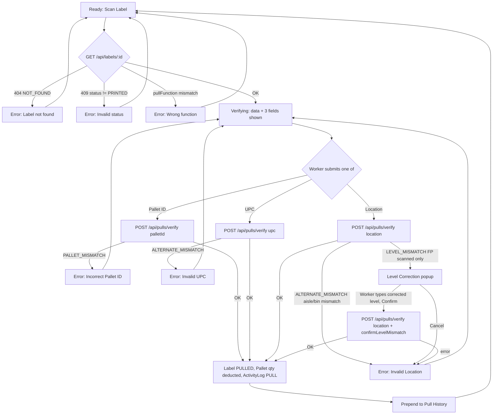

# Screen Design: PIP — Pallet ID Pull

**Device:** Tablet — iPad Pro 13" landscape, fixed 1366×1024 canvas (kiosk).
**Bucket:** Existing Warehouse App (current production screen).
**Roles:** Worker, IM, Lead Worker, Manager, Admin — all roles behave identically on this screen; no role gating anywhere in PIP.

## Flow

1. Worker lands on `/pull` with the **Pull Function** dropdown at the top, defaulted to the first option (`CA — Carton Air`). This dropdown is persistent — always reachable, not a separate initial step — and filters which labels can be scanned in this session (a scanned label whose `pullFunction` doesn't match the selected value is rejected).
2. Worker scans or keys a label into the **Scan Label** field and confirms. `GET /api/labels/:id` resolves the label.
   - 2a. If the label's `pullFunction` doesn't match the dropdown's selection: rejected with an error; label field keeps its scanned value and stays focused for a retry.
   - 2b. If the label isn't found, or isn't in `PRINTED` status (i.e. it's `PULLED`/`CANCELED`/`PURGED`): rejected with an error; label field clears and stays focused.
   - 2c. On success: screen transitions to the verification state. Pull data (Location, Item, DPCI, and a Current/Pull/Remaining quantity table) renders immediately alongside three independent verification fields — there is no separate review step.
3. Worker scans/keys **any one** of Pallet ID, UPC, or Location to confirm the pull. Each independently calls `POST /api/pulls/verify` with only that one field.
   - 3a. **Pallet ID** — must exactly match the pallet at the label's resolved location.
   - 3b. **UPC** — must resolve (by DPCI lookup) to the same item as the pallet.
   - 3c. **Location** — resolved by the shared 3-box Aisle/Bin/Level entry, either from one atomic 8-digit scan or by typing all three boxes. The match rule depends on both the pull function and whether the value was scanned or hand-typed (see `outline.md`'s Location Barcode Handling exception):
     - Hand-entered, any function: full Aisle+Bin+Level match required, no recovery popup on a mismatch.
     - Scanned Carton Air (CA): full Aisle+Bin+Level match required.
     - Scanned Carton Floor (CF): only Aisle+Bin compared — level ignored. (Hand-entered CF also only meaningfully checks Bin, since PIP locks the Aisle and Level boxes to the pallet's real values for this combination.)
     - Scanned Full Pallet (FP): full match required, but an aisle+bin match with a level-only mismatch does not reject outright — it opens the **Level Correction popup** (step 3c-i below).
   - An aisle+bin mismatch (any function/entry method) is always an outright reject — no popup.
   - 3c-i. **FP level-mismatch recovery:** the popup shows the scanned level vs. the pallet's actual recorded level and asks what level the pallet was actually pulled from. The worker types a level (1–2 digits); this is accepted as their attestation with no further validation, and the pull resubmits with the corrected level and `confirmLevelMismatch: true`. Backing out of the popup (Cancel) is treated as an ordinary invalid Location.
4. On a successful verify (any of 3a/3b/3c): the label is marked `PULLED`, the pallet's carton/SSP quantities are deducted (floored at 0; a carton pull always zeroes the pallet's full-pallet count), the pull is prepended to the session's Pull History (right column), and the screen resets to the ready state (label field cleared, focused for the next scan).
5. **Hold quick-action:** while in the verification state, a "Hold" button (visible whenever the label's location is known) opens the shared `HoldPanel` inline, for flagging the current location without leaving PIP.
6. **Changing Pull Function mid-verification:** selecting a different function while a label is scanned-but-unverified discards it (warns "Label not verified"), clears Pallet ID/UPC/Location, and returns to the ready state under the new function. Re-selecting the same function already active is a no-op.
7. **Rescanning a new label while unverified:** scanning a different label while the previous one hasn't yet been verified is treated as a normal part of the fast scan-then-verify-in-batch workflow (no warning) — Pallet ID/UPC/Location clear and the new label's data loads in their place.

### Mis-scan / error handling

- Label not found (`404`) → error, `"Label not found"`, field keeps its value (corrected here — this doc previously said "clears," which hasn't matched the actual code's `focusLabelField()`-not-`.clear()` behavior) and refocuses; also picks up the app-wide red-wash treatment (v1.7.0 — see `DevNotes/DesignPrompts/Feature-8-AppWide-Invalid-Field-Wash.md`) via `FieldDisplay`'s new `invalid` prop, since it's the one field on this screen where a failed value stays visible long enough to be worth washing.
- Label not `PRINTED` (`409`) → error, `"Invalid status: {status}"` (e.g. `PULLED`/`CANCELED`/`PURGED`), field keeps its value (same correction as above) and refocuses; same red-wash treatment.
- Label's pull function doesn't match the selected dropdown value → error, `"Wrong function — label requires {fn}"`, field keeps its value and refocuses; same red-wash treatment.
- Pallet ID mismatch (`400 PALLET_MISMATCH`) → error, `"Incorrect Pallet ID"`, Pallet ID field only clears/refocuses; other fields untouched. Not washed — the field clears atomically with the error (no visible moment where a bad value sits in the box), unlike Label above.
- UPC mismatch (`400 ALTERNATE_MISMATCH`) → error, `"Invalid UPC"`, UPC field only clears/refocuses. Not washed, same reasoning as Pallet ID.
- Location mismatch (`400 ALTERNATE_MISMATCH`) → error, `"Invalid Location"`, Location's three boxes remount/clear and Aisle refocuses. Not washed, same reasoning — `LocationEntryFields`' own per-box `invalid` props (used by PAR) aren't wired here since PIP's Location failure is a whole-value verify mismatch, not a per-box existence check, and the boxes clear before any wash would be visible anyway.
- Pull function mismatch at verify time (`409 WRONG_PULL_FUNCTION`) → error, `"Pull function mismatch"`.
- FP level-only mismatch (`400 LEVEL_MISMATCH`) → opens the Level Correction popup instead of an error message; declining it produces the same `"Invalid Location"` error as an ordinary mismatch.
- Any other verify failure → generic error, `"Verification failed — please try again"`.

### Status / messaging behavior

- Errors are transient but not auto-cleared — they persist until the next message-bar update.
- The success message (`"Last Pull {location} — {pallets}P / {cartons}C / {ssps}S"`) deliberately persists through the return to the ready state and through the next label scan (not cleared on state transition) — a worker can verify their previous pull while already moving to the next one. A rescan while still-unverified does *not* stomp this message with a spurious warning (issue #45 fix) — only a genuine error path updates the message bar in that case.
- All error paths play `playAlert('error')`; successful pulls play `playAlert('info')`.
- **(v1.7.0, issue #95)** `handleLabelScan`'s success path also calls `clearMessage()` (right after `setLabelInvalid(false)`), so a stale error clears on the next successful label load. The later PID/UPC/Location verify steps already overwrite any stale error via their shared `onPullSuccess`'s own success message, so no gap existed there.

## Layout

```
┌──────────────────────────────────────────────────────────────────────────────────────┐
│ Header (104px): [Back] [Home] [Jump]      Pallet ID Pull      [Name]        [Logout]  │
├──────────────────────────────────────────────────────────────────────────────────────┤
│ Message Bar (74px): idle / error / success text                                       │
├───────────────────────────────────────────────────────────┬──────────────────────────┤
│ Content (792px)                                            │ Pull History (456px)     │
│                                                              │                          │
│ Pull Function [CA — Carton Air ▾]           [Hold]          │  ┌────────────────────┐  │
│                                                              │  │ 030105-08   10:42a │  │
│ Scan Label  [______________________]                        │  │ Pulled 0P/4C/0S     │  │
│                                                              │  │ 2P/1C/0S remaining  │  │
│  (once a label verifies, below appears:)                    │  └────────────────────┘  │
│  Location   [ 030105-08 ]                                    │  ┌────────────────────┐  │
│  Item       Widget, Blue, 12ct                                │  │ ...                 │  │
│  DPCI       012-34-5678                                       │  └────────────────────┘  │
│  ┌───────────────┬────────┬────────┬────────┐                │                          │
│  │               │ Pallet │ Carton │  SSP   │                │                          │
│  │ Current       │   2    │   5    │   0    │                │                          │
│  │ Pull          │   0    │   4    │   0    │                │                          │
│  │ ─────────────────────────────────────────│                │                          │
│  │ Remaining     │   2    │   1    │   0    │                │                          │
│  └───────────────┴────────┴────────┴────────┘                │                          │
│  Pallet ID [__________]                                      │                          │
│  UPC [________]  │  Location [Aisle][Bin][Lvl]                │                          │
├───────────────────────────────────────────────────────────┴──────────────────────────┤
│ Footer (54px): [Numpad/Keyboard toggle]  [state-aware demo buttons]  [date/time]       │
└──────────────────────────────────────────────────────────────────────────────────────┘
```

## Input handling

- All text entry goes through `NumpadContext` — the on-screen Numpad (numeric) or Keyboard (for alpha UPCs), bound per-field via `useNumpadField().focus(handler)`. Exactly one field holds the numpad/keyboard registration at a time; tapping a `FieldDisplay` box calls its `onFocus`, which re-registers the handler.
- Hardware barcode scanner input flows through the same path via `deliverScan()` — a scan is delivered to whichever field currently holds focus.
- Field boxes are 72px tall (60/26px "compact" variant for the side-by-side UPC pair) — meets the 72px minimum touch target except where two fields intentionally share a row.
- Location is the shared 3-box `LocationEntryFields` component (Aisle/Bin/Level), not a plain `useNumpadField` — it manages its own three sub-fields and reports back via `onResolved(value, wasScanned)`. `wasScanned` is structurally derived (a value longer than a single box's own max length can only arrive via a scan) — this is what feeds the entry-method-dependent match rule described in Flow step 3c.
- Screen-specific override: the Location boxes can be **locked** (shown disabled, not part of the typed sequence) — Aisle is always locked to the pallet's real value for hand-entry; Level is additionally locked for Carton Floor. A full 8-digit scan into any box still overrides regardless of locks.
- The footer demo-button slot is state- and field-aware: it shows a different valid/invalid (and, for Label, a third "⚠ Invalid Label" picker) pair depending on which field currently holds focus (Label / Pallet ID / UPC / Location).

## Data

**Reads:**
- `Label` (by `lid`) — status, `pullFunction`, `quantity` (cartons), `sspQuantity`, `dpci` fields — to validate and display pull data.
- `Pallet` (via the label's relation) — `currentPallets`/`currentCartons`/`currentSSPs`, `dept`/`class`/`item` — for the Current quantity row and UPC/Pallet ID matching.
- `Location` (via the pallet's relation) — `aisle`/`bin`/`level` — for display and the Location verification path.
- `Item` (by `upc`) — `dept`/`class`/`item` — to resolve the UPC path.

**Writes:**
- `Label.status` → `PULLED` on a successful verify.
- `Pallet.currentPallets`/`currentCartons`/`currentSSPs` → deducted by the label's quantity (floored at 0); `currentPallets` always zeroed on any carton pull (FP zeroes it explicitly via its own consumed count).
- `Pallet.lastPulledByZ` / `lastPulledAt` → set to the acting worker and now.
- `ActivityLog` — one `PULL` entry per successful verify, with before/after quantities, `pullFunction`, `verifiedVia` (`PID`/`UPC`/`LID`), `wasScanned`, and (FP level-mismatch resubmissions only) `confirmedLevel`.

**Not written:** The session-local Pull History panel (right column) is purely client-side state — it resets on navigation away and is not itself a persisted record (the `ActivityLog` entry is the durable record of the same event). Declining a Location mismatch or an FP level-correction popup writes nothing.

## Screen Flow

Covers: label scan success/failure, wrong pull function, the three independent verification paths (Pallet ID / UPC / Location) and their mismatch handling, and the FP level-mismatch recovery sub-flow.



## Behind the Scenes

**Label scan (`GET /api/labels/:id`).** Read-only — nothing is written until a verify path succeeds. The label's `pullFunction` is checked client-side against the dropdown selection before the API call even completes the round trip conceptually, but the actual gate is server-agnostic here — this specific check (`data.label.pullFunction !== pullFunctionRef.current`) happens purely in the frontend after the fetch resolves; the server itself only re-checks `pullFunction` again at verify time (`WRONG_PULL_FUNCTION`), which is the real enforcement point in case the dropdown and an in-flight verify race.

**Verification paths (`POST /api/pulls/verify`).** Exactly one of `palletId`/`upc`/`location` must be present (`INVALID_INPUT` otherwise). The label's `PRINTED` status is re-validated at this point too (`NOT_FOUND` if it's no longer pending — e.g. another worker already pulled it in the gap between the label scan and this submit). The actual mutation (`Label.status` → `PULLED`, `Pallet` quantity update) happens in a single `prisma.$transaction` — the two writes are atomic, so a crash mid-write can't leave the label `PULLED` with stale pallet quantities or vice versa. The `ActivityLog` write happens immediately after, outside that transaction — a failure there would not roll back the pull itself (this is consistent with how every other screen in this app writes its log).

**Location match rule.** The rule is resolved entirely server-side in `verifyPull` (api/functions/pulls.ts), keyed on `pullFunction` + `wasScanned`. `wasScanned` is not derived from `NumpadContext`'s `isScanningRef` for the Location path (unlike Pallet ID/UPC) — it comes structurally from `LocationEntryFields`, since a scan is the only way a box can receive a value longer than its own typed maxLength. This distinction matters for CF (aisle+bin only when scanned, full match when hand-typed) and FP (level-mismatch recovery only available when scanned — a hand-typed level that's wrong is just wrong, since the worker already claims to know it).

**FP level-mismatch resubmission.** The corrected level typed into the popup is never validated against `pallet.location.level` — it's recorded as-is in `ActivityLog.details.confirmedLevel` as the worker's attestation. This is a deliberate scope decision (issue #72) — Full Pallet pulls happen from floor level, so the worker frequently cannot physically scan the true (possibly high-rack) level's barcode.

**Session persistence via `PIPContext`.** The scanned label (`labelData`, mirroring the page's own former local `LabelScanResult` shape: label/pallet/location) lives in `PIPProvider` (mounted in `App.tsx`, alongside all 12 sibling per-screen providers — `StagingProvider`/`PIIProvider`/`ISIProvider`/`LIIProvider`/`SDPProvider`/`MNPProvider`/`IIDProvider`/`PARProvider`/`WLHProvider`/`SARProvider`/`ELAProvider`/`ELZProvider`, all 13 now mounted together wrapping `AppShell`), not local component state, so navigating away from PIP and back restores the last-scanned label instead of resetting to the empty ready state. Only the resolved label/pallet/location data persists — the Pallet ID/UPC/Location verification fields' in-progress typing, and the session-local Pull History panel (client-side only, resets on navigation away per the Data section above), are never part of this state.

**Focus-race guard.** `PIPPage.tsx` re-focuses the Label field synchronously inside `onPullSuccess` rather than relying solely on the `'ready'`-state effect's 50ms-delayed call — without this, a fast scanner scan of the next label could land on the just-cleared-but-still-registered Pallet ID/UPC field instead of Label, producing a spurious "Label not verified" warning (this was issue #45's actual root cause, fixed in v1.0.9/v1.1.0).

## Open items still remaining

- [#83](https://github.com/BobbyJoeCool/PalletIQ/issues/83) — scanning an unknown Pallet ID crashes with a 500 instead of a 404 on the Manual/SDP put screens; PIP's own Pallet ID mismatch path (`PALLET_MISMATCH`) was not reported as affected, but the same non-numeric-input class of bug is worth re-checking against PIP's `handlePidVerify` path given it shares patterns with SDP/MNP.
- [#88](https://github.com/BobbyJoeCool/PalletIQ/issues/88) — bad Contraction data on RS/RF/BS/some HS locations; not a PIP-specific bug, but a location a worker pulls from could carry incorrect Contraction flags that don't otherwise gate a pull today.
- No PIP-specific "Known Limitation" note currently open in `CHANGELOG.md` beyond the items above — the screen's own fix backlog (`DevNotes/Fixes/tasks.md`'s PIP section) has been fully worked through as of v1.6.1.

## Change Log

| Date | Change |
|---|---|
| 2026-07-17 | Rebuilt to the new Screen-Design-Template format, documenting the screen as currently shipped (v1.6.6) rather than the original Phase 6.1 build plan. No behavioral changes — see below for how the old `DevNotes/Screen-Specs/PIP.md` diverged from the live code (Numpad-minimize toggle and a fixed 436×482px Numpad footprint described in the old doc were never actually built this way; the real layout uses the shared Footer's Numpad/Keyboard toggle, not a screen-local minimize control). |
| 2026-07-14 (v1.6.2) | Activity log entries now record whether Pallet ID/UPC/Location was scanned or hand-typed (`verifiedVia` + `wasScanned`), rendered as a trailing `(Scan: PID)`-style suffix in the Activity overlay. |
| 2026-07-14 (v1.6.1) | Location field rebuilt as the shared 3-box `LocationEntryFields` (replacing the old single barcode-string field); match rule redefined to depend on entry method (scanned vs. hand-typed), not just pull function, after live testing found `outline.md`'s original rule incomplete. Added Pulled/Canceled/Purged demo-label buttons via the new shared `DemoPicker`. Fixed a pre-existing "Maximum update depth exceeded" render loop (root-caused to `useNumpadField`'s unstable object identity, fixed at that shared layer). |
| 2026-07-12 (v1.5.0) | Alternate ID split into independent UPC and Location fields (issue #82) — the old combined field's format-guessing removed from both frontend and `POST /api/pulls/verify`'s contract. FP level-mismatch popup redesigned to collect the actual level (issue #72) instead of a plain confirm/reject. Location/quantity display font sizes increased; Pull/Remaining rows merged into one Current/Pull/Remaining table (issue #62). Fixed a verifying-state focus race that could misroute a scan. |
| 2026-07-08 (v1.1.0) | FP Alternate ID level mismatch changed from an outright reject to a confirm-and-proceed dialog (issue #49) — a Full Pallet pull is done from floor level, so requiring a scan of the true (possibly high) level's barcode isn't physically viable. Location display enlarged/bolded/reddened; added a "⚠ Wrong Function" demo button; DPCI/UPC values became tap-to-jump links. Fixed a status-bar-stomping bug on plain rescans (issue #45). |
| 2026-07-08 (v1.0.9) | Alternate ID verification on FP pulls now checks level (previously aisle+bin only, same as CA/CF) given FP empties the whole location and a bin can hold several stacked levels (issue #48). Fixed the pull-verification success message being overwritten by a spurious "Label not verified" warning (issue #45 root cause). |
| Initial build — v0.9.0 (2026-07-05) | Unified pull screen for every pull type (CA/CF/FP/BK), with two-path verification (Pallet ID or a single combined Alternate ID field guessed as UPC-or-Location).
