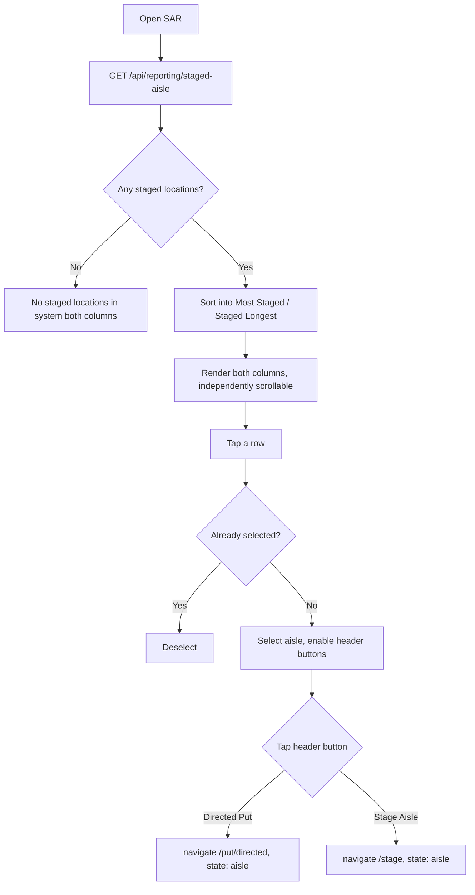

# Screen Design: SAR — Staged Aisle Report

**Device:** Tablet — iPad Pro 13" landscape, fixed 1366×1024 canvas (kiosk)
**Bucket:** Existing Warehouse App (current production screen)
**Roles:** All roles (read-only report; no write action originates on this screen)

## Flow

1. Worker opens SAR (from Reporting Functions in the menu, or HotJump "SAR").
2. On mount, the screen calls `GET /api/reporting/staged-aisle` exactly once. While loading, both columns show "Loading…". Data is **not** auto-refreshed — the worker must reopen the screen to see current state.
3. The response (one row per aisle with at least one `STAGED` location) is sorted client-side into two independent lists rendered side by side:
   - **Most Staged** — descending by staged-location count, aisle number ascending on tie.
   - **Staged Longest** — descending by the age of that aisle's single oldest staged location, aisle number ascending on tie.
4. Each row shows: Aisle id (`A-{aisle}`), a wrapped set of freight-type badges present in that aisle (`StorageCode-Size`, e.g. `CR-M`), and the column's own metric (staged count, or formatted age).
5. Tapping any row **selects** that aisle (highlighted background) — tapping the already-selected row deselects it. Selection is shared across both columns (selecting a row in either list selects that aisle app-wide for this screen, and is reflected if the same aisle also appears in the other column).
6. With an aisle selected, two header buttons enable: **Directed Put — A-{aisle}** and **Stage Aisle — A-{aisle}**. Tapping either navigates to `/put/directed` (SDP) or `/stage` (STG) respectively, passing the aisle via router `state`, pre-populating that screen's own aisle field.
7. If the report returns zero aisles with any staged locations, both columns show: "No staged locations in system".

### Mis-scan / error handling

- SAR has no scanner/typed input of its own — there is nothing to mis-scan.
- If `GET /api/reporting/staged-aisle` fails outright (network/server error), the screen falls back to an empty row set for both columns (same rendering as the legitimate "nothing staged" empty state) — there is no distinct error message shown to the worker for a failed fetch versus a genuinely empty system.

### Status / messaging behavior

SAR does not use the Message Bar at all under normal operation — it is a pure read-only report screen with no success/error/warning outcomes to surface there. The only "state" communicated is the Loading/empty/populated condition of each column, rendered inline within the column itself.

## Layout

```
┌──────────────────────────────────────────────────────────────────────────┐
│ Header  (104px) — Home · Back · SAR · Jump · Activity · user/logout      │
├──────────────────────────────────────────────────────────────────────────┤
│ Message Bar  (74px)  (unused on this screen)                             │
├──────────────────────────────────────────────────────────────────────────┤
│ Content (1366×792)                                                       │
│                              [Directed Put — A-305] [Stage Aisle — A-305]│
│  ┌───────────────────────────┐   ┌───────────────────────────┐          │
│  │ MOST STAGED                │   │ STAGED LONGEST             │        │
│  ├───────────────────────────┤   ├───────────────────────────┤          │
│  │ A-05   [CR-M][CR-S] 14 st. │   │ A-12   [BS-L]      2d 4h   │        │
│  │ A-11   [HS-M]       9 st.  │   │ A-05   [CR-M][CR-S] 6h 32m │        │
│  │ A-305  [RS-S]       6 st.  │   │ A-11   [HS-M]       48m    │        │
│  │ …(scrolls, ~6–7 visible)…  │   │ …(scrolls independently)…  │        │
│  └───────────────────────────┘   └───────────────────────────┘          │
├──────────────────────────────────────────────────────────────────────────┤
│ Footer  (54px) — no demo buttons on this screen                         │
└──────────────────────────────────────────────────────────────────────────┘
```

## Input handling

SAR has no Numpad, Keyboard, or scanner input — every interaction is a tap on a row or one of the two navigation buttons. Rows and the header buttons meet the app's 72px+ effective touch-target convention (44px visual button height with generous horizontal padding for the buttons; full-row tap area — px-5 py-3 — for list rows).

## Data

**Reads:**
- `Location` (aisle, bin, level, storageCode, size) filtered to `status: 'STAGED'` — the full staged-location set the report is built from.
- `ActivityLog` filtered to `actionType: 'STAGE'` for the aisles found above — the most recent `STAGE` log entry per exact location gives that location's "staged since" timestamp, from which age is computed. A `STAGED` location with no matching log entry (e.g. pre-existing seed data) falls back to age `0` rather than failing the request.

**Writes:** none — SAR performs no writes of any kind. Selecting a row and navigating to SDP/STG only passes the aisle number through router `state`; SAR itself never calls a mutating endpoint.

**Not written:** nothing tracked here is specific to SAR — it is purely a read/aggregate view over `Location` and `ActivityLog` rows written by other screens (STG's stage/unstage actions).

## Screen Flow

Covers: normal load with data, empty system, row selection/deselection, navigation hand-off to SDP/STG.



## Behind the Scenes

**Single fetch, client-side dual sort.** The API returns one unsorted array; `SARPage` derives `mostStaged` and `stagedLongest` via two independent `Array.prototype.sort` calls over the same underlying rows — there are no two separate API calls, and no server-side sort parameter. Both lists always reflect the exact same data snapshot from the one `GET` call.

**Aisle-level aggregation happens server-side, not per-location.** `getStagedAisleReport` groups every `STAGED` location by `aisle`, computing `stagedCount` (row count) and `oldestStagedAge` (max age across that aisle's staged locations) in a single in-memory pass over the query results — there is no per-location detail returned to the client, only the aggregated per-aisle summary.

**"Staged since" is derived from the Activity Log, not a `Location` column.** There is no `stagedSince` timestamp stored directly on `Location` — age is reconstructed by finding each location's most recent `STAGE`-type `ActivityLog` row (sorted `desc`, first match per exact aisle/bin/level wins) and diffing against "now" at request time. This means age is only as accurate as the Activity Log's retention — see STG's own log entries for how per-location `STAGE` rows are written (one per location per stage action, not one per bulk action), which is why this per-location lookup is possible at all.

**No auto-refresh is a deliberate simplicity choice, not a bug.** The screen loads once on mount (`useEffect` with an empty dependency array) and never re-polls; a worker who wants current numbers must navigate away and back. There is no "Refresh" button on this screen (unlike STG, which added one in v1.6.6) — SAR has never had one at any point in its history.

**Session persistence via `SARContext`.** Only the selected aisle (`selected: number | null`) lives in `SARProvider` (mounted in `App.tsx`, alongside all 12 sibling per-screen providers — `StagingProvider`/`PIIProvider`/`ISIProvider`/`LIIProvider`/`PIPProvider`/`SDPProvider`/`MNPProvider`/`IIDProvider`/`PARProvider`/`WLHProvider`/`ELAProvider`/`ELZProvider`, all 13 now mounted together wrapping `AppShell`), not local component state, so navigating away from SAR and back keeps the same aisle selected instead of resetting the Directed Put/Stage Aisle buttons to disabled. The report's `rows` themselves are deliberately excluded from persistence — SAR always re-fetches fresh on mount (see the "No auto-refresh" note above), since this is a live view of current staging state and showing stale cached rows after navigating back would be actively worse than the normal brief loading flash, unlike LII/PII/ISI/IID/WLH's own "resume the last cached lookup" pattern.

**Failed fetch and empty state are indistinguishable to the worker.** `SARPage`'s fetch `.catch()` sets `rows` to `[]`, the same value a genuinely-empty system produces — there's no separate error banner. A developer investigating a "why does SAR say nothing is staged" report should not assume the report is necessarily accurate without checking the network/server logs first.

## Open items still remaining

- No known open GitHub issues reference SAR directly as of this writing (the "Distant Future" and "Needs Triage" backlog items in `CHANGELOG.md`'s Unreleased section do not mention SAR).
- Failed-fetch vs. genuinely-empty ambiguity (see Behind the Scenes above) has no tracked issue but is a plausible source of a future confusing bug report if the reporting endpoint starts failing silently in production.

## Change Log

| Date | Change |
|---|---|
| 2026-07-17 | Rebuilt onto the new screen-spec template from the legacy `DevNotes/Screen-Specs/SAR.md`. No behavioral divergence found between the old doc and current code for SAR's core report behavior; added detail the old doc didn't cover: the freight-type badges and Directed Put/Stage Aisle hand-off buttons (both shipped in v1.1.0, after the old doc's initial writing) and the exact Activity Log-derived age mechanism. |
| 2026-07-08 (v1.1.0) | SAR moved from Location Management to the top of Reporting Functions in the menu; gained per-aisle freight-type badges and the Directed Put/Stage Aisle hot-button hand-off to SDP/STG (issues #10, #11, #26). Its prior Location Management slot was taken over by the new ISI screen. |
| 2026-07-05 (v0.9.0) | Initial build — two independently-sorted, independently-scrolling read-only aisle lists (Most Staged, Staged Longest), no filters, load-once-on-open, per `DevNotes/Screen-Specs/SAR.md`'s original design. |
