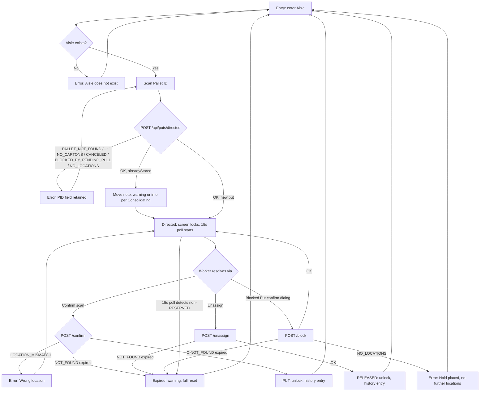

# Screen Design: SDP — System Directed Put

**Device:** Tablet — iPad Pro 13" landscape, fixed 1366×1024 canvas (kiosk).
**Bucket:** Existing Warehouse App (current production screen).
**Roles:** Worker, IM, Lead Worker, Manager, Admin. Every role can scan a pallet and complete a directed put; **Size** override is available to every role; **Storage Code** and **Zone** overrides, and the **Consolidating** toggle, are IM and above only (IM/Lead/Manager/Admin — "IM+" throughout).

## Flow

1. Worker lands on `/put/directed` in the **entry** state. Aisle may arrive pre-filled from router state (e.g. a row-select hand-off from SAR).
2. Worker enters/scans an **Aisle** (3 digits; a scanned location barcode is truncated to its leading 3 digits rather than rejected). On confirm, the aisle is validated to actually exist (`GET /api/locations/empty-by-zone`) before advancing.
   - 2a. Nonexistent aisle → error, field clears and refocuses.
3. IM+ users may optionally set **Size** (any role), **Storage Code** (IM+), and **Zone** (IM+) overrides, each independently "lockable" (🔒) to persist across multiple puts in the same session; IM+ may also toggle **Consolidating** (off by default). Size/Storage Code narrow to what's actually present in the entered aisle once Aisle is filled; Zone's dropdown is never narrowed. **(v1.7.0)** With a Size and/or Storage Code override entered, the "✓ Put"/"✓ Move" footer demo buttons now exclude pallets that already naturally match the entered override(s) from their random pick (`GET /api/demo/pallet`'s new `excludeSize`/`excludeStorageCode` params) — a demo pallet that already happened to be, say, a CR-M pallet wouldn't visibly demonstrate a CR/M override actually redirecting it anywhere. `excludeSize` only affects the Move button (an unlocated, not-yet-put pallet has no Size of its own to exclude on).
4. Worker scans/keys a **Pallet ID**. `POST /api/puts/directed` runs eligibility checks, resolves the effective Size/Storage Code/Zone (an explicit override always wins; otherwise falls back to the pallet's own inherited values, then the Item's intrinsic Storage Code), finds the next eligible location in the aisle, reserves it (`RESERVED` status + a `Reservation` row), and returns the directed location.
   - 4a. Pallet not found / no cartons / no open locations in aisle / blocked by a pending pull / canceled → error; Pallet ID field keeps its value (not cleared) so the worker can adjust Aisle/overrides and resubmit without re-scanning. Also picks up the app-wide red-wash treatment (v1.7.0 — see `DevNotes/DesignPrompts/Feature-8-AppWide-Invalid-Field-Wash.md`) via a `palletInvalid` flag, an individual wash shared by every one of these failure codes since they all leave the same field visible for the same retry. Aisle's own nonexistent-aisle error (2a) isn't washed — that field clears atomically instead, so there's no visible bad value to wash (same reasoning as PIP's PID/UPC/Location).
   - 4b. Pallet already stored somewhere (a move): succeeds normally; message bar shows a "directing as move" note — `warning` tone if Consolidating is off, `info` tone if on.
   - 4c. On success: screen transitions to the **directed** state and locks — Back/Home/Jump/Logout are disabled shell-wide via `useNavLock` until the reservation resolves. A 15-second poll against `GET /api/locations/{id}` starts, to proactively detect the server-side 5-minute reservation timeout.
5. Worker resolves the locked reservation one of three ways:
   - 5a. **Confirm** — scans/keys the directed location into the **Confirm Location** 3-box entry. `POST /api/puts/{id}/confirm` compares Aisle+Bin only (level is not checked — physical barcodes only encode Aisle+Bin). On match: pallet is stored (old location cleared atomically if this was a move), reservation deleted, screen unlocks and returns to entry.
   - 5b. **Unassign** — releases the reservation with no location scan required (`POST /api/puts/{id}/unassign`); the location reverts to `STAGED` if that's genuinely how it was found, otherwise `EMPTY`. Screen unlocks; Aisle/overrides retained, Pallet ID cleared.
   - 5c. **Blocked Put** — confirmed via a dialog ("Place Hold Both?"), then `POST /api/puts/{id}/block`: places Hold Both on the current directed location, releases the old reservation, re-runs the same location search for a new one, and creates a new reservation. Screen **stays locked**, now directed to the new location.
     - No further eligible locations after blocking → screen unlocks, full reset to entry.
6. **Reservation expiry** (5-minute server-side timer, checked via the 15s poll or surfaced reactively on the next confirm/unassign/block attempt returning `NOT_FOUND`) → screen unlocks, full reset to entry, warning message.
7. A right-column session history log tracks every reservation's outcome (`ASSIGNED`/`PUT`/`MOVE`/`RELEASED`/`BLOCKED`) as it resolves.

### Mis-scan / error handling

- Aisle doesn't exist → error, field clears and refocuses.
- Pallet not found (`404 PALLET_NOT_FOUND`) → error, `"Pallet not found"`.
- Pallet has no stored cartons (`409 NO_CARTONS`) → error, `"Invalid Pallet: No Cartons"`.
- Pallet canceled (`409 CANCELED`) → error, `"Invalid Pallet: Canceled"`.
- Pallet has an open pull label against it (`409 BLOCKED_BY_PENDING_PULL`) → error, `"Invalid Pallet: Pull Pending"`.
- No eligible locations in aisle (`409 NO_LOCATIONS`) → error, `"No eligible locations available in aisle {aisle}"`.
- Non-IM supplying `storageCode`/`zone` → `403 FORBIDDEN` (not reachable through the UI itself, since those fields are hidden from non-IM roles).
- Confirm-location mismatch (`400 LOCATION_MISMATCH`) → error, `"Wrong location — directed to {directedLocation}"`; Confirm Location boxes clear/refocus.
- Reservation not found on any of confirm/unassign/block (`404`) → treated as expiry, not a plain error — see Flow step 6.
- Block with no further locations (`409 NO_LOCATIONS`) → error naming the blocked location and aisle; full reset.

### Status / messaging behavior

- Errors persist until the next message-bar update; they are not auto-cleared.
- A successful Confirm shows `success`/`info` depending on whether the destination was already `STAGED` (the preferred outcome — green success) or fell through to `EMPTY` (blue info, with a "location was not staged" note) — per the SDP put hierarchy's rule 4.a.
- Move detection (pallet already stored) plays `warning` tone normally, `info` tone when Consolidating is on — same message text either way, tone is the only difference.
- Reservation-expiry messages always play `warning`.
- **(v1.7.0, issue #95)** A stale error also clears on the next successful action: `handleAisleConfirm`'s successful aisle-existence check and `handlePalletScan`'s success path (right after `setPalletInvalid(false)`) both now call `clearMessage()` — the latter can still be immediately overwritten by the `alreadyStored` info/warning message when that case applies, same tick, no visible flicker.

## Layout

```
┌──────────────────────────────────────────────────────────────────────────────────────┐
│ Header (104px): [Back]* [Home]* [Jump]*   System Directed Put   [Name]      [Logout]* │
│   * disabled/greyed while a reservation is active (screen-locked)                     │
├──────────────────────────────────────────────────────────────────────────────────────┤
│ Message Bar (74px): idle / error / warning / info / success text                      │
├───────────────────────────────────────────────────────────┬──────────────────────────┤
│ Content (792px)                                             │ Put History (456px)     │
│                                                              │                          │
│  Aisle [ 301 ]      Size [_]🔒  Storage [__]🔒  Zone [1]🔒   │  ┌────────────────────┐  │
│                     (Storage/Zone shown IM+ only)            │  │ PID 88213   PUT     │  │
│                                                              │  │ 030105-08  10:44a   │  │
│  [Consolidating]  Applying: Size M · Storage CR · Zone 2      │  └────────────────────┘  │
│                                                              │  ┌────────────────────┐  │
│  Scan Pallet ID [______________]  (disabled until Aisle set)   │  │ ...                 │  │
│                                                              │  └────────────────────┘  │
│  (once directed:)                                             │                          │
│  ⚠ Screen locked — active reservation                         │                          │
│  Item      Widget, Blue, 12ct        Put in [ 030105-08 ]     │                          │
│  DPCI      012-34-5678   Qty 2P/5C/0S                          │                          │
│  Move from [ 030102-04 ]  (only if this is a move)              │                          │
│                                                              │                          │
│  Confirm Location [Aisle][Bin][Lvl]   [Unassign] [Blocked Put]  │                          │
├───────────────────────────────────────────────────────────┴──────────────────────────┤
│ Footer (54px): [Numpad/Keyboard toggle]  [state-aware demo buttons]  [date/time]       │
└──────────────────────────────────────────────────────────────────────────────────────┘
```

## Input handling

- Same `NumpadContext`/`useNumpadField` model as PIP: on-screen Numpad/Keyboard bound per-field, hardware scans delivered via `deliverScan()` to whichever field is focused.
- Aisle uses `useNumpadField('numpad', 3, true)` — the `true` pads a short entry on submit (typing "5" + OK is accepted as "005").
- Confirm Location is the shared 3-box `LocationEntryFields` (`size="large"` variant — larger box/text since Unassign/Blocked Put sit beside it rather than below).
- Size/Storage Code use the shared code-picker fields (type a known code, or tap the chevron for a `{code} — {full name}` popup, narrowed to the entered aisle's actual codes); Zone is a plain 1–4 dropdown (never narrowed — no full-name disambiguation needed).
- **Screen-specific override — navigation lock.** `useNavLock(screenState === 'directed')` disables Back/Home/Jump/Logout shell-wide for the duration of an active reservation; this is enforced at the shared `LiveId` component level too (tapping a Pallet ID/Location ID chip elsewhere on screen, e.g. in Put History, does not navigate away while locked — see Behind the Scenes).
- Demo footer buttons are state-aware (entry: Put/Move/Invalid-Pallet picker; directed: valid/invalid Location).

## Data

**Reads:**
- `Location` (via `empty-by-zone`) — to validate an entered aisle exists and to narrow Size/Storage Code options.
- `Pallet` (by `pid`) — eligibility fields (`status`, `currentCartons`), inherited `storageCode`/`size`/`zone`, current location — via the shared `checkPalletEligibility` helper.
- `Label` — open (non-terminal) label count against the pallet, to detect `BLOCKED_BY_PENDING_PULL`.
- `Location` (candidate search) — `findNextLocation` reads `status`/`holdCategory`/`contraction`/`size`/`storageCode`/`zone` across the aisle to pick the next eligible spot.
- `Reservation` (by id) — read back on every confirm/unassign/block call to check it still exists and to retrieve its target fields.
- `GET /api/locations/{id}` — polled every 15s while directed, to detect expiry proactively.

**Writes:**
- `Location.status` → `RESERVED` on directed-put success; → `STORED` on confirm (with old location, if a move, atomically set to `EMPTY`); → `STAGED`/`EMPTY` on unassign or block (whichever it was genuinely found as); `holdCategory` → `HOLD_BOTH` on Blocked Put.
- `Reservation` — created on directed-put and on Blocked Put's re-direct; deleted on confirm, unassign, and block (old one) — never updated in place.
- `Pallet.locationAisle`/`locationBin`/`locationLevel`, `storageCode`/`size`/`zone`, `status`, `putByZ`/`putAt` — set on confirm (`placePallet`), copying the destination location's own Storage Code/Size/Zone onto the pallet as its new inherited values.
- `ActivityLog` — `RESERVE` on directed-put and on Blocked Put's re-reservation; `PUT` on confirm (records `wasMove`, `clearedLocation`, `consolidating`, `wasStaged`, per-field verification method, and any IM+ override actually used); `UNASSIGN` on unassign; `BLOCK_PUT` on block.

**Not written:** The session-local Put History panel is client-side only, reset on navigation away — the `ActivityLog` is the durable record of the same events. A reservation that simply times out server-side writes no `ActivityLog` entry of its own (the timer-triggered clear function updates `Location.status` directly); the worker's own subsequent action against the dead reservation is what surfaces the expiry client-side.

## Screen Flow

Covers: aisle entry/validation, pallet scan success/eligibility failures, the move (already-stored) case under Consolidating on/off, the three reservation-resolution paths (Confirm/Unassign/Blocked Put), Blocked-Put's no-further-locations dead end, and reservation timeout.



## Behind the Scenes

**Directed-put location search.** `resolveEffectiveCriteria` computes Size/Storage Code/Zone once per request: an explicit IM+ override always wins; Size/Storage Code otherwise fall back to the pallet's own inherited values (set by `placePallet` on every prior completed put), and Storage Code has a third fallback tier — the Item's own intrinsic Storage Code — so a never-stored (`PUT_PENDING`) pallet still gets a real filter on its first put. Zone is only ever a *starting preference*: `findNextLocation` retries from Zone 1 if nothing eligible exists at or above the resolved zone. Within a zone, the fill order is deterministic (highest bin first, then lowest level, before stepping to the next-lower bin) — the same direction Stage Aisle fills from, so the two workflows land in the same aisle-half. STAGED locations are preferred over EMPTY ones unless `consolidating` is set, in which case STAGED is skipped entirely.

**Reservation as the lock primitive.** A `Reservation` row plus the target `Location.status = RESERVED` is what blocks any other worker's Directed Put from landing on the same spot — there's no separate mutex. Confirm/Unassign/Block all operate by reservation id, and all three treat a missing reservation (`404 NOT_FOUND`) identically: it means the row is gone, either because the 5-minute timer function already cleared it or because it was already resolved by another action. The frontend distinguishes this from an ordinary error by resetting fully (`resetToEntry(true)`) rather than just re-prompting.

**Confirm's atomicity.** `placePallet` (shared with MNP) runs the old-location-clear and new-location-store as one `prisma.$transaction` — a pallet can never appear to exist in two locations at once, even momentarily, including on a crash mid-write. The confirmed level always comes from the Reservation record, never the scanned barcode (which only ever encodes Aisle+Bin) — SDP confirms Aisle+Bin only, unlike PIP's full Aisle+Bin+Level Location match.

**Blocked Put's re-search.** `blockPut` doesn't reuse any cached criteria — it re-derives the exact same effective Size/Storage Code/Zone from the Reservation's raw `targetSize`/`targetStorage`/`targetZone` plus the pallet's *current* inherited values (unchanged, since the pallet was never actually stored at the blocked location). This guarantees the re-search reproduces what the original `directedPut` search would have computed, not a fresh/different set of constraints.

**Navigation lock enforcement.** `useNavLock` disables the Header's own Back/Home/Jump/Logout, but a worker could otherwise navigate away via a tappable `LiveId` chip elsewhere on the page (the "Directed to"/"Move from" chips, or any Put History row). This was a real gap (fixed in v1.0.9) — the lock check now lives inside the shared `LiveId` component itself, so it applies everywhere `LiveId` is rendered, not just on SDP.

**Session persistence via `SDPContext`.** The directed pallet (`directed`, typed `SDPDirectedResult`: reservationId/directedLocation/pallet/alreadyStored) lives in `SDPProvider` (mounted in `App.tsx`, alongside all 12 sibling per-screen providers — `StagingProvider`/`PIIProvider`/`ISIProvider`/`LIIProvider`/`PIPProvider`/`MNPProvider`/`IIDProvider`/`PARProvider`/`WLHProvider`/`SARProvider`/`ELAProvider`/`ELZProvider`, all 13 now mounted together wrapping `AppShell`), not local component state, so navigating away from SDP and back restores the last-directed pallet instead of resetting to the empty entry state. The underlying `Reservation` this points at still expires server-side after 5 minutes regardless of navigation — a persisted-but-now-expired `directed` value isn't specially guarded against here, since SDPPage's *existing* expiry detection (the 15-second poll, plus the reactive 404 fallback on a confirm/unassign/block call) already handles a "resumed a now-expired reservation" exactly the same way it handles the in-session expiry case, so persistence doesn't introduce a new failure mode.

**Polling vs. reactive detection.** The 15-second poll (`GET /api/locations/{id}`, treating any non-`RESERVED` status as expiry) is a proactive convenience — the reservation would also be caught reactively the next time the worker tries to Confirm/Unassign/Block and gets `NOT_FOUND`. The poll reads the *current* reservation via a ref on every tick (not a captured value), so it keeps tracking correctly through a Blocked Put re-direct without needing to be manually restarted.

## Open items still remaining

- [#85](https://github.com/BobbyJoeCool/PalletIQ/issues/85) — most of the Pallet ID Directed Put Playwright e2e flow fails: demo scans land in the Aisle field instead of Pallet ID. Not yet root-caused; likely a focus-timing issue between the Aisle-confirm → Pallet-ID-focus chain and the demo button's `deliverScan` call.
- [#83](https://github.com/BobbyJoeCool/PalletIQ/issues/83) — scanning an unknown Pallet ID on SDP crashes with a 500 instead of a clean 404.
- [#86](https://github.com/BobbyJoeCool/PalletIQ/issues/86) — `placePallet` clears a pallet's old location to `EMPTY` without checking whether a second occupant pallet has since moved in there (shared with MNP — see `puts.ts`'s `placePallet`, used by both `confirmPut` and `manualConfirm`). Could silently clobber another pallet's occupancy record in a rare race.
- [#88](https://github.com/BobbyJoeCool/PalletIQ/issues/88) — bad Contraction data on RS/RF/BS/some HS locations could incorrectly exclude otherwise-eligible locations from `findNextLocation`'s search (Contraction is a hard exclusion regardless of mode).

## Change Log

| Date | Change |
|---|---|
| 2026-07-17 | Rebuilt to the new Screen-Design-Template format, documenting the screen as currently shipped (v1.6.6). The old `DevNotes/Screen-Specs/SDP.md` described a simpler "same-DPCI-in-aisle Zone lookup" and a plain always-EMPTY-vs-STAGED-agnostic search — both fully superseded by the v1.6.2 location-selection hierarchy rebuild; the old doc's `POST /api/puts/directed` response/error shapes and reservation-timeout polling description are also out of date relative to the live code. |
| 2026-07-14 (v1.6.2) | Directed Put's location search rebuilt around a real Storage Code/Size/Zone hierarchy (pallet-inherited values + Item fallback + IM+ override), replacing the old same-DPCI Zone lookup entirely. Worker role gained a Size override (Storage Code/Zone remain IM+ only). Reservation timeout detection made proactive (15s poll) instead of purely reactive. Releasing a reservation now restores `STAGED` (not always `EMPTY`) when that's how it was actually found. Confirm Location rebuilt as the shared 3-box entry. Fixed a silently-masked Prisma Client staleness bug that had been failing every real Directed Put, and a reentrant double-submit bug shared with PIP/PAR/LII/WLH. |
| 2026-07-13 (v1.5.0) | Consolidating/lock-toggle buttons enlarged for tap accuracy; "Applying: …" override summary added next to Consolidating. |
| 2026-07-10 (v1.3.1) | Directed Put now prefers `STAGED` locations over `EMPTY` ones when Consolidating is off (issue #79), so pallets land next to what a GPMer already staged for them instead of scattering into unrelated empties. |
| 2026-07-08 (v1.1.5) | IM+ Size override changed from a free-text-plus-quick-pick hybrid to a plain dropdown, matching the original spec exactly (deliberate behavior change, confirmed with the user — dropped free-text sizes outside the fixed list). Location display moved into a bordered box for visibility. |
| 2026-07-08 (v1.1.0) | Added an "Applying: …" override summary (clarifying overrides combine with AND, not last-one-wins) and fixed the "✗ PID" demo button showing a generic failure instead of "Pallet not found". |
| 2026-07-06 (v1.0.3) | Fixed the Consolidating toggle being silently ignored on the next pallet scan (stale-closure bug — `handlePalletScan` was registered once per entry into the `entry` state and never re-read a later toggle). |
| Initial build — v0.9.0 (2026-07-05) | System Directed Put: zone-aware location assignment with move/consolidation handling, screen-locked reservation flow with Confirm/Unassign/Blocked Put resolution paths.
