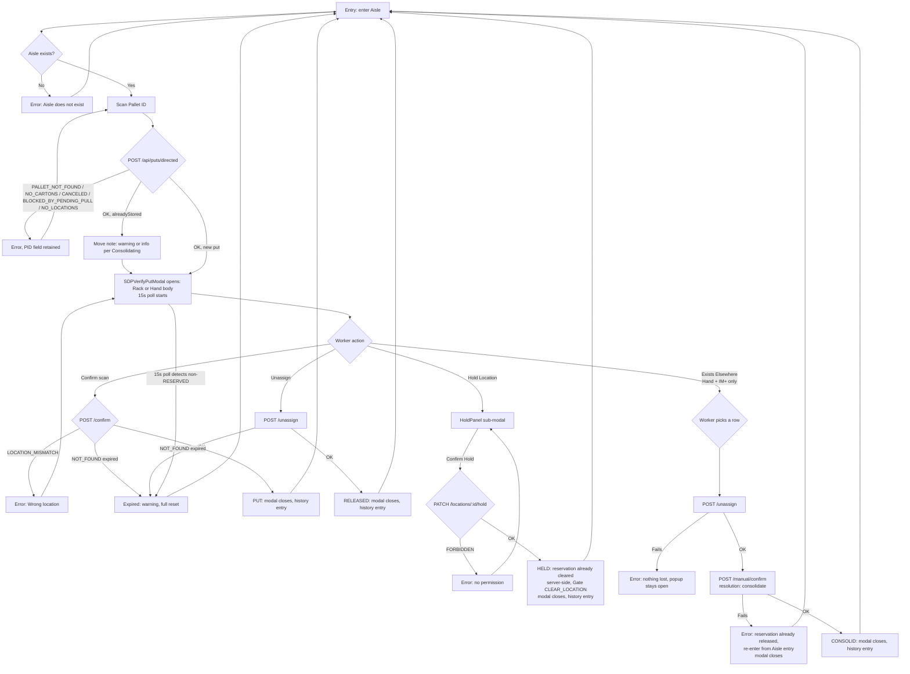

# Screen Design: SDP — System Directed Put

**Device:** Tablet — iPad Pro 13" landscape, fixed 1366×1024 canvas (kiosk).
**Bucket:** Existing Warehouse App (current production screen).
**Roles:** Worker, IM, Lead Worker, Manager, Admin. Every role can scan a pallet and complete a directed put; **Size** override is available to every role; **Storage Code** and **Zone** overrides, and the **Consolidating** toggle, are IM and above only (IM/Lead/Manager/Admin — "IM+" throughout).

## Flow

1. Worker lands on `/put/directed` in the **entry** state. Aisle may arrive pre-filled from router state (e.g. a row-select hand-off from SAR).
2. Worker enters/scans an **Aisle** (3 digits; a scanned location barcode is truncated to its leading 3 digits rather than rejected). On confirm, the aisle is validated to actually exist (`GET /api/locations/empty-by-zone`) before advancing.
   - 2a. Nonexistent aisle → error, field clears and refocuses.
3. IM+ users may optionally set **Size** (any role), **Storage Code** (IM+), and **Zone** (IM+) overrides, each independently "lockable" (🔒) to persist across multiple puts in the same session; IM+ may also toggle **Consolidating** (off by default). Size/Storage Code narrow to what's actually present in the entered aisle once Aisle is filled; Zone's dropdown is never narrowed. **(v1.7.0)** With a Size and/or Storage Code override entered, the "✓ Put"/"✓ Move" footer demo buttons now exclude pallets that already naturally match the entered override(s) from their random pick (`GET /api/demo/pallet`'s new `excludeSize`/`excludeStorageCode` params) — a demo pallet that already happened to be, say, a CR-M pallet wouldn't visibly demonstrate a CR/M override actually redirecting it anywhere. `excludeSize` only affects the Move button (an unlocated, not-yet-put pallet has no Size of its own to exclude on).
4. Worker scans/keys a **Pallet ID**. `POST /api/puts/directed` runs eligibility checks, resolves the effective Size/Storage Code/Zone (an explicit override always wins; otherwise falls back to the pallet's own inherited values, then the Item's intrinsic Storage Code), finds the next eligible location in the aisle, reserves it (`RESERVED` status + a `Reservation` row), and returns the directed location.
   - 4a. Pallet not found / no cartons / no open locations in aisle / blocked by a pending pull / canceled → error; Pallet ID field keeps its value (not cleared) so the worker can adjust Aisle/overrides and resubmit without re-scanning. Also picks up the app-wide red-wash treatment (v1.7.0 — see `DevNotes/DesignPrompts/Feature-8-AppWide-Invalid-Field-Wash.md`) via a `palletInvalid` flag, an individual wash shared by every one of these failure codes since they all leave the same field visible for the same retry. Aisle's own nonexistent-aisle error (2a) isn't washed — that field clears atomically instead, so there's no visible bad value to wash (same reasoning as PIP's PID/UPC/Location).
   - 4b. Pallet already stored somewhere (a move): succeeds normally; message bar shows a "directing as move" note — `warning` tone if Consolidating is off, `info` tone if on.
   - 4c. On success: `SDPVerifyPutModal` (GitHub #151) opens as a screen-blocking popup over the **directed** state — a real modal, not the old inline screen-lock. Back/Home/Jump/Logout are still disabled shell-wide via `useNavLock` for the duration (kept from the old behavior — the modal backdrop alone doesn't stop header taps). A 15-second poll against `GET /api/locations/{id}` starts, to proactively detect the server-side 5-minute reservation timeout. The modal has two bodies, chosen by the response's `directedLocationSize`: **Rack** (everything but XS) shows just Pallet ID/Item/DPCI/Confirm Location; **Hand** (XS) additionally shows a read-only **Carton Quantity** field beside Location, and an **Exists Elsewhere** button once a same-DPCI XS match elsewhere is found. Bulk Put has no modal body of its own — out of scope for #151.
5. Worker resolves the open modal one of up to four ways:
   - 5a. **Confirm** — scans/keys the directed location into the **Confirm Location** 3-box entry. `POST /api/puts/{id}/confirm` compares Aisle+Bin only (level is not checked — physical barcodes only encode Aisle+Bin). On match: pallet is stored (old location cleared atomically if this was a move), reservation deleted, modal closes and screen returns to entry.
   - 5b. **Unassign** — releases the reservation with no location scan required (`POST /api/puts/{id}/unassign`); the location reverts to `STAGED` if that's genuinely how it was found, otherwise `EMPTY`. Modal closes; Aisle/overrides retained, Pallet ID cleared.
   - 5c. **Hold Location** (#151 — replaces the old "Blocked Put" entirely) — opens a nested modal embedding the shared `HoldPanel` (same component PIP/MNP/WLH already use), targeting the currently-directed location. Placing any hold on a `RESERVED` location already clears it server-side as a side effect (`placeHold`'s Logic Gate `CLEAR_LOCATION` call, #149) — so once `HoldPanel` reports success, the modal just resets to entry. **No auto-continue to a new location** — this is a deliberate behavior change from the old Blocked Put, which always auto-re-reserved a replacement.
   - 5d. **Exists Elsewhere** (Hand Put only) — opens a popup listing every other same-DPCI XS location (location + current carton count), fetched via `GET /api/items/dpci/{dpci}/locations` (ISI's own endpoint) and filtered client-side to `size === 'XS'` and not the currently-directed location. Picking a row unassigns the original reservation, then calls `POST /api/puts/manual/confirm` with `resolution: 'consolidate'` at the picked location — sent immediately, no intermediate confirmation, since the picked row is already known to be a same-DPCI XS match. If the second call fails after the first succeeds, the pallet is left `PUT_PENDING` with no reservation; the modal closes with an error telling the worker to re-enter from Aisle entry.
6. **Reservation expiry** (5-minute server-side timer, checked via the 15s poll or surfaced reactively on the next confirm/unassign attempt returning `NOT_FOUND`) → modal closes, full reset to entry, warning message.
7. A right-column session history log tracks every reservation's outcome (`ASSIGNED`/`PUT`/`MOVE`/`RELEASED`/`HELD`) as it resolves.

### Mis-scan / error handling

- Aisle doesn't exist → error, field clears and refocuses.
- Pallet not found (`404 PALLET_NOT_FOUND`) → error, `"Pallet not found"`.
- Pallet has no stored cartons (`409 NO_CARTONS`) → error, `"Invalid Pallet: No Cartons"`.
- Pallet canceled (`409 CANCELED`) → error, `"Invalid Pallet: Canceled"`.
- Pallet has an open pull label against it (`409 BLOCKED_BY_PENDING_PULL`) → error, `"Invalid Pallet: Pull Pending"`.
- No eligible locations in aisle (`409 NO_LOCATIONS`) → error, `"No eligible locations available in aisle {aisle}"`.
- Non-IM supplying `storageCode`/`zone` → `403 FORBIDDEN` (not reachable through the UI itself, since those fields are hidden from non-IM roles).
- Confirm-location mismatch (`400 LOCATION_MISMATCH`) → error, `"Wrong location — directed to {directedLocation}"`; Confirm Location boxes clear/refocus, modal stays open.
- Reservation not found on either confirm or unassign (`404`) → treated as expiry, not a plain error — see Flow step 6.
- Hold Location placement forbidden for the current role (`403 FORBIDDEN`) → error inside the Hold Location sub-modal, which stays open (same `HoldPanel` behavior as PIP/MNP/WLH).
- Exists Elsewhere's unassign call failing → error, popup stays open, nothing lost (reservation still held) — retryable.
- Exists Elsewhere's `manual/confirm` call failing after its own unassign already succeeded → error naming the situation explicitly (nothing left to retry against), full reset to entry.

### Status / messaging behavior

- Errors persist until the next message-bar update; they are not auto-cleared.
- A successful Confirm shows `success`/`info` depending on whether the destination was already `STAGED` (the preferred outcome — green success) or fell through to `EMPTY` (blue info, with a "location was not staged" note) — per the SDP put hierarchy's rule 4.a.
- Move detection (pallet already stored) plays `warning` tone normally, `info` tone when Consolidating is on — same message text either way, tone is the only difference.
- Reservation-expiry messages always play `warning`.
- **(v1.7.0, issue #95)** A stale error also clears on the next successful action: `handleAisleConfirm`'s successful aisle-existence check and `handlePalletScan`'s success path (right after `setPalletInvalid(false)`) both now call `clearMessage()` — the latter can still be immediately overwritten by the `alreadyStored` info/warning message when that case applies, same tick, no visible flicker.

## Layout

```
┌──────────────────────────────────────────────────────────────────────────────────────┐
│ Header (104px): [Back]* [Home]* [Jump]*   System Directed Put   [Name]      [Logout]* │
│   * disabled/greyed while a reservation is active (nav-locked, modal or not)          │
├──────────────────────────────────────────────────────────────────────────────────────┤
│ Message Bar (74px): idle / error / warning / info / success text                      │
├───────────────────────────────────────────────────────────┬──────────────────────────┤
│ Content (792px)                                             │ Put History (456px)     │
│                                                              │                          │
│  Aisle [ 301 ]      Size [_]🔒  Storage [__]🔒  Zone [1]🔒   │  ┌────────────────────┐  │
│                     (Storage/Zone shown IM+ only)            │  │ PID 88213   PUT     │  │
│                                                              │  │ 030105-08  10:44a   │  │
│  [Consolidating]  Applying Constraints / Size M / Zone 2      │  └────────────────────┘  │
│                                                              │  ┌────────────────────┐  │
│  Scan Pallet ID [______________]  (disabled until Aisle set)   │  │ ...                 │  │
│                                                              │  └────────────────────┘  │
├───────────────────────────────────────────────────────────┴──────────────────────────┤
│ Footer (54px): [Numpad/Keyboard toggle]  [state-aware demo buttons]  [date/time]       │
└──────────────────────────────────────────────────────────────────────────────────────┘

  (once directed — SDPVerifyPutModal, screen-blocking popup over the above, #151)
  ┌────────────────────────────────────────────────────────────┐
  │  Pallet ID   88213                                          │
  │  Item        Widget, Blue, 12ct                             │
  │  DPCI        012-34-5678                                    │
  │  Move from   [ 030102-04 ]  (only if this is a move)        │
  │                                                              │
  │  Confirm Location            Carton Quantity   [Unassign]   │
  │  [Aisle][Bin][Lvl]            [ 14 ] (Hand only) [Hold Loc.] │
  │                                                              │
  │  [⇄ Exists Elsewhere]  (Hand only, shown once a same-DPCI   │
  │                          XS match elsewhere is found)        │
  └────────────────────────────────────────────────────────────┘
```

## Input handling

- Same `NumpadContext`/`useNumpadField` model as PIP: on-screen Numpad/Keyboard bound per-field, hardware scans delivered via `deliverScan()` to whichever field is focused.
- Aisle uses `useNumpadField('numpad', 3, true)` — the `true` pads a short entry on submit (typing "5" + OK is accepted as "005").
- Confirm Location is the shared 3-box `LocationEntryFields` (`size="large"` variant — larger box/text since Unassign/Hold Location sit beside it rather than below), rendered inside `SDPVerifyPutModal` (#151).
- Size/Storage Code use the shared code-picker fields (type a known code, or tap the chevron for a `{code} — {full name}` popup, narrowed to the entered aisle's actual codes); Zone is a plain 1–4 dropdown (never narrowed — no full-name disambiguation needed).
- **Screen-specific override — navigation lock.** `useNavLock(screenState === 'directed')` disables Back/Home/Jump/Logout shell-wide for the duration of an active reservation, regardless of whether the modal is open; this is enforced at the shared `LiveId` component level too (tapping a Pallet ID/Location ID chip elsewhere on screen, e.g. in Put History, does not navigate away while locked — see Behind the Scenes).
- **Hold Location** opens a further nested `ModalOverlay` embedding the shared `HoldPanel` on top of `SDPVerifyPutModal`; **Exists Elsewhere** similarly opens a nested `ModalOverlay` listing candidate rows. Both close back to the Verify-Put Modal (Hold Location's cancel path) or all the way to entry (successful placement/redirect).
- **(Feature 9, Phase 1)** The Pallet ID field's own demo footer content (entry state) is now the generalized Pallet ID Demo Scanner — ✓ Valid Pallet ID / Pallet ID by Status (Status dropdown, defaulting to **Put Pending**, plus Storage Code/Size filter dropdowns) / ✗ Invalid Pallet ID — owned internally by `PalletIdField`'s opt-in `demoScanner` prop, superseding the old dedicated ✓ Put/✓ Move/⚠ Invalid Pallet picker described below in the v1.1.0/v1.7.0 entries. The Location Confirm demo buttons (directed state: ✓/✗ Location) are unchanged and still screen-owned. **✓ Valid Pallet ID is aisle-aware on this screen specifically** (`PalletIdField`'s `demoAisle` prop, passed the currently-entered aisle) — it fetches a Put Pending pallet whose own Storage Code/Size will actually fit the entered aisle, restoring (via the current aisle rather than an exclude-override) the old dedicated buttons' "will actually succeed here" property that the initial Feature 9 migration below dropped. See `Documentation/Components/DemoScannerBar.md`.

## Data

**Reads:**
- `Location` (via `GET /api/locations/aisle-exists`) — to validate an entered aisle exists (Feature 10/#161 — see Change Log).
- `Location` (via `empty-by-zone`) — to narrow Size/Storage Code override options to the entered aisle.
- `Pallet` (by `pid`) — eligibility fields (`status`, `currentCartons`), inherited `storageCode`/`size`/`zone`, current location — via the shared `checkPalletEligibility` helper.
- `Container` — open (non-terminal) container count against the pallet, to detect `BLOCKED_BY_PENDING_PULL`.
- `Location` (candidate search) — `findNextLocation` reads `status`/`holdCategory`/`contraction`/`size`/`storageCode`/`zone` across the aisle to pick the next eligible spot.
- `Reservation` (by id) — read back on every confirm/unassign call to check it still exists and to retrieve its target fields.
- `GET /api/locations/{id}` — polled every 15s while directed, to detect expiry proactively.
- `GET /api/items/dpci/{dpci}/locations` (Hand Put only, #151) — ISI's own endpoint, fetched once per directed pallet to populate Exists Elsewhere; filtered client-side to `size === 'XS'` and not the currently-directed location.
- `GET /api/locations/{id}` (Hold Location, via the shared `HoldPanel`) — the location's current hold state, fetched by `HoldPanel` itself on mount.

**Writes:**
- `Location.status` → `RESERVED` on directed-put success; → `STORED` on confirm (with old location, if a move, atomically set to `EMPTY`); → `STAGED`/`EMPTY` on unassign (whichever it was genuinely found as); → `EMPTY` on Hold Location, as a side effect of `placeHold`'s Logic Gate `CLEAR_LOCATION` call (#149) rather than a write this screen makes directly; `holdCategory` → the picked hold type on Hold Location.
- `Reservation` — created on directed-put; deleted on confirm, unassign, and (indirectly, via the same Gate side effect) Hold Location — never updated in place. Exists Elsewhere deletes the original reservation via the same `unassignPut` call Unassign itself uses, then creates no new one (the redirect lands via `manual/confirm`, which doesn't reserve).
- `Pallet.locationAisle`/`locationBin`/`locationLevel`, `storageCode`/`size`/`zone`, `status`, `putByZ`/`putAt` — set on confirm (`placePallet`), copying the destination location's own Storage Code/Size/Zone onto the pallet as its new inherited values. Exists Elsewhere instead zeroes the source pallet (`ZERO_PALLET`, status `CONSOLIDATED`) and adds its quantity onto the occupant pallet at the picked location — the merge, not a location move.
- `ActivityLog` — `RESERVE` on directed-put; `PUT` on confirm (records `wasMove`, `clearedLocation`, `consolidating`, `wasStaged`, per-field verification method, and any IM+ override actually used); `UNASSIGN` on unassign; `HOLD_PLACE` on Hold Location (written by `placeHold`, not by this screen); `CONSOLID` on Exists Elsewhere (written by `manualConfirm`'s own consolidate branch, IM+ only — see Behind the Scenes).

**Not written:** The session-local Put History panel is client-side only, reset on navigation away — the `ActivityLog` is the durable record of the same events. A reservation that simply times out server-side writes no `ActivityLog` entry of its own (the timer-triggered clear function updates `Location.status` directly); the worker's own subsequent action against the dead reservation is what surfaces the expiry client-side.

## Screen Flow

Covers: aisle entry/validation, pallet scan success/eligibility failures, the move (already-stored) case under Consolidating on/off, the four Verify-Put Modal resolution paths (Confirm/Unassign/Hold Location/Exists Elsewhere, #151), Exists Elsewhere's role gate and second-call-failure edge case, and reservation timeout.


```mermaid
flowchart TD
    A[Entry: enter Aisle] --> B{Aisle exists?}
    B -->|No| A1[Error: Aisle does not exist] --> A
    B -->|Yes| C[Scan Pallet ID]

    C --> D{POST /api/puts/directed}
    D -->|PALLET_NOT_FOUND / NO_CARTONS / CANCELED / BLOCKED_BY_PENDING_PULL / NO_LOCATIONS| D1[Error, PID field retained] --> C
    D -->|OK, alreadyStored| E1[Move note: warning or info per Consolidating] --> F
    D -->|OK, new put| F[SDPVerifyPutModal opens: Rack or Hand body\n15s poll starts]

    F --> G{Worker action}
    G -->|Confirm scan| H{POST /confirm}
    G -->|Unassign| I[POST /unassign]
    G -->|Hold Location| N[HoldPanel sub-modal]
    G -->|Exists Elsewhere\nHand + IM+ only| O{Worker picks a row}

    H -->|LOCATION_MISMATCH| H1[Error: Wrong location] --> F
    H -->|NOT_FOUND expired| K[Expired: warning, full reset] --> A
    H -->|OK| L[PUT: modal closes, history entry] --> A

    I -->|NOT_FOUND expired| K
    I -->|OK| M[RELEASED: modal closes, history entry] --> A

    N -->|Confirm Hold| N1{PATCH /locations/:id/hold}
    N1 -->|FORBIDDEN| N2[Error: no permission] --> N
    N1 -->|OK| N3[HELD: reservation already cleared\nserver-side, Gate CLEAR_LOCATION\nmodal closes, history entry] --> A

    O --> P[POST /unassign]
    P -->|Fails| P1[Error: nothing lost, popup stays open]
    P -->|OK| Q[POST /manual/confirm\nresolution: consolidate]
    Q -->|Fails| Q1[Error: reservation already released,\nre-enter from Aisle entry\nmodal closes] --> A
    Q -->|OK| Q2[CONSOLID: modal closes, history entry] --> A

    F -->|15s poll detects non-RESERVED| K
```

## Behind the Scenes

**Directed-put location search.** `resolveEffectiveCriteria` computes Size/Storage Code/Zone once per request: an explicit IM+ override always wins; Size/Storage Code otherwise fall back to the pallet's own inherited values (set by `placePallet` on every prior completed put), and Storage Code has a third fallback tier — the Item's own intrinsic Storage Code — so a never-stored (`PUT_PENDING`) pallet still gets a real filter on its first put. Zone is only ever a *starting preference*: `findNextLocation` retries from Zone 1 if nothing eligible exists at or above the resolved zone. Within a zone, the fill order is deterministic (highest bin first, then lowest level, before stepping to the next-lower bin) — the same direction Stage Aisle fills from, so the two workflows land in the same aisle-half. STAGED locations are preferred over EMPTY ones unless `consolidating` is set, in which case STAGED is skipped entirely.

**Reservation as the lock primitive.** A `Reservation` row plus the target `Location.status = RESERVED` is what blocks any other worker's Directed Put from landing on the same spot — there's no separate mutex. Confirm/Unassign/Hold Location all operate by reservation id (Hold Location indirectly, via `placeHold`'s Gate side effect — see below), and all treat a missing reservation (`404 NOT_FOUND`) identically: it means the row is gone, either because the 5-minute timer function already cleared it or because it was already resolved by another action. The frontend distinguishes this from an ordinary error by resetting fully (`resetToEntry(true)`) rather than just re-prompting.

**Confirm's atomicity.** `placePallet` (shared with MNP) runs the old-location-clear and new-location-store as one `prisma.$transaction` — a pallet can never appear to exist in two locations at once, even momentarily, including on a crash mid-write. The confirmed level always comes from the Reservation record, never the scanned barcode (which only ever encodes Aisle+Bin) — SDP confirms Aisle+Bin only, unlike PIP's full Aisle+Bin+Level Location match.

**Hold Location needs no API call of its own (#151).** `SDPVerifyPutModal`'s Hold Location button embeds the shared `HoldPanel` exactly as PIP/MNP/WLH do, and `HoldPanel` always calls the same `PATCH /api/locations/:id/hold` regardless of which screen embeds it. `placeHold` (`api/functions/locations.ts`) already calls the Logic Gate's `CLEAR_LOCATION` (override `EMPTY`) whenever it places a hold on a `RESERVED` location — so by the time `HoldPanel`'s `onDone` fires, the Reservation this screen was tracking is already gone server-side. The modal's `onHoldDone` handler only needs to tag the history entry `HELD` and reset to entry; there's nothing left to release. This replaced the old "Blocked Put" entirely — Blocked Put's own re-search-and-re-reserve behavior (auto-continuing to a new location after placing Hold Both) has no equivalent today; Hold Location always stops and returns to entry.

**Exists Elsewhere's role gate.** Hand Put's "Exists Elsewhere" button only renders for IM+ (`SDPVerifyPutModal`'s own `isIM` check), even though Hand Put itself (via the Size override) is reachable by every role. This isn't a UI preference — `manual/confirm`'s `resolution: 'consolidate'` branch is hard-gated `requireRole(auth, 'IM')` server-side (`api/functions/puts.ts`, shared with MNP), so a Worker reaching this button would successfully unassign the original reservation and then get a `403` on the redirect call, orphaning the pallet as `PUT_PENDING` with no reservation. The frontend gate exists purely to keep the button from ever reaching a role that would fail on the second of its two calls.

**Navigation lock enforcement.** `useNavLock` disables the Header's own Back/Home/Jump/Logout, but a worker could otherwise navigate away via a tappable `LiveId` chip elsewhere on the page (the "Directed to"/"Move from" chips, or any Put History row). This was a real gap (fixed in v1.0.9) — the lock check now lives inside the shared `LiveId` component itself, so it applies everywhere `LiveId` is rendered, not just on SDP.

**Session persistence via `SDPContext`.** The directed pallet (`directed`, typed `SDPDirectedResult`: reservationId/directedLocation/directedLocationSize/pallet/alreadyStored) lives in `SDPProvider` (mounted in `App.tsx`, alongside all 12 sibling per-screen providers — `StagingProvider`/`PIIProvider`/`ISIProvider`/`LIIProvider`/`PIPProvider`/`MNPProvider`/`IIDProvider`/`PARProvider`/`WLHProvider`/`SARProvider`/`ELAProvider`/`ELZProvider`, all 13 now mounted together wrapping `AppShell`), not local component state, so navigating away from SDP and back restores the last-directed pallet instead of resetting to the empty entry state. The underlying `Reservation` this points at still expires server-side after 5 minutes regardless of navigation — a persisted-but-now-expired `directed` value isn't specially guarded against here, since SDPPage's *existing* expiry detection (the 15-second poll, plus the reactive 404 fallback on a confirm/unassign call) already handles a "resumed a now-expired reservation" exactly the same way it handles the in-session expiry case, so persistence doesn't introduce a new failure mode.

**Polling vs. reactive detection.** The 15-second poll (`GET /api/locations/{id}`, treating any non-`RESERVED` status as expiry) is a proactive convenience — the reservation would also be caught reactively the next time the worker tries to Confirm or Unassign and gets `NOT_FOUND`. The poll reads the *current* reservation via a ref on every tick (not a captured value).

## Open items still remaining

- [#88](https://github.com/BobbyJoeCool/PalletIQ/issues/88) — bad Contraction data on RS/RF/BS/some HS locations could incorrectly exclude otherwise-eligible locations from `findNextLocation`'s search (Contraction is a hard exclusion regardless of mode).

## Change Log

| Date | Change |
|---|---|
| 2026-08-01 (GitHub #151) | **Verify-Put Modal**: the old inline screen-lock (`screenState === 'directed'` disabling the page in place, red "Screen locked" banner) replaced by `SDPVerifyPutModal`, a real screen-blocking popup, ported into its own file. Two bodies, chosen by a new `directedLocationSize` field on `directedPut`'s response (free — it's exactly `effective.size`, already computed): **Rack** (non-XS) is unchanged Pallet ID/Item/DPCI/Confirm Location; **Hand** (XS) adds a read-only Carton Quantity field beside Location, and an **Exists Elsewhere** button (IM+ only — see Behind the Scenes) once a same-DPCI XS match elsewhere is found via ISI's own `GET /api/items/dpci/:dpci/locations` (no new endpoint). **"Blocked Put" removed entirely** (`blockPut` function + its route deleted from `api/functions/puts.ts`) — replaced by **Hold Location**, which embeds the shared `HoldPanel` (same component PIP/MNP/WLH use) and, unlike Blocked Put, does **not** auto-continue to a new location; it needs no API call of its own beyond `HoldPanel`'s existing `PATCH /hold`, since placing a hold on a `RESERVED` location already clears the reservation server-side (Logic Gate `CLEAR_LOCATION`, #149 — built in an earlier round, this is the first caller to depend on that specific side effect). `HistoryEntry.outcome`'s `'BLOCKED'` replaced with `'HELD'`. Confirm/Unassign are unchanged, just relocated into the new modal. Also fixed a same-session bug this rebuild surfaced: `pickCode`/`tapKeys`-based e2e coverage had never exercised Worker-role Hand Put, which is how `SDPVerifyPutModal` initially shipped with no role check on Exists Elsewhere despite `manual/confirm`'s `resolution: 'consolidate'` being IM+-only server-side — caught before ship via a live-browser walkthrough, not by the automated suite; a new Worker-role test now locks this in. |
| 2026-07-29 (direct instruction — data-integrity fix) | **Directed Put's location search now hard-rejects a pallet with no resolvable Size** instead of silently searching with no Size constraint at all. Storage Code was already always enforced (the Item's own intrinsic Storage Code is a guaranteed fallback); Size had no equivalent fallback, so a pallet reaching the search with a null own Size (and no override) previously matched *any* location regardless of its actual Size — meaning a location's Size stopped meaning anything the moment that happened. New `409 MISSING_SIZE` error (`resolveEffectiveCriteria` in `api/lib/zoneLogic.ts`, shared by `directedPut` and `blockPut`) — recoverable by any role via the existing Size override field, same as before. Message: "This pallet has no Size set — enter a Size override to continue." A pallet is expected to never actually reach this state going forward (Size is now mandatory at every pallet-creation path — see the Feature 9 follow-up entry below), so this is a fail-safe, not an expected everyday path. |
| 2026-07-29 (Feature 9, follow-up, direct instruction) | **✓ Valid Pallet ID** on this screen is now aisle-aware: it fetches a Put Pending pallet whose own Storage Code/Size matches one of the currently-entered aisle's actually-eligible locations, so a one-tap "Valid" demo pallet on SDP specifically will actually succeed when directed, restoring the property the plain Feature 9 migration below had dropped. New `aisle` query param on `GET /api/demo/pallet-status` (`samplePalletByStatus` in `api/functions/samples.ts`, mirrors `samplePallet`'s own aisle-eligibility logic exactly); `demoScanner.ts` gained `fetchValidPalletForAisle`; `DemoScannerBar` gained an `aisle` prop; `PalletIdField` gained a `demoAisle` prop threading it through, passed here as `aisleFields.field.value`. Every other Pallet ID field (PII/MNP, and this screen's own by-status popup) is unaffected — the popup's own Storage Code/Size filters remain the tester-driven equivalent, not aisle-scoped. |
| 2026-07-29 (Feature 9, Phase 1) | The entry-state ✓ Put/✓ Move/⚠ Invalid Pallet footer buttons (and the `demoPut`/`demoMove`/`pickInvalidPallet` handlers, `invalidPalletPickerOpen` state, and the `DemoPicker` import behind them) removed, replaced by `PalletIdField`'s new `demoScanner` opt-in — see Input handling above. The old aisle-constrained/override-excluded filtering those handlers did (`excludeStorageCode`/`excludeSize`, aisle-scoped picks) is **not** carried over: the generic Demo Scanner's Storage Code/Size filters instead let a tester pick the *starting* pallet's own native type directly, while this screen's own Size/Storage/Zone override fields remain the mechanism for redirecting that pallet elsewhere — same underlying capability, reached a different way. Location Confirm's own demo buttons are unaffected. |
| 2026-07-28 (Feature 10 / #161) | Internal-only, plus one minor deliberate behavior tightening: the Aisle field's existence check now uses the shared `useAisleField` hook, switched from `GET /api/locations/empty-by-zone` to the purpose-built `GET /api/locations/aisle-exists` (confirmed identical existence semantics). The one real behavior change: a transient network failure during the check now clears/re-focuses the field the same as a genuine not-found, rather than silently letting the worker proceed to Pallet ID — matches this hook's own (and PAR's pre-existing `checkAisleExists`) "any failure = invalid" convention instead of SDP's previous own narrower "only NOT_FOUND blocks" carve-out. |
| 2026-07-27 (Feature 10 / #158) | Internal-only: the Pallet ID box (`FieldDisplay`/`NumpadFieldBox`) replaced with the shared `PalletIdField` component, matching its existing 72px box size via override props. `handlePalletScan`'s own submit logic, disabled-until-Aisle-filled gating, screen-locked gating, and not-found/canceled/pull-pending/no-locations wash are all unchanged. |
| 2026-07-27 (Feature 10) | Internal-only: the Size/Storage override fields' aisle-narrowing now lives inside `SizeField`/`StorageCodeField` themselves (`aisle`/`storageCode` dependency props) instead of this screen computing narrowed options lists externally. No change to documented behavior. |
| 2026-07-27 | Fixed [#86](https://github.com/BobbyJoeCool/PalletIQ/issues/86) — `placePallet` (shared with MNP) now checks whether a second pallet still occupies a vacated location before clearing it, falling back to `STORED` instead of `EMPTY` if so. |
| 2026-07-27 | Fixed [#85](https://github.com/BobbyJoeCool/PalletIQ/issues/85) — the "✓ Location"/"✗ Location" Confirm Location demo buttons now gate on `LocationEntryFields`' own `onActiveChange` (mirroring PIP's existing `locationActive` pattern) instead of rendering as soon as `screenState` left `'entry'`, closing a race where a fast tap could fire before the panel's key handler was registered and silently drop the delivered value. |
| 2026-07-27 | Fixed [#83](https://github.com/BobbyJoeCool/PalletIQ/issues/83) — confirmed SDP's `directedPut` already returned a correct `404 PALLET_NOT_FOUND` (no FK write beforehand, unlike MNP's `manualScan`); this issue's SDP half wasn't actually reproducible as filed. |
| 2026-07-17 | Rebuilt to the new Screen-Design-Template format, documenting the screen as currently shipped (v1.6.6). The old `DevNotes/Screen-Specs/SDP.md` described a simpler "same-DPCI-in-aisle Zone lookup" and a plain always-EMPTY-vs-STAGED-agnostic search — both fully superseded by the v1.6.2 location-selection hierarchy rebuild; the old doc's `POST /api/puts/directed` response/error shapes and reservation-timeout polling description are also out of date relative to the live code. |
| 2026-07-14 (v1.6.2) | Directed Put's location search rebuilt around a real Storage Code/Size/Zone hierarchy (pallet-inherited values + Item fallback + IM+ override), replacing the old same-DPCI Zone lookup entirely. Worker role gained a Size override (Storage Code/Zone remain IM+ only). Reservation timeout detection made proactive (15s poll) instead of purely reactive. Releasing a reservation now restores `STAGED` (not always `EMPTY`) when that's how it was actually found. Confirm Location rebuilt as the shared 3-box entry. Fixed a silently-masked Prisma Client staleness bug that had been failing every real Directed Put, and a reentrant double-submit bug shared with PIP/PAR/LII/WLH. |
| 2026-07-13 (v1.5.0) | Consolidating/lock-toggle buttons enlarged for tap accuracy; "Applying: …" override summary added next to Consolidating. |
| 2026-07-10 (v1.3.1) | Directed Put now prefers `STAGED` locations over `EMPTY` ones when Consolidating is off (issue #79), so pallets land next to what a GPMer already staged for them instead of scattering into unrelated empties. |
| 2026-07-08 (v1.1.5) | IM+ Size override changed from a free-text-plus-quick-pick hybrid to a plain dropdown, matching the original spec exactly (deliberate behavior change, confirmed with the user — dropped free-text sizes outside the fixed list). Location display moved into a bordered box for visibility. |
| 2026-07-08 (v1.1.0) | Added an "Applying: …" override summary (clarifying overrides combine with AND, not last-one-wins) and fixed the "✗ PID" demo button showing a generic failure instead of "Pallet not found". |
| 2026-07-06 (v1.0.3) | Fixed the Consolidating toggle being silently ignored on the next pallet scan (stale-closure bug — `handlePalletScan` was registered once per entry into the `entry` state and never re-read a later toggle). |
| Initial build — v0.9.0 (2026-07-05) | System Directed Put: zone-aware location assignment with move/consolidation handling, screen-locked reservation flow with Confirm/Unassign/Blocked Put resolution paths.
