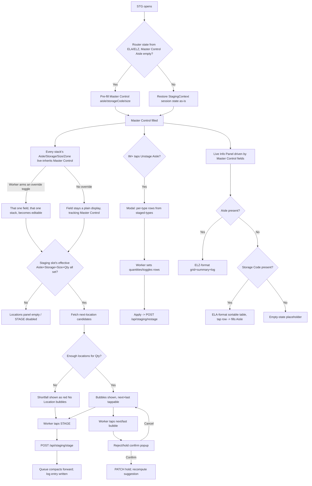

# Screen Design: STG — Stage Aisle

**Device:** Tablet — iPad Pro 13" landscape, fixed 1366×1024 canvas (kiosk).
**Bucket:** Existing Warehouse App (current production screen).
**Roles:** All roles for staging itself; **Unstage Aisle** and the Unstage/Restage modal's
Apply action are gated to IM, Lead, Manager, Admin (hidden from Worker). Clear Forks, each
stack's own Clear, and every per-field override toggle are available to every role (they
only touch local, unsubmitted entry fields, never anything already staged).

Route: `/stage` · Jump code: `STG` · Component: `src/pages/STGPage.tsx`

This is the most heavily-revised screen in the app — full graphic/layout redesigns
shipped in v1.3.0 (single front-stack), v1.4.1 (reverted to three independent stacks),
v1.6.6 (fork-graphic/Master-Control/per-stack reorganization), and v1.7.2 (per-field
override of Master Control's inherited values, issue #99). Everything below describes the
**current, v1.7.2 end state**; see the Change Log for the lineage.

## Concept: Stack Queue (On Deck / Next / Staging)

STG models a fork-truck "triple" carrying up to three independent pallet stacks at once.
Each stack is a slot — **On Deck** (leftmost, closest to the mast/operator), **Next**
(middle), **Staging** (rightmost, "the end of the forks," closest to the Locations
panel) — holding its own Aisle/Storage Code/Size/Quantity. Only the **Staging** slot
(index 0 in `StagingContext`) ever computes destination locations or can be staged;
On Deck/Next are pure data entry for what's queued up behind it.

**(v1.7.2, issue #99)** Each stack's own Aisle/Storage Code/Size is no longer independent
local state by default — it *live-inherits* Master Control's current value continuously,
automatically, with no button, unless a worker explicitly arms a per-field override toggle
(one each for Aisle/Storage Code/Size — three per stack) for that one stack. An overridden
field becomes a normal editable box again (pre-filled with Master Control's value at the
moment it was armed) and, as of GitHub #156, is auto-focused the instant it's armed — a
single tap on the field (not the small OVERRIDE toggle) both arms the override *and* opens
the input panel in one action, rather than requiring a first tap to arm and a second to
actually start typing. Disarming reverts to a plain display of whatever Master Control
currently holds. Since an override (a boolean flag plus its own value) is stored directly
on the stack's own state, it rides along automatically through `compactStacks`/
`resetStackAfterStage` below — no separate position-indexed override tracking was needed
for an override to "travel down the forks" as the queue advances. This replaced the old
Fill All/per-stack Fill buttons entirely (removed — inheritance no longer needs a manual
trigger). **(GitHub #192)** Zone joined this same inherit-unless-overridden shape — Master
Control gained its own optional Zone control (previously only the per-stack override
existed, with nothing at Master Control to inherit from); see the Master Control bullet
below.

When Staging stages and clears, the queue **compacts forward**: whichever of Next/On Deck is filled slides
all the way into Staging, skipping past an empty slot in between if one exists (e.g. if
Next is empty but On Deck has data, On Deck jumps straight to Staging). If nothing was
queued behind it, the newly-emptied Staging slot inherits the just-staged stack's own
Aisle/Storage Code/Size for convenience (a repeat stage into the same aisle/type then
only needs a new Quantity). **(v1.7.0)** When there *was* something queued behind it,
each of Aisle/Storage Code/Size — independently — carries forward into whatever slot the
compaction newly opens up, but only if all three stacks (Staging, Next, On Deck) held the
*exact same value* for that field before staging (e.g. all three on Storage Code CR but
different Sizes persists only CR, not a Size). **(v1.7.2)** Since a non-overridden field
is already identical across all three stacks automatically (they all live-inherit the
same Master Control value with no code needed), this carry-forward now only ever fires
for a field all three stacks happen to independently *override* to the same custom
value — and, when it does, carries the override flag itself forward too, not just the
value, so the newly-opened slot correctly stays overridden rather than silently reverting
to inheritance. Distinct from the "nothing queued behind it" case just above, which always
persists every one of the staged stack's own fields (and override flags) regardless of
whether Next/On Deck had anything to compare against. See `compactStacks` and
`resetStackAfterStage` in `src/context/StagingContext.tsx`.

This queue — plus **Master Control** (a separate, independent Aisle/Storage Code/Size
used to drive the Live Info Panel below, and live-inherited by every stack's own fields
per the override model above) and the session's staging **Log** — is held in
`StagingContext`, mounted once app-wide (in
`App.tsx`, not on this page), so navigating away from STG and back restores the forks
exactly as left. State clears only when the authenticated route tree unmounts (logout).

## Flow

1. Worker opens STG directly, or arrives pre-populated from ELA's/ELZ's "Stage Aisle"
   button (`{ aisle, storageCode, size? }` in router state). Pre-population **only ever
   fills Master Control** (never a fork/stack slot directly) and only applies once per
   navigation, gated on Master Control's own Aisle still being empty (v1.6.4 — see
   Behind the Scenes).
2. **Master Control** (top bar): worker fills Aisle (3-digit numpad, auto-commits/pads),
   Storage Code and Size (both `CodePickerField`-family, `strict` — a value typed that
   isn't actually valid clears itself and posts `"Master Control - Storage Code/Size -
   Invalid Entry"`), and **(GitHub #192)** an optional **Zone** (`ZoneField`, 1-4, also
   `strict`). Note: Storage Code validates against the codes narrowed to the *current*
   Aisle (`strictToAisle`) — with no Aisle yet, that narrowed list is empty rather than
   "still loading," so a Storage Code typed before an Aisle is entered is rejected
   regardless of its own validity; fill Aisle first to avoid this, even though Storage
   Code sits to its left in the layout. These four fields independently drive the **Live
   Info Panel** at the bottom of the screen (see step 6; Zone does not affect the panel),
   and are live-inherited by every stack box that isn't individually overriding a given
   field (see step 3). Zone has no bearing on Storage Code/Size validity or the Live Info
   Panel — it only ever affects the Staging slot's own destination-location search (see
   step 4): staging begins in that zone, then continues to the beginning of the aisle
   (bin 1) without restarting in zones already covered, identical to the per-stack Zone
   override's own established behavior (both now flow through the same
   `effectiveStack().zone` — see `src/lib/stagingHelpers.ts`).
3. **(v1.7.2, issue #99; Zone joined in GitHub #192)** Each of the three stack boxes
   (**On Deck**, **Next**, **Staging**, left to right) shows its own Aisle/Storage
   Code/Size/Zone as a plain, non-interactive display of Master Control's current value by
   default — no fill step needed, it just tracks Master Control live. Next to each of the
   four fields is a small override toggle; tapping the *field itself* (not just the
   toggle) arms that one field for that one stack only — pre-filling it with Master
   Control's value at that moment, turning it blue, and (GitHub #156) auto-focusing it so
   the input panel is already open and ready to type into, no second tap needed — so the
   worker can enter a different value for just that field on just that stack, independent
   of Master Control and the other two stacks. Tapping the toggle again disarms it,
   reverting to the plain inherited display. Quantity is unaffected by any of this — it's
   always its own direct entry field, never inherited from anywhere.
   - Each stack's own **Clear** pill (now sharing Quantity's row, to its left), or the
     Cab's **Clear Forks** button — clears that one stack's (or all three stacks')
     Aisle/Storage Code/Size/Zone/Quantity/computed locations and disarms any active
     overrides; never touches Master Control. (GitHub #156 — Clear Forks had drifted to
     omit Zone/zoneOverride, the only one of the four override pairs it was missing; fixed
     to match the single-stack Clear, which already reset it correctly.)
4. Once the **Staging** slot's Aisle + Storage Code + Size + Quantity are all filled, the
   **Locations panel** (right of the stack boxes) fetches and displays up to Quantity
   destination locations as tappable bubbles (`{Aisle}-{Bin}-{Level}` format), laid out
   into 1/2/3 columns depending on count, sized dynamically to fill the panel's own
   measured space. If fewer locations are available than Quantity, the shortfall renders
   as red "No Location" bubbles — staging is still permitted for whatever is available.
5. Worker taps **STAGE** (only enabled once Staging's four fields are filled and at
   least one location is available): calls `POST /api/staging/stage`, marking every
   listed location `STAGED`, writing a log entry, and fetching a next-location
   look-ahead for that log entry's text. On success, the Staging slot clears and the
   queue compacts forward per the Concept section above.
   - 5a. If fewer locations were available than requested, the message bar shows a
     warning and the log entry is flagged; staging still proceeds for what was found.
6. **Live Info Panel** (below the stack-box row, full width): driven purely by Master
   Control's own Aisle/Storage Code/Size —
   - Nothing filled, or only Size filled → empty-state placeholder.
   - **Aisle present** (alone or with Storage Code/Size) → the literal ELZ display format
     (grid + zone summary), read-only, plus the session's own staging Log rendered inline
     in the space beside the zone summary. If every location in the aisle is `XS`, shows
     *"Cannot stage XS aisles"* instead.
   - **Storage Code present without an Aisle** (alone or with Size) → the literal same
     sortable `AisleSizeTable` ELA's own page uses; tapping a row commits that Aisle
     straight to Master Control (no separate confirm button, unlike ELA's own
     toggle-then-navigate flow).
7. **Log panel** — collapsed strip pinned to the bottom of the content slot, showing the
   most recent log entries; only rendered here while Master Control's Aisle is empty
   (once an Aisle is entered, the Log renders inline inside the Live Info Panel's own
   zone-summary column instead, so it never shows twice). Tapping either variant opens a
   full scrollable modal of the whole session's log.
8. **Refresh** (Master Control, right side) — manually re-triggers the Live Info Panel
   and the Staging slot's own location suggestion, independent of the automatic
   field-commit-triggered refresh.
9. **Unstage Aisle** (IM+ only, Master Control left side, red outline) — opens a modal
   listing every freight type currently present in the aisle (empty, staged, *or*
   already `STORED`), one row per type, each with an active/inactive toggle (the
   Storage-Code-Size bubble itself is the toggle), a Quantity field (numpad, clamped to
   that row's `empty + staged` max), a Max button, and a Clear Restage button. **Apply**
   clears every active row's currently-STAGED locations of that exact type, then stages
   the first `quantity` EMPTY locations of that type from the back — logged as one
   combined "restage" entry, reported in the message bar as a per-type summary (e.g.
   `"Cleared CR-M · Restaged 6 CR-L"`).
10. **Location suggestion reject/hold flow** — **every** bubble in the Staging slot's
    suggested-location queue is a tap target (v1.7.0, issue #97 — previously only the
    first bubble and the final/green bubble were tappable, per #77; reversed since
    rejecting any bubble always triggers the same full server-side re-suggestion
    regardless of which position was rejected, so there was never a queue-compaction
    reason tied to position). Tapping a bubble does **not** stage anything: it opens a
    confirmation popup ("Reject suggested location?") defaulting the reason code to
    `B05` ("Blocked", editable via the shared `ReasonCodeField` — an entry-with-dropdown-
    helper field as of v1.6.7, not a plain dropdown; type a code or tap the chevron for a
    popup of known ones).
    Confirming places a Hold Both on that location and recalculates a new suggestion.
    Cancelling leaves the original suggestion untouched. If no valid location remains
    after a rejection, the message bar reports `"No valid location available to
    suggest"`. The final/green bubble (Quantity fully satisfied) keeps its distinct green
    styling — every other bubble, including the first, shares the same blue style.

### Mis-scan / error handling

- A typed Storage Code, Size, or Aisle (on any stack, or on Master Control) that isn't
  actually valid **stays in the field** (fixed 2026-07-27, issue #109 — previously
  cleared itself; see below) and posts `"{Stack} Stack - Storage Code/Size/Aisle -
  Invalid Entry"` (or `"Master Control - ..."`) in the message bar. Per-stack Storage
  Code/Size validation (`strict`) is skipped while the narrowing reference data (the
  stack's own Aisle's freight types, or the full Storage Code list) hasn't loaded yet, so
  a value typed before that data arrives isn't falsely rejected.
  **App-wide red-wash, issue #109 (2026-07-27):** every field on this screen now picks up
  the red-wash treatment (`DevNotes/DesignPrompts/Feature-8-AppWide-Invalid-Field-Wash.md`),
  the last screen to get it. This previously wasn't possible — every field cleared itself
  atomically on an invalid entry, so there was never a moment where a bad value sat
  visibly in a box to wash (the same finding MNP was separately audited-and-correctly-
  skipped for). Rather than leave STG skipped too, the underlying clear-on-invalid
  behavior itself was fixed: `useCodePickerField`'s strict-mode reject path no longer
  calls `field.clear()` by default (a new opt-in `clearOnInvalid` flag exists for a future
  caller that specifically wants the old wipe behavior; nothing currently uses it), and
  per-stack/Master Aisle's own free-text existence check no longer clears on failure
  either. `PalletBox`/`PalletCodePicker` both gained an `invalid` prop applying
  `INVALID_WASH`, driven by new per-field state (`aisleInvalid`/`storageInvalid`/
  `sizeInvalid`/`zoneInvalid` per stack, plus Master Control's own `storageInvalid`/
  `sizeInvalid`) that's set by the failing handler and cleared on the next successful
  commit or by arming/disarming that field's override. ELA's Workstation field (the only
  other screen using `strict` mode) got the equivalent treatment in the same pass, to
  avoid a stale-unstyled-value regression from the shared hook's new default.
- A per-stack Aisle that doesn't actually exist (checked live against `GET
  /api/locations/empty-by-zone`) stays in the field, washed red, with `"{Stack} Stack -
  Aisle - Invalid Entry"`.
- Insufficient destination locations for the requested Quantity → shortfall renders as
  red "No Location" bubbles; staging still proceeds for whatever is available, and the
  post-stage message bar/log both report the shortfall as a warning.
- API failure on stage/restage/hold → message bar `"Staging failed"`/`"Restage failed"`/
  `"Hold placement failed — please try again"`; nothing is mutated.

### Status / messaging behavior

Message bar text persists until the next `setMessage` call replaces it (no auto-clear).
Successful stage/restage/hold actions also always play an audio tone (`playAlert('info'
| 'warning' | 'error')`) and write a log entry, independent of the message bar text.

**(v1.7.0, issue #95)** A stale error also clears on the next successful aisle confirm —
per-stack `handleAisleConfirm` now calls `clearMessage()` right after its
`empty-by-zone` existence check succeeds, so a prior invalid-entry error doesn't linger
through a subsequent valid one.

## Layout

```
┌──────────────────────────────── Header (104px) ─────────────────────────────────┐
├────────────────────────────── Message Bar (74px) ────────────────────────────────┤
├──────────────────────────── Content slot (792px) ────────────────────────────────┤
│              Master Control                                                     │
│ [Unstage▲]        [Storage▾][Aisle][Size▾][Zone▾]         [Refresh]             │
│ ┌────────────────────────────────────────────┐ ┌─────────────────────────────┐  │
│ │ [Cab img]│ On Deck │  Next  │ Staging(blue) │ │ Locations                   │  │
│ │ Clear    │[Ovr]Aisle│[Ovr]Aisle│[Ovr] Aisle  │ │  (bubbles, 1-3 cols,        │  │
│ │ Forks    │[Ovr]Zone │[Ovr]Zone │[Ovr]  Zone   │ │   dynamic size)           │  │
│ │          │[Ovr]Storag│[Ovr]Storag│[Ovr] Storage│ │                             │  │
│ │          │[Ovr]Size │[Ovr]Size │[Ovr]  Size   │ │                             │  │
│ │          │┌────────┐│┌────────┐│┌────────────┐│ │        [STAGE]              │  │
│ │          ││Clr│ QTY ││Clr│ QTY │Clr│   QTY    ││ │                             │  │
│ │          │└────────┘│└────────┘│└────────────┘│ │                             │  │
│ │──────────┴─────────┴────────┴───────────────│ └─────────────────────────────┘  │
│ │           (forks strip graphic, shelf)       │                                │
│ └───────────────────────────────────────────────────────────────────────────────┘  │
│ ┌───────────────────────────────────────────────────────────────────────────────┐  │
│ │ Live Info Panel: ELZ-format grid+summary+log (Aisle present)                 │  │
│ │        — or —  ELA-format sortable aisle table (Storage Code only)          │  │
│ │        — or —  empty-state placeholder                                      │  │
│ └───────────────────────────────────────────────────────────────────────────────┘  │
│ [ Log strip — only rendered while Master Control's Aisle is empty ]              │
├──────────────────────────────── Footer (54px) ───────────────────────────────────┤
└───────────────────────────────────────────────────────────────────────────────────┘
```

Note: On Deck/Next render at the two leftmost stack positions and Staging at the
rightmost (closest to the Locations panel) — index 2/1/0 left-to-right in code terms,
matching "front of the forks = furthest from the operator" regardless of the graphic's
own flipped orientation.

## Input handling

- **Master Control Aisle** and each **stack's Aisle** (only rendered as an editable field
  while overridden — issue #99; a plain display otherwise): numpad-driven
  (`useNumpadField`), 3-digit auto-commit/pad (Master Control) or plain confirm-driven
  (stack boxes, via `handleAisleConfirm`, which also validates existence).
- **Master Control Storage Code/Size/Zone** and each **stack's Storage Code/Size/Zone**
  (same overridden-only rendering rule): all use the type-or-tap-chevron code-picker
  pattern — Master Control via the shared `StorageCodeField`/`SizeField`/`ZoneField`
  components (GitHub #192 added Zone); each stack via a local `PalletCodePicker` (a
  dedicated reimplementation of the same field+popup logic inside the pallet-slat visual
  chrome `PalletBox` uses, since `CodePickerField`'s own `size` variants don't match that
  box's rounding/height/label position). All are `strict` once their narrowing data has
  loaded (Zone never narrows by aisle — always the fixed 1-4 list).
- **Each field's override toggle** (issue #99; Zone joined in GitHub #192): a plain tap,
  no numpad/keyboard involved — arms/disarms that one field's override for that one
  stack. Tapping the field itself (not just the toggle) also arms it, and — GitHub #156 —
  auto-focuses the field the same tap opens, via each field's own `autoFocus` prop
  (`PalletBox`/`PalletCodePicker`), which fires the field's normal focus handler once on
  mount (i.e. exactly when the override just switched on and the box swapped in from
  `InheritedDisplay`).
- **Quantity** (each stack) and **Unstage/Restage's per-type Quantity**: plain numpad
  fields.
- Physical barcode scanner input (`deliverScan()`) is available as a shared app
  capability but has no STG-specific scan target — this screen has no location/pallet
  barcode field of its own to scan into.
- All primary tap targets (Unstage Aisle, Clear Forks, per-stack Clear, location bubbles,
  STAGE, Refresh) meet or exceed the app's 72px minimum touch-target height where they're
  a primary action; the per-stack Clear button, override toggles, and PalletBox/
  InheritedDisplay fields are deliberately compact (this screen packs far more controls
  into one row than any other screen) but remain individually tappable at their rendered
  size.

## Data

**Reads:**
- `Location.aisle/.bin/.level/.zone/.storageCode/.size/.status/.contraction/.holdCategory`
  — read across `GET /api/staging/next-location` (candidate search),
  `GET /api/staging/staged-types` (Unstage/Restage row set),
  `GET /api/locations/empty-by-zone` (Live Info Panel's ELZ mode, per-stack Aisle
  validation, and `useAisleFreightTypes`'s dropdown narrowing),
  `GET /api/locations/empty-by-aisle` (Live Info Panel's ELA mode).
- `StorageCode.id`/`.desc` — full reference list for un-narrowed popups.

**Writes:**
- `POST /api/staging/stage` — sets `Location.status: 'STAGED'` on every location in the
  submitted `locationIds` list (re-validated as still `EMPTY`+non-contracted at write
  time; a location that no longer qualifies is silently skipped and counted toward
  `shortfall` rather than failing the whole request). Writes one `ActivityLog` `STAGE`
  entry per successfully staged location, plus one combined `STAGE_SUM` entry for the
  whole action.
- `POST /api/staging/restage` — for each active freight type: clears every currently
  `STAGED` location of that exact type back to `EMPTY`, then stages the first `quantity`
  `EMPTY` locations of that type from the back. Writes per-location `STAGE` entries
  (method: `RESTAGE`) plus one combined `RESTAGE` `ActivityLog` entry for the whole
  action. IM+ only (`requireRole(auth, 'IM')`, 403 otherwise).
- `PATCH /api/locations/:id/hold` (reused, not STG-specific) — sets `holdCategory:
  'HOLD_BOTH'` on the rejected location with the chosen reason code, via the reject/hold
  flow.

**Not written:** Master Control's own Aisle/Storage Code/Size/Zone, and every stack's own
Aisle/Storage Code/Size/Zone/Quantity/override flags (issue #99; Zone since GitHub #192),
live only in client-side
`StagingContext` (session state) — nothing about "what's currently queued on the forks"
is persisted server-side until a `STAGE`/`RESTAGE` call actually commits a location's
status change. The staging Log is likewise session-local and not the same thing as the
app-wide 12-hour Activity Log overlay (both exist independently).

## Screen Flow

Covers: pre-population from ELA/ELZ, live inheritance / per-field override / Clear Forks /
per-stack Clear, Staging-slot location computation and shortfall, Stage → queue
compaction, Unstage/Restage (IM+), reject/hold flow, Live Info Panel's three display
modes, field validation errors.



## Behind the Scenes

**Per-field override / live inheritance (F/G/H, issue #99; Zone joined in GitHub #192):**
Every consumer of a stack's Aisle/Storage Code/Size/Zone — the field itself, Storage/Size
dropdown narrowing, the Staging slot's location fetch, the Stage submission,
`UnstageModal`'s aisle fallback — reads `effectiveStack(stack, master)`
(`src/lib/stagingHelpers.ts`), never the stack's raw `aisle`/`storageCode`/`size`/`zone`
fields directly. `effectiveStack` returns Master Control's current value for any field not
overridden, the stack's own stored value for any field that is — this is the entire
mechanism; there's no separate "sync" step or effect propagating Master Control's changes
outward, since every read already resolves live. Arming an override
(`aisleOverride`/`storageCodeOverride`/`sizeOverride`/`zoneOverride`, one boolean per field
on `StackState`) pre-fills the stack's own field with Master Control's value at that
instant; disarming clears it back to `''` (unused while not overridden, but cleared anyway
so a stale value never quietly resurfaces the next time the override arms again). Before
GitHub #192, Zone was the one field of the four with nothing at Master Control to inherit
from (`effectiveStack`'s zone branch always resolved to `''` unless the stack's own
override was armed) — Master Control's Zone control brought it in line with the other
three.

**Auto-focus on arm (GitHub #156):** arming an override via `InheritedDisplay`'s own tap
(`onActivate`) only ever flips the boolean — it has no way to focus the *different*
component that renders in its place once the override is on (`PalletBox` for Aisle,
`PalletCodePicker` for Storage/Size/Zone). Each of those two components instead takes an
`autoFocus` prop, passed `true` only at the four per-stack override call sites (never at
Master Control's own, always-mounted fields), and fires its normal focus handler in a
`useEffect` with an empty dependency array — meaning it fires exactly once, right when
React swaps `InheritedDisplay` out for the real field on the override turning on, since
that's a genuine mount for a component that wasn't there a render ago. A worker (or a
Playwright helper) tapping the field only once now both arms the override and lands ready
to type, instead of silently requiring an unnoticed second tap.

**Override toggle placement and row sizing (issue #99, direct-instruction follow-up to
the initial build):** each field's override toggle renders to the *left* of the field it
controls (not the right), spelled out as "Override" rather than an icon, wide enough to
read at a glance. Qty's own row is `flex-[2]` while Aisle/Storage/Size stay `flex-1` — Qty
deliberately absorbs the vertical space the old Fill/Clear row used to occupy (now that
Fill is gone) instead of that space just disappearing, so Qty ends up twice the height of
the other three fields; Clear (sharing that row, to Qty's left) and Qty's own label/value
text are both sized up to match (double the 9px/15px every other field still uses) so
they read proportionally, not lost in the taller box.

**Pre-population gate (B/C):** The pre-fill effect checks `!state?.aisle || master.aisle`
— it only ever applies once per navigation, using Master Control's own empty Aisle as the
"not yet applied" signal, and never writes to any stack slot directly (v1.6.4 product
decision, reversing v1.4.1's "auto-fill all three slots" behavior — see
`DevNotes/Fixes/ELA/03` and `STG/05`).

**Queue compaction (Q):** `resetStackAfterStage` clears index 0, then calls
`compactStacks` on `[empty, prev[1], prev[2]]` — compaction is a pure re-derivation from
"whichever slots are non-empty," not a persisted slot identity, which is what makes
"On Deck slides straight to Staging if Next is empty" fall out for free rather than
needing special-case logic. If the whole queue is now empty, the new Staging slot
inherits the just-staged Aisle/Storage Code/Size (not Quantity) for staging convenience.

**Location list fetch (K):** `GET /api/staging/next-location` takes a `count` param
(added v1.4.2/#75) so the server walks the bin/level cursor internally in one round trip
instead of the frontend issuing one HTTP call per pallet in Quantity — this was the fix
for a previously slow-feeling automatic refresh on every field commit.

**Dynamic bubble sizing (L/N):** Column count buckets off total bubble count (≤4 → 1
column, ≤8 → 2, else 3). Each bubble's width/height is computed from the Locations
panel's own `ResizeObserver`-measured content-box size, *minus* the actual rendered gap
space between columns/rows, divided by column/row count, then clamped to width ∈
[1/3, 1/2] and height ∈ [1/5, 1/3] of that gap-adjusted space. Two real bugs were fixed
getting here (both documented inline in `STGPage.tsx`): (1) the Locations panel's own
height was only ever set via flex `items-stretch`, making it a function of its own
bubble sizes — which were in turn computed from that same measured height, a closed
loop that grew bubbles without bound at 3+ pallets; fixed by anchoring the panel's height
to the (genuinely content-independent) Master-Control-plus-graphic column via
`useElementSize`/an explicit `height` prop. (2) the sizing math initially divided the
raw measured size by column/row count without subtracting the actual `gap-2`/`gap-1.5`
rendered between bubbles, so N bubbles + gaps summed to more than the container's real
size, clipping the last row/column.

**Stage write (O/P):** `stageLocations` re-validates every submitted location as still
`status: 'EMPTY', contraction: false` at write time (not just at candidate-fetch time) —
a location that another worker staged into in the meantime is silently skipped and
counted toward `shortfall`, not treated as a hard failure of the whole request. One
`STAGE`-type `ActivityLog` row is written per successfully staged location (not one
combined row) specifically so SAR's "Staged Longest" report column can query
per-location staged timestamps without re-parsing a JSON blob.

**Unstage/Restage (U-X):** `getStagedTypes` (v1.6.6) unions `EMPTY`+`STAGED`+`STORED`
rows so a freight type appears as a row even if nothing of it is currently staged yet
(broadened from STAGED-only, since this endpoint has exactly one caller — this modal —
so the contract was safe to change in place). `restageAisle` requires IM+
(`requireRole(auth, 'IM')`); a type simply absent from the submitted `types` array is
left completely untouched (not cleared, not restaged).

**Reject/hold flow (R/S/T):** Calls the same `PATCH /api/locations/:id/hold` endpoint
WLH uses, with `holdType: 'HOLD_BOTH'` — no STG-specific hold endpoint exists. The
`expectingSuggestionRef` flag is set right before the recompute this triggers, so only
*that* specific fetch resolution (not an ordinary shortfall from a large Quantity) is
allowed to report "No valid location available to suggest" as an error.

**Live Info Panel modes (Y-AD):** `InfoPanel`'s `mode` is purely `aisle ? 'elz' : storageCode
? 'ela' : 'none'` — Size alone never changes the mode. The `elz` branch additionally
special-cases an all-`XS` aisle (checked against every cell in the grid response, not
just the narrowed summary) to show "Cannot stage XS aisles" instead of rendering the
grid — since staging can't target XS locations at all. The `ela` branch renders the
literal same `AisleSizeTable` component ELA's own page uses (extracted in v1.6.6 so the
two can never diverge into two different sort implementations); tapping a row here
commits straight to `setMaster({ aisle })` rather than ELA's own select-then-navigate
flow, since there's no second screen to jump to from inside STG.

**Log panel dual rendering (7):** Rendered as the bottom-pinned `LogPanel` (`variant:
'bottom'`) only while Master Control's Aisle is empty; once an Aisle is entered, an
`inline`-variant `LogPanel` renders instead, inside `ElzFormat`'s own zone-summary
column — this is a deliberate v1.6.6 change to fill space that would otherwise sit empty
next to the zone summary, not a bug where the log renders twice (it's the same
`LogExpandedModal` either way when tapped).

## Open items still remaining

- **GitHub #88** — bad Contraction data (every RS/RF/BS location, plus some HS locations
  on Levels 2-9, incorrectly flagged as contracted) shows as incorrectly
  blocked/red/non-stageable on STG's own embedded Zone Map. Cross-referenced under ELZ
  too. Needs a data correction, not a code fix.
- **App-Wide v1.7.0 backlog items relevant to STG:**
  - Add whole-level Contraction support (mark an entire level contracted at once) — today
    per zone-side/level cell only.
  - Activity Log detail-line rework for STG-specific entries (staged/unstaged counts per
    freight type) is still on the app-wide backlog, separate from STG's own session-local
    Log panel described above.
  - Reason codes (used by the reject/hold flow's dropdown) don't yet match the documented
    Department+Code scheme — no DB-backed `HoldType` table or per-role department
    restriction (GitHub #84, flagged as needing a product conversation before any code
    change).
  - "Add screen persistence across the app" is partially already true for STG (via
    `StagingContext`, mounted app-wide) but the item as filed is broader than STG alone.
- **GitHub #83/#85/#86** (SDP/MNP-focused, not STG-specific) are adjacent but do not
  touch this screen's own code paths.
- No STG-specific open fix-list items remain from the v1.6.6 round itself — all 7
  original items plus several found live were shipped in that version (see Change Log).
  Remaining open STG-tagged work is tracked as GitHub Issues (see this repo's
  [open issues](https://github.com/BobbyJoeCool/PalletIQ/issues)) — `DevNotes/Fixes/
  MASTER-CHECKLIST.md` was retired 2026-07-24.

## Change Log

| Date | Change |
|---|---|
| 2026-07-31 (#192) | Master Control gained its own optional Zone control (`ZoneField`), mirroring the per-stack Zone override that already existed — previously Master Control had no Zone at all, so a non-overridden stack's Zone always resolved to "no restriction." `effectiveStack`/`StagingContext`'s `master` state extended to carry `zone`; arming a per-stack Zone override now pre-fills from Master Control's current Zone, matching Aisle/Storage/Size's existing pre-fill behavior. **Real behavior fix found and corrected in the same pass:** `findNextStagingLocation` (`api/lib/stagingLogic.ts`) filtered candidates by an *exact* `zone: opts.zone` match instead of "starting zone, continuing toward bin 1" — meaning a Zone restriction (Master Control's new one, or the pre-existing per-stack override from #129, which shipped with the same bug) could return zero candidates even with real, eligible locations sitting a zone or two further in. Fixed to `zone: { gte: opts.zone }` plus `{ zone: 'asc' }` as the primary sort — the same range-search shape SDP's own `findNextLocation` (`api/lib/zoneLogic.ts`) already uses for its own "at or above this zone" preference. Confirmed live (aisle 303, CR-L): before the fix, restricting to a zone with real empty capacity elsewhere in the aisle returned "No Location" for every slot; after, it correctly falls through to the nearest zone that actually has capacity. Incidental fix found in the same area: Clear Forks (all 3 stacks) had drifted to omit `zone`/`zoneOverride` from its reset, unlike the single-stack Clear, which already reset it correctly. |
| 2026-07-31 (#156) | Tapping a not-yet-overridden field (`InheritedDisplay`) armed the override but never actually focused/opened the input panel, silently requiring an unnoticed second tap to start typing — `PalletBox`/`PalletCodePicker` gained an `autoFocus` prop, passed only at the four per-stack override call sites, that focuses the field once on the mount that occurs when the override just switched on. Root-caused while investigating why `tests/e2e/stg.spec.ts`'s fill flow (15 of 22 e2e tests across STG/ELA) had been failing; see also ELA.md's Change Log for the sibling fix. Several additional stale test-only issues fixed in the same pass (wrong seed-data aisle/size pairing, a stale "Fill All" test for a button removed in issue #99, a shared `useCodePickerField.selectOption` that never closed the input panel on a popup pick) — no further product behavior changes from those. |
| 2026-07-28 (Feature 10 / #161) | Both Aisle fields (Master Control and each stack's per-stack override) now use the shared `useAisleField` hook. Master Control's Aisle field previously had **no existence check at all** — an inconsistency with the per-stack override's own check, fixed here (documented behavior addition: Master Control's Aisle now washes red and shows "Master Control - Aisle - Invalid Entry" on a nonexistent aisle, same as the per-stack override already did). The per-stack override's own check switched from `GET /api/locations/empty-by-zone` to the purpose-built `GET /api/locations/aisle-exists` (confirmed identical existence semantics — no behavior change from that switch alone). |
| 2026-07-28 (#126) | STG's embedded Zone Map (shared `AisleGrid` component) redesigned along with ELZ's own — see ELZ.md's Change Log for the full description. Each of the 8 zone/side columns is now its own dynamically-sized list of occupied levels instead of a fixed one-row-per-level grid; every column fills full height, entries weighted by Size (same-session refinement); Level badge enlarged to 1.5x. |
| 2026-07-28 (Zone Summary columns) | STG's own Zone Summary panel updated to match ELZ's: one column per Storage Code, each column's badges sorted largest Size first — see ELZ.md's Change Log for the full description. Shared via the new `groupBreakdownByStorageCode` helper (`lib/zoneSummary.ts`). |
| 2026-07-28 (Seed data — Aisle 200 zone direction) | Aisle 200 (BS) shares `foldedZoneOf` with Aisle 730 — see ELZ.md's Change Log entry for the full fix description. Database was reseeded. |
| 2026-07-27 (Feature 10) | Internal-only: `PalletCodePicker` (Storage/Size/Zone's shared chrome wrapper, both `StackBox` and Master Control) now owns its own aisle-narrowing fetch and invalid-state computation internally (`field`/`aisle`/`storageCodeForSize` props) instead of each caller computing `storageOptions`/`sizeOptions`/`storageStrict`/`sizeStrict` and its own `xInvalid` state externally. Validation still always checks the narrowed (aisle-scoped) list, matching this screen's existing intent — no change to the documented wash/message conditions. |
| 2026-07-27 | Fixed [#109](https://github.com/BobbyJoeCool/PalletIQ/issues/109) — Storage Code/Size/Zone/Aisle no longer clear themselves on an invalid entry (shared `useCodePickerField`'s clear-on-reject behavior flipped to opt-in); the retained value now washes red via a new `invalid` prop on `PalletBox`/`PalletCodePicker`, completing the app-wide red-wash rollout (STG was the last screen). |
| 2026-07-27 | Fixed [#127](https://github.com/BobbyJoeCool/PalletIQ/issues/127) — the per-stack Aisle box (both inherited and overridden states) is now a fixed size matching Storage/Size/Zone; `PalletBox` gained the same `reserveToggleSpace` prop `InheritedDisplay` already had, reserving the same trailing width `PalletCodePicker`'s own popup-toggle button occupies. |
| 2026-07-22 (v1.7.2) | **Per-stack override of Master Control's inherited values** ([GitHub #99](https://github.com/BobbyJoeCool/PalletIQ/issues/99)): every stack's Aisle/Storage Code/Size now live-inherits Master Control's current value automatically and continuously (previously a one-time "Fill" copy, after which the stack's fields were independent state with no further relationship to Master Control); a worker can arm a per-field override toggle (Aisle/Storage Code/Size each independent, 3 per stack) to diverge just that one field on just that one stack, pre-filled from Master Control's value at the moment it's armed. Fill All and each stack's own Fill button removed entirely (inheritance no longer needs a manual trigger). Clear moved into the same row as Quantity (to its left), replacing the old separate Fill/Clear row now that Fill is gone. An active override rides along automatically through queue compaction after a stage, since it's stored directly on the stack's own state alongside Aisle/Storage/Size/Quantity. **Follow-up sizing pass (direct instruction):** each override toggle moved to the left of its field and widened to spell out "Override"; Quantity's row now absorbs the old Fill/Clear row's vertical space (`flex-[2]` vs. `flex-1` for Aisle/Storage/Size), with Clear and Quantity's own text doubled in size to match. |
| 2026-07-17 (v1.6.6) | Full layout/graphic redesign: two-piece Cab + Forks-strip crop replacing the old single small image; Master Control reorganized (Fill All/Unstage Aisle left, fields center, Refresh right) with a new all-roles "Clear Forks" button on the Cab graphic; per-stack Fill/Clear buttons added; per-stack Storage Code/Size converted to entry-with-dropdown-helper fields scoped to that stack's own Aisle; field validation added everywhere (invalid typed Storage Code/Size/Aisle now clears itself and posts an explicit message-bar error instead of silently committing); STG/ELZ Zone Summary switched to color-coded `ZoneCodeBadge` pills; dynamic Locations-panel bubble sizing (1/2/3 columns based on count, sized to available space) replacing the old fixed 5-per-column/112×32px bubbles; Unstage/Restage modal now lists every freight type present (not just currently-staged), with the type bubble itself as the active/inactive toggle; "no Aisle" bottom info panel switched onto the literal shared `AisleSizeTable` ELA's own page uses; final assigned bubble is green and tappable (not red/dead); Staging stack sits in its own blue-bordered box. Fixed several bugs found live: bubbles not clearing on valid→invalid Quantity; Unstage/Restage's Apply dropping an unconfirmed typed quantity; "Fill All" incorrectly disabled when arriving from ELZ; contracted Storage Code/Size never appearing in dropdown-helper popups (also fixed on ELZ/SDP); bubbles growing without bound at 3+ pallets (a self-referential height/bubble-size measurement loop); bubbles slightly oversized at 3+ per column/3 columns (gap space not subtracted from the sizing math). |
| 2026-07-16 (v1.6.4) | Pre-population from ELA/ELZ's "Stage Aisle" now only fills Master Control — no fork/stack slot is written directly; the worker fills stacks themselves via Fill All or a per-stack fill button (reverses v1.4.1/#81's "auto-fill all three slots" behavior; product decision made while fixing ELA/03 and STG/05). |
| 2026-07-11 (v1.4.2) | `GET /api/staging/next-location` gained a `count` param — the server now walks the bin/level cursor internally across up to `count` locations in one request, instead of the frontend issuing one HTTP round-trip per pallet in Quantity (#75). |
| 2026-07-11 (v1.4.1) | **Redesign:** restored three independent stack-entry boxes (On Deck/Next/Staging) after v1.3.0/#77's single-stageable-front-stack model turned out not to match how staging actually works physically (filed as a production Blocker/Major bug). Only Staging computes locations/can be staged; queue compaction (skipping empty slots) added. Destination-location list moved into a dedicated bubble-grid Locations panel (5 per column, wrapping to more columns); graphic shrunk further, `object-contain` instead of `object-fill` to stop `Triple.png` distorting. Master Control's Fill All and ELA/ELZ's "Stage Aisle" pre-population both restored to filling every slot again (later reversed in v1.6.4, see above). |
| 2026-07-11 (v1.4.0) | App-wide code-picker fields (type-or-tap-chevron) rolled out to Master Control's Storage Code/Size, narrowed to what's present in the entered aisle via the existing `empty-by-zone` endpoint (#80). |
| 2026-07-10 (v1.3.1) | SDP-side change with STG relevance: Directed Put now prefers STAGED locations over EMPTY ones when Consolidating mode is off, so pallets a GPMer staged land next to what was already staged for them rather than scattering (#79). |
| 2026-07-10 (v1.3.0) | **Redesign:** collapsed the three-independent-fork-stacks model down to a single stageable **front stack** (only stack, "front" = furthest from operator, fixed regardless of graphic orientation); graphic flipped so forks point right and shortened; Fill All/Unstage Aisle moved onto the graphic itself, top-left over the operator's compartment; added the location-suggestion reject/hold flow (tap the next suggestion to place a Hold Both with a reason code — default "Blocked" — and get a new suggestion, without staging); added the manual Refresh button (#76); Unstage Aisle button enlarged/reddened (#74) (later superseded by v1.4.1's three-stack restoration and v1.6.6's further graphic/button reorganization, though the reject/hold flow and manual Refresh both persist unchanged through every later redesign). |
| 2026-07-09 (v1.2.0) | Old all-or-nothing "Unstage Aisle" modal replaced entirely by the per-freight-type popup (one row per type actually staged, deactivate to skip, quantity clamped to `empty+staged` max, one combined Apply) (#58). Added the Live Info Panel (Feature 2) — Master Control's Aisle/Storage Code/Size now surface a live ELZ-format or ELA-format display at the bottom of the screen, replacing the old single static aisle map (#57). Also fixed: Master Control's Storage Code/Aisle fields now auto-commit at their fixed lengths, matching every other screen. |
| 2026-07-07 (v1.0.6) | Fixed: STG's zone map (and other screens) redrew more often than their inputs actually changed — root-caused to `MessageBarContext`'s `setMessage`/`clearMessage` not being memoized, so STG's zone-map fetch effect re-ran on every message-bar update anywhere in the app, not just its own aisle/storage-code changes. |
| 2026-07-06 (v1.0.5) | Fixed (all 6 items filed against STG in the v0.9.1 bug report, frontend-only): master info now fully pulls in when navigating to STG from ELZ/ELA; second/third stack location-collision and no-propagation bugs fixed via client-side priority-order exclusion between sibling stacks (a since-superseded architecture, replaced by v1.3.0/v1.4.1's single-computing-stack model); Fill All's disabled state now responds to quantity entry; dynamic sizing + bold red final location added to the per-stack "Pallets Go To" list; STG's embedded zone map (`AisleGrid`, `dense` prop) made visibly narrower than ELZ's own full-page rendering (the `dense` prop itself was later retired entirely in v1.6.6, once STG's info panel was expanded to `flex-1`). |
| 2026-07-06 (v1.0.4) | Fixed: STG showed no active-state (focused-field) indicator at all on several of its fields — every numpad/keyboard-driven field, including STG's, now turns its border red while active. |
| 2026-07-05 (v0.9.0) | Initial build — v0.9.0 (2026-07-05). Shipped as a new feature not present in the legacy system this project improves on: three independent fork-truck stack positions (Aisle/Storage Code/Size/Quantity each), a pallet-rider-triple graphic (already flagged mid-session for a further visual redesign), Master Control's Fill All, per-stack live destination-location list with dynamic sizing, IM+ Unstage Aisle, and a collapsible session log — largely superseded in presentation by every redesign listed above, but establishing the core staging/queue/back-to-front-fill model that has persisted through all of them. |
