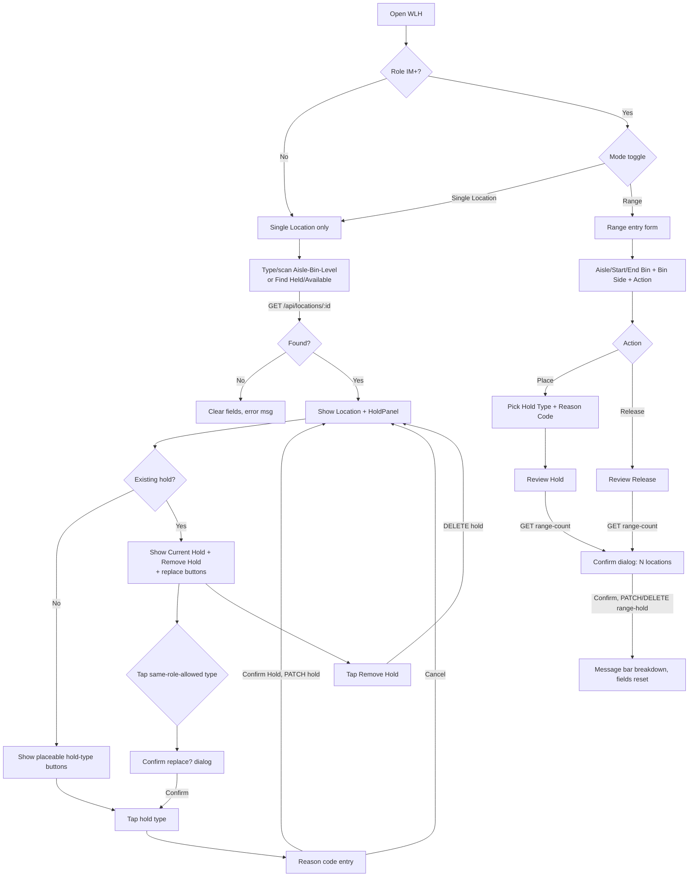

# Screen Design: WLH — Warehouse Location Hold

**Device:** Tablet — iPad Pro 13" landscape, fixed 1366×1024 canvas (kiosk)
**Bucket:** Existing Warehouse App (current production screen)
**Roles:** All roles can open WLH and place/remove **Hold Both**; **Hold Inbound**/**Hold Outbound** require IM and above to place or remove; **Hold Permanent** requires Lead Worker and above to place or remove; **Range mode** (both Place and Release) requires IM and above regardless of hold type, on top of whichever role the specific hold type already requires for a single location.

## Flow

1. Worker opens WLH (from Home, HotJump "WLH", the "Hold" button on LII, or a quick-hold panel rendered inline on PIP/SDP/MNP without navigating away).
2. If the caller's role is IM or above, a **Single Location | Range** segmented control renders at the top of the content area. Sub-IM roles never see the toggle and are locked to Single Location.

### 2a. Single Location mode (default)

3. Three-field Aisle/Bin/Level entry (`LocationEntryFields`, auto-focused on mount) is shown, plus a helper bar with **Find Held Location** and **Find Available Location** buttons (no role gate — available to every role).
4. Worker resolves a location one of three ways:
   - Types Aisle → Bin → Level in sequence (auto-advances at 3/3/2 digits; typing fewer digits and hitting OK zero-pads, e.g. "5" → "005").
   - Scans a full 8-digit barcode into any of the three boxes — resolves immediately regardless of what's already typed elsewhere.
   - Taps **Find Held Location** or **Find Available Location** — the app picks a random matching location app-wide and loads it exactly as if scanned. Tapping again re-rolls a new pick.
   - Arrives pre-populated via `?id=` (LII's "Hold" button, or a future quick-hold navigation) — resolved automatically on mount.
5. Once resolved, the app calls `GET /api/locations/:id` and reconstructs the canonical 8-digit location id (aisle/bin/level zero-padded), then renders the `Location` id (tappable `LiveId` chip) and the shared `HoldPanel` below it.
6. `HoldPanel` independently fetches the location's current hold state and displays **Current Hold** (color-coded: blue = Hold Inbound/Outbound, amber = Hold Both, red = Hold Permanent, white "None" if no hold).
   - **No current hold:** one button per hold type the caller's role can place, each labeled with its name and a one-line "blocks" description. Tapping one goes straight to reason-code entry.
   - **Existing hold present:** a **Remove Hold** button appears only if the caller's role can remove that specific hold type; pressing it calls `DELETE` immediately, no reason code needed. Placeable hold-type buttons still show below it as "replace" options; tapping one that isn't the current type first raises a **Replace existing hold?** confirmation dialog before advancing to reason-code entry (tapping the button matching the current hold type is disabled).
7. Reason-code entry: **(v1.6.7)** the shared `ReasonCodeField`, an entry-with-dropdown-helper field (`CodePickerField`, same pattern as STG/SDP's Storage Code/Size) — type a known 3-character `HOLD_REASON_CODES` code (auto-commits, dismisses the on-screen Keyboard) or tap the chevron for a popup of `{code} — {desc}` options. Replaces the previous native `<select>` + "Type a code…" design. **Confirm Hold** is disabled until a code is chosen/typed; **Cancel** returns to the no-reason-code view with the selection cleared.
8. On **Confirm Hold**, `PATCH /api/locations/:id/hold` is called with `{ holdType, reasonCode }`. On success, `HoldPanel` reloads the location's hold state, the Message Bar shows a success line, and `playAlert('info')` fires.
9. On **Remove Hold**, `DELETE /api/locations/:id/hold` is called with no body. Same reload/message/audio pattern on success.

### 2b. Range mode (IM+ only)

3. Switching to Range hides the single-location entry/helper bar/HoldPanel entirely and mounts `RangeHoldPanel`. Switching modes explicitly hides any open Numpad panel first, since the field that had it registered unmounts without its own cleanup.
4. Worker enters **Aisle** (3 digits, auto-advances to Start Bin), **Start Bin** (3 digits, auto-advances to End Bin), **End Bin** (3 digits, closes the numpad). A full 8-digit scan is not applicable here — Range mode has no single resolved location to scan into.
5. Worker picks **Bin Side** (All / Odd only / Even only, default All) and **Action** (Place / Release, default Place) via segmented controls.
6. If Action = Place: worker also picks a **Hold Type** (only types the role can place are listed) and a **Reason Code** (same entry-with-dropdown-helper `ReasonCodeField` as single-location, **v1.6.7**). Not shown for Release — Release never needs a hold type or reason code.
7. **Review Hold**/**Review Release** button enables once the range is valid (`startBin <= endBin`, all three numbers present) and, for Place, a hold type + reason code are set. Pressing it calls `GET /api/locations/range-count` to fetch the matching location count and opens a `ConfirmDialog` stating the exact range and location count.
8. Confirming submits `PATCH /api/locations/range-hold` (Place) or `DELETE /api/locations/range-hold` (Release) with the same range/binSide plus holdType/reasonCode for Place.
9. On success: `playAlert('info')`, every field resets (Aisle/Start Bin/End Bin clear, Bin Side resets to All, Action resets to Place, Hold Type/Reason Code clear and the Reason Code field remounts to reset its own dropdown state), and the Message Bar reports the actual breakdown:
   - Place: `"Placed {type} on {placed} locations"`, plus `"Upgraded {n} to Hold Both"` and/or `"{n} blocked (existing higher-priority hold)"` appended when non-zero, followed by the range description.
   - Release: `"Holds released on {n} locations ({range description})"`.

**Hold hierarchy — Range Place only** (single-location Place always overwrites outright, since the worker sees exactly what they're replacing one location at a time; Range Place cannot, since it can silently touch many locations at once). Priority low→high: `HOLD_IN = HOLD_OUT < HOLD_BOTH < HOLD_PERM`.
- Requested `HOLD_PERM` always applies — nothing outranks it.
- Requested `HOLD_BOTH` applies and overwrites, unless the existing hold is `HOLD_PERM` (blocked).
- Requested `HOLD_IN`/`HOLD_OUT` against the *opposite* directional hold: the location's hold is **upgraded** to `HOLD_BOTH`, not simply overwritten.
- Requested `HOLD_IN`/`HOLD_OUT` against `HOLD_BOTH` or `HOLD_PERM`: blocked, the lower-priority hold does not overwrite.
- Requested `HOLD_IN`/`HOLD_OUT` against None or the same type: applies normally.

Range Release has no hierarchy — it clears whatever exists — except clearing a `HOLD_PERM`-held location still requires Lead+; an IM's Release simply reports those as `blocked` rather than failing the whole request.

### Mis-scan / error handling

- Single Location: an unresolvable location id (`404` from `GET /api/locations/:id`) clears all three entry boxes (forcing a remount via a bumped key), shows Message Bar `error` — "Location not found", and plays `playAlert('error')`.
- **Find Held Location** with no held locations anywhere: Message Bar `warning` — "No locations currently on hold." (no error tone; nothing changes on screen).
- **Find Available Location** with every location currently held: Message Bar `warning` — "No locations currently available without a hold."
- Hold placement `403` (role doesn't meet the hold type's requirement): Message Bar `error` — "You do not have permission to place {type} holds"; `playAlert('error')`.
- Hold removal `403`: Message Bar `error` — "You do not have permission to remove this hold"; `playAlert('error')`.
- Range: an invalid range (e.g. Start Bin > End Bin, non-numeric) simply keeps **Review** disabled — no error message; nothing is submitted.
- Range preview (`range-count`) failure: Message Bar `error` — "Could not preview this range — please try again"; no confirmation dialog opens.
- Range submit failure: `playAlert('error')`, Message Bar `error` — "Range action failed — please try again"; the confirmation dialog closes and entry fields are left as typed (not cleared) so the worker can retry.

### Status / messaging behavior

Message Bar entries are transient (auto-managed by `MessageBarContext`, not sticky/ack-required) and are replaced by the next message, following the same convention as every other screen in the app — no screen-specific override here.

## Layout

```
┌──────────────────────────────────────────────────────────────────────────┐
│ Header  (104px) — Home · Back · WLH · Jump · Activity · user/logout      │
├──────────────────────────────────────────────────────────────────────────┤
│ Message Bar  (74px)                                                      │
├──────────────────────────────────────────────────────────────────────────┤
│ Content (1366×792)                                                       │
│  ┌──────────────────────────────┐  (IM+ only)                           │
│  │ [Single Location] [ Range ]   │                                      │
│  └──────────────────────────────┘                                       │
│                                                                          │
│  Single Location mode:                                                  │
│   AISLE  BIN  LEVEL     [Find Held Location] [Find Available Location]  │
│   [___] [___] [__]                                                      │
│                                                                          │
│   LOCATION  A-305-014-02                                                │
│   ┌────────────────────────────────────────────┐                        │
│   │ CURRENT HOLD   None / Hold Both / …         │                       │
│   │ [Remove Hold]                               │                       │
│   │ Hold Inbound   — Blocks new puts…           │                       │
│   │ Hold Outbound  — Blocks new label gen…      │                       │
│   │ Hold Both      — Blocks puts + labels…      │                       │
│   │ Hold Permanent — Blocks everything…         │                       │
│   └────────────────────────────────────────────┘                        │
│                                                                          │
│  Range mode:                                                            │
│   AISLE  START BIN  END BIN     Bin Side: [All][Odd][Even]              │
│   [___]  [___]      [___]       Action:   [Place][Release]              │
│   Hold Type: (buttons, Place only)     Reason Code: [B05___] [▾]        │
│   [Review Hold / Review Release]                                        │
├──────────────────────────────────────────────────────────────────────────┤
│ Footer  (54px) — demo buttons (Single Location only) / nav               │
└──────────────────────────────────────────────────────────────────────────┘
```

## Input handling

- On-screen **Numpad** appears contextually via `NumpadContext` whenever an Aisle/Bin/Level or Range numeric box is focused — never persistently mounted. Every field uses `useNumpadField` with `padOnSubmit` so a short entry (e.g. "5") zero-pads to the fixed width on OK.
- Hardware barcode scanner input is delivered via `deliverScan()` into whichever field currently holds numpad focus; an 8-digit scan in any of the three Single Location boxes is treated as a full-barcode override regardless of partial typing already in the other boxes (`NumpadContext`'s `isScanningRef` suppresses the normal maxLength auto-submit during injection).
- **(v1.6.7)** Reason Code is the shared `ReasonCodeField` (`CodePickerField`-based) — typed entry opens the on-screen **Keyboard** (`useNumpadField('keyboard')`, not the device's native keyboard), or tap the chevron for a dropdown-helper popup of known codes. Same entry-with-popup-helper pattern STG/SDP already use for Storage Code/Size — no longer a plain `<select>`.
- All interactive controls (mode toggle, hold-type buttons, Confirm/Cancel/Remove, Bin Side/Action segments) meet the 72px+ effective touch target convention used app-wide (buttons render at 44–56px visual height with generous padding hit area).

## Data

**Reads:**
- `Location` (aisle, bin, level, status, holdCategory) — via `GET /api/locations/:id`, to resolve a scanned/typed/found location and to render `HoldPanel`'s Current Hold display.
- `Location.holdCategory` (aggregate) — via `GET /api/locations/random-held` / `random-unheld`, to power the Find Held/Available helper buttons.
- `Location` count by aisle/bin range/side — via `GET /api/locations/range-count`, to preview a Range action before commit.

**Writes:**
- `Location.holdCategory` — set on `PATCH /api/locations/:id/hold` (single Place/Replace) or cleared on `DELETE /api/locations/:id/hold` (single Remove); set/upgraded/cleared in bulk via `PATCH`/`DELETE /api/locations/range-hold` (Range Place/Release), per the hierarchy rules above.
- `ActivityLog` — one entry per action: `actionType: 'HOLD_PLACE'` (single place/replace, `details: { holdType, reasonCode, previousHoldType }`), `actionType` for single remove (details: `{ clearedHoldType }`), `actionType: 'RANGE_HOLD'` (`details: { startBin, endBin, binSide, holdType, reasonCode, placed, upgraded, blocked }`), `actionType: 'RANGE_REL'` (`details: { startBin, endBin, binSide, released, blocked }`).

**Not written:** the reason code is **never** stored as a column on `Location` — `Location` has no reason-code field at all. It exists only inside the `ActivityLog.details` JSON blob for the action that placed the hold. There is no historical "why was this held" lookup outside the Activity Log overlay/table.

## Screen Flow

Covers: single-location resolve, no-hold placement, existing-hold replace (with confirm), hold removal, Find Held/Available helper, Range Place (with hierarchy outcomes), Range Release.



## Behind the Scenes

**Single-location resolve.** `resolveLocation` always reconstructs the canonical 8-digit id from the response's `aisle`/`bin`/`level` fields (each zero-padded) rather than trusting whatever length string triggered the lookup — necessary because a 6-digit lookup (e.g. from the demo/find buttons, which only know Aisle+Bin) would otherwise leave the id level-ambiguous, and the hold endpoints require an exact 8-digit id.

**HoldPanel is a shared component, not WLH-owned.** It fetches its own hold state independently given a `locationId` prop and is reused verbatim as the quick-hold panel on PIP/SDP/MNP — those screens render it inline without navigating to `/hold` at all. Any change to HoldPanel's behavior (reason code UI, replace-confirm flow, role gating) therefore affects four screens at once, not just WLH. Confirmed in practice by the **(v1.6.7)** `ReasonCodeField` redesign above — that change was made once, in the shared component, and every one of these four screens' Reason Code field picked it up automatically with no per-screen code changes.

**Nothing is written until Confirm.** Both single-location Place and Range Place/Release only call their PATCH/DELETE on explicit confirmation (Confirm Hold button, or the range ConfirmDialog's Confirm) — selecting a hold type, typing a reason code, or previewing a range count are all pure client-side/read-only steps up to that point.

**Range snapshot-before-write.** `placeRangeHold` counts every distinct existing-hold "bucket" (null/HOLD_IN/HOLD_OUT/HOLD_BOTH/HOLD_PERM) within the range *before* issuing any `updateMany`, then applies each bucket's resolved outcome from that frozen snapshot. This avoids double-counting rows whose hold value happens to land on a value another bucket's write just produced (e.g. an earlier null→HOLD_IN write being re-counted by the also-being-processed HOLD_IN bucket) in the same request.

**Range mode role floor is enforced twice server-side.** `placeRangeHold`/`releaseRangeHold` call `requireRole(auth, RANGE_FLOOR_ROLE)` (IM) and then, for Place, a second `requireRole` against the specific hold type's own `HOLD_PLACE_MIN_ROLE` — so Permanent still requires Lead+ even though the caller already cleared the IM+ Range floor. The client mirrors this by only listing hold types the role can place at all in the Range panel's own button list.

**Mode-switch numpad cleanup.** `WLHPage.setMode` calls `hideModeSwitchPanel()` (the shared `NumpadContext`'s `hidePanel`) before flipping the mode state, because `LocationEntryFields`' Aisle field auto-focuses on mount and would otherwise leave the numpad open and "bound" to a field that no longer exists on screen once the panel unmounts without its own cleanup.

**Demo buttons are Single-Location-only.** The footer's demo slot (`✓ Load Location` / `✗ Bad Location`) is hidden entirely in Range mode — both demo buttons act on a single resolved `locationId`, which Range mode has no equivalent of; Range's Review/Confirm flow is already fully manually testable without a shortcut.

## Open items still remaining

- [#84](https://github.com/BobbyJoeCool/PalletIQ/issues/84) — Reason codes (used here for every hold placement) are currently a hard-coded array (`HOLD_REASON_CODES`), not a database table with per-department/role restrictions; needs a product conversation before it can be redesigned.
- No historical view of *why* a hold was placed exists outside the app-wide Activity Log overlay — since the reason code is never a `Location` column, there's no per-location "hold history" list on WLH itself, only whatever the last 12 hours of Activity Log happens to retain.
- Range mode has no equivalent of the single-location demo buttons (by design, per the comment above) — if a future change wants a Range demo shortcut, it needs its own design, not a reuse of the existing pair.
- `DevNotes/Fixes/WLH/01-range-mode-confirm-flow.md` — Range mode's submit path (fill fields → "Review Hold"/"Review Release" → confirm popup) reads as confusing/possibly-missing compared to Single Location's tap-hold-type-first → popup sequence; not a missing feature, but a genuinely different, less obvious sequence. Needs a decision: restructure Range mode to match Single Location's exact flow, or just make "Review Hold" more visible/reachable.
- `DevNotes/Fixes/WLH/02-range-hierarchy-retest-blocked.md` — Range Place's hold hierarchy (HI/HO/HB/HP interactions) and Range Release were both marked "unable to test" during the last smoke test, blocked on the confusing submit flow above. Needs a direct retest against the existing server-side logic once #01 is resolved, not assumed to be broken.
- `DevNotes/Fixes/WLH/03-level-range-in-range-form.md` — requested addition: a Level range (Start/End Level) alongside the existing Aisle/Bin range and Bin Side, e.g. "Aisle 318, Bins 1–32, Levels 4–5." Touches three backend endpoints (`range-count`, `range-hold` PATCH/DELETE) plus the frontend form and confirmation copy — not yet started.
- `DevNotes/Fixes/WLH/04-find-buttons-not-in-footer.md` — the Find Held/Find Available Location buttons currently render as hand-placed JSX in the main content area rather than through the shared footer demo-slot system (`useDemoSlot`) every other screen's helper/demo buttons use; requested for consistency, not yet moved.

## Change Log

| Date | Change |
|---|---|
| 2026-07-18 (v1.6.7) | Reason Code (single-location and Range Place) redesigned onto the shared `ReasonCodeField`'s new entry-with-dropdown-helper pattern (`CodePickerField`, matching Storage Code/Size) — replaces the old native `<select>` + "Type a code…" design. Made once in the shared component (this change originated from PII's own Edit Mode work, not a WLH-specific ask) — HoldPanel's reuse on PIP/SDP/MNP means those three screens' quick-hold panels picked up the identical change automatically. |
| 2026-07-17 | Rebuilt onto the new screen-spec template from the legacy `DevNotes/Screen-Specs/WLH.md`, reconciled against the current shipped code: added Range Mode (v1.5.0) and the Find Held/Available helper bar (v1.5.0), neither present in the old doc; corrected the role table (Hold Both is placeable by any role including Worker, matching `HOLD_LABELS`/`HOLD_PLACE_MIN_ROLE` — the old doc's "All roles" wording for Place was retained but Remove's IM+ floor for Hold Both is now explicit); removed the old doc's Location "Status" row from the State 2 display description — the current `HoldPanel`/WLH UI does not render occupancy status (EMPTY/STORED/etc.) at all, only the location id and Current Hold, a divergence from the original spec's documented State 2 layout. |
| 2026-07-12 (v1.5.0) | Range Mode and Find Held/Available Location shipped — see `CHANGELOG.md` [1.5.0]. |
| 2026-07-05 (v0.9.0) | Initial build — single-location Hold Place/Replace/Remove, role-gated hold types, shared `HoldPanel` also used inline on PIP/SDP/MNP, per `DevNotes/Screen-Specs/WLH.md`'s original design. |
