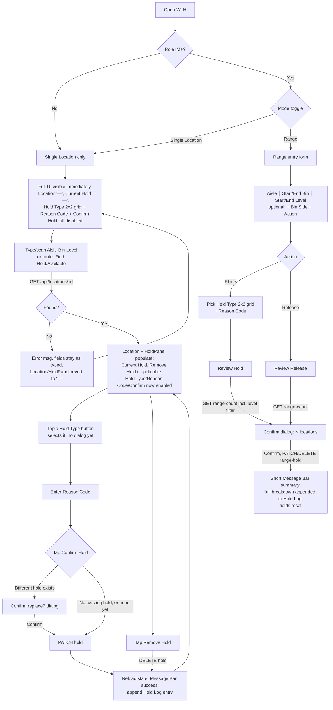

# Screen Design: WLH — Warehouse Location Hold

**Device:** Tablet — iPad Pro 13" landscape, fixed 1366×1024 canvas (kiosk)
**Bucket:** Existing Warehouse App (current production screen)
**Roles:** All roles can open WLH and place/remove **Hold Both**; **Hold Inbound**/**Hold Outbound** require IM and above to place or remove; **Hold Permanent** requires Lead Worker and above to place or remove; **Range mode** (both Place and Release) requires IM and above regardless of hold type, on top of whichever role the specific hold type already requires for a single location.

## Flow

1. Worker opens WLH (from Home, HotJump "WLH", the "Hold" button on LII, or a quick-hold panel rendered inline on PIP/MNP without navigating away — SDP's own quick-hold action was removed in v1.6.2).
2. If the caller's role is IM or above, a **Single Location | Range** segmented control renders at the top of the content area. Sub-IM roles never see the toggle and are locked to Single Location. **(v1.6.10)** Below that, the screen is a two-column layout: main content on the left, a **Hold Log** panel on the right — a running session list of every hold action taken this visit to WLH, in both modes. It renders immediately on navigating to the screen (an empty "No hold actions yet this session" state, not conditionally hidden until a scan or action happens) and stays visible across mode switches; entries are session-only (reset on navigating away and back), not a substitute for the Activity Log.

### 2a. Single Location mode (default)

3. **(v1.6.10)** The full Single Location layout renders immediately on navigating to the screen, before any location is scanned — not gated behind a resolved location (direct instruction). Three-field Aisle/Bin/Level entry (`LocationEntryFields`, auto-focused on mount), the `Location` indicator, and `HoldPanel` (Current Hold, Hold Type grid, Reason Code, Confirm Hold) are all visible from the start: `Location` shows "—" and `HoldPanel`'s Current Hold shows "—" with every action control disabled until a real location loads. **Find Held Location** and **Find Available Location** (no role gate — available to every role) render in the footer's shared demo-slot alongside `✓ Load Location`/`✗ Bad Location`, not as an in-content helper bar (WLH fix item 04).
4. Worker resolves a location one of three ways:
   - Types Aisle → Bin → Level in sequence (auto-advances at 3/3/2 digits; typing fewer digits and hitting OK zero-pads, e.g. "5" → "005"). **(v1.6.10)** A failed lookup no longer clears or remounts these boxes — whatever was typed stays visible so the worker can see and correct it (matches PII's v1.6.7 fix for its own Pallet ID field), instead of the old behavior of wiping all three boxes back to blank on a "Location not found" error.
   - Scans a full 8-digit barcode into any of the three boxes — resolves immediately regardless of what's already typed elsewhere.
   - Taps **Find Held Location** or **Find Available Location** — the app picks a random matching location app-wide and loads it exactly as if scanned. Tapping again re-rolls a new pick.
   - Arrives pre-populated via `?id=` (LII's "Hold" button, or a future quick-hold navigation) — resolved automatically on mount.
5. Once resolved, the app calls `GET /api/locations/:id` and reconstructs the canonical 8-digit location id (aisle/bin/level zero-padded); the already-visible `Location` indicator updates from "—" to the real, tappable `LiveId` chip, and `HoldPanel` (already on screen) reloads with the resolved hold state.
6. `HoldPanel` independently fetches the location's current hold state and displays **Current Hold** (color-coded: blue = Hold Inbound/Outbound, amber = Hold Both, red = Hold Permanent, white "None" if no hold, gray "—" if no location is loaded yet). **(v1.6.10)** The full placement UI — Hold Type, Reason Code, and Confirm Hold — renders together at all times now, rather than Reason Code/Confirm only appearing after a Hold Type tap (direct instruction, replacing the earlier two-step reveal):
   - **Remove Hold** renders above it, only if the caller's role can remove the current hold type; pressing it calls `DELETE` immediately, no reason code needed, independent of whatever's selected below.
   - **Hold Type** is a 2×2 grid of buttons, one per type the caller's role can place (same grid shape as Range mode's own Hold Type picker, **v1.6.10**), each labeled with its name and a one-line "blocks" description. Tapping one just selects it (highlighted border, matching Range's selection style) — the button matching the location's current hold type, if any, is disabled. Selecting a different type doesn't submit or raise a dialog by itself.
   - **Reason Code** is always visible below the grid, independent of whether a type is selected yet.
   - **Confirm Hold** is disabled until both a Hold Type is selected and a Reason Code is set.
7. Reason Code: **(v1.6.7)** the shared `ReasonCodeField`, an entry-with-dropdown-helper field (`CodePickerField`, same pattern as STG/SDP's Storage Code/Size) — type a known 3-character `HOLD_REASON_CODES` code (auto-commits, dismisses the on-screen Keyboard) or tap the chevron for a popup of `{code} — {desc}` options.
8. On **Confirm Hold**: if a *different* hold already exists on the location, a **Replace existing hold?** confirmation dialog appears first (**v1.6.10** — moved here from immediately after the Hold Type tap, since Reason Code is now filled in before Confirm rather than after); confirming (or, if there was no existing hold to begin with, tapping Confirm Hold directly) calls `PATCH /api/locations/:id/hold` with `{ holdType, reasonCode }`. On success, `HoldPanel` reloads the location's hold state, clears the selected type and reason code, the Message Bar shows a success line, `playAlert('info')` fires, and **(v1.6.10)** a one-line entry (`"Placed {type} on {location}"`) is appended to the Hold Log.
9. On **Remove Hold**, `DELETE /api/locations/:id/hold` is called with no body. Same reload/message/audio pattern on success, plus a Hold Log entry (`"Removed {type} from {location}"`, **v1.6.10**).

### 2b. Range mode (IM+ only)

3. Switching to Range hides the single-location entry/HoldPanel entirely (footer demo/find buttons hide too) and mounts `RangeHoldPanel` in the same left column, with the Hold Log staying put on the right. Switching modes explicitly hides any open Numpad panel first, since the field that had it registered unmounts without its own cleanup. **(v1.6.10)** The whole panel scrolls internally (`overflow-y-auto`) rather than relying on the page never overflowing — WLH fix item 01: with Level range added below, the form is tall enough that "Review Hold" could otherwise land off-screen with no way to reach it.
4. Worker enters, in one row with a vertical divider between each group (**v1.6.10**): **Aisle** (3 digits, auto-advances to Start Bin) │ **Start Bin**/**End Bin** (3 digits each, End Bin closes the numpad) │ **Start Level**/**End Level** (2 digits each, optional — WLH fix item 03). A full 8-digit scan is not applicable here — Range mode has no single resolved location to scan into. Level is independent of the Aisle→Bin auto-advance chain (tapped manually); leaving both Level boxes blank means every level in the matching bins (the original behavior); filling only one is invalid and shows an inline warning, blocking Review until both are set or both are cleared.
5. Worker picks **Bin Side** (All / Odd only / Even only, default All) and **Action** (Place / Release, default Place) via segmented controls.
6. If Action = Place: worker also picks a **Hold Type** — a 2×2 grid of buttons (**v1.6.10**, matching Single Location's own grid shape), only types the role can place are listed — and a **Reason Code** (same entry-with-dropdown-helper `ReasonCodeField` as single-location, **v1.6.7**). Not shown for Release — Release never needs a hold type or reason code.
7. **Review Hold**/**Review Release** button enables once the range is valid (`startBin <= endBin`, all three numbers present, Level range either fully set or fully blank) and, for Place, a hold type + reason code are set. Pressing it calls `GET /api/locations/range-count` (including `startLevel`/`endLevel` when set) to fetch the matching location count and opens a `ConfirmDialog` stating the exact range (including a "Levels {start}–{end}" clause when applicable) and location count.
8. Confirming submits `PATCH /api/locations/range-hold` (Place) or `DELETE /api/locations/range-hold` (Release) with the same range/binSide/startLevel/endLevel plus holdType/reasonCode for Place.
9. On success: `playAlert('info')`, every field resets (Aisle/Start/End Bin and Start/End Level clear, Bin Side resets to All, Action resets to Place, Hold Type/Reason Code clear and the Reason Code field remounts to reset its own dropdown state). **(v1.6.10)** The Message Bar stays short — `"Placed {type} on {total} locations — {range description}"` (Place) or `"Holds released on {total} locations — {range description}"` (Release) — while the **full** per-bucket breakdown goes to the Hold Log instead, using the `breakdown` array both range endpoints now return:
   - Place log entry: one line per bucket — `"{n} placed (was {existing type or None})"`, `"{n} upgraded {existing} → {next}"`, or `"{n} blocked (existing {existing})"`.
   - Release log entry: one line per existing hold type found — `"{n} released (was {type})"` or `"{n} blocked (still {type}, insufficient role)"`.

**Hold hierarchy — Range Place only** (single-location Place always overwrites outright, since the worker sees exactly what they're replacing one location at a time; Range Place cannot, since it can silently touch many locations at once). Priority low→high: `HOLD_IN = HOLD_OUT < HOLD_BOTH < HOLD_PERM`.
- Requested `HOLD_PERM` always applies — nothing outranks it.
- Requested `HOLD_BOTH` applies and overwrites, unless the existing hold is `HOLD_PERM` (blocked).
- Requested `HOLD_IN`/`HOLD_OUT` against the *opposite* directional hold: the location's hold is **upgraded** to `HOLD_BOTH`, not simply overwritten.
- Requested `HOLD_IN`/`HOLD_OUT` against `HOLD_BOTH` or `HOLD_PERM`: blocked, the lower-priority hold does not overwrite.
- Requested `HOLD_IN`/`HOLD_OUT` against None or the same type: applies normally.

Range Release has no hierarchy — it clears whatever exists — except clearing a `HOLD_PERM`-held location still requires Lead+; an IM's Release simply reports those as `blocked` rather than failing the whole request.

**Retested live (v1.6.10)** against the local Docker DB, all outcomes confirmed correct: HI+HI stacking (placed), HI then HO on an overlapping range (upgrade to HB on the overlap, plain placed on the non-overlapping part), HP placement scoped to a single level via the new Level range filter (overwrites an HB underneath), a subsequent HI attempt against that same bin fully blocked (HP at one level, HB at the others — both outrank HI), Release across a mixed HI/HB/HO/HP range (exact per-bucket counts), and an IM's Release correctly blocked on a HOLD_PERM bucket while an ADMIN's Release of the same bucket succeeds.

### Mis-scan / error handling

- Single Location: an unresolvable location id (`404` from `GET /api/locations/:id`) shows Message Bar `error` — "Location not found", plays `playAlert('error')`, and resets `Location`/`HoldPanel` to their "—"/no-location state — but **(v1.6.10)** leaves the Aisle/Bin/Level entry boxes exactly as typed rather than clearing/remounting them, so the worker can see and correct the bad entry instead of retyping from scratch.
- **Find Held Location** with no held locations anywhere: Message Bar `warning` — "No locations currently on hold." (no error tone; nothing changes on screen).
- **Find Available Location** with every location currently held: Message Bar `warning` — "No locations currently available without a hold."
- Hold placement `403` (role doesn't meet the hold type's requirement): Message Bar `error` — "You do not have permission to place {type} holds"; `playAlert('error')`.
- Hold removal `403`: Message Bar `error` — "You do not have permission to remove this hold"; `playAlert('error')`.
- Range: an invalid range (e.g. Start Bin > End Bin, non-numeric) simply keeps **Review** disabled — no error message; nothing is submitted.
- Range preview (`range-count`) failure: Message Bar `error` — "Could not preview this range — please try again"; no confirmation dialog opens.
- Range submit failure: `playAlert('error')`, Message Bar `error` — "Range action failed — please try again"; the confirmation dialog closes and entry fields are left as typed (not cleared) so the worker can retry.

### Status / messaging behavior

Message Bar entries are transient (auto-managed by `MessageBarContext`, not sticky/ack-required) and are replaced by the next message, following the same convention as every other screen in the app — no screen-specific override here.

## Layout

```
┌──────────────────────────────────────────────────────────────────────────┐
│ Header  (104px) — Home · Back · WLH · Jump · Activity · user/logout      │
├──────────────────────────────────────────────────────────────────────────┤
│ Message Bar  (74px)                                                      │
├──────────────────────────────────────────────────────────────────────────┤
│ Content (1366×792)                                                       │
│  ┌──────────────────────────────┐  (IM+ only)                           │
│  │ [Single Location] [ Range ]   │                                      │
│  └──────────────────────────────┘                                       │
│ ┌─────────────────────────────────────────────────┐ ┌──────────────────┐ │
│ │ Single Location mode:                            │ │ HOLD LOG          │ │
│ │  AISLE  BIN  LEVEL                                │ │ ─────────────────│ │
│ │  [___] [___] [__]                                 │ │ Placed HB on…     │ │
│ │                                                    │ │  10:41 AM         │ │
│ │  LOCATION  A-305-014-02                            │ │ ─────────────────│ │
│ │  CURRENT HOLD   None / Hold Both / …              │ │ Place HI —        │ │
│ │  [Remove Hold]                                    │ │  Aisle 304…       │ │
│ │  Hold Type (2×2 grid):                            │ │  25 placed (was   │ │
│ │   [Hold Inbound]   [Hold Outbound]                │ │  None)   10:38 AM │ │
│ │   [Hold Both]      [Hold Permanent]               │ │ ─────────────────│ │
│ │  Reason Code: [B05___] [▾]                        │ │ (empty state:     │ │
│ │  [Confirm Hold]                                   │ │ "No hold actions  │ │
│ │                                                    │ │ yet this session")│ │
│ │  Range mode:                                       │ │                   │ │
│ │  AISLE│START BIN END BIN│START LVL END LVL         │ │                   │ │
│ │  [___]│[___]      [___] │[__]      [__]  (÷ dividers)                    │ │
│ │  Bin Side: [All][Odd][Even]    Action: [Place][Release]                  │ │
│ │  Hold Type (2×2 grid, Place only)   Reason Code: [B05___] [▾]            │ │
│ │  [Review Hold / Review Release]                   │ │                   │ │
│ └─────────────────────────────────────────────────┘ └──────────────────┘ │
├──────────────────────────────────────────────────────────────────────────┤
│ Footer  (54px) — Single Location only: ✓ Load / ✗ Bad / Find Held /      │
│                  Find Available (all via shared demo-slot) / nav          │
└──────────────────────────────────────────────────────────────────────────┘
```

## Input handling

- On-screen **Numpad** appears contextually via `NumpadContext` whenever an Aisle/Bin/Level or Range numeric box is focused — never persistently mounted. Every field uses `useNumpadField` with `padOnSubmit` so a short entry (e.g. "5") zero-pads to the fixed width on OK.
- Hardware barcode scanner input is delivered via `deliverScan()` into whichever field currently holds numpad focus; an 8-digit scan in any of the three Single Location boxes is treated as a full-barcode override regardless of partial typing already in the other boxes (`NumpadContext`'s `isScanningRef` suppresses the normal maxLength auto-submit during injection).
- **(v1.6.7)** Reason Code is the shared `ReasonCodeField` (`CodePickerField`-based) — typed entry opens the on-screen **Keyboard** (`useNumpadField('keyboard')`, not the device's native keyboard), or tap the chevron for a dropdown-helper popup of known codes. Same entry-with-popup-helper pattern STG/SDP already use for Storage Code/Size — no longer a plain `<select>`.
- All interactive controls (mode toggle, hold-type buttons, Confirm/Cancel/Remove, Bin Side/Action segments) meet the 72px+ effective touch target convention used app-wide (buttons render at 44–56px visual height with generous padding hit area).

## Data

**Reads:**
- `Location` (aisle, bin, level, status, holdCategory) — via `GET /api/locations/:id`, to resolve a scanned/typed/found location and to render `HoldPanel`'s Current Hold display.
- `Location.holdCategory` (aggregate) — via `GET /api/locations/random-held` / `random-unheld`, to power the Find Held/Available helper buttons (footer demo-slot, **v1.6.10**).
- `Location` count by aisle/bin/level range/side — via `GET /api/locations/range-count`, to preview a Range action before commit. `startLevel`/`endLevel` query params are optional (**v1.6.10**, WLH fix item 03) — omitted entirely means every level, not a specific default range.

**Writes:**
- `Location.holdCategory` — set on `PATCH /api/locations/:id/hold` (single Place/Replace) or cleared on `DELETE /api/locations/:id/hold` (single Remove); set/upgraded/cleared in bulk via `PATCH`/`DELETE /api/locations/range-hold` (Range Place/Release), per the hierarchy rules above. Range Place/Release's `where` clauses now also intersect against `startLevel`/`endLevel` when supplied (**v1.6.10**).
- `ActivityLog` — one entry per action: `actionType: 'HOLD_PLACE'` (single place/replace, `details: { holdType, reasonCode, previousHoldType }`), `actionType` for single remove (details: `{ clearedHoldType }`), `actionType: 'RANGE_HOLD'` (`details: { startBin, endBin, binSide, startLevel, endLevel, holdType, reasonCode, placed, upgraded, blocked }`), `actionType: 'RANGE_REL'` (`details: { startBin, endBin, binSide, startLevel, endLevel, released, blocked }`) — **(v1.6.10)** both now also carry `startLevel`/`endLevel` when the Level range was used.
- **Not persisted anywhere:** `placeRangeHold`/`releaseRangeHold`'s response now also includes a `breakdown` array (one row per distinct existing-hold bucket, **v1.6.10**) — this is response-only, purely to feed the client's session Hold Log; it is not written to `ActivityLog` or any other table (the aggregate `placed`/`upgraded`/`blocked`/`released`/`blocked` counts already written there are unchanged).

**Not written:** the reason code is **never** stored as a column on `Location` — `Location` has no reason-code field at all. It exists only inside the `ActivityLog.details` JSON blob for the action that placed the hold. There is no historical "why was this held" lookup outside the Activity Log overlay/table (and, for the current session only, the Hold Log panel — see Behind the Scenes).

## Screen Flow

Covers: single-location resolve, always-visible hold-type/reason UI, existing-hold replace (confirm at submit), hold removal, Find Held/Available helper, Range Place (with hierarchy outcomes and Level range), Range Release, and the shared Hold Log both modes write into.



## Behind the Scenes

**Single-location resolve.** `resolveLocation` always reconstructs the canonical 8-digit id from the response's `aisle`/`bin`/`level` fields (each zero-padded) rather than trusting whatever length string triggered the lookup — necessary because a 6-digit lookup (e.g. from the demo/find buttons, which only know Aisle+Bin) would otherwise leave the id level-ambiguous, and the hold endpoints require an exact 8-digit id.

**HoldPanel is a shared component, not WLH-owned.** It fetches its own hold state independently given a `locationId` prop and is reused verbatim as the quick-hold panel on PIP/MNP — those screens render it inline without navigating to `/hold` at all (SDP had its own quick-hold panel too, removed in v1.6.2). Any change to HoldPanel's behavior (reason code UI, replace-confirm flow, role gating) therefore affects three screens at once, not just WLH. Confirmed in practice by the **(v1.6.7)** `ReasonCodeField` redesign above — that change was made once, in the shared component, and every one of these three screens' Reason Code field picked it up automatically with no per-screen code changes. **(v1.6.10)** `locationId` is now `string | null` — WLH's Single Location mode mounts `HoldPanel` from first navigation, before any location is resolved; PIP/MNP always pass a real, already-resolved id and are unaffected by the wider type.

**Nothing is written until Confirm.** Both single-location Place and Range Place/Release only call their PATCH/DELETE on explicit confirmation (Confirm Hold button, or the range ConfirmDialog's Confirm) — selecting a hold type, typing a reason code, or previewing a range count are all pure client-side/read-only steps up to that point.

**Range snapshot-before-write.** `placeRangeHold` counts every distinct existing-hold "bucket" (null/HOLD_IN/HOLD_OUT/HOLD_BOTH/HOLD_PERM) within the range *before* issuing any `updateMany`, then applies each bucket's resolved outcome from that frozen snapshot. This avoids double-counting rows whose hold value happens to land on a value another bucket's write just produced (e.g. an earlier null→HOLD_IN write being re-counted by the also-being-processed HOLD_IN bucket) in the same request.

**Range mode role floor is enforced twice server-side.** `placeRangeHold`/`releaseRangeHold` call `requireRole(auth, RANGE_FLOOR_ROLE)` (IM) and then, for Place, a second `requireRole` against the specific hold type's own `HOLD_PLACE_MIN_ROLE` — so Permanent still requires Lead+ even though the caller already cleared the IM+ Range floor. The client mirrors this by only listing hold types the role can place at all in the Range panel's own button list.

**Mode-switch numpad cleanup.** `WLHPage.setMode` calls `hideModeSwitchPanel()` (the shared `NumpadContext`'s `hidePanel`) before flipping the mode state, because `LocationEntryFields`' Aisle field auto-focuses on mount and would otherwise leave the numpad open and "bound" to a field that no longer exists on screen once the panel unmounts without its own cleanup.

**Demo buttons are Single-Location-only.** The footer's demo slot (`✓ Load Location` / `✗ Bad Location` / `Find Held Location` / `Find Available Location`, all four now via the shared demo-slot system per **v1.6.10**) is hidden entirely in Range mode — all four act on a single resolved `locationId`, which Range mode has no equivalent of; Range's Review/Confirm flow is already fully manually testable without a shortcut.

**Hold Log is lifted state, not owned by either panel (v1.6.10).** `logEntries`/`addLogEntry` live in `WLHPage` itself, not in `RangeHoldPanel` or `HoldPanel`, since both need to write into the same list and it must survive switching between Single Location and Range. `RangeHoldPanel` takes `onLog` as a prop; the shared `HoldPanel` takes a new optional `onAction` prop it calls after a successful place/remove — WLH's Single Location branch is the only caller that passes it, so PIP/MNP's inline quick-hold panels (which also render `HoldPanel`) are unaffected and don't log anywhere. Entries are plain in-memory state (`useState`, keyed by an incrementing ref counter) — not fetched from or written to the server, and reset on navigating away from WLH.

**Range breakdown is response-only.** `placeRangeHold`/`releaseRangeHold`'s new `breakdown` array exists purely to let the client build a fuller Hold Log entry than the aggregate `placed`/`upgraded`/`blocked`/`released` counts alone would allow (e.g. "8 upgraded HOLD_IN → HOLD_BOTH" instead of just "8 upgraded"). It's computed from the same bucket loop that already existed for the aggregate counts — no extra queries — and isn't persisted; `ActivityLog.details` still only stores the aggregate counts, unchanged.

**Single Location's Confirm-time replace check.** Since Hold Type/Reason Code/Confirm are all visible together now (v1.6.10), `HoldPanel`'s "Replace existing hold?" `ConfirmDialog` moved from firing on the Hold Type tap itself to firing inside `handleConfirmClick`, only when a *different* hold already exists on the location than the one just selected — selecting a type is now a pure client-side selection with no side effect, matching how Range mode's own Hold Type grid already worked (select, then a separate confirm step evaluates whatever's being replaced).

## Open items still remaining

- [#84](https://github.com/BobbyJoeCool/PalletIQ/issues/84) — Reason codes (used here for every hold placement) are currently a hard-coded array (`HOLD_REASON_CODES`), not a database table with per-department/role restrictions; needs a product conversation before it can be redesigned.
- No historical view of *why* a hold was placed exists outside the app-wide Activity Log overlay and the current session's Hold Log — since the reason code is never a `Location` column, there's no per-location, cross-session "hold history" list on WLH itself.
- Hold Log is session-only — it does not persist across navigating away from WLH and back, and isn't fetched from `ActivityLog`, so a worker who leaves mid-session loses the panel's history (the underlying `ActivityLog` rows themselves are unaffected, this is purely about what's visible in the panel).

## Change Log

| Date | Change |
|---|---|
| 2026-07-20 (v1.6.10) | WLH fix-list round (all 4 items): Range mode's "Review Hold" is now always reachable via an internal scroll container instead of restructuring the flow (item 01, resolved by direct choice between the two options raised); Range Place hierarchy and Range Release retested live against local Docker and confirmed correct (item 02); a Level range (Start/End Level, optional) added to Range mode across `range-count`/`range-hold` PATCH/DELETE plus the frontend form (item 03); Find Held/Find Available Location moved into the shared footer demo-slot system (item 04). |
| 2026-07-20 (v1.6.10) | Live UI revisions requested mid-session, beyond the original fix list: Aisle/Bin/Level fields moved into one row with vertical dividers between the three groups; Range mode's Hold Type picker changed from a vertical list to a 2×2 grid. |
| 2026-07-20 (v1.6.10) | Single Location's `HoldPanel` redesigned (direct instruction, shared component — also affects PIP/MNP's inline quick-hold panels): Hold Type (now a 2×2 grid, matching Range), Reason Code, and Confirm Hold all render together at all times instead of Reason Code/Confirm only appearing after a Hold Type tap; the "Replace existing hold?" dialog moved to fire at Confirm time instead of on the Hold Type tap itself. |
| 2026-07-20 (v1.6.10) | Aisle/Bin/Level entry no longer clears/remounts on a failed lookup — the boxes keep whatever was typed so the worker can see and correct it (matches PII's v1.6.7 fix), and the Location indicator/`HoldPanel` now render unconditionally from first navigation instead of waiting for a resolved location — `HoldPanel`'s `locationId` prop is now `string \| null`; with no location, Current Hold shows "—" and every action control (Hold Type grid, Reason Code, Confirm Hold) is disabled until a real location loads. |
| 2026-07-20 (v1.6.10) | Added a session-only **Hold Log** panel on the right side of the screen (always visible from navigation, not gated on a scan/action), fed by both modes via a new `HoldPanel.onAction` callback and `RangeHoldPanel.onLog` prop. Range Place/Release's Message Bar text shortened to a total-count summary; the full per-bucket breakdown (what got upgraded from what to what, what got blocked and why) moved to the Log, backed by a new `breakdown` array both range endpoints now return. |
| 2026-07-18 (v1.6.7) | Reason Code (single-location and Range Place) redesigned onto the shared `ReasonCodeField`'s new entry-with-dropdown-helper pattern (`CodePickerField`, matching Storage Code/Size) — replaces the old native `<select>` + "Type a code…" design. Made once in the shared component (this change originated from PII's own Edit Mode work, not a WLH-specific ask) — HoldPanel's reuse on PIP/SDP/MNP means those three screens' quick-hold panels picked up the identical change automatically. |
| 2026-07-17 | Rebuilt onto the new screen-spec template from the legacy `DevNotes/Screen-Specs/WLH.md`, reconciled against the current shipped code: added Range Mode (v1.5.0) and the Find Held/Available helper bar (v1.5.0), neither present in the old doc; corrected the role table (Hold Both is placeable by any role including Worker, matching `HOLD_LABELS`/`HOLD_PLACE_MIN_ROLE` — the old doc's "All roles" wording for Place was retained but Remove's IM+ floor for Hold Both is now explicit); removed the old doc's Location "Status" row from the State 2 display description — the current `HoldPanel`/WLH UI does not render occupancy status (EMPTY/STORED/etc.) at all, only the location id and Current Hold, a divergence from the original spec's documented State 2 layout. |
| 2026-07-12 (v1.5.0) | Range Mode and Find Held/Available Location shipped — see `CHANGELOG.md` [1.5.0]. |
| 2026-07-05 (v0.9.0) | Initial build — single-location Hold Place/Replace/Remove, role-gated hold types, shared `HoldPanel` also used inline on PIP/SDP/MNP, per `DevNotes/Screen-Specs/WLH.md`'s original design. |
